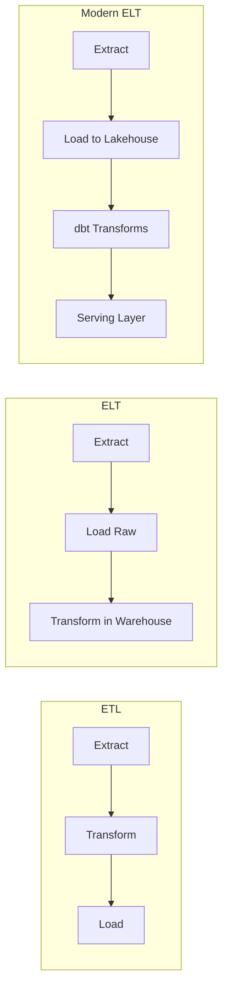
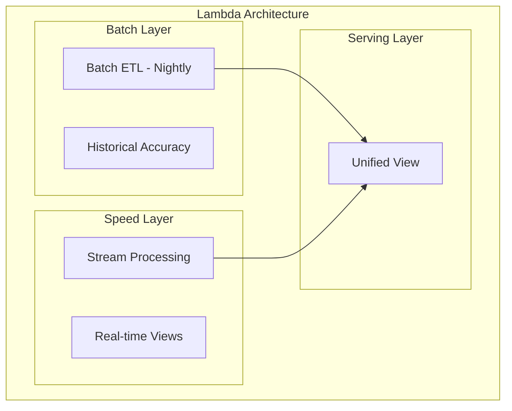

# ETL vs ELT: Modern Data Stack for Banking

## Overview

The debate between ETL (Extract-Transform-Load) and ELT (Extract-Load-Transform) has evolved significantly with modern cloud infrastructure. In banking, the choice between these patterns depends on data volume, compliance requirements, transformation complexity, and team skills. This guide covers both approaches, when to use each, and how the modern data stack (dbt, Snowflake, BigQuery) has shifted the paradigm.

## ETL vs ELT Comparison



| Dimension | ETL | ELT | Modern ELT |
|-----------|-----|-----|------------|
| Transformation Location | Before loading | In target system | In target system |
| Storage | Only processed data | Raw + processed | Raw + curated + serving |
| Flexibility | Low (schema-on-write) | High (schema-on-read) | Very high (dbt models) |
| Compute Cost | Transform on dedicated | Transform in warehouse | Warehouse-optimized |
| Time to Insight | Slower (transform first) | Faster (query raw immediately) | Fast (incremental models) |
| Historical Data | Limited | Full raw history | Full raw history |
| Skills Required | ETL developers | SQL analysts | SQL + dbt engineers |
| Compliance | Easier (PII removed early) | Requires careful governance | Requires data contracts |

## ETL: Traditional Approach

### When ETL Makes Sense for Banking

1. **Regulatory compliance requires PII removal before storage**
2. **Data must be anonymized for non-production environments**
3. **Target systems have limited compute capacity**
4. **Strict schema enforcement is required**
5. **Downstream systems cannot handle raw data formats**

### ETL Pipeline Example

```python
"""
Traditional ETL: Extract from source, transform in Python/Spark, 
load clean data to warehouse.
"""
import pandas as pd
import psycopg2
from datetime import datetime
import hashlib

def extract_from_core_banking(source_config: dict) -> pd.DataFrame:
    """Extract raw data from core banking system."""
    conn = psycopg2.connect(**source_config)
    query = """
        SELECT t.*, a.account_number, c.customer_id
        FROM transactions t
        JOIN accounts a ON t.account_id = a.account_id
        JOIN customers c ON a.customer_id = c.customer_id
        WHERE t.transaction_date = CURRENT_DATE - 1
    """
    df = pd.read_sql(query, conn)
    conn.close()
    return df

def transform_clean(df: pd.DataFrame) -> pd.DataFrame:
    """Transform: clean, validate, mask PII."""
    # Remove reversed/cancelled transactions
    df = df[df['status'] != 'REVERSED']
    
    # Validate amounts
    df = df[df['amount'] > 0]
    
    # Mask PII before loading
    df['masked_account'] = df['account_number'].apply(
        lambda x: '****' + str(x)[-4:] if x else None
    )
    df['customer_hash'] = df['customer_id'].apply(
        lambda x: hashlib.sha256(str(x).encode()).hexdigest()[:12]
    )
    
    # Drop raw PII columns
    df = df.drop(columns=['account_number', 'customer_id', 'national_id'])
    
    # Enrich with derived fields
    df['transaction_tier'] = df['amount'].apply(
        lambda x: 'HIGH' if x > 10000 else ('MEDIUM' if x > 1000 else 'LOW')
    )
    df['processed_at'] = datetime.utcnow()
    
    return df

def load_to_warehouse(df: pd.DataFrame, target_config: dict):
    """Load transformed data to warehouse."""
    conn = psycopg2.connect(**target_config)
    
    # Idempotent load: delete then insert for the date
    run_date = df['transaction_date'].iloc[0]
    with conn.cursor() as cur:
        cur.execute("""
            DELETE FROM fact_transactions 
            WHERE transaction_date = %s
        """, (run_date,))
        
        # Bulk insert
        for _, row in df.iterrows():
            cur.execute("""
                INSERT INTO fact_transactions 
                    (transaction_id, account_id, amount, currency,
                     transaction_type, transaction_tier, 
                     masked_account, customer_hash,
                     transaction_date, processed_at)
                VALUES (%s, %s, %s, %s, %s, %s, %s, %s, %s, %s)
            """, (
                row['transaction_id'], row['account_id'], row['amount'],
                row['currency'], row['transaction_type'], 
                row['transaction_tier'], row['masked_account'],
                row['customer_hash'], row['transaction_date'],
                row['processed_at']
            ))
    
    conn.commit()
    conn.close()

# ETL pipeline execution
def run_etl_pipeline():
    """Execute ETL pipeline."""
    raw_data = extract_from_core_banking(source_config)
    clean_data = transform_clean(raw_data)
    load_to_warehouse(clean_data, target_config)
```

## ELT: Modern Approach

### When ELT Makes Sense for Banking

1. **Cloud data warehouse with elastic compute**
2. **Need to reprocess historical data with new logic**
3. **Multiple teams need different transformations from same raw data**
4. **Schema-on-read flexibility needed for exploratory analysis**
5. **dbt or similar transformation tool available**

### ELT Pipeline with dbt

```yaml
# dbt_project.yml
name: banking_analytics
version: '2.0'
config-version: 2
profile: banking_db

models:
  banking_analytics:
    staging:
      +materialized: view
      +schema: staging
    intermediate:
      +materialized: view
      +schema: intermediate
    marts:
      +materialized: table
      +schema: marts
      banking:
        +schema: marts_banking
```

```sql
-- models/staging/stg_transactions.sql
{{ config(materialized='view') }}

WITH source AS (
    SELECT * FROM raw_banking.transactions
    WHERE transaction_date >= '2020-01-01'  -- Keep only relevant data
),
cleaned AS (
    SELECT
        transaction_id,
        account_id,
        customer_id,
        amount,
        currency,
        LOWER(transaction_type) AS transaction_type,
        transaction_date,
        transaction_time,
        merchant_id,
        channel,
        CASE
            WHEN status IN ('PENDING', 'PROCESSING') THEN 'IN_PROGRESS'
            WHEN status = 'COMPLETED' THEN 'COMPLETED'
            WHEN status IN ('FAILED', 'DECLINED') THEN 'FAILED'
            WHEN status = 'REVERSED' THEN 'REVERSED'
            ELSE 'UNKNOWN'
        END AS normalized_status,
        _etl_loaded_at
    FROM source
    WHERE status != 'REVERSED'  -- Filter at the staging level
)
SELECT * FROM cleaned
```

```sql
-- models/marts/banking/fact_daily_transactions.sql
{{ 
    config(
        materialized='incremental',
        unique_key=['transaction_date', 'account_id'],
        partition_by={'field': 'transaction_date', 'data_type': 'date'}
    )
}}

WITH daily_agg AS (
    SELECT
        transaction_date,
        account_id,
        customer_id,
        COUNT(*) AS transaction_count,
        SUM(amount) AS total_amount,
        AVG(amount) AS avg_amount,
        MIN(amount) AS min_amount,
        MAX(amount) AS max_amount,
        COUNT(DISTINCT merchant_id) AS unique_merchants,
        COUNT(DISTINCT channel) AS channels_used,
        CURRENT_TIMESTAMP AS updated_at
    FROM {{ ref('stg_transactions') }}
    
    
    WHERE transaction_date >= (
        SELECT MAX(transaction_date) FROM {{ this }}
    )
    
    
    GROUP BY 
        transaction_date, 
        account_id, 
        customer_id
)
SELECT * FROM daily_agg
```

```sql
-- models/marts/banking/dim_customer_360.sql
{{ config(materialized='table') }}

WITH customer_accounts AS (
    SELECT
        customer_id,
        COUNT(DISTINCT account_id) AS total_accounts,
        SUM(balance) AS total_balance,
        MIN(account_opened_date) AS first_account_date,
        MAX(account_opened_date) AS latest_account_date
    FROM {{ ref('stg_accounts') }}
    WHERE status = 'ACTIVE'
    GROUP BY customer_id
),
customer_activity AS (
    SELECT
        customer_id,
        COUNT(DISTINCT transaction_date) AS active_days_last_90d,
        SUM(amount) AS total_spend_90d,
        COUNT(*) AS txn_count_90d,
        AVG(amount) AS avg_txn_90d
    FROM {{ ref('stg_transactions') }}
    WHERE transaction_date >= CURRENT_DATE - INTERVAL '90 days'
    GROUP BY customer_id
),
customer_segment AS (
    SELECT
        customer_id,
        CASE
            WHEN total_balance > 500000 AND total_spend_90d > 50000 THEN 'PREMIUM'
            WHEN total_balance > 100000 AND total_spend_90d > 10000 THEN 'GOLD'
            WHEN total_balance > 25000 AND total_spend_90d > 5000 THEN 'SILVER'
            ELSE 'STANDARD'
        END AS customer_segment
    FROM customer_accounts
    LEFT JOIN customer_activity USING (customer_id)
)
SELECT
    c.customer_id,
    c.first_name,
    c.last_name,
    c.email,
    c.date_of_birth,
    ca.total_accounts,
    ca.total_balance,
    ca.first_account_date,
    ca.latest_account_date,
    COALESCE(ca2.active_days_last_90d, 0) AS active_days_last_90d,
    COALESCE(ca2.total_spend_90d, 0) AS total_spend_90d,
    COALESCE(ca2.txn_count_90d, 0) AS txn_count_90d,
    COALESCE(ca2.avg_txn_90d, 0) AS avg_txn_90d,
    cs.customer_segment,
    CURRENT_TIMESTAMP AS updated_at
FROM {{ ref('stg_customers') }} c
LEFT JOIN customer_accounts ca ON c.customer_id = ca.customer_id
LEFT JOIN customer_activity ca2 ON c.customer_id = ca2.customer_id
LEFT JOIN customer_segment cs ON c.customer_id = cs.customer_id
```

## Hybrid Approach: Lambda and Kappa



### Lambda Architecture for Banking

```python
"""
Lambda Architecture: Combine batch accuracy with streaming speed.
- Batch layer: Daily ETL for complete, accurate historical data
- Speed layer: Stream processing for real-time metrics
- Serving layer: Merges both views
"""

# Speed layer (Kafka Streams / Flink)
# Computes real-time metrics that are later corrected by batch

# Batch layer (dbt / Spark)
# Runs nightly, produces authoritative daily snapshots

# Serving layer query
sql = """
-- Combine batch (authoritative) with streaming (real-time)
SELECT 
    customer_id,
    COALESCE(batch.total_balance, streaming.current_balance) AS balance,
    COALESCE(batch.daily_txn_count, 0) + streaming.realtime_txn_count AS total_txns_today,
    CASE 
        WHEN streaming.is_realtime THEN 'STREAMING'
        ELSE 'BATCH'
    END AS data_source
FROM batch_daily_balances batch
FULL OUTER JOIN streaming_realtime_metrics streaming
    ON batch.customer_id = streaming.customer_id
"""
```

## Cross-References

- **Data Pipelines**: See [data-pipelines.md](data-pipelines.md) for pipeline patterns
- **Airflow**: See [airflow.md](airflow.md) for orchestration
- **Warehouses vs Lakehouses**: See [warehouses-lakehouses.md](warehouses-lakehouses.md) for storage choices

## Interview Questions

1. **When would you choose ETL over ELT for a banking data pipeline?**
2. **How does dbt change the way you think about data transformations?**
3. **What are the advantages of storing raw data in a data lake even if you transform it?**
4. **Explain Lambda architecture. Why is it being replaced by Kappa architecture?**
5. **How do you handle reprocessing when transformation logic changes in an ELT pipeline?**
6. **What is the role of data contracts in an ELT architecture?**

## Checklist: Choosing ETL vs ELT

- [ ] ETL: PII must be removed before data enters the warehouse
- [ ] ETL: Target system has limited compute capacity
- [ ] ETL: Downstream systems need data in specific format
- [ ] ELT: Cloud warehouse with elastic compute
- [ ] ELT: Need to reprocess historical data with new logic
- [ ] ELT: Multiple teams need different views of same data
- [ ] ELT: dbt or similar tooling available
- [ ] Hybrid: Real-time and batch accuracy both required
