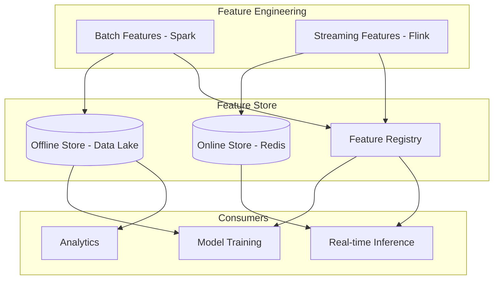

# Feature Stores for Banking ML

## Overview

Feature stores provide a centralized system for storing, discovering, and serving ML features. In banking, features power fraud detection models, credit scoring, customer churn prediction, and personalized GenAI recommendations. The feature store ensures consistency between training and inference, prevents data leakage, and enables feature sharing across teams.

## Feature Store Architecture



## Feature Definitions

```python
"""
Feature definitions for banking ML models.
Defines how features are computed from raw data.
"""
from feast import Entity, FeatureView, Field, FeatureStore
from feast.types import Float64, Int64, String, Bool
from datetime import timedelta

# Entities
customer = Entity(
    name="customer",
    join_keys=["customer_id"],
    description="Banking customer",
)

account = Entity(
    name="account",
    join_keys=["account_id"],
    description="Bank account",
)

transaction = Entity(
    name="transaction",
    join_keys=["transaction_id"],
    description="Financial transaction",
)

# Batch Feature View: Historical features for training
customer_features = FeatureView(
    name="customer_features",
    entities=[customer],
    ttl=timedelta(days=365),
    schema=[
        Field(name="customer_id", dtype=Int64),
        Field(name="total_accounts", dtype=Int64),
        Field(name="total_balance", dtype=Float64),
        Field(name="avg_monthly_spend", dtype=Float64),
        Field(name="monthly_txn_count", dtype=Float64),
        Field(name="customer_segment", dtype=String),
        Field(name="risk_rating", dtype=String),
        Field(name="relationship_years", dtype=Float64),
        Field(name="product_count", dtype=Int64),
        Field(name="days_since_last_transaction", dtype=Int64),
        Field(name="spend_volatility", dtype=Float64),
        Field(name="international_txn_pct", dtype=Float64),
    ],
    source=BatchSource(
        name="customer_feature_table",
        path="s3://banking-features/customer/",
        timestamp_field="computed_at",
        created_timestamp_column="created_at",
    ),
)

# Streaming Feature View: Real-time features for inference
transaction_stream_features = FeatureView(
    name="transaction_stream_features",
    entities=[transaction],
    ttl=timedelta(hours=1),
    schema=[
        Field(name="transaction_id", dtype=String),
        Field(name="account_id", dtype=Int64),
        Field(name="txn_count_last_1h", dtype=Int64),
        Field(name="txn_amount_last_1h", dtype=Float64),
        Field(name="txn_count_last_24h", dtype=Int64),
        Field(name="avg_amount_last_7d", dtype=Float64),
        Field(name="max_amount_last_7d", dtype=Float64),
        Field(name="is_unusual_time", dtype=Bool),
        Field(name="is_international", dtype=Bool),
        Field(name="merchant_risk_score", dtype=Float64),
    ],
    source=StreamSource(
        name="transaction_stream",
        kafka_topic="banking-transactions",
        kafka_bootstrap_servers="kafka-1:9092",
        timestamp_field="transaction_time",
        created_timestamp_column="processed_at",
    ),
)
```

## Online/Offline Feature Serving

```python
"""
Feature serving for training and inference.
Online store: Low-latency feature retrieval for real-time inference.
Offline store: Historical features for model training.
"""
from feast import FeatureStore
import pandas as pd

# Initialize feature store
store = FeatureStore(repo_path="./feature_repo")

# Training: Get historical features
def get_training_data():
    """Get point-in-time correct features for training."""
    # Entity dataframe with events and timestamps
    entity_df = pd.DataFrame({
        'customer_id': [1001, 1002, 1003],
        'event_timestamp': [
            '2025-01-15 10:00:00',
            '2025-01-15 11:30:00',
            '2025-01-15 14:00:00',
        ],
        'label': [0, 1, 0],  # Fraud label
    })
    
    # Get historical features (point-in-time correct)
    training_df = store.get_historical_features(
        entity_df=entity_df,
        feature_refs=[
            'customer_features:total_balance',
            'customer_features:avg_monthly_spend',
            'customer_features:monthly_txn_count',
            'customer_features:spend_volatility',
            'customer_features:days_since_last_transaction',
        ],
    ).to_df()
    
    return training_df

# Inference: Get online features
def get_online_features(customer_id: int) -> dict:
    """Get latest features for real-time inference."""
    features = store.get_online_features(
        features=[
            'customer_features:total_balance',
            'customer_features:avg_monthly_spend',
            'customer_features:monthly_txn_count',
            'customer_features:customer_segment',
            'customer_features:risk_rating',
        ],
        entity_rows=[{'customer_id': customer_id}],
    ).to_dict()
    
    return features

# Feature materialization: Push offline to online
def materialize_features():
    """Sync offline computed features to online store."""
    store.materialize(
        start_date=datetime(2025, 1, 1),
        end_date=datetime.utcnow(),
    )
```

## Real-Time Feature Computation

```python
"""
Real-time feature computation for fraud detection.
Features computed from streaming transaction events.
"""
from collections import defaultdict, deque
import time
import json
from confluent_kafka import Consumer

class RealTimeFeatureComputer:
    """Compute real-time features from streaming events."""
    
    def __init__(self):
        # Sliding window features per account
        self.account_windows = defaultdict(lambda: {
            'amounts_1h': deque(maxlen=1000),
            'amounts_24h': deque(maxlen=10000),
            'timestamps_1h': deque(maxlen=1000),
            'timestamps_24h': deque(maxlen=10000),
            'merchants_24h': set(),
        })
        
        self.consumer = Consumer({
            'bootstrap.servers': 'kafka-1:9092',
            'group.id': 'feature-computer',
            'auto.offset.reset': 'latest',
        })
        self.consumer.subscribe(['banking-transactions'])
    
    def compute_features(self, account_id: int) -> dict:
        """Compute current features for an account."""
        window = self.account_windows[account_id]
        now = time.time()
        
        # Filter to time windows
        amounts_1h = [
            a for a, t in zip(window['amounts_1h'], window['timestamps_1h'])
            if now - t < 3600
        ]
        amounts_24h = [
            a for a, t in zip(window['amounts_24h'], window['timestamps_24h'])
            if now - t < 86400
        ]
        
        return {
            'account_id': account_id,
            'txn_count_last_1h': len(amounts_1h),
            'txn_amount_last_1h': sum(amounts_1h),
            'txn_count_last_24h': len(amounts_24h),
            'avg_amount_last_24h': sum(amounts_24h) / len(amounts_24h) if amounts_24h else 0,
            'max_amount_last_24h': max(amounts_24h) if amounts_24h else 0,
            'unique_merchants_24h': len(window['merchants_24h']),
            'computed_at': now,
        }
    
    def update_features(self, event: dict):
        """Update feature windows with new event."""
        account_id = event['account_id']
        amount = event['amount']
        now = time.time()
        
        window = self.account_windows[account_id]
        
        window['amounts_1h'].append(amount)
        window['timestamps_1h'].append(now)
        window['amounts_24h'].append(amount)
        window['timestamps_24h'].append(now)
        
        if event.get('merchant_id'):
            window['merchants_24h'].add(event['merchant_id'])
    
    def run(self):
        """Main processing loop."""
        while True:
            msg = self.consumer.poll(timeout=1.0)
            if msg is None:
                continue
            if msg.error():
                continue
            
            event = json.loads(msg.value())
            self.update_features(event)
            
            # Compute and store features
            features = self.compute_features(event['account_id'])
            self.store_features(features)
```

## Cross-References

- **Kafka**: See [kafka.md](kafka.md) for streaming infrastructure
- **Spark/PySpark**: See [spark-pyspark.md](spark-pyspark.md) for batch feature computation
- **Redis**: See [redis.md](../databases/redis.md) for online feature storage

## Interview Questions

1. **What is the difference between online and offline feature stores?**
2. **How does a feature store prevent data leakage in training?**
3. **Design a feature store for a real-time fraud detection system.**
4. **How do you handle feature versioning when computation logic changes?**
5. **What is point-in-time correctness and why does it matter for training?**
6. **How do you monitor feature drift between training and production?**

## Checklist: Feature Store Implementation

- [ ] Feature definitions documented and versioned
- [ ] Point-in-time correctness ensured for training data
- [ ] Online store configured for low-latency inference
- [ ] Offline store configured for historical analysis
- [ ] Feature materialization pipeline scheduled
- [ ] Real-time feature computation from streaming events
- [ ] Feature monitoring for drift between training and inference
- [ ] Feature discovery catalog with search and documentation
- [ ] Access controls for sensitive features
- [ ] Feature validation at ingestion
