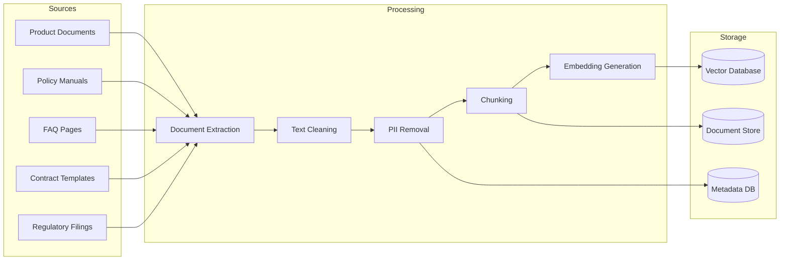

# GenAI Data Preparation for Banking Platforms

## Overview

Data preparation for GenAI is fundamentally different from traditional data engineering. Instead of structured schemas and aggregations, GenAI pipelines process unstructured documents, clean and chunk text, generate embeddings, and build retrieval-optimized indexes. This guide covers the complete data preparation workflow for banking GenAI applications including RAG systems, intelligent document processing, and conversational AI.

## GenAI Data Pipeline Architecture



## Document Processing Pipeline

```python
"""
Complete document processing pipeline for banking GenAI.
Handles PDF, HTML, Markdown, and plain text documents.
"""
import re
import hashlib
import logging
from datetime import datetime
from typing import List, Dict, Optional
from dataclasses import dataclass, asdict
from pathlib import Path

logger = logging.getLogger(__name__)

@dataclass
class Document:
    """Represents a banking document for GenAI processing."""
    document_id: str
    title: str
    source: str
    doc_type: str  # PRODUCT, POLICY, FAQ, CONTRACT, REGULATORY
    content: str
    metadata: Dict
    created_at: datetime
    version: str
    language: str = 'en'

@dataclass
class DocumentChunk:
    """A processed chunk ready for embedding."""
    chunk_id: str
    document_id: str
    chunk_index: int
    content: str
    token_count: int
    metadata: Dict
    embedding: Optional[List[float]] = None

class BankingDocumentProcessor:
    """Process banking documents for GenAI retrieval."""
    
    def __init__(
        self,
        chunk_size: int = 1000,
        chunk_overlap: int = 200,
        min_chunk_size: int = 100,
    ):
        self.chunk_size = chunk_size
        self.chunk_overlap = chunk_overlap
        self.min_chunk_size = min_chunk_size
    
    def process_document(self, doc: Document) -> List[DocumentChunk]:
        """Process a single document into embedding-ready chunks."""
        logger.info(f"Processing document {doc.document_id}: {doc.title}")
        
        # Step 1: Clean text
        cleaned_content = self._clean_text(doc.content)
        
        # Step 2: Remove PII
        sanitized_content = self._remove_pii(cleaned_content)
        
        # Step 3: Validate content quality
        if not self._is_quality_acceptable(sanitized_content):
            logger.warning(
                f"Document {doc.document_id} failed quality checks"
            )
            return []
        
        # Step 4: Split into chunks
        chunks = self._chunk_text(sanitized_content)
        
        # Step 5: Create chunk objects with metadata
        document_chunks = []
        for i, chunk_text in enumerate(chunks):
            chunk = DocumentChunk(
                chunk_id=self._generate_chunk_id(doc.document_id, i, chunk_text),
                document_id=doc.document_id,
                chunk_index=i,
                content=chunk_text.strip(),
                token_count=self._count_tokens(chunk_text),
                metadata={
                    'document_title': doc.title,
                    'document_type': doc.doc_type,
                    'source': doc.source,
                    'version': doc.version,
                    'language': doc.language,
                    'chunk_index': i,
                    'total_chunks': len(chunks),
                    'processed_at': datetime.utcnow().isoformat(),
                    **doc.metadata,
                }
            )
            document_chunks.append(chunk)
        
        logger.info(
            f"Document {doc.document_id} -> {len(document_chunks)} chunks"
        )
        return document_chunks
    
    def _clean_text(self, text: str) -> str:
        """Clean and normalize document text."""
        # Normalize whitespace
        text = re.sub(r'\n{3,}', '\n\n', text)  # Max 2 consecutive newlines
        text = re.sub(r' +', ' ', text)  # Single spaces
        text = text.strip()
        
        # Remove page numbers and headers/footers
        text = re.sub(r'\n\s*-\s*\d+\s*-\s*\n', '\n', text)
        text = re.sub(r'\nPage \d+ of \d+\n', '\n', text)
        
        # Remove special characters that don't add semantic value
        text = re.sub(r'[^\x00-\x7F]+', ' ', text)  # Remove non-ASCII
        
        # Fix common OCR artifacts
        text = text.replace('|', 'I')  # OCR pipe vs capital I
        text = re.sub(r'(\d)0(\d)', r'\1O\2', text)  # Fix OCR 0 vs O (contextual)
        
        return text
    
    def _remove_pii(self, text: str) -> str:
        """Remove personally identifiable information."""
        # Account numbers (10-16 digits)
        text = re.sub(r'\b\d{10,16}\b', '[ACCOUNT_NUMBER]', text)
        
        # SSNs
        text = re.sub(r'\b\d{3}-\d{2}-\d{4}\b', '[SSN]', text)
        
        # Credit card numbers
        text = re.sub(
            r'\b\d{4}[\s-]?\d{4}[\s-]?\d{4}[\s-]?\d{4}\b',
            '[CREDIT_CARD]',
            text
        )
        
        # Email addresses
        text = re.sub(
            r'\b[A-Za-z0-9._%+-]+@[A-Za-z0-9.-]+\.[A-Z|a-z]{2,}\b',
            '[EMAIL]',
            text
        )
        
        # Phone numbers
        text = re.sub(
            r'\b\+?1?[\s-]?\(?\d{3}\)?[\s-]?\d{3}[\s-]?\d{4}\b',
            '[PHONE]',
            text
        )
        
        return text
    
    def _chunk_text(self, text: str) -> List[str]:
        """Split text into overlapping chunks."""
        # Use semantic boundaries for chunking
        separators = [
            '\n\n',      # Paragraph breaks
            '\n',        # Line breaks
            '. ',        # Sentence ends
            '! ',        # Exclamation
            '? ',        # Question
            ', ',        # Clause breaks
            ' ',         # Word breaks
            '',          # Character level (last resort)
        ]
        
        chunks = self._recursive_split(text, separators, self.chunk_size)
        
        # Filter out chunks that are too small
        chunks = [c for c in chunks if len(c) >= self.min_chunk_size]
        
        return chunks
    
    def _recursive_split(self, text: str, separators: List[str], max_size: int) -> List[str]:
        """Recursively split text using separators."""
        if len(text) <= max_size:
            return [text]
        
        if not separators:
            # Character-level split
            return [text[i:i+max_size] for i in range(0, len(text), max_size - self.chunk_overlap)]
        
        separator = separators[0]
        remaining_separators = separators[1:]
        
        # Split by current separator
        parts = text.split(separator)
        
        # Try to merge parts into chunks of appropriate size
        chunks = []
        current_chunk = []
        current_length = 0
        
        for part in parts:
            part_length = len(part)
            
            if part_length > max_size:
                # Part is too large, recurse with remaining separators
                if current_chunk:
                    chunks.append(separator.join(current_chunk))
                    current_chunk = []
                    current_length = 0
                
                sub_chunks = self._recursive_split(
                    part, remaining_separators, max_size
                )
                chunks.extend(sub_chunks)
            
            elif current_length + part_length + len(separator) <= max_size:
                current_chunk.append(part)
                current_length += part_length + len(separator)
            
            else:
                # Current chunk is full
                if current_chunk:
                    chunks.append(separator.join(current_chunk))
                current_chunk = [part]
                current_length = part_length
        
        if current_chunk:
            chunks.append(separator.join(current_chunk))
        
        # Add overlap by prepending end of previous chunk
        if len(chunks) > 1:
            overlapped = [chunks[0]]
            for i in range(1, len(chunks)):
                prev_end = chunks[i-1][-self.chunk_overlap:]
                overlapped.append(prev_end + chunks[i])
            chunks = overlapped
        
        return chunks
    
    def _count_tokens(self, text: str) -> int:
        """Estimate token count (rough approximation)."""
        # ~4 characters per token for English
        return len(text) // 4
    
    def _generate_chunk_id(self, doc_id: str, index: int, content: str) -> str:
        """Generate unique chunk ID."""
        content_hash = hashlib.md5(content.encode()).hexdigest()[:8]
        return f"{doc_id}_chunk_{index}_{content_hash}"
    
    def _is_quality_acceptable(self, text: str) -> bool:
        """Check if text quality is acceptable for embedding."""
        if len(text) < self.min_chunk_size:
            return False
        
        # Check for meaningful content ratio
        words = text.split()
        if not words:
            return False
        
        # Reject if too many placeholder/redacted markers
        redacted_count = len(re.findall(r'\[.*?\]', text))
        if redacted_count / len(words) > 0.5:
            return False
        
        return True
```

## Batch Embedding Generation

```python
"""Batch embedding generation for banking documents."""
import asyncio
from openai import AsyncOpenAI
from typing import List
import logging

logger = logging.getLogger(__name__)

class BatchEmbeddingGenerator:
    """Generate embeddings for document chunks in batches."""
    
    def __init__(
        self,
        model: str = 'text-embedding-3-large',
        batch_size: int = 100,
        max_retries: int = 3,
    ):
        self.client = AsyncOpenAI()
        self.model = model
        self.batch_size = batch_size
        self.max_retries = max_retries
    
    async def generate_embeddings(
        self, chunks: List[DocumentChunk]
    ) -> List[DocumentChunk]:
        """Generate embeddings for all chunks."""
        # Process in batches
        for i in range(0, len(chunks), self.batch_size):
            batch = chunks[i:i + self.batch_size]
            
            texts = [chunk.content for chunk in batch]
            
            # Call embedding API
            for attempt in range(self.max_retries):
                try:
                    response = await self.client.embeddings.create(
                        input=texts,
                        model=self.model,
                    )
                    
                    # Attach embeddings to chunks
                    for chunk, embedding_obj in zip(batch, response.data):
                        chunk.embedding = embedding_obj.embedding
                    
                    logger.info(
                        f"Embedded batch {i // self.batch_size + 1}: "
                        f"{len(batch)} chunks"
                    )
                    break
                
                except Exception as e:
                    if attempt == self.max_retries - 1:
                        logger.error(f"Failed to embed batch: {e}")
                        raise
                    await asyncio.sleep(2 ** attempt)  # Exponential backoff
        
        return chunks
    
    async def run_pipeline(self, documents: List[Document]) -> List[DocumentChunk]:
        """Run full pipeline: process -> embed."""
        processor = BankingDocumentProcessor()
        
        all_chunks = []
        for doc in documents:
            chunks = processor.process_document(doc)
            all_chunks.extend(chunks)
        
        # Generate embeddings
        all_chunks = await self.generate_embeddings(all_chunks)
        
        return all_chunks
```

## Cross-References

- **Embedding Pipelines**: See [embedding-pipelines.md](embedding-pipelines.md) for embedding infrastructure
- **PII Masking**: See [pii-masking.md](pii-masking.md) for PII removal
- **Data Quality**: See [data-quality.md](data-quality.md) for quality checks

## Interview Questions

1. **How do you chunk banking documents for optimal RAG retrieval?**
2. **What quality checks do you apply before embedding documents?**
3. **How do you handle documents with tables and structured data in GenAI pipelines?**
4. **Design a pipeline that keeps embeddings fresh when source documents change.**
5. **How do you evaluate the quality of your document chunks for retrieval?**
6. **What metadata do you attach to chunks to improve retrieval relevance?**

## Checklist: GenAI Data Preparation

- [ ] Documents extracted from source systems (PDF, HTML, Markdown)
- [ ] Text cleaned and normalized (whitespace, OCR fixes)
- [ ] PII detected and removed/masked
- [ ] Content quality validated before chunking
- [ ] Chunking strategy chosen (size, overlap, boundaries)
- [ ] Chunk metadata captured (source, type, version, position)
- [ ] Embedding model selected and versioned
- [ ] Batch processing with retry and error handling
- [ ] Embeddings stored with version tracking
- [ ] Stale/updated document detection for re-embedding
- [ ] Retrieval quality metrics defined and tracked
