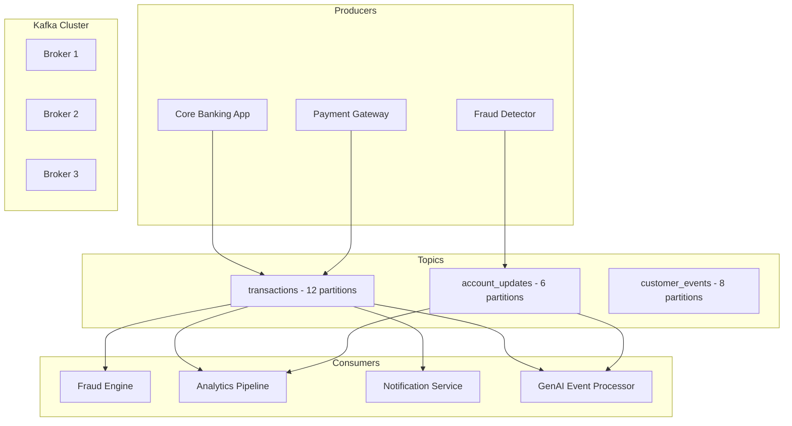

# Apache Kafka for Banking Data Streaming

## Overview

Apache Kafka is the backbone of real-time data streaming in modern banking platforms. It provides durable, ordered, replayable event streams that power fraud detection, real-time analytics, CDC synchronization, and GenAI event-driven workflows. This guide covers Kafka architecture, producer/consumer patterns, partitioning strategies, and operational best practices for banking environments.

## Kafka Architecture



## Core Concepts

### Topics and Partitions

```
Topic: transactions
Partitions: 12
Replication Factor: 3

Partition 0: [txn_001, txn_012, txn_024, ...]
Partition 1: [txn_002, txn_013, txn_025, ...]
Partition 2: [txn_003, txn_014, txn_026, ...]
...

Each partition is an ordered, immutable log.
Ordering is guaranteed WITHIN a partition, not across partitions.
```

### Key-Based Partitioning for Banking

```python
# Correct: Use account_id as key for ordering guarantees
from confluent_kafka import Producer

producer = Producer({
    'bootstrap.servers': 'kafka-broker-1:9092,kafka-broker-2:9092',
    'acks': 'all',  # Wait for all replicas (banking requirement)
    'retries': 5,
    'enable.idempotence': True,  # Exactly-once producer
    'max.in.flight.requests.per.connection': 5,
    'compression.type': 'lz4',
})

def delivery_report(err, msg):
    if err:
        logger.error(f"Message delivery failed: {err}")
    else:
        logger.info(
            f"Delivered to {msg.topic()} "
            f"[{msg.partition()}] @ offset {msg.offset()}"
        )

def publish_transaction(transaction: dict):
    """Publish transaction event with key for ordering."""
    # Key by account_id: all transactions for same account 
    # go to same partition, maintaining order
    key = str(transaction['account_id']).encode('utf-8')
    value = json.dumps(transaction).encode('utf-8')
    
    producer.produce(
        topic='banking-transactions',
        key=key,
        value=value,
        headers=[
            ('event_type', transaction['type'].encode()),
            ('schema_version', b'v2'),
            ('source_system', transaction['source'].encode()),
        ],
        callback=delivery_report,
    )
    
    producer.poll(0)  # Trigger delivery callbacks
```

## Consumer Groups and Parallelism

```python
from confluent_kafka import Consumer, KafkaException

class TransactionConsumer:
    """Kafka consumer for processing banking transactions."""
    
    def __init__(self, group_id: str, topics: list):
        self.consumer = Consumer({
            'bootstrap.servers': 'kafka-broker-1:9092',
            'group.id': group_id,
            'auto.offset.reset': 'earliest',  # Process from beginning
            'enable.auto.commit': False,  # Manual commit for control
            'max.poll.records': 500,
            'session.timeout.ms': 30000,
            'max.poll.interval.ms': 300000,  # 5 min processing time
            'isolation.level': 'read_committed',  # Only see committed txns
        })
        self.consumer.subscribe(topics)
    
    def process_batch(self, messages: list):
        """Process a batch of messages with transactional writes."""
        processed = []
        for msg in messages:
            if msg.error():
                logger.error(f"Consumer error: {msg.error()}")
                continue
            
            event = json.loads(msg.value())
            # Process the transaction
            result = self.process_transaction(event)
            processed.append(result)
        
        # Write results to database
        self.write_to_database(processed)
        
        # Commit offsets AFTER successful processing
        self.consumer.commit(asynchronous=False)
    
    def run(self):
        """Main consumer loop."""
        try:
            while True:
                messages = []
                for _ in range(500):
                    msg = self.consumer.poll(timeout=1.0)
                    if msg is None:
                        break
                    messages.append(msg)
                
                if messages:
                    self.process_batch(messages)
                    
        except KeyboardInterrupt:
            pass
        finally:
            self.consumer.close()
```

## Kafka Streams for Real-Time Processing

```python
# Kafka Streams equivalent in Python using Faust or ksqlDB
# ksqlDB approach for banking stream processing

"""
-- ksqlDB: Real-time fraud detection stream
CREATE STREAM transactions_raw (
    transaction_id VARCHAR,
    account_id BIGINT,
    amount DOUBLE,
    currency VARCHAR,
    merchant_id VARCHAR,
    transaction_time BIGINT
) WITH (
    KAFKA_TOPIC = 'banking-transactions',
    VALUE_FORMAT = 'JSON'
);

-- Windowed aggregation: transactions per account in 5-minute windows
CREATE TABLE account_txn_windows AS
SELECT 
    account_id,
    COUNT(*) AS txn_count,
    SUM(amount) AS total_amount,
    MAX(amount) AS max_amount
FROM transactions_raw
WINDOW TUMBLING (SIZE 5 MINUTES)
GROUP BY account_id;

-- Fraud detection: flag accounts with >10 transactions or >$50K in 5 min
CREATE STREAM fraud_alerts AS
SELECT 
    account_id,
    txn_count,
    total_amount,
    max_amount,
    WINDOWSTART AS window_start,
    WINDOWEND AS window_end
FROM account_txn_windows
WHERE txn_count > 10 OR total_amount > 50000;

-- Join with customer data for enriched alerts
CREATE STREAM enriched_fraud_alerts AS
SELECT 
    f.account_id,
    c.customer_name,
    c.risk_rating,
    f.txn_count,
    f.total_amount,
    CASE 
        WHEN c.risk_rating = 'HIGH' AND f.total_amount > 20000 THEN 'CRITICAL'
        WHEN c.risk_rating = 'HIGH' THEN 'HIGH'
        WHEN f.total_amount > 50000 THEN 'HIGH'
        ELSE 'MEDIUM'
    END AS alert_severity
FROM fraud_alerts f
LEFT JOIN customers_table c ON f.account_id = c.account_id;
"""
```

## Exactly-Once Semantics

```python
# Exactly-once processing with Kafka transactions
from confluent_kafka import Producer, Consumer

class ExactlyOnceProcessor:
    """Process messages with exactly-once semantics."""
    
    def __init__(self):
        self.producer = Producer({
            'bootstrap.servers': 'kafka-1:9092',
            'transactional.id': 'banking-processor-1',
            'enable.idempotence': True,
            'acks': 'all',
        })
        self.producer.init_transactions()
        
        self.consumer = Consumer({
            'bootstrap.servers': 'kafka-1:9092',
            'group.id': 'banking-processor',
            'isolation.level': 'read_committed',
            'enable.auto.commit': False,
        })
        self.consumer.subscribe(['input-topic'])
    
    def process_and_produce(self):
        """Process messages with transactional output."""
        while True:
            msg = self.consumer.poll(timeout=1.0)
            if msg is None:
                continue
            if msg.error():
                continue
            
            self.producer.begin_transaction()
            
            try:
                # Process input
                event = json.loads(msg.value())
                result = self.transform(event)
                
                # Produce output
                self.producer.produce(
                    topic='output-topic',
                    key=str(result['account_id']),
                    value=json.dumps(result).encode(),
                )
                
                # Send offsets to transaction
                self.producer.send_offsets_to_transaction(
                    consumer=self.consumer,
                    partitions=[
                        TopicPartition(
                            msg.topic(), msg.partition(), msg.offset() + 1
                        )
                    ]
                )
                
                self.producer.commit_transaction()
                
            except Exception as e:
                self.producer.abort_transaction()
                logger.error(f"Transaction aborted: {e}")
```

## Schema Registry

```python
# Using Schema Registry for schema evolution
from confluent_kafka.schema_registry import SchemaRegistryClient
from confluent_kafka.schema_registry.avro import AvroSerializer
from confluent_kafka import Producer

# Avro schema for banking transactions
TRANSACTION_SCHEMA = """
{
    "type": "record",
    "name": "BankingTransaction",
    "namespace": "com.banking.events",
    "fields": [
        {"name": "transaction_id", "type": "string"},
        {"name": "account_id", "type": "long"},
        {"name": "amount", "type": "double"},
        {"name": "currency", "type": "string"},
        {"name": "transaction_type", "type": "string"},
        {"name": "transaction_time", "type": "long"},
        {"name": "merchant_id", "type": ["null", "string"], "default": null},
        {"name": "channel", "type": "string", "default": "unknown"}
    ]
}
"""

schema_registry_client = SchemaRegistryClient({
    'url': 'http://schema-registry:8081'
})

avro_serializer = AvroSerializer(
    schema_registry_client,
    TRANSACTION_SCHEMA,
)

producer = Producer({
    'bootstrap.servers': 'kafka-1:9092',
    'key.serializer': 'string',
    'value.serializer': avro_serializer,
})

# Schema evolution: Adding new field with default value
# This is BACKWARD compatible - old consumers can read new data
```

## Monitoring and Operations

```yaml
# Key Kafka metrics to monitor for banking
kafka_monitoring:
  producer_metrics:
    - kafka_producer_record_send_rate
    - kafka_producer_record_error_rate
    - kafka_producer_request_latency_avg
    - kafka_producer_batch_size_avg
  
  consumer_metrics:
    - kafka_consumer_records_consumed_rate
    - kafka_consumer_lag  # Most critical for SLA
    - kafka_consumer_commit_latency
    - kafka_consumer_poll_idle_ratio
  
  broker_metrics:
    - kafka_server_under_replicated_partitions
    - kafka_server_isr_shrinks_rate
    - kafka_server_request_rate
    - kafka_network_io_rate
    - kafka_disk_usage
  
  alerting:
    consumer_lag_warning:
      expr: kafka_consumer_lag > 10000
      for: 5m
      severity: warning
    
    consumer_lag_critical:
      expr: kafka_consumer_lag > 100000
      for: 2m
      severity: critical
    
    under_replicated:
      expr: kafka_server_under_replicated_partitions > 0
      for: 1m
      severity: critical
```

## Cross-References

- **CDC**: See [cdc.md](cdc.md) for database change streaming
- **Data Pipelines**: See [data-pipelines.md](data-pipelines.md) for pipeline design
- **Streaming vs Batch**: See [batch-vs-streaming.md](batch-vs-streaming.md) for tradeoffs

## Interview Questions

1. **How do you guarantee message ordering in Kafka for banking transactions?**
2. **Your consumer lag is growing rapidly. What are the possible causes and how do you fix them?**
3. **Explain exactly-once semantics in Kafka. How is it implemented?**
4. **How do you choose the number of partitions for a topic?**
5. **What is the difference between `acks=1` and `acks=all`? Which should banking use?**
6. **Design a Kafka-based architecture for real-time fraud detection.**

## Checklist: Kafka Production Readiness

- [ ] `acks=all` for banking-critical topics
- [ ] `enable.idempotence=true` on producers
- [ ] Replication factor >= 3 for durability
- [ ] Consumer group offsets managed and monitored
- [ ] Schema Registry configured with compatibility rules
- [ ] Consumer lag alerting configured
- [ ] Disk space monitoring on brokers
- [ ] `min.insync.replicas` set appropriately
- [ ] Log retention policy matches compliance requirements
- [ ] DLQ topic configured for poison messages
