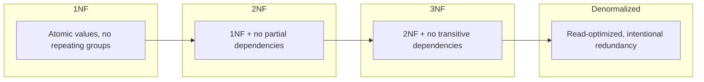

# Schema Design for Banking Data Systems

## Overview

Schema design decisions in banking systems have long-lasting consequences. Poor normalization leads to data anomalies; over-normalization causes complex joins that slow down queries. This guide covers normalization strategies, denormalization patterns, and practical schema design for banking data systems.

## Normalization Levels



## Normalized Banking Schema (3NF)

```sql
-- Fully normalized schema (good for transactional integrity)

-- Customers
CREATE TABLE customers (
    customer_id BIGINT GENERATED ALWAYS AS IDENTITY PRIMARY KEY,
    first_name VARCHAR(100) NOT NULL,
    last_name VARCHAR(100) NOT NULL,
    date_of_birth DATE NOT NULL,
    national_id_hash VARCHAR(64) NOT NULL UNIQUE,
    risk_rating VARCHAR(10) CHECK (risk_rating IN ('LOW', 'MEDIUM', 'HIGH', 'CRITICAL')),
    customer_segment VARCHAR(20),
    created_at TIMESTAMPTZ DEFAULT NOW(),
    updated_at TIMESTAMPTZ DEFAULT NOW()
);

-- Addresses (separate table: one customer, many addresses)
CREATE TABLE customer_addresses (
    address_id BIGINT GENERATED ALWAYS AS IDENTITY PRIMARY KEY,
    customer_id BIGINT NOT NULL REFERENCES customers(customer_id),
    address_type VARCHAR(20) CHECK (address_type IN ('HOME', 'WORK', 'MAILING')),
    street_address VARCHAR(200),
    city VARCHAR(100),
    state VARCHAR(50),
    postal_code VARCHAR(20),
    country VARCHAR(50),
    is_primary BOOLEAN DEFAULT false,
    valid_from DATE,
    valid_to DATE
);

-- Accounts
CREATE TABLE accounts (
    account_id BIGINT GENERATED ALWAYS AS IDENTITY PRIMARY KEY,
    customer_id BIGINT NOT NULL REFERENCES customers(customer_id),
    account_number VARCHAR(20) NOT NULL UNIQUE,
    account_type_id BIGINT NOT NULL REFERENCES account_types(account_type_id),
    currency VARCHAR(3) NOT NULL DEFAULT 'USD',
    status VARCHAR(20) CHECK (status IN ('ACTIVE', 'FROZEN', 'CLOSED', 'DORMANT')),
    opened_date DATE NOT NULL,
    closed_date DATE
);

-- Account types (reference data)
CREATE TABLE account_types (
    account_type_id BIGINT PRIMARY KEY,
    type_code VARCHAR(10) UNIQUE,
    type_name VARCHAR(50),
    category VARCHAR(20)  -- CHECKING, SAVINGS, LOAN, CREDIT
);

-- Transactions
CREATE TABLE transactions (
    transaction_id BIGINT GENERATED ALWAYS AS IDENTITY PRIMARY KEY,
    account_id BIGINT NOT NULL REFERENCES accounts(account_id),
    transaction_type_id BIGINT NOT NULL REFERENCES transaction_types(transaction_type_id),
    amount DECIMAL(15, 2) NOT NULL CHECK (amount > 0),
    currency VARCHAR(3) NOT NULL,
    transaction_time TIMESTAMPTZ NOT NULL,
    balance_after DECIMAL(15, 2),
    reference VARCHAR(100),
    channel VARCHAR(20),
    status VARCHAR(20) DEFAULT 'PENDING'
);

-- Transaction types (reference data)
CREATE TABLE transaction_types (
    transaction_type_id BIGINT PRIMARY KEY,
    type_code VARCHAR(20) UNIQUE,
    type_name VARCHAR(50),
    category VARCHAR(20)  -- DEBIT, CREDIT
);

-- Merchants
CREATE TABLE merchants (
    merchant_id BIGINT GENERATED ALWAYS AS IDENTITY PRIMARY KEY,
    merchant_code VARCHAR(20) UNIQUE,
    merchant_name VARCHAR(200),
    category_code VARCHAR(10),  -- MCC code
    country VARCHAR(50)
);

-- Transaction-Merchant relationship
CREATE TABLE transaction_merchants (
    transaction_id BIGINT PRIMARY KEY REFERENCES transactions(transaction_id),
    merchant_id BIGINT REFERENCES merchants(merchant_id)
);
```

## Denormalized Schema for Analytics

```sql
-- Denormalized schema for read-heavy analytics workloads
-- Intentionally duplicating data to avoid joins

CREATE TABLE analytics_transactions (
    transaction_id BIGINT,
    account_id BIGINT,
    customer_id BIGINT,
    customer_name VARCHAR(200),        -- Denormalized from customers
    customer_segment VARCHAR(20),      -- Denormalized from customers
    account_number VARCHAR(20),        -- Denormalized from accounts
    account_type VARCHAR(50),          -- Denormalized from account_types
    transaction_type VARCHAR(50),      -- Denormalized from transaction_types
    amount DECIMAL(15, 2),
    currency VARCHAR(3),
    transaction_time TIMESTAMPTZ,
    transaction_date DATE GENERATED ALWAYS AS (DATE(transaction_time)) STORED,
    balance_after DECIMAL(15, 2),
    merchant_name VARCHAR(200),        -- Denormalized from merchants
    merchant_category VARCHAR(50),     -- Denormalized from merchants
    channel VARCHAR(20),
    status VARCHAR(20),
    branch_name VARCHAR(100),          -- Denormalized from branches
    region VARCHAR(50),                -- Denormalized from branches
    
    -- Audit
    created_at TIMESTAMPTZ DEFAULT NOW()
) PARTITION BY RANGE (transaction_date);

-- Benefits of denormalization:
-- 1. Single-table queries (no joins)
-- 2. Partitioning by date is straightforward
-- 3. Columnar storage formats (Parquet) benefit from flat schemas
-- 4. BI tools work better with flat tables

-- Costs of denormalization:
-- 1. Data duplication (storage cost)
-- 2. Update anomalies (must update in multiple places)
-- 3. Larger ETL pipelines to maintain consistency
```

## Hybrid Approach: Normalized Write, Denormalized Read

```sql
-- Write to normalized schema (OLTP)
INSERT INTO transactions (account_id, transaction_type_id, amount, currency, transaction_time)
VALUES (1001, 5, 500.00, 'USD', NOW());

-- ETL process denormalizes to analytics schema (OLAP)
INSERT INTO analytics_transactions (
    transaction_id, account_id, customer_id, customer_name, customer_segment,
    account_number, account_type, transaction_type, amount, currency,
    transaction_time, balance_after, merchant_name, merchant_category, channel, status
)
SELECT 
    t.transaction_id,
    t.account_id,
    c.customer_id,
    c.first_name || ' ' || c.last_name AS customer_name,
    c.customer_segment,
    a.account_number,
    at.type_name AS account_type,
    tt.type_name AS transaction_type,
    t.amount,
    t.currency,
    t.transaction_time,
    t.balance_after,
    m.merchant_name,
    mc.category_name AS merchant_category,
    t.channel,
    t.status
FROM transactions t
JOIN accounts a ON t.account_id = a.account_id
JOIN customers c ON a.customer_id = c.customer_id
JOIN account_types at ON a.account_type_id = at.account_type_id
JOIN transaction_types tt ON t.transaction_type_id = tt.transaction_type_id
LEFT JOIN transaction_merchants tm ON t.transaction_id = tm.transaction_id
LEFT JOIN merchants m ON tm.merchant_id = m.merchant_id
LEFT JOIN merchant_categories mc ON m.category_code = mc.category_code
WHERE t.transaction_id > COALESCE(
    (SELECT max(transaction_id) FROM analytics_transactions), 0
);
```

## Schema Design for GenAI Document Storage

```sql
-- Storing documents and chunks for GenAI retrieval

CREATE TABLE banking_documents (
    document_id UUID PRIMARY KEY DEFAULT gen_random_uuid(),
    title VARCHAR(500),
    document_type VARCHAR(50),  -- PRODUCT_INFO, POLICY, FAQ, CONTRACT
    source_system VARCHAR(50),
    source_url TEXT,
    version VARCHAR(20),
    language VARCHAR(5) DEFAULT 'en',
    status VARCHAR(20) DEFAULT 'DRAFT',
    published_at TIMESTAMPTZ,
    content TEXT,  -- Full document text
    metadata JSONB,  -- Flexible metadata
    created_at TIMESTAMPTZ DEFAULT NOW(),
    updated_at TIMESTAMPTZ DEFAULT NOW()
);

-- Document chunks for RAG retrieval
CREATE TABLE document_chunks (
    chunk_id UUID PRIMARY KEY DEFAULT gen_random_uuid(),
    document_id UUID REFERENCES banking_documents(document_id),
    chunk_index INTEGER NOT NULL,
    content TEXT NOT NULL,
    token_count INTEGER,
    embedding VECTOR(1536),  -- pgvector
    embedding_model VARCHAR(50),
    embedding_version VARCHAR(20),
    metadata JSONB,
    created_at TIMESTAMPTZ DEFAULT NOW(),
    
    -- Ensure chunk ordering
    UNIQUE(document_id, chunk_index)
);

-- GIN index on JSONB metadata for flexible querying
CREATE INDEX idx_doc_metadata ON banking_documents USING gin (metadata);

-- HNSW index on embeddings for fast similarity search
CREATE INDEX idx_chunks_embedding 
ON document_chunks 
USING hnsw (embedding vector_cosine_ops);
```

## Cross-References

- **JSONB**: See [jsonb.md](../databases/jsonb.md) for flexible schema with JSONB
- **Partitioning**: See [data-partitioning.md](data-partitioning.md) for table partitioning
- **pgvector**: See [pgvector.md](../databases/pgvector.md) for vector storage

## Interview Questions

1. **When would you denormalize a banking schema? What are the tradeoffs?**
2. **Design a schema for storing customer documents with GenAI retrieval support.**
3. **How do you handle slowly changing dimensions in a banking data warehouse?**
4. **What is the difference between horizontal and vertical partitioning?**
5. **How would you design a schema that supports both OLTP and OLAP workloads?**
6. **Your transactions table has 200 columns and queries are slow. What do you investigate?**

## Checklist: Schema Design

- [ ] Primary keys defined for all tables
- [ ] Foreign keys with appropriate ON DELETE behavior
- [ ] Check constraints for data validation at database level
- [ ] Indexes on foreign key columns
- [ ] Appropriate data types (avoid VARCHAR when domain type exists)
- [ ] Timestamps with time zones (TIMESTAMPTZ)
- [ ] Audit columns (created_at, updated_at) on all tables
- [ ] JSONB for flexible/semi-structured data (not EAV pattern)
- [ ] Partition keys included in primary key for partitioned tables
- [ ] Denormalized read tables have clear ownership and refresh strategy
