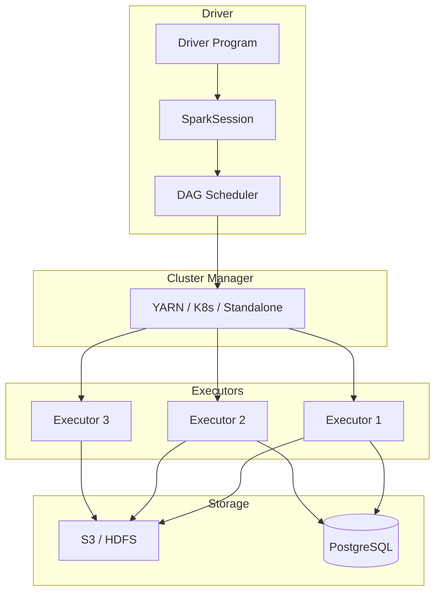

# Apache Spark and PySpark for Large-Scale Banking Data Processing

## Overview

Apache Spark is the de facto standard for large-scale batch and streaming data processing. In banking, Spark handles workloads that exceed single-machine memory capacity: multi-year transaction analysis, customer segmentation across millions of records, and embedding generation for GenAI knowledge bases. This guide covers Spark architecture, PySpark patterns, performance tuning, and banking-specific use cases.

## Spark Architecture



## SparkSession and Basic Setup

```python
from pyspark.sql import SparkSession
from pyspark.sql.functions import *
from pyspark.sql.types import *
from pyspark.sql.window import Window

# Production Spark session configuration
spark = (SparkSession.builder
    .appName("banking-daily-etl")
    .config("spark.sql.adaptive.enabled", "true")
    .config("spark.sql.adaptive.coalescePartitions.enabled", "true")
    .config("spark.sql.adaptive.skewJoin.enabled", "true")
    .config("spark.sql.shuffle.partitions", "200")
    .config("spark.executor.memory", "8g")
    .config("spark.executor.cores", "4")
    .config("spark.driver.memory", "4g")
    .config("spark.sql.execution.arrow.pyspark.enabled", "true")
    .config("spark.serializer", "org.apache.spark.serializer.KryoSerializer")
    .config("spark.dynamicAllocation.enabled", "true")
    .config("spark.dynamicAllocation.minExecutors", "2")
    .config("spark.dynamicAllocation.maxExecutors", "20")
    .config("spark.memory.fraction", "0.8")
    .config("spark.sql.broadcastTimeout", "300")
    .getOrCreate()
)
```

## Reading and Writing Data

```python
# Read from various sources
# Parquet (preferred for large datasets)
transactions_df = spark.read.parquet(
    "s3://banking-data-lake/transactions/year=2025/month=01/"
)

# Partitioned data with predicate pushdown
daily_txns = spark.read.parquet(
    "s3://banking-data-lake/transactions/"
).filter("transaction_date = '2025-01-15'")

# JDBC from PostgreSQL
accounts_df = (spark.read
    .format("jdbc")
    .option("url", "jdbc:postgresql://db-host:5432/banking")
    .option("dbtable", "accounts")
    .option("user", db_user)
    .option("password", db_password)
    .option("driver", "org.postgresql.Driver")
    .option("fetchsize", "10000")
    .option("partitionColumn", "account_id")
    .option("lowerBound", "1")
    .option("upperBound", "10000000")
    .option("numPartitions", "16")
    .load()
)

# Kafka streaming
from pyspark.sql.functions import from_json, col

kafka_df = (spark.readStream
    .format("kafka")
    .option("kafka.bootstrap.servers", "kafka-1:9092,kafka-2:9092")
    .option("subscribe", "banking-transactions")
    .option("startingOffsets", "latest")
    .option("failOnDataLoss", "false")
    .load()
)

# Write with partitioning and compression
(transactions_df
    .write
    .mode("overwrite")
    .partitionBy("transaction_date", "transaction_type")
    .option("compression", "snappy")
    .parquet("s3://banking-data-lake/processed-transactions/")
)
```

## Core Transformations

### Daily Transaction Analytics

```python
from pyspark.sql.functions import *
from pyspark.sql.window import Window

# Load raw transactions
txns = spark.read.parquet("s3://banking-data-lake/raw/transactions/")

# Aggregate: Daily summary by account
daily_summary = (txns
    .filter(col("transaction_date") == "2025-01-15")
    .groupBy("account_id")
    .agg(
        count("*").alias("txn_count"),
        sum("amount").alias("total_amount"),
        avg("amount").alias("avg_amount"),
        min("amount").alias("min_amount"),
        max("amount").alias("max_amount"),
        percentile_approx("amount", 0.5).alias("median_amount"),
        countDistinct("merchant_id").alias("unique_merchants"),
    )
)

# Window functions: Running balance
window_spec = Window.partitionBy("account_id").orderBy("transaction_time")

with_running_total = (txns
    .withColumn("running_total", 
        sum("amount").over(
            window_spec.rowsBetween(Window.unboundedPreceding, 0)
        )
    )
    .withColumn("prev_amount", 
        lag("amount", 1).over(window_spec)
    )
    .withColumn("amount_change", 
        col("amount") - col("prev_amount")
    )
)

# Customer segmentation
from pyspark.ml.feature import VectorAssembler
from pyspark.ml.clustering import KMeans

# Prepare features for clustering
customer_features = (txns
    .groupBy("customer_id")
    .agg(
        count("*").alias("total_txns"),
        sum("amount").alias("total_spend"),
        avg("amount").alias("avg_txn_amount"),
        countDistinct("transaction_date").alias("active_days"),
        stddev("amount").alias("spend_volatility"),
    )
    .na.fill(0)  # Handle nulls
)

# Assemble features
assembler = VectorAssembler(
    inputCols=["total_txns", "total_spend", "avg_txn_amount", 
               "active_days", "spend_volatility"],
    outputCol="features"
)

feature_df = assembler.transform(customer_features)

# K-Means clustering
kmeans = KMeans(k=5, seed=42, featuresCol="features")
model = kmeans.fit(feature_df)

segmented = model.transform(feature_df)
```

### Fraud Detection Pipeline

```python
def detect_fraud_spark(transactions_df, customer_profiles_df):
    """
    Spark-based fraud detection using statistical anomaly detection.
    """
    # Calculate per-customer historical baselines
    baselines = (transactions_df
        .filter(col("transaction_date") < "2025-01-15")
        .groupBy("customer_id")
        .agg(
            avg("amount").alias("avg_amount"),
            stddev("amount").alias("stddev_amount"),
            avg("daily_txn_count").alias("avg_daily_txns"),
            percentile_approx("amount", 0.95).alias("p95_amount"),
        )
    )
    
    # Join current day transactions with baselines
    today = transactions_df.filter(col("transaction_date") == "2025-01-15")
    
    scored = (today
        .join(baselines, "customer_id", "left")
        .withColumn("z_score",
            when(col("stddev_amount") > 0,
                (col("amount") - col("avg_amount")) / col("stddev_amount")
            ).otherwise(0)
        )
        .withColumn("is_high_value",
            col("amount") > col("p95_amount")
        )
        .withColumn("is_amount_anomaly",
            abs(col("z_score")) > 3.0
        )
        .withColumn("fraud_score",
            when(col("is_amount_anomaly") & col("is_high_value"), 90)
            .when(col("is_amount_anomaly"), 70)
            .when(col("is_high_value"), 40)
            .otherwise(10)
        )
    )
    
    # Flag high-risk transactions
    flagged = scored.filter(col("fraud_score") >= 70)
    
    return flagged

# Execute
fraud_alerts = detect_fraud_spark(transactions_df, customer_profiles_df)
fraud_alerts.write.mode("overwrite").parquet(
    "s3://banking-data-lake/fraud-alerts/2025-01-15/"
)
```

## Performance Optimization

### Broadcast Joins

```python
from pyspark.sql.functions import broadcast

# Small dimension table (< 10MB) should be broadcast
countries_df = spark.read.parquet("s3://banking-data-lake/dim/countries/")

# Broadcast join: avoid shuffling the large table
result = (transactions_df
    .join(broadcast(countries_df), "country_code")
)

# Check Spark UI to verify broadcast happened
# Look for "BroadcastExchange" in the physical plan
result.explain()
```

### Handling Data Skew

```python
# Problem: 90% of transactions belong to 10% of accounts
# This causes one executor to do most of the work

# Solution 1: Salting
from pyspark.sql.functions import rand, concat, lit

# Add random salt to skewed key
salted_txns = (transactions_df
    .withColumn("salt", (rand() * 10).cast("int"))
    .withColumn("salted_account_id", 
        concat(col("account_id"), lit("_"), col("salt"))
    )
)

# Salt the other table too
salted_accounts = (accounts_df
    .withColumn("salt", (rand() * 10).cast("int"))
    .withColumn("salted_account_id", 
        concat(col("account_id"), lit("_"), col("salt"))
    )
)

# Join on salted key, then remove salt
result = (salted_txns
    .join(salted_accounts, "salted_account_id")
    .drop("salt", "salted_account_id")
)

# Solution 2: AQE (Adaptive Query Execution) - Spark 3.0+
# Enable in SparkSession config (shown above)
# spark.sql.adaptive.skewJoin.enabled = true
```

### Partitioning and Bucketing

```python
# Optimize table layout for common query patterns
# Partition by date (high cardinality filter)
# Bucket by account_id (common join key)

(transactions_df
    .write
    .mode("overwrite")
    .partitionBy("transaction_date")
    .bucketBy(64, "account_id")  # 64 buckets
    .sortBy("account_id", "transaction_time")
    .option("path", "s3://banking-data-lake/optimized-transactions/")
    .saveAsTable("banking.transactions_optimized")
)

# Query benefits from partition pruning
# Only reads 2025-01-15 partition, not entire table
df = spark.sql("""
    SELECT * FROM banking.transactions_optimized
    WHERE transaction_date = '2025-01-15'
    AND account_id = 12345
""")
```

### Caching and Checkpointing

```python
# Cache: Store in memory for repeated access
customer_360 = (customers_df
    .join(accounts_df, "customer_id")
    .join(transactions_summary, "customer_id")
)

customer_360.cache()  # Mark for caching
customer_360.count()  # Force materialization (lazy evaluation)

# Use cached data multiple times
premium_customers = customer_360.filter(col("segment") == "PREMIUM")
high_value = customer_360.filter(col("total_balance") > 100000)

# Checkpoint: Break lineage for very long transformation chains
spark.sparkContext.setCheckpointDir("s3://banking-data-lake/checkpoints/")
customer_360.checkpoint()  # Write to storage, truncate lineage

# Unpersist when done
customer_360.unpersist()
```

## Spark Structured Streaming

```python
# Real-time transaction monitoring
streaming_txns = (spark.readStream
    .format("kafka")
    .option("kafka.bootstrap.servers", "kafka-1:9092")
    .option("subscribe", "banking-transactions")
    .option("startingOffsets", "latest")
    .load()
    .selectExpr("CAST(value AS STRING) as json_str")
    .select(from_json(col("json_str"), transaction_schema).alias("data"))
    .select("data.*")
)

# Windowed aggregation: 1-minute tumbling windows
windowed_counts = (streaming_txns
    .groupBy(
        window(col("transaction_time"), "1 minute"),
        col("transaction_type")
    )
    .agg(
        count("*").alias("txn_count"),
        sum("amount").alias("total_amount"),
    )
)

# Write to console (for debugging)
query = (windowed_counts
    .writeStream
    .outputMode("complete")
    .format("console")
    .option("truncate", "false")
    .start()
)

# Write to PostgreSQL sink
query = (windowed_counts
    .writeStream
    .outputMode("update")
    .foreachBatch(write_to_postgres)
    .option("checkpointLocation", "s3://banking-data-lake/checkpoints/streaming/")
    .start()
)

query.awaitTermination()
```

## Cross-References

- **Batch vs Streaming**: See [batch-vs-streaming.md](batch-vs-streaming.md) for processing paradigms
- **Embedding Pipelines**: See [embedding-pipelines.md](embedding-pipelines.md) for batch embedding generation
- **Data Quality**: See [data-quality.md](data-quality.md) for validation in Spark

## Interview Questions

1. **How does Spark's lazy evaluation work? When does actual computation happen?**
2. **Your Spark job is running out of memory on the executor. What do you check and how do you fix it?**
3. **Explain the difference between `cache()` and `checkpoint()`. When would you use each?**
4. **How do you handle data skew in Spark joins?**
5. **What is Adaptive Query Execution (AQE) and what problems does it solve?**
6. **Design a Spark pipeline to calculate customer lifetime value from 5 years of transaction data.**

## Checklist: Spark Production Readiness

- [ ] AQE enabled for automatic optimization
- [ ] Dynamic allocation enabled for resource efficiency
- [ ] Broadcast joins for small dimension tables
- [ ] Partition pruning verified for large fact tables
- [ ] Shuffle partitions tuned based on data size
- [ ] Checkpoint locations configured for streaming jobs
- [ ] Executor memory and cores sized for workload
- [ ] Serialization set to Kryo for performance
- [ ] Arrow enabled for Pandas UDFs
- [ ] Monitoring via Spark UI and driver logs
