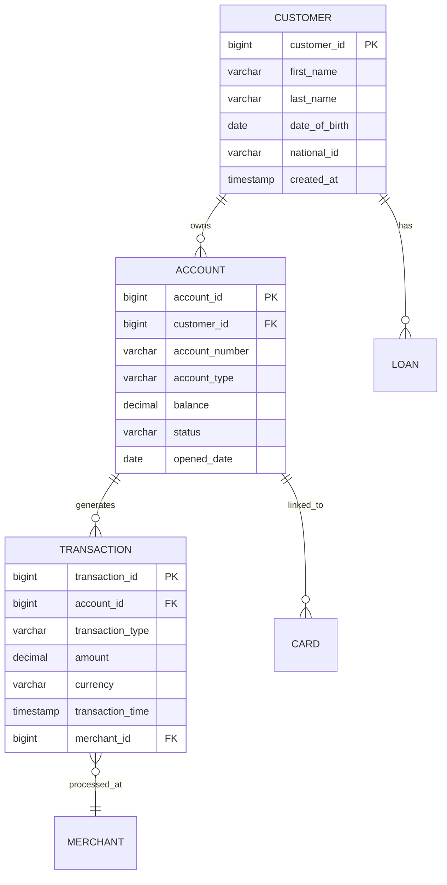
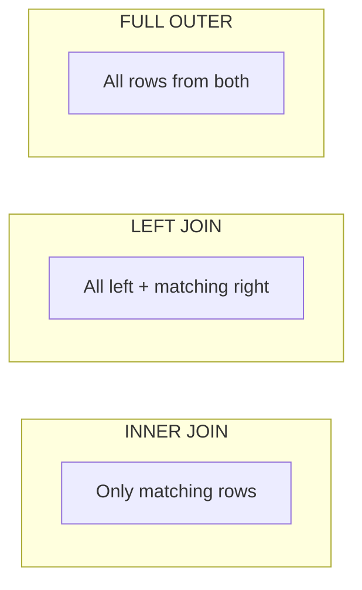

# SQL Fundamentals for Banking Data Engineering

## Why SQL Mastery Matters

In banking, SQL remains the primary interface for data analysis, reporting, and pipeline transformations. Even with modern tools like Spark and dbt, the underlying execution engine translates to SQL. Understanding SQL at a deep level is essential for writing efficient queries, debugging pipeline issues, and passing technical interviews.

## Relational Model Primer

The relational model organizes data into tables (relations) with rows (tuples) and columns (attributes). Banking systems heavily rely on relational databases for their ACID guarantees.



## Core SQL Operations

### SELECT and Filtering

```sql
-- Basic query with filtering
SELECT 
    account_number,
    account_type,
    balance,
    status
FROM accounts
WHERE status = 'ACTIVE'
    AND balance > 1000
ORDER BY balance DESC
LIMIT 50;

-- Pattern matching for banking operations
SELECT *
FROM customers
WHERE last_name ILIKE 'sm%'  -- Case-insensitive prefix match
   OR email LIKE '%@%.com';

-- IN and BETWEEN for range queries
SELECT *
FROM transactions
WHERE transaction_type IN ('TRANSFER', 'PAYMENT')
  AND amount BETWEEN 1000 AND 50000
  AND transaction_time BETWEEN '2025-01-01' AND '2025-03-31';
```

### JOINs

Joins combine data from multiple tables. Understanding join types is critical for banking queries where data spans customers, accounts, transactions, and products.



```sql
-- INNER JOIN: Customers with active accounts
SELECT 
    c.customer_id,
    c.first_name,
    c.last_name,
    a.account_number,
    a.account_type,
    a.balance
FROM customers c
INNER JOIN accounts a ON c.customer_id = a.customer_id
WHERE a.status = 'ACTIVE';

-- LEFT JOIN: All customers, including those without accounts
SELECT 
    c.customer_id,
    c.first_name,
    c.last_name,
    a.account_number
FROM customers c
LEFT JOIN accounts a ON c.customer_id = a.customer_id
WHERE a.account_id IS NULL;  -- Customers with NO accounts

-- SELF JOIN: Find customers who share the same address
SELECT 
    c1.customer_id AS customer_1_id,
    c1.first_name AS customer_1_name,
    c2.customer_id AS customer_2_id,
    c2.first_name AS customer_2_name,
    c1.address
FROM customers c1
INNER JOIN customers c2 
    ON c1.address = c2.address
    AND c1.customer_id < c2.customer_id;  -- Avoid duplicates and self-match

-- Multiple JOINs: Full customer financial picture
SELECT 
    c.customer_id,
    c.first_name || ' ' || c.last_name AS full_name,
    a.account_number,
    a.balance AS account_balance,
    COALESCE(SUM(t.amount), 0) AS monthly_transaction_total,
    l.loan_amount,
    l.interest_rate
FROM customers c
LEFT JOIN accounts a ON c.customer_id = a.customer_id
LEFT JOIN transactions t ON a.account_id = t.account_id
    AND t.transaction_time >= DATE_TRUNC('month', CURRENT_DATE)
LEFT JOIN loans l ON c.customer_id = l.customer_id
    AND l.status = 'ACTIVE'
GROUP BY 
    c.customer_id, c.first_name, c.last_name,
    a.account_number, a.balance, l.loan_amount, l.interest_rate;
```

### Aggregations

```sql
-- Daily transaction summary
SELECT 
    DATE_TRUNC('day', transaction_time) AS txn_date,
    transaction_type,
    COUNT(*) AS transaction_count,
    SUM(amount) AS total_amount,
    AVG(amount) AS average_amount,
    MIN(amount) AS min_amount,
    MAX(amount) AS max_amount,
    PERCENTILE_CONT(0.5) WITHIN GROUP (ORDER BY amount) AS median_amount
FROM transactions
WHERE transaction_time >= CURRENT_DATE - INTERVAL '30 days'
GROUP BY DATE_TRUNC('day', transaction_time), transaction_type
ORDER BY txn_date DESC, transaction_count DESC;

-- Customer segmentation by activity
SELECT 
    CASE 
        WHEN txn_count = 0 THEN 'INACTIVE'
        WHEN txn_count BETWEEN 1 AND 5 THEN 'LOW'
        WHEN txn_count BETWEEN 6 AND 20 THEN 'MEDIUM'
        WHEN txn_count BETWEEN 21 AND 50 THEN 'HIGH'
        ELSE 'VERY_HIGH'
    END AS activity_segment,
    COUNT(*) AS customer_count,
    AVG(total_amount) AS avg_spend
FROM (
    SELECT 
        c.customer_id,
        COUNT(t.transaction_id) AS txn_count,
        COALESCE(SUM(t.amount), 0) AS total_amount
    FROM customers c
    LEFT JOIN transactions t 
        ON c.customer_id = t.customer_id
        AND t.transaction_time >= CURRENT_DATE - INTERVAL '30 days'
    GROUP BY c.customer_id
) customer_activity
GROUP BY 
    CASE 
        WHEN txn_count = 0 THEN 'INACTIVE'
        WHEN txn_count BETWEEN 1 AND 5 THEN 'LOW'
        WHEN txn_count BETWEEN 6 AND 20 THEN 'MEDIUM'
        WHEN txn_count BETWEEN 21 AND 50 THEN 'HIGH'
        ELSE 'VERY_HIGH'
    END;
```

### HAVING vs WHERE

```sql
-- WHERE filters rows before aggregation
-- HAVING filters groups after aggregation
SELECT 
    account_type,
    COUNT(*) AS account_count,
    AVG(balance) AS avg_balance
FROM accounts
WHERE status = 'ACTIVE'  -- Filter individual rows
GROUP BY account_type
HAVING COUNT(*) > 100     -- Filter aggregated groups
   AND AVG(balance) > 5000
ORDER BY avg_balance DESC;
```

## Window Functions

Window functions perform calculations across a set of rows related to the current row, without collapsing them into a single output row. They are essential for time-series analysis in banking.

```sql
-- ROW_NUMBER, RANK, DENSE_RANK
SELECT 
    customer_id,
    transaction_time,
    amount,
    ROW_NUMBER() OVER (
        PARTITION BY customer_id 
        ORDER BY transaction_time DESC
    ) AS txn_rank_latest,
    RANK() OVER (
        PARTITION BY customer_id 
        ORDER BY amount DESC
    ) AS amount_rank,
    DENSE_RANK() OVER (
        ORDER BY amount DESC
    ) AS global_amount_dense_rank
FROM transactions
WHERE transaction_time >= CURRENT_DATE - INTERVAL '7 days';

-- LAG and LEAD for period-over-period comparison
SELECT 
    DATE_TRUNC('month', transaction_time) AS month,
    SUM(amount) AS monthly_total,
    LAG(SUM(amount), 1) OVER (ORDER BY DATE_TRUNC('month', transaction_time)) 
        AS prev_month_total,
    LEAD(SUM(amount), 1) OVER (ORDER BY DATE_TRUNC('month', transaction_time)) 
        AS next_month_total,
    SUM(amount) - LAG(SUM(amount), 1) OVER (
        ORDER BY DATE_TRUNC('month', transaction_time)
    ) AS mom_change,
    ROUND(
        (SUM(amount) - LAG(SUM(amount), 1) OVER (
            ORDER BY DATE_TRUNC('month', transaction_time)
        )) * 100.0 / NULLIF(LAG(SUM(amount), 1) OVER (
            ORDER BY DATE_TRUNC('month', transaction_time)
        ), 0), 2
    ) AS mom_change_pct
FROM transactions
GROUP BY DATE_TRUNC('month', transaction_time)
ORDER BY month;

-- Running totals with frames
SELECT 
    account_id,
    transaction_time,
    amount,
    SUM(amount) OVER (
        PARTITION BY account_id 
        ORDER BY transaction_time 
        ROWS BETWEEN UNBOUNDED PRECEDING AND CURRENT ROW
    ) AS running_balance,
    AVG(amount) OVER (
        PARTITION BY account_id 
        ORDER BY transaction_time 
        ROWS BETWEEN 6 PRECEDING AND CURRENT ROW
    ) AS rolling_7_txn_avg
FROM transactions
ORDER BY account_id, transaction_time;

-- NTILE for percentile bucketing
SELECT 
    customer_id,
    total_spend,
    NTILE(4) OVER (ORDER BY total_spend DESC) AS spend_quartile,
    NTILE(10) OVER (ORDER BY total_spend DESC) AS spend_decile,
    PERCENT_RANK() OVER (ORDER BY total_spend) AS spend_percentile
FROM (
    SELECT 
        customer_id,
        SUM(amount) AS total_spend
    FROM transactions
    WHERE transaction_time >= CURRENT_DATE - INTERVAL '90 days'
    GROUP BY customer_id
) customer_spend;

-- FIRST_VALUE and LAST_VALUE
SELECT 
    account_id,
    transaction_time,
    amount,
    FIRST_VALUE(amount) OVER (
        PARTITION BY account_id 
        ORDER BY transaction_time 
        ROWS BETWEEN UNBOUNDED PRECEDING AND UNBOUNDED FOLLOWING
    ) AS first_txn_amount,
    LAST_VALUE(amount) OVER (
        PARTITION BY account_id 
        ORDER BY transaction_time 
        ROWS BETWEEN UNBOUNDED PRECEDING AND UNBOUNDED FOLLOWING
    ) AS latest_txn_amount
FROM transactions;
```

## Set Operations

```sql
-- UNION: Combine results, remove duplicates
SELECT account_number FROM checking_accounts
UNION
SELECT account_number FROM savings_accounts;

-- UNION ALL: Combine results, keep duplicates (faster)
SELECT account_number, 'CHECKING' AS account_type 
FROM checking_accounts
UNION ALL
SELECT account_number, 'SAVINGS' AS account_type 
FROM savings_accounts;

-- INTERSECT: Common rows
SELECT customer_id FROM customers_with_loans
INTERSECT
SELECT customer_id FROM customers_with_credit_cards;

-- EXCEPT: Rows in first but not second
SELECT customer_id FROM active_customers
EXCEPT
SELECT customer_id FROM customers_with_fraud_flag;
```

## Practical Banking Queries

### Fraud Detection Pattern

```sql
-- Detect unusual transaction patterns
WITH customer_daily_stats AS (
    SELECT 
        customer_id,
        DATE_TRUNC('day', transaction_time) AS txn_date,
        COUNT(*) AS txn_count,
        SUM(amount) AS daily_total,
        AVG(amount) AS daily_avg
    FROM transactions
    WHERE transaction_time >= CURRENT_DATE - INTERVAL '30 days'
    GROUP BY customer_id, DATE_TRUNC('day', transaction_time)
),
customer_baselines AS (
    SELECT 
        customer_id,
        AVG(daily_total) AS avg_daily_spend,
        STDDEV(daily_total) AS stddev_daily_spend,
        MAX(daily_total) AS max_daily_spend
    FROM customer_daily_stats
    GROUP BY customer_id
)
SELECT 
    cds.customer_id,
    cds.txn_date,
    cds.daily_total,
    cb.avg_daily_spend,
    cb.stddev_daily_spend,
    ROUND(
        (cds.daily_total - cb.avg_daily_spend) / NULLIF(cb.stddev_daily_spend, 0),
        2
    ) AS z_score
FROM customer_daily_stats cds
JOIN customer_baselines cb ON cds.customer_id = cb.customer_id
WHERE cb.stddev_daily_spend > 0
  AND (cds.daily_total - cb.avg_daily_spend) / cb.stddev_daily_spend > 3.0
ORDER BY z_score DESC;
```

## Cross-References

- **Advanced SQL**: See [advanced-sql.md](advanced-sql.md) for CTEs and recursive queries
- **Query Optimization**: See [query-optimization.md](query-optimization.md) for performance tuning
- **Postgres Best Practices**: See [postgres-best-practices.md](postgres-best-practices.md) for production patterns

## Interview Questions

1. **What is the difference between WHERE and HAVING? When would you use each?**
2. **Explain the difference between RANK, DENSE_RANK, and ROW_NUMBER.**
3. **How would you find the second highest transaction amount per customer?**
4. **Write a query to identify customers whose monthly spending increased by more than 50% compared to the previous month.**
5. **How do you handle NULL values in aggregations and joins?**
6. **Explain the difference between UNION and UNION ALL. Which is faster and why?**

## Checklist: SQL Best Practices

- [ ] Use explicit column lists instead of SELECT *
- [ ] Filter early with WHERE to reduce data processed
- [ ] Use appropriate JOIN types for the question being asked
- [ ] Leverage window functions instead of self-joins for rankings
- [ ] Handle NULLs explicitly with COALESCE or NULLIF
- [ ] Use table aliases for readability
- [ ] Avoid correlated subqueries when window functions work
- [ ] Index columns used in JOIN conditions and WHERE clauses
- [ ] Use EXPLAIN to verify query execution plans
