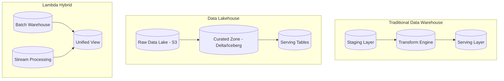

# Data Warehouses vs Lakehouses for Banking

## Overview

Choosing the right data storage architecture is a foundational decision for banking data platforms. Data warehouses optimize for structured analytics, while lakehouses combine the flexibility of data lakes with the management capabilities of warehouses. This guide compares architectures, evaluates tradeoffs, and provides decision frameworks for banking GenAI platforms.

## Architecture Comparison



| Dimension | Data Warehouse | Data Lake | Lakehouse |
|-----------|---------------|-----------|-----------|
| Data Format | Structured, schema-on-write | Any format, schema-on-read | Structured + semi, schema-enforcement |
| Storage Cost | Higher (proprietary) | Lowest (object storage) | Low (open table formats) |
| Query Performance | Optimized | Variable | Good (with indexing) |
| ACID Transactions | Full support | Limited | Full support (Delta/Iceberg) |
| Workload Support | BI, SQL analytics | ML, batch processing | BI + ML + streaming |
| Vendor Lock-in | High | Low | Low-Medium |
| GenAI Support | Limited (no vector search) | Flexible (any format) | Good (vector + tabular) |
| Compliance | Strong | Requires governance | Strong (with governance layer) |

## Data Warehouse: Postgres/Redshift/Snowflake

### When to Use

- **Structured analytics with known schemas**
- **Regulatory reporting requiring ACID guarantees**
- **Business intelligence dashboards**
- **Team has strong SQL skills, limited engineering bandwidth**

### Postgres as Analytics Warehouse

```sql
-- Banking data warehouse schema in Postgres
CREATE SCHEMA dwh;

-- Dimension tables
CREATE TABLE dwh.dim_date (
    date_key DATE PRIMARY KEY,
    full_date DATE,
    day_of_week INTEGER,
    month INTEGER,
    quarter INTEGER,
    year INTEGER,
    is_weekend BOOLEAN,
    is_holiday BOOLEAN
);

CREATE TABLE dwh.dim_customer (
    customer_id BIGINT PRIMARY KEY,
    customer_segment VARCHAR(20),
    risk_rating VARCHAR(10),
    region VARCHAR(50),
    account_opened_date DATE,
    is_active BOOLEAN
);

CREATE TABLE dwh.dim_account (
    account_id BIGINT PRIMARY KEY,
    account_type VARCHAR(20),
    currency VARCHAR(3),
    branch_code VARCHAR(10),
    opened_date DATE
);

-- Fact tables
CREATE TABLE dwh.fact_transactions (
    transaction_id VARCHAR(36) PRIMARY KEY,
    date_key DATE REFERENCES dwh.dim_date(date_key),
    customer_id BIGINT REFERENCES dwh.dim_customer(customer_id),
    account_id BIGINT REFERENCES dwh.dim_account(account_id),
    transaction_type VARCHAR(20),
    amount DECIMAL(15, 2),
    currency VARCHAR(3),
    channel VARCHAR(20),
    merchant_id VARCHAR(36),
    is_flagged BOOLEAN DEFAULT FALSE
);

-- Aggregated fact tables for fast queries
CREATE MATERIALIZED VIEW dwh.mv_daily_account_summary AS
SELECT 
    date_key,
    account_id,
    COUNT(*) AS txn_count,
    SUM(amount) AS total_deposits,
    SUM(CASE WHEN amount < 0 THEN ABS(amount) ELSE 0 END) AS total_withdrawals,
    COUNT(DISTINCT merchant_id) AS unique_merchants
FROM dwh.fact_transactions
GROUP BY date_key, account_id;

CREATE UNIQUE INDEX ON dwh.mv_daily_account_summary (date_key, account_id);
```

## Lakehouse: Delta Lake / Apache Iceberg

### When to Use

- **Mixed workloads: BI + ML + streaming**
- **Need to store raw + processed data in one place**
- **GenAI workloads with unstructured data (documents, embeddings)**
- **Cost-conscious architecture with open formats**
- **Multiple teams with different access patterns**

### Delta Lake Banking Setup

```python
"""Delta Lake setup for banking data lakehouse."""
from delta import *
from pyspark.sql import SparkSession
from pyspark.sql.functions import *

# Configure Spark with Delta
spark = (SparkSession.builder
    .appName("banking-lakehouse")
    .config("spark.sql.extensions", "io.delta.sql.DeltaSparkSessionExtension")
    .config("spark.sql.catalog.spark_catalog", 
            "org.apache.spark.sql.delta.catalog.DeltaCatalog")
    .getOrCreate()
)

# Create bronze (raw), silver (cleaned), gold (aggregated) layers

# Bronze: Raw ingestion
(raw_transactions_df
    .write
    .format("delta")
    .mode("append")
    .option("mergeSchema", "true")
    .save("s3://banking-lakehouse/bronze/transactions/")
)

# Silver: Cleaned and validated
silver_txns = (spark.read.format("delta")
    .load("s3://banking-lakehouse/bronze/transactions/")
    .filter(col("status") != "REVERSED")
    .filter(col("amount") > 0)
    .withColumn("cleaned_at", current_timestamp())
)

(silver_txns
    .write
    .format("delta")
    .mode("append")
    .option("mergeSchema", "true")
    .save("s3://banking-lakehouse/silver/transactions/")
)

# Gold: Business-level aggregates
gold_daily = (spark.read.format("delta")
    .load("s3://banking-lakehouse/silver/transactions/")
    .groupBy(date_trunc("day", col("transaction_time")).alias("txn_date"))
    .agg(
        count("*").alias("txn_count"),
        sum("amount").alias("total_amount"),
        countDistinct("account_id").alias("active_accounts"),
    )
)

(gold_daily
    .write
    .format("delta")
    .mode("overwrite")
    .option("overwriteSchema", "true")
    .save("s3://banking-lakehouse/gold/daily_transaction_summary/")
)

# Time travel: Query historical state
historical_df = (spark.read.format("delta")
    .option("timestampAsOf", "2025-01-01")
    .load("s3://banking-lakehouse/silver/transactions/")
)
```

## GenAI-Specific Storage

### Vector + Structured Data in Lakehouse

```python
"""
Lakehouse storing both structured data and GenAI artifacts.
Combines tabular analytics with vector search for RAG.
"""

# Store document chunks with embeddings
document_chunks_df = spark.createDataFrame([
    {
        "document_id": "doc_001",
        "chunk_id": "chunk_001_0",
        "content": "Interest rates for savings accounts...",
        "metadata": {
            "doc_type": "product_info",
            "source": "banking_products.pdf",
            "version": "2025.01"
        },
        "embedding": [0.1, 0.2, ...]  # 1536-dim vector
    },
    # ... more chunks
])

# Store in Delta Lake
(document_chunks_df
    .write
    .format("delta")
    .mode("overwrite")
    .save("s3://banking-lakehouse/gold/document_embeddings/")
)

# Also store in pgvector for RAG queries
import psycopg2
from psycopg2.extras import Json, execute_values

conn = psycopg2.connect(dsn="postgresql://analytics-db/banking")

with conn.cursor() as cur:
    cur.execute("""
        CREATE TABLE IF NOT EXISTS genai_document_chunks (
            chunk_id VARCHAR PRIMARY KEY,
            document_id VARCHAR,
            content TEXT,
            metadata JSONB,
            embedding VECTOR(1536),
            created_at TIMESTAMPTZ DEFAULT NOW()
        );
        
        CREATE INDEX IF NOT EXISTS idx_chunks_embedding 
        ON genai_document_chunks 
        USING hnsw (embedding vector_cosine_ops);
    """)
    
    for _, row in document_chunks_df.toPandas().iterrows():
        cur.execute("""
            INSERT INTO genai_document_chunks 
                (chunk_id, document_id, content, metadata, embedding)
            VALUES (%s, %s, %s, %s, %s)
            ON CONFLICT (chunk_id) DO UPDATE SET
                content = EXCLUDED.content,
                embedding = EXCLUDED.embedding,
                metadata = EXCLUDED.metadata
        """, (
            row['chunk_id'], row['document_id'], row['content'],
            Json(row['metadata']), row['embedding']
        ))

conn.commit()
```

## Cost Comparison

```
Scenario: 50TB data, 100 users, daily batch processing

Data Warehouse (Snowflake):
- Storage: 50TB * $23/TB/month = $1,150/month
- Compute: Medium warehouse, 8 hrs/day * 30 days = ~$3,600/month
- Total: ~$4,750/month

Data Lakehouse (S3 + Trino/Spark):
- S3 Storage: 50TB * $23/TB/month = $1,150/month
- Compute (EMR): On-demand cluster, 8 hrs/day = ~$2,000/month
- Total: ~$3,150/month

Pure Data Lake (S3 + Athena):
- S3 Storage: 50TB * $23/TB/month = $1,150/month
- Compute (Athena): $5/TB scanned, 10TB/day = ~$1,500/month
- Total: ~$2,650/month

Banking Reality: Most organizations use a hybrid:
- Data warehouse for regulatory/financial reporting
- Lakehouse for ML/GenAI workloads
- CDC sync between systems
```

## Cross-References

- **Batch vs Streaming**: See [batch-vs-streaming.md](batch-vs-streaming.md) for processing paradigms
- **ETL vs ELT**: See [etl-vs-elt.md](etl-vs-elt.md) for transformation patterns
- **Embedding Pipelines**: See [embedding-pipelines.md](embedding-pipelines.md) for GenAI storage

## Interview Questions

1. **When would you choose a data warehouse over a lakehouse for a banking platform?**
2. **How does Delta Lake provide ACID transactions on top of object storage?**
3. **What is the medallion architecture (bronze/silver/gold) and when does it break down?**
4. **How do you store vector embeddings alongside structured data?**
5. **Compare the cost of Snowflake vs S3+Trino for a 100TB banking data platform.**
6. **How do you handle schema evolution in a lakehouse vs a warehouse?**

## Checklist: Storage Architecture Decision

- [ ] Requirements documented (workload types, SLAs, compliance)
- [ ] Data volume and growth projections estimated
- [ ] Query patterns analyzed (ad-hoc vs predefined)
- [ ] Team skills and operational maturity assessed
- [ ] Total cost of ownership calculated for 3-year horizon
- [ ] Vendor lock-in risk evaluated
- [ ] GenAI requirements (vector search, document storage) considered
- [ ] Compliance and audit requirements mapped to storage features
- [ ] Migration path from current architecture defined
- [ ] Proof of concept completed for top 2 options
