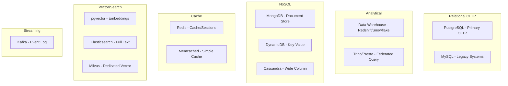
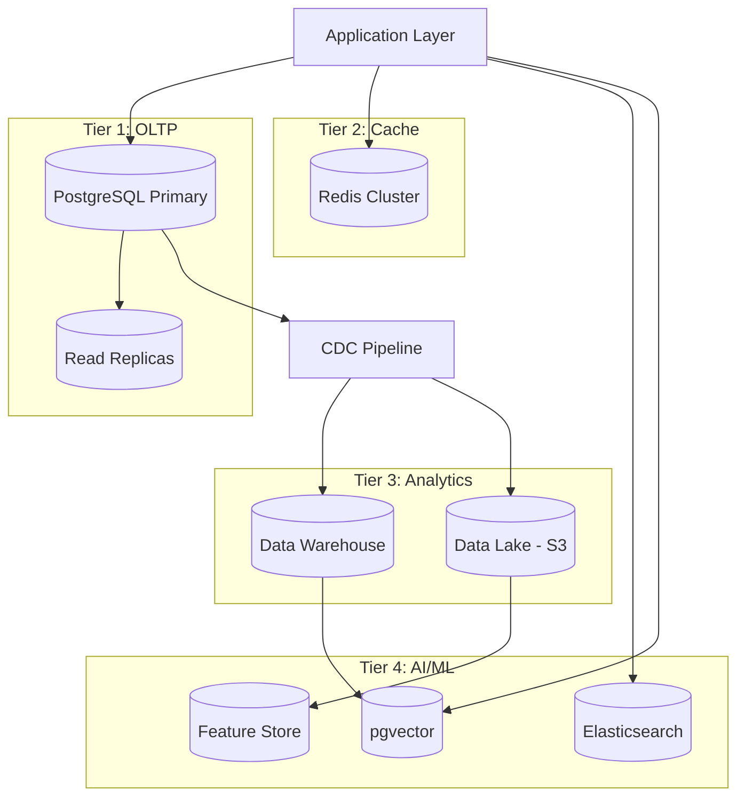

# Database Landscape for Banking GenAI Platforms

## Overview

Modern banking GenAI platforms use multiple database technologies, each optimized for specific workloads. Choosing the right database for each use case is a critical architectural decision that impacts performance, cost, and operational complexity. This guide covers the database landscape, selection criteria, and banking-specific considerations.

## Database Landscape



## Database Selection Matrix

| Use Case | Primary Choice | Alternative | Why |
|----------|---------------|-------------|-----|
| Core banking transactions | PostgreSQL | MySQL | ACID, complex queries, extensions |
| Customer profiles | PostgreSQL JSONB | MongoDB | Flexible schema with relational integrity |
| Session storage | Redis | Memcached | Rich data structures, persistence |
| Embedding storage | pgvector | Milvus, Pinecone | Co-located with metadata, SQL queries |
| Full-text search | Elasticsearch | OpenSearch | Relevance tuning, facets |
| Analytics/Reporting | Data Warehouse | Trino + Data Lake | Columnar, optimized for aggregation |
| Event streaming | Kafka | Pulsar | Durability, ordering, replay |
| Rate limiting | Redis | -- | Atomic counters, Lua scripts |
| Audit logs | PostgreSQL | Elasticsearch | ACID, compliance, append-only |
| Feature store (online) | Redis | DynamoDB | Low latency, rich data types |
| Feature store (offline) | Data Lake (Parquet) | -- | Cost, Spark compatibility |
| Document store | PostgreSQL JSONB | MongoDB | Transactional consistency |

## PostgreSQL: The Default Choice

```yaml
# PostgreSQL is the default database for most banking workloads
# Strengths:
postgresql_strengths:
  - "Full ACID compliance for financial transactions"
  - "Rich extension ecosystem (pgvector, PostGIS, hstore)"
  - "Advanced query optimizer for complex analytics"
  - "Row-level security for multi-tenant access control"
  - "Logical replication for CDC and read replicas"
  - "JSONB for flexible document storage"
  - "Mature connection pooling (PgBouncer)"
  - "Strong open-source community and vendor support"

# When NOT to use PostgreSQL:
postgresql_limitations:
  - "Write scaling: Single primary limits write throughput"
  - "Columnar analytics: Use data warehouse instead"
  - "Full-text search at scale: Use Elasticsearch"
  - "Sub-millisecond latency: Use Redis"
  - "Event streaming: Use Kafka"
```

## Vector Database Landscape

```python
"""
Vector database selection for GenAI workloads.
"""

VECTOR_DB_COMPARISON = {
    'pgvector': {
        'type': 'PostgreSQL extension',
        'best_for': 'Co-located vector + metadata, SQL queries',
        'max_vectors': '~10M (depends on hardware)',
        'index_types': ['IVFFlat', 'HNSW'],
        'pros': [
            'Single database for vectors and metadata',
            'SQL joins with relational data',
            'ACID transactions',
            'Familiar operational patterns',
            'No additional infrastructure',
        ],
        'cons': [
            'Limited scale compared to dedicated solutions',
            'HNSW build time for large datasets',
            'Postgres WAL growth with vector updates',
        ],
        'banking_fit': 'Excellent for RAG with < 10M vectors',
    },
    'milvus': {
        'type': 'Dedicated vector database',
        'best_for': 'Large-scale vector search, distributed',
        'max_vectors': 'Billions',
        'index_types': ['IVF', 'HNSW', 'SCANN', 'DiskANN'],
        'pros': [
            'Massive scale',
            'Distributed architecture',
            'Multiple index types',
            'GPU acceleration',
        ],
        'cons': [
            'Additional infrastructure to manage',
            'Metadata queries less flexible than SQL',
            'Operational complexity',
        ],
        'banking_fit': 'When vector count exceeds 10M+',
    },
    'pinecone': {
        'type': 'Managed vector database (SaaS)',
        'best_for': 'Teams wanting zero-ops vector search',
        'max_vectors': 'Billions (managed)',
        'index_types': ['Pod-based', 'Serverless'],
        'pros': [
            'Fully managed',
            'No infrastructure management',
            'Good performance',
        ],
        'cons': [
            'Vendor lock-in',
            'Data leaves banking network (compliance concern)',
            'Cost at scale',
            'Limited control over index tuning',
        ],
        'banking_fit': 'Rarely - data residency concerns',
    },
    'elasticsearch': {
        'type': 'Search engine with dense vector support',
        'best_for': 'Hybrid search (text + vector)',
        'max_vectors': 'Hundreds of millions',
        'index_types': ['HNSW', 'Int8 HNSW'],
        'pros': [
            'Hybrid text + vector search',
            'Rich filtering and aggregation',
            'Mature ecosystem',
        ],
        'cons': [
            'Vector search is secondary feature',
            'Memory-intensive',
            'Complex operational overhead',
        ],
        'banking_fit': 'When full-text search is primary requirement',
    },
}

def choose_vector_database(requirements: dict) -> str:
    """Choose vector database based on requirements."""
    vector_count = requirements.get('vector_count', 0)
    needs_sql_joins = requirements.get('needs_sql_joins', False)
    data_residency = requirements.get('data_residency', 'on-premise')
    ops_capacity = requirements.get('ops_capacity', 'medium')
    
    # SaaS solutions ruled out for strict data residency
    if data_residency == 'on-premise':
        requirements.pop('pinecone', None)
    
    # SQL joins needed -> pgvector
    if needs_sql_joins and vector_count < 10_000_000:
        return 'pgvector'
    
    # Very large scale
    if vector_count > 10_000_000:
        if ops_capacity == 'high':
            return 'milvus'
        else:
            return 'pinecone'  # If ops capacity is low
    
    # Default for banking
    return 'pgvector'
```

## Banking Database Architecture



## Cross-References

- **Postgres Fundamentals**: See [postgres-fundamentals.md](postgres-fundamentals.md) for core concepts
- **Choosing a Datastore**: See [choosing-datastore.md](choosing-datastore.md) for decision framework
- **pgvector**: See [pgvector.md](pgvector.md) for vector storage

## Interview Questions

1. **How do you choose between PostgreSQL and MongoDB for storing customer profiles?**
2. **Why is pgvector a good choice for banking GenAI vs dedicated vector databases?**
3. **When would you introduce Redis into a banking architecture?**
4. **What database would you use for real-time fraud detection feature lookups?**
5. **How do you justify the operational cost of managing 6+ database technologies?**
6. **Design the database architecture for a banking GenAI assistant.**

## Checklist: Database Architecture

- [ ] Primary database selected for each workload type
- [ ] Read replicas configured for read-heavy workloads
- [ ] Caching layer for latency-sensitive operations
- [ ] Vector database selected for GenAI requirements
- [ ] CDC pipeline from OLTP to analytics
- [ ] Data residency requirements met (no SaaS for sensitive data)
- [ ] Backup and DR strategy for each database
- [ ] Connection pooling configured for each database
- [ ] Monitoring and alerting for each database
- [ ] Migration plan from current to target architecture
