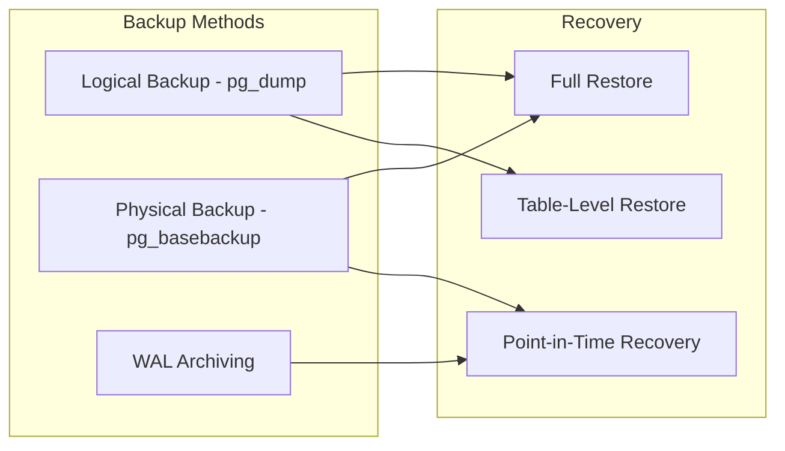

# Database Backup Strategies

## Overview

Database backups are the last line of defense against data loss. In banking, backup strategies must meet regulatory requirements for data retention while enabling rapid recovery from failures. This guide covers pg_dump, WAL archiving, PITR, and backup verification for production banking databases.

## Backup Types



| Method | Granularity | Speed | Size | PITR | Use Case |
|--------|------------|-------|------|------|----------|
| pg_dump | Table/Schema | Slow | Compressed | No | Small DB, migrations |
| pg_basebackup | Full cluster | Fast | Raw size | With WAL | Full restore |
| WAL Archive | Incremental | Fastest | Incremental | Yes | PITR |
| pg_dumpall | Globals only | Fast | Tiny | No | Roles, config |

## Logical Backups with pg_dump

```bash
# Full database backup
pg_dump -h db-host -U backup_user -d banking -F c -f banking_backup_$(date +%Y%m%d).dump

# Format options:
# -F c: Custom (compressed, allows parallel restore)
# -F d: Directory (parallel backup/restore)
# -F t: Tar
# -F p: Plain SQL

# Specific tables only
pg_dump -h db-host -U backup_user -d banking -t transactions -t accounts -F c -f banking_selected.dump

# Schema only (no data)
pg_dump -h db-host -U backup_user -d banking --schema-only -f banking_schema.sql

# Data only (no schema)
pg_dump -h db-host -U backup_user -d banking --data-only -F c -f banking_data.dump

# Parallel backup (faster for large databases)
pg_dump -h db-host -U backup_user -d banking -F d -j 4 -f banking_backup_dir/

# Backup with compression level
pg_dump -h db-host -U backup_user -d banking -F c -Z 6 -f banking_backup.dump
```

## Restore from pg_dump

```bash
# Restore from custom format
pg_restore -h db-host -U admin_user -d banking -c banking_backup.dump

# -c: Clean (drop objects before recreating)
# --if-exists: Don't error if objects don't exist
# -j 4: Parallel restore
# --table=transactions: Restore specific table

# Restore to different database
pg_restore -h db-host -U admin_user -d banking_restore banking_backup.dump

# Restore plain SQL dump
psql -h db-host -U admin_user -d banking -f banking_schema.sql
```

## Physical Backup with pg_basebackup

```bash
# Full cluster backup (all databases, all objects)
pg_basebackup -h primary-host -U replicator -D /backup/base_$(date +%Y%m%d) \
    --checkpoint=fast \
    --wal-method=stream \
    --format=tar \
    --gzip \
    --progress \
    --verbose

# Options:
# --wal-method=stream: Include WAL files for PITR
# --checkpoint=fast: Start checkpoint immediately
# --format=tar: Tar format (p for plain)
# --gzip: Compress
```

## WAL Archiving for PITR

```sql
-- Enable WAL archiving (postgresql.conf)
archive_mode = on
archive_command = 'cp %p /var/lib/postgresql/wal_archive/%f'
-- For S3: archive_command = 'aws s3 cp %p s3://banking-backups/wal/%f'

-- Restart PostgreSQL after config change
SELECT pg_reload_conf();

-- Verify archiving is working
SELECT archived_count, last_archived_wal, last_archived_time
FROM pg_stat_archiver;

-- Check WAL archive directory
ls -la /var/lib/postgresql/wal_archive/
```

## Point-in-Time Recovery

```bash
# PITR: Restore to a specific point in time

# 1. Stop PostgreSQL
pg_ctlcluster 15 main stop

# 2. Move current data directory aside
mv /var/lib/postgresql/15/main /var/lib/postgresql/15/main.failed

# 3. Restore base backup
tar xzf /backup/base_20250115.tar.gz -C /var/lib/postgresql/15/main

# 4. Configure recovery
cat > /var/lib/postgresql/15/main/postgresql.auto.conf << EOF
restore_command = 'cp /var/lib/postgresql/wal_archive/%f %p'
recovery_target_time = '2025-01-15 14:30:00 UTC'
recovery_target_action = 'promote'
EOF

# 5. Create recovery signal
touch /var/lib/postgresql/15/main/recovery.signal

# 6. Start PostgreSQL (will recover to target time)
pg_ctlcluster 15 main start

# 7. Verify recovery
SELECT pg_is_in_recovery();  -- Should return false after promotion
```

## Automated Backup Script

```bash
#!/bin/bash
# backup_banking_db.sh - Automated backup with verification

set -euo pipefail

BACKUP_DIR="/backup/banking"
RETENTION_DAYS=30
DB_NAME="banking"
DB_USER="backup_user"
DB_HOST="db-primary"
TIMESTAMP=$(date +%Y%m%d_%H%M%S)
BACKUP_FILE="${BACKUP_DIR}/${DB_NAME}_${TIMESTAMP}.dump"
LOG_FILE="${BACKUP_DIR}/backup_${TIMESTAMP}.log"

log() {
    echo "[$(date -u +%Y-%m-%dT%H:%M:%SZ)] $1" | tee -a "$LOG_FILE"
}

log "Starting backup of ${DB_NAME}"

# Create backup
log "Running pg_dump..."
pg_dump -h "$DB_HOST" -U "$DB_USER" -d "$DB_NAME" -F c -Z 6 -f "$BACKUP_FILE" 2>> "$LOG_FILE"

BACKUP_SIZE=$(stat -c%s "$BACKUP_FILE")
log "Backup complete: ${BACKUP_FILE} ($(numfmt --to=iec ${BACKUP_SIZE}))"

# Verify backup
log "Verifying backup..."
pg_restore -l "$BACKUP_FILE" > /dev/null 2>&1
if [ $? -eq 0 ]; then
    log "Backup verification: PASSED"
else
    log "Backup verification: FAILED"
    exit 1
fi

# Upload to S3
log "Uploading to S3..."
aws s3 cp "$BACKUP_FILE" "s3://banking-backups/daily/${DB_NAME}_${TIMESTAMP}.dump" 2>> "$LOG_FILE"
log "S3 upload complete"

# Clean up old backups
log "Cleaning up backups older than ${RETENTION_DAYS} days..."
find "$BACKUP_DIR" -name "${DB_NAME}_*.dump" -mtime +${RETENTION_DAYS} -delete
aws s3 ls "s3://banking-backups/daily/" | grep "${DB_NAME}" | \
    awk '{print $4}' | while read file; do
        file_date=$(echo "$file" | grep -oP '\d{8}')
        file_age=$(( ($(date +%s) - $(date -d "$file_date" +%s)) / 86400 ))
        if [ $file_age -gt $RETENTION_DAYS ]; then
            aws s3 rm "s3://banking-backups/daily/$file"
        fi
    done

log "Backup completed successfully"
```

## Backup Verification

```bash
# Test restore to a separate environment
pg_restore -h test-db-host -U admin -d banking_test latest_backup.dump

# Verify row counts
psql -h test-db-host -U admin -d banking_test -c "
SELECT 
    schemaname,
    relname,
    n_live_tup
FROM pg_stat_user_tables
ORDER BY n_live_tup DESC
LIMIT 20;
"

# Run data quality checks
psql -h test-db-host -U admin -d banking_test -c "
SELECT 
    'customers' AS table_name,
    COUNT(*) AS row_count,
    COUNT(DISTINCT customer_id) AS unique_ids,
    COUNT(CASE WHEN email IS NULL THEN 1 END) AS null_emails
FROM customers
UNION ALL
SELECT 
    'accounts',
    COUNT(*),
    COUNT(DISTINCT account_id),
    COUNT(CASE WHEN balance IS NULL THEN 1 END)
FROM accounts;
"
```

## Cross-References

- **Disaster Recovery**: See [disaster-recovery.md](disaster-recovery.md) for DR strategies
- **High Availability**: See [high-availability.md](high-availability.md) for HA setups
- **Replication**: See [replication.md](replication.md) for replication setup

## Interview Questions

1. **What is the difference between logical and physical backups? When do you use each?**
2. **How does Point-in-Time Recovery (PITR) work?**
3. **Your database needs to be restored to exactly 2:30 PM yesterday. How do you do it?**
4. **How do you verify that backups are restorable?**
5. **What is the role of WAL archiving in backup strategy?**
6. **How do you handle backup retention and cleanup for a 7-year regulatory requirement?**

## Checklist: Backup Strategy

- [ ] Automated daily logical backups with pg_dump
- [ ] Weekly physical base backups with pg_basebackup
- [ ] WAL archiving enabled for PITR
- [ ] Backups stored off-site (S3, separate region)
- [ ] Backup encryption at rest
- [ ] Backup verification automated (test restore)
- [ ] Retention policy enforced (automated cleanup)
- [ ] Restore procedure documented and tested quarterly
- [ ] RTO (Recovery Time Objective) defined and achievable
- [ ] RPO (Recovery Point Objective) defined and met
- [ ] Backup monitoring and alerting configured
- [ ] Backup credentials rotated regularly
