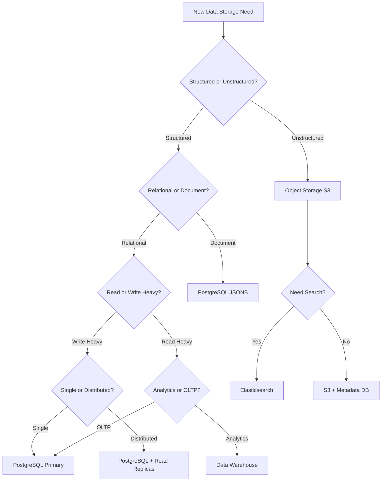

# How to Choose the Right Datastore

## Overview

Choosing the right datastore for each workload is a foundational architectural decision. This guide provides a decision framework for selecting databases in a banking GenAI platform, considering data characteristics, access patterns, compliance requirements, and operational constraints.

## Decision Framework



## Decision Matrix

| Requirement | Primary Choice | Alternative | When to Switch |
|------------|---------------|-------------|----------------|
| Financial transactions | PostgreSQL | -- | Never (ACID required) |
| Customer profiles | PostgreSQL JSONB | MongoDB | If document complexity grows |
| Session storage | Redis | Memcached | If persistence needed |
| API rate limiting | Redis | -- | -- |
| Embedding storage | pgvector | Milvus | If > 10M vectors |
| Full-text search | Elasticsearch | OpenSearch | -- |
| Analytics/BI | Data Warehouse | Trino + Lake | If cloud-native needed |
| Event streaming | Kafka | Pulsar | If multi-cloud needed |
| Audit logs | PostgreSQL | Elasticsearch | If search-heavy |
| Time-series metrics | TimescaleDB | Prometheus | If cloud-native needed |
| File storage | S3/MinIO | -- | -- |
| Graph data | Neo4j | -- | If complex relationships |

## Data Characteristics Assessment

```yaml
# Assess your data before choosing a datastore

data_assessment:
  structure:
    - "Is the data highly structured with fixed schema? -> Relational DB"
    - "Is the data semi-structured with varying fields? -> Document/JSONB"
    - "Is the data unstructured (text, images)? -> Object Storage"
    - "Is the data time-series (metrics, events)? -> Time-series DB"
    - "Is the data graph-like (relationships)? -> Graph DB"
  
  access_patterns:
    - "Frequent point lookups by key? -> Key-Value (Redis)"
    - "Range queries on dates/amounts? -> Relational with indexes"
    - "Full-text search? -> Elasticsearch"
    - "Similarity/vector search? -> Vector DB"
    - "Complex joins across tables? -> Relational DB"
    - "Aggregations over large datasets? -> Data Warehouse"
  
  scale_requirements:
    - "Data volume: KB, MB, GB, TB, PB?"
    - "QPS: 10, 100, 1000, 10000?"
    - "Read vs Write ratio?"
    - "Peak vs sustained load?"
  
  consistency_requirements:
    - "Strong consistency required? -> Relational (ACID)"
    - "Eventual consistency acceptable? -> NoSQL"
    - "Can tolerate some data loss? -> Consider replication trade-offs"
  
  compliance_requirements:
    - "Data residency restrictions?"
    - "Encryption requirements?"
    - "Audit logging requirements?"
    - "Retention period?"
```

## Multi-Datastore Architecture

```
Typical banking GenAI platform uses 6-10 datastores:

┌─────────────────────────────────────────────────┐
│  Application Layer                              │
├─────────────────────────────────────────────────┤
│                                                 │
│  PostgreSQL (Primary OLTP)                      │
│  ├── Customers, accounts, transactions          │
│  ├── pgvector for embeddings                    │
│  └── JSONB for flexible documents               │
│                                                 │
│  Redis (Cache + Rate Limiting)                  │
│  ├── Session storage                            │
│  ├── API response cache                         │
│  ├── Rate limiting counters                     │
│  └── Online feature store                       │
│                                                 │
│  Kafka (Event Streaming)                        │
│  ├── Transaction events                         │
│  ├── CDC events                                 │
│  └── Real-time alerts                           │
│                                                 │
│  Elasticsearch (Search)                         │
│  ├── Full-text document search                  │
│  ├── Log aggregation                            │
│  └── Audit log search                           │
│                                                 │
│  Data Warehouse (Analytics)                     │
│  ├── BI dashboards                              │
│  ├── Regulatory reporting                       │
│  └── ML training data                           │
│                                                 │
│  S3/Data Lake (Storage)                         │
│  ├── Raw data archive                           │
│  ├── Document storage                           │
│  └── Backup storage                             │
│                                                 │
└─────────────────────────────────────────────────┘
```

## Cost Considerations

```
Cost model per datastore (approximate, 1TB data):

PostgreSQL (self-managed):
- Compute: $500-2000/month (depending on instance)
- Storage: $100/month (SSD)
- Operations: 0.5-1 FTE

Redis (self-managed):
- Compute: $200-500/month
- Memory: $300/month (1TB RAM is expensive)
- Operations: 0.25-0.5 FTE

Elasticsearch (self-managed):
- Compute: $500-1500/month
- Storage: $200/month
- Operations: 0.5-1 FTE

Kafka (self-managed):
- Compute: $500-1500/month
- Storage: $200/month
- Operations: 0.5-1 FTE

Total infrastructure: $3000-8000/month
Total operations: 2-4.5 FTE

Managed alternatives (higher cost, lower ops):
- RDS/Aurora: 2-3x self-managed cost
- ElastiCache: 2-3x self-managed cost
- MSK: 2-3x self-managed cost
- Managed Elasticsearch: 2-4x self-managed cost
```

## Cross-References

- **Database Landscape**: See [README.md](README.md) for database overview
- **Banking Patterns**: See [banking-db-patterns.md](banking-db-patterns.md) for specific patterns

## Interview Questions

1. **How do you decide between PostgreSQL and MongoDB for a new feature?**
2. **When would you introduce a new database technology to an existing architecture?**
3. **What factors drive the decision to use a data warehouse vs querying the OLTP database?**
4. **How do you justify the operational cost of managing 6+ databases?**
5. **What is your process for evaluating a new database technology?**
6. **How do you handle data that needs to be queried across multiple datastores?**

## Checklist: Datastore Selection

- [ ] Data characteristics documented (structure, volume, access patterns)
- [ ] Consistency requirements defined
- [ ] Scale requirements projected for 2-3 years
- [ ] Compliance requirements mapped
- [ ] Operational capacity assessed
- [ ] Total cost of ownership calculated
- [ ] Proof of concept completed with production-like data
- [ ] Migration path from current state defined
- [ ] Backup and DR strategy defined
- [ ] Team training plan for new technology
