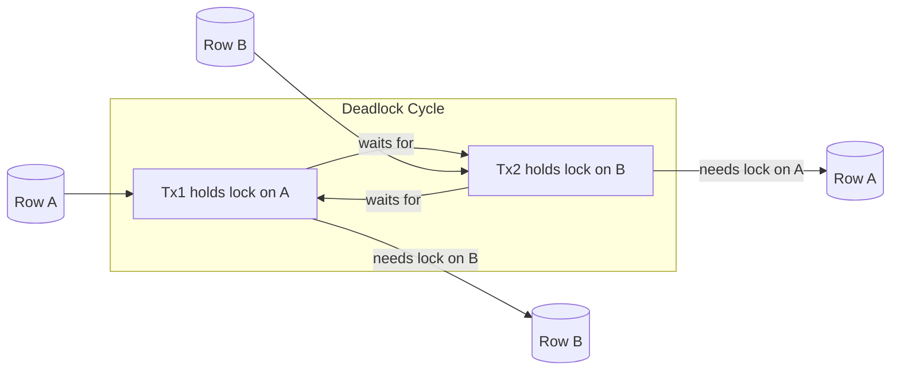

# Deadlock Detection, Prevention, and Resolution

## Overview

Deadlocks occur when two or more transactions are waiting for each other to release locks, creating a circular dependency. PostgreSQL automatically detects deadlocks and resolves them by aborting one of the transactions. Understanding deadlocks is critical for banking systems where high-concurrency operations on accounts and transactions are common.

## What Is a Deadlock?



```
Deadlock Example:
Time 1: Tx1 locks Row A (UPDATE accounts WHERE account_id = 1)
Time 2: Tx2 locks Row B (UPDATE accounts WHERE account_id = 2)
Time 3: Tx1 tries to lock Row B -> BLOCKED (Tx2 holds it)
Time 4: Tx2 tries to lock Row A -> BLOCKED (Tx1 holds it)

Neither transaction can proceed. PostgreSQL detects the cycle
and aborts one transaction with:
ERROR: deadlock detected
DETAIL: Process 1234 waits for ShareLock on transaction 5678;
        blocked by process 5678.
        Process 5678 waits for ShareLock on transaction 1234;
        blocked by process 1234.
```

## Deadlock Example in Banking

```sql
-- Classic deadlock: Transfer between two accounts in opposite order

-- Transaction 1: Transfer from Account 1 to Account 2
BEGIN;
UPDATE accounts SET balance = balance - 100 WHERE account_id = 1;  -- Locks Row 1
-- (waits...)                                                       -- Wants Row 2
UPDATE accounts SET balance = balance + 100 WHERE account_id = 2;
COMMIT;

-- Transaction 2: Transfer from Account 2 to Account 1
BEGIN;
UPDATE accounts SET balance = balance - 50 WHERE account_id = 2;   -- Locks Row 2
-- (waits...)                                                       -- Wants Row 1
UPDATE accounts SET balance = balance + 50 WHERE account_id = 1;
COMMIT;

-- If both transactions run simultaneously:
-- Tx1 holds Row 1, wants Row 2
-- Tx2 holds Row 2, wants Row 1
-- DEADLOCK! PostgreSQL aborts one transaction.
```

## Prevention Strategies

### Strategy 1: Consistent Lock Ordering

```sql
-- Always lock rows in a consistent order (e.g., by account_id)

-- Fix the deadlock: Always lock lower account_id first
CREATE OR REPLACE FUNCTION safe_transfer(
    from_account BIGINT,
    to_account BIGINT,
    amount DECIMAL
) RETURNS void AS $$
DECLARE
    v_first BIGINT;
    v_second BIGINT;
BEGIN
    -- Determine lock order
    IF from_account < to_account THEN
        v_first := from_account;
        v_second := to_account;
    ELSE
        v_first := to_account;
        v_second := from_account;
    END IF;
    
    -- Lock in order
    PERFORM 1 FROM accounts WHERE account_id = v_first FOR UPDATE;
    PERFORM 1 FROM accounts WHERE account_id = v_second FOR UPDATE;
    
    -- Now perform the transfer
    UPDATE accounts SET balance = balance - amount 
    WHERE account_id = from_account;
    
    UPDATE accounts SET balance = balance + amount 
    WHERE account_id = to_account;
    
    -- Log the transfer
    INSERT INTO transfer_log (from_account, to_account, amount, created_at)
    VALUES (from_account, to_account, amount, NOW());
END;
$$ LANGUAGE plpgsql;
```

### Strategy 2: NOWAIT or SKIP LOCKED

```sql
-- NOWAIT: Fail immediately instead of waiting
BEGIN;
UPDATE accounts SET balance = balance - 100 
WHERE account_id = 1;

UPDATE accounts SET balance = balance + 100 
WHERE account_id = 2 
NOWAIT;  -- Raises error if row is locked

-- If NOWAIT fails, application can retry or queue

-- SKIP LOCKED: Skip locked rows (good for queues)
SELECT * FROM pending_payments 
ORDER BY created_at 
LIMIT 10 
FOR UPDATE SKIP LOCKED;
-- Returns only unlocked rows, processes them, next worker gets the rest
```

### Strategy 3: Retry Logic

```python
"""Deadlock retry with exponential backoff."""
import psycopg2
import time
import logging
from functools import wraps

logger = logging.getLogger(__name__)

def retry_on_deadlock(max_retries=3, base_delay=0.1):
    """Decorator to retry functions that fail with deadlock."""
    def decorator(fn):
        @wraps(fn)
        def wrapper(*args, **kwargs):
            for attempt in range(max_retries):
                try:
                    return fn(*args, **kwargs)
                except psycopg2.extensions.TransactionRollbackError as e:
                    if 'deadlock' in str(e).lower():
                        if attempt == max_retries - 1:
                            logger.error(f"Deadlock retry exhausted after {max_retries} attempts")
                            raise
                        
                        delay = base_delay * (2 ** attempt)
                        logger.warning(f"Deadlock detected, retry {attempt + 1}/{max_retries} in {delay}s")
                        time.sleep(delay)
                    else:
                        raise
            return None
        return wrapper
    return decorator

@retry_on_deadlock(max_retries=3)
def execute_transfer(conn, from_account, to_account, amount):
    """Execute a bank transfer with deadlock retry."""
    with conn.cursor() as cur:
        cur.execute("""
            UPDATE accounts SET balance = balance - %s 
            WHERE account_id = %s
        """, (amount, from_account))
        
        cur.execute("""
            UPDATE accounts SET balance = balance + %s 
            WHERE account_id = %s
        """, (amount, to_account))
        
        cur.execute("""
            INSERT INTO transfer_log (from_account, to_account, amount)
            VALUES (%s, %s, %s)
        """, (from_account, to_account, amount))
    
    conn.commit()
```

## Detection and Monitoring

```sql
-- Deadlock information (available only during deadlock)
-- PostgreSQL logs deadlocks to server log

-- Configure deadlock timeout (default 1 second)
SHOW deadlock_timeout;  -- How long to wait before checking for deadlock

-- Set shorter for faster detection
ALTER SYSTEM SET deadlock_timeout = '500ms';
SELECT pg_reload_conf();

-- Monitor lock waits
SELECT 
    blocked_locks.pid AS blocked_pid,
    blocked_activity.usename AS blocked_user,
    blocked_activity.query AS blocked_statement,
    EXTRACT(EPOCH FROM (now() - blocked_activity.query_start)) AS wait_seconds,
    blocking_locks.pid AS blocking_pid,
    blocking_activity.query AS blocking_statement
FROM pg_catalog.pg_locks blocked_locks
JOIN pg_catalog.pg_stat_activity blocked_activity 
    ON blocked_activity.pid = blocked_locks.pid
JOIN pg_catalog.pg_locks blocking_locks 
    ON blocking_locks.locktype = blocked_locks.locktype
    AND blocking_locks.database IS NOT DISTINCT FROM blocked_locks.database
    AND blocking_locks.relation IS NOT DISTINCT FROM blocked_locks.relation
    AND blocking_locks.pid != blocked_locks.pid
JOIN pg_catalog.pg_stat_activity blocking_activity 
    ON blocking_activity.pid = blocking_locks.pid
WHERE NOT blocked_locks.granted;

-- Kill a blocking query (last resort)
SELECT pg_terminate_backend(<blocking_pid>);
```

## Cross-References

- **Isolation Levels**: See [isolation-levels.md](isolation-levels.md) for lock behavior
- **Transactions**: See [transactions.md](transactions.md) for transaction management

## Interview Questions

1. **What causes a deadlock? How does PostgreSQL detect and resolve it?**
2. **How do you prevent deadlocks in a transfer operation between two accounts?**
3. **What is the difference between NOWAIT, SKIP LOCKED, and regular FOR UPDATE?**
4. **Your application experiences frequent deadlocks. What steps do you take?**
5. **How does lock ordering prevent deadlocks?**
6. **What is deadlock_timeout and how does it affect deadlock detection?**

## Checklist: Deadlock Prevention

- [ ] Consistent lock ordering across all transactions
- [ ] Transactions kept short to minimize lock duration
- [ ] NOWAIT or SKIP LOCKED used for queue-style operations
- [ ] Retry logic implemented for deadlock errors
- [ ] deadlock_timeout configured appropriately
- [ ] Lock wait monitoring and alerting
- [ ] Long-running transactions investigated and optimized
- [ ] Application logs include deadlock information
- [ ] Periodic review of lock patterns in code
- [ ] Termination procedure for runaway blocking situations
