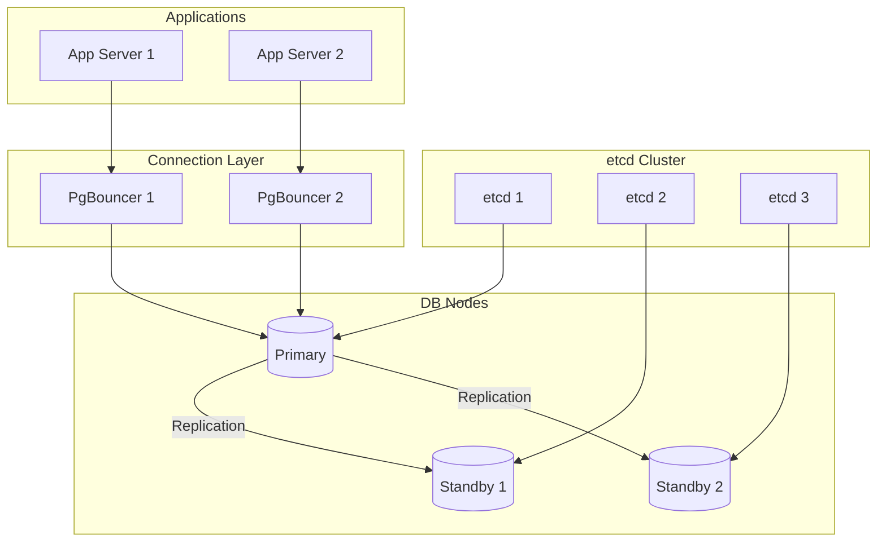

# High Availability: Patroni and Connection Failover

## Overview

High availability (HA) ensures banking databases remain accessible despite hardware failures, network partitions, and maintenance events. This guide covers Patroni-based HA architectures, connection failover patterns, and operational procedures for banking-grade database availability.

## Patroni HA Architecture



## Patroni Configuration

```yaml
# /etc/patroni/patroni.yml
scope: banking-cluster
namespace: /service/
name: db-node-1

restapi:
  listen: 0.0.0.0:8008
  connect_address: db-node-1:8008

etcd:
  hosts:
    - etcd-1:2379
    - etcd-2:2379
    - etcd-3:2379

bootstrap:
  dcs:
    ttl: 30
    loop_wait: 10
    retry_timeout: 10
    maximum_lag_on_failover: 1048576  # 1MB
    postgresql:
      use_pg_rewind: true
      use_slots: true
      parameters:
        wal_level: replica
        hot_standby: "on"
        max_wal_senders: 10
        max_replication_slots: 10
        wal_keep_size: 1024

  initdb:
    - encoding: UTF8
    - data-checksums

  pg_hba:
    - host replication replicator 0.0.0.0/0 md5
    - host all all 0.0.0.0/0 md5

postgresql:
  listen: 0.0.0.0:5432
  connect_address: db-node-1:5432
  data_dir: /var/lib/postgresql/15/data
  bin_dir: /usr/lib/postgresql/15/bin
  authentication:
    replication:
      username: replicator
      password: "${REPLICATOR_PASSWORD}"
    superuser:
      username: postgres
      password: "${POSTGRES_PASSWORD}"
  parameters:
    shared_buffers: 16GB
    work_mem: 256MB
    max_connections: 200

tags:
  nofailover: false
  noloadbalance: false
  clonefrom: false
  nosync: false
```

## Patroni Operations

```bash
# Check cluster status
patronictl -c /etc/patroni/patroni.yml list

# Output:
# + Cluster: banking-cluster +-------+---------+---------+----+-----------+
# | Member   | Host        | Role    | State   | TL | Lag in MB |
# +----------+-------------+---------+---------+----+-----------+
# | db-node-1| 10.0.1.1    | Leader  | running |  5 |           |
# | db-node-2| 10.0.1.2    | Replica | running |  5 |         0 |
# | db-node-3| 10.0.1.3    | Replica | running |  5 |         0 |
# +----------+-------------+---------+---------+----+-----------+

# Manual failover
patronictl -c /etc/patroni/patroni.yml failover

# Switchover (planned)
patronictl -c /etc/patroni/patroni.yml switchover \
    --master db-node-1 \
    --candidate db-node-2

# Pause auto-failover (for maintenance)
patronictl -c /etc/patroni/patroni.yml pause

# Resume auto-failover
patronictl -c /etc/patroni/patroni.yml resume

# Show configuration
patronictl -c /etc/patroni/patroni.yml show-config

# Edit configuration
patronictl -c /etc/patroni/patroni.yml edit-config
```

## Connection Failover with PgBouncer

```ini
# /etc/pgbouncer/pgbouncer.ini
[databases]
# Use multiple hosts for failover
banking_prod = host=db-node-1,db-node-2,db-node-3 port=5432 dbname=banking

# Use Patroni's REST API for health checks
# Patroni exposes /read-write on primary, /read-only on standbys

[pgbouncer]
listen_addr = *
listen_port = 6432
auth_type = md5
auth_file = /etc/pgbouncer/userlist.txt
pool_mode = transaction
max_client_conn = 10000
default_pool_size = 50

# Health check
server_check_query = SELECT 1
server_check_delay = 10

# Failover settings
server_connect_timeout = 5
server_login_retry = 5
```

```python
"""Application-level connection failover."""
import psycopg2
from psycopg2 import pool
import logging

logger = logging.getLogger(__name__)

class FailoverConnectionPool:
    """Connection pool with automatic failover."""
    
    def __init__(self, hosts: list, **kwargs):
        self.hosts = hosts
        self.kwargs = kwargs
        self.current_host_index = 0
        self.pool = None
        self._create_pool()
    
    def _create_pool(self):
        """Create connection pool to current host."""
        host = self.hosts[self.current_host_index]
        try:
            self.pool = psycopg2.pool.ThreadedConnectionPool(
                minconn=5,
                maxconn=20,
                host=host,
                **self.kwargs
            )
            logger.info(f"Connected to {host}")
        except Exception as e:
            logger.error(f"Failed to connect to {host}: {e}")
            self._failover()
    
    def _failover(self):
        """Try next host in list."""
        self.current_host_index = (self.current_host_index + 1) % len(self.hosts)
        self._create_pool()
    
    def get_connection(self):
        """Get connection with failover retry."""
        for _ in range(len(self.hosts)):
            try:
                return self.pool.getconn()
            except psycopg2.OperationalError:
                logger.warning("Connection failed, trying failover")
                self._failover()
        
        raise Exception("All database hosts unavailable")
    
    def execute_with_failover(self, query, params=None):
        """Execute query with automatic failover."""
        conn = self.get_connection()
        try:
            with conn.cursor() as cur:
                cur.execute(query, params)
                if cur.description:  # SELECT query
                    return cur.fetchall()
                conn.commit()
                return None
        except psycopg2.OperationalError:
            self.pool.putconn(conn, close=True)
            self._failover()
            # Retry once after failover
            conn = self.get_connection()
            with conn.cursor() as cur:
                cur.execute(query, params)
                if cur.description:
                    return cur.fetchall()
                conn.commit()
                return None
        except Exception:
            self.pool.putconn(conn)
            raise
        finally:
            self.pool.putconn(conn)
```

## Cross-References

- **Disaster Recovery**: See [disaster-recovery.md](disaster-recovery.md) for DR strategies
- **Replication**: See [replication.md](replication.md) for replication setup
- **Backups**: See [backups.md](backups.md) for backup strategies

## Interview Questions

1. **How does Patroni ensure high availability? What role does etcd play?**
2. **What happens during a Patroni failover? How long does it take?**
3. **How do you handle application connections during database failover?**
4. **What is the difference between failover and switchover in Patroni?**
5. **How do you perform planned maintenance on the primary node without downtime?**
6. **Your Patroni cluster shows maximum_lag exceeded on a standby. What does this mean?**

## Checklist: High Availability

- [ ] Patroni cluster with minimum 3 nodes
- [ ] etcd cluster with odd number of nodes (3 or 5)
- [ ] PgBouncer configured for connection pooling and failover
- [ ] Application connection retry logic implemented
- [ ] DNS/VIP for primary endpoint
- [ ] Monitoring for cluster state and replication lag
- [ ] Failover procedure tested regularly
- [ ] Planned switchover procedure for maintenance
- [ ] maximum_lag_on_failover configured appropriately
- [ ] pg_rewind enabled for automatic resync after failover
