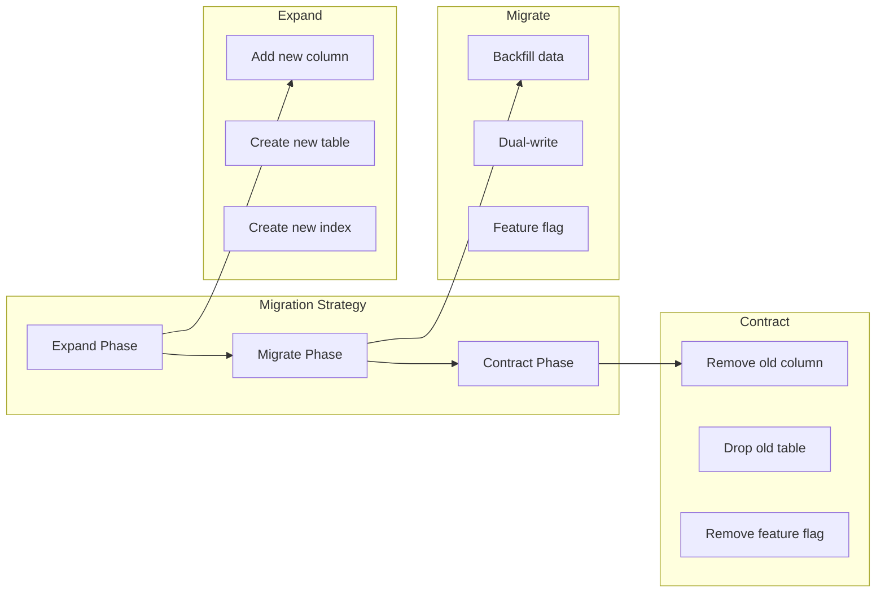

# Database Migrations for Banking Systems

## Overview

Database migrations in banking must maintain backward compatibility, support zero-downtime deployments, and ensure data integrity. This guide covers migration strategies, patterns for safe schema evolution, and rollback procedures for production banking databases.

## Migration Principles



## Expand-Migrate-Contract Pattern

```sql
-- Scenario: Split customer "name" into "first_name" and "last_name"

-- Phase 1: EXPAND (Add new columns, keep old)
ALTER TABLE customers 
    ADD COLUMN first_name VARCHAR(100),
    ADD COLUMN last_name VARCHAR(100);

-- Deploy application that writes to BOTH old and new columns

-- Phase 2: MIGRATE (Backfill data)
UPDATE customers 
SET 
    first_name = SPLIT_PART(full_name, ' ', 1),
    last_name = SUBSTRING(full_name FROM POSITION(' ' IN full_name) + 1)
WHERE first_name IS NULL
LIMIT 10000;  -- Run in batches

-- Repeat until all rows migrated
-- Deploy application that reads from NEW columns

-- Phase 3: CONTRACT (Remove old columns)
-- After confirming all reads use new columns
ALTER TABLE customers DROP COLUMN full_name;

-- Deploy application that no longer references old column
```

## Zero-Downtime Migration Patterns

### Adding a Column with Default

```sql
-- BAD: Locks table while updating every row
ALTER TABLE transactions ADD COLUMN channel VARCHAR(20) DEFAULT 'ONLINE';

-- GOOD: Add column without default, then backfill
ALTER TABLE transactions ADD COLUMN channel VARCHAR(20);

-- Backfill in batches
CREATE OR REPLACE FUNCTION backfill_channel() RETURNS void AS $$
DECLARE
    v_updated INT := 0;
BEGIN
    LOOP
        UPDATE transactions 
        SET channel = 'ONLINE'
        WHERE channel IS NULL
          AND transaction_id IN (
              SELECT transaction_id FROM transactions 
              WHERE channel IS NULL LIMIT 10000
          );
        
        GET DIAGNOSTICS v_updated = ROW_COUNT;
        COMMIT;
        
        EXIT WHEN v_updated = 0;
        PERFORM pg_sleep(0.1);
    END LOOP;
END;
$$ LANGUAGE plpgsql;

SELECT backfill_channel();

-- Now add default for future inserts
ALTER TABLE transactions ALTER COLUMN channel SET DEFAULT 'ONLINE';
```

### Renaming a Column

```sql
-- Cannot rename column with zero downtime in Postgres
-- Use expand-migrate-contract pattern instead

-- Step 1: Add new column
ALTER TABLE accounts ADD COLUMN new_balance DECIMAL(15, 2);

-- Step 2: Dual-write application updates both columns
-- (Application code change)

-- Step 3: Backfill
UPDATE accounts SET new_balance = balance WHERE new_balance IS NULL;

-- Step 4: Switch reads to new column
-- (Application code change)

-- Step 5: Drop old column
ALTER TABLE accounts DROP COLUMN balance;

-- Step 6: Rename new column (with brief lock)
ALTER TABLE accounts RENAME COLUMN new_balance TO balance;
```

### Changing a Column Type

```sql
-- Changing integer to bigint (safe, no data loss)
ALTER TABLE transactions ALTER COLUMN amount TYPE DECIMAL(15, 2);

-- Changing varchar length (safe if increasing)
ALTER TABLE customers ALTER COLUMN email TYPE VARCHAR(500);

-- Changing type with data transformation (requires migration)
-- Example: integer timestamp to timestamptz
ALTER TABLE events ADD COLUMN created_at_new TIMESTAMPTZ;

-- Backfill
UPDATE events 
SET created_at_new = TO_TIMESTAMP(created_at_old)
WHERE created_at_new IS NULL
LIMIT 10000;

-- After backfill complete and reads switched:
ALTER TABLE events DROP COLUMN created_at_old;
ALTER TABLE events RENAME COLUMN created_at_new TO created_at;
```

## Migration Tools

### Flyway Migration Files

```sql
-- V20250115_001__add_transaction_channel.sql
ALTER TABLE transactions ADD COLUMN channel VARCHAR(20);
CREATE INDEX idx_txn_channel ON transactions (channel) WHERE channel IS NULL;

-- V20250115_002__backfill_transaction_channel.sql
-- This runs as a separate migration to avoid long locks
-- Execute backfill function in batches

-- V20250115_003__set_transaction_channel_default.sql
UPDATE transactions SET channel = 'ONLINE' WHERE channel IS NULL;
ALTER TABLE transactions ALTER COLUMN channel SET DEFAULT 'ONLINE';
ALTER TABLE transactions ALTER COLUMN channel SET NOT NULL;
```

### Programmatic Migration with Python

```python
"""
Database migration script with rollback support.
"""
import psycopg2
import logging
from contextlib import contextmanager

logger = logging.getLogger(__name__)

class DatabaseMigrator:
    """Execute database migrations with rollback support."""
    
    def __init__(self, db_config: dict):
        self.db_config = db_config
        self._ensure_migration_table()
    
    def _ensure_migration_table(self):
        """Create migration tracking table."""
        with self._connection() as conn:
            with conn.cursor() as cur:
                cur.execute("""
                    CREATE TABLE IF NOT EXISTS schema_migrations (
                        migration_id VARCHAR(100) PRIMARY KEY,
                        applied_at TIMESTAMPTZ DEFAULT NOW(),
                        execution_time_ms INT,
                        status VARCHAR(20) DEFAULT 'APPLIED'
                    )
                """)
            conn.commit()
    
    def apply_migration(self, migration_id: str, up_sql: str, down_sql: str = None):
        """Apply a single migration with rollback capability."""
        if self._is_applied(migration_id):
            logger.info(f"Migration {migration_id} already applied")
            return
        
        import time
        start = time.time()
        
        try:
            with self._connection() as conn:
                with conn.cursor() as cur:
                    cur.execute(up_sql)
                    
                    cur.execute("""
                        INSERT INTO schema_migrations 
                            (migration_id, execution_time_ms, status)
                        VALUES (%s, %s, 'APPLIED')
                    """, (migration_id, int((time.time() - start) * 1000)))
                
                conn.commit()
                logger.info(f"Migration {migration_id} applied successfully")
        
        except Exception as e:
            logger.error(f"Migration {migration_id} failed: {e}")
            raise
    
    def rollback_migration(self, migration_id: str, down_sql: str):
        """Rollback a migration."""
        if not self._is_applied(migration_id):
            logger.info(f"Migration {migration_id} not applied")
            return
        
        with self._connection() as conn:
            with conn.cursor() as cur:
                cur.execute(down_sql)
                cur.execute("""
                    UPDATE schema_migrations 
                    SET status = 'ROLLED_BACK'
                    WHERE migration_id = %s
                """, (migration_id,))
            conn.commit()
        
        logger.info(f"Migration {migration_id} rolled back")
    
    def _is_applied(self, migration_id: str) -> bool:
        with self._connection() as conn:
            with conn.cursor() as cur:
                cur.execute("""
                    SELECT COUNT(*) FROM schema_migrations 
                    WHERE migration_id = %s AND status = 'APPLIED'
                """, (migration_id,))
                return cur.fetchone()[0] > 0
    
    @contextmanager
    def _connection(self):
        conn = psycopg2.connect(**self.db_config)
        try:
            yield conn
        finally:
            conn.close()

# Usage
migrator = DatabaseMigrator(db_config)

migrator.apply_migration(
    migration_id="20250115_add_customer_segment",
    up_sql="""
        ALTER TABLE customers ADD COLUMN segment VARCHAR(20);
        CREATE INDEX idx_customer_segment ON customers (segment);
    """,
    down_sql="""
        DROP INDEX IF EXISTS idx_customer_segment;
        ALTER TABLE customers DROP COLUMN IF EXISTS segment;
    """,
)
```

## Cross-References

- **Transactions**: See [transactions.md](transactions.md) for transaction safety
- **Postgres Performance**: See [postgres-performance.md](postgres-performance.md) for avoiding migration locks

## Interview Questions

1. **How do you deploy a database migration with zero downtime?**
2. **What is the expand-migrate-contract pattern? When do you use it?**
3. **Your migration locked a production table for 30 minutes. How do you prevent this?**
4. **How do you rollback a failed migration in production?**
5. **What happens when you ALTER TABLE to add a column with a DEFAULT value in Postgres 11+?**
6. **How do you handle migrations when multiple application versions are running simultaneously?**

## Checklist: Safe Migrations

- [ ] Migrations are reversible (have rollback SQL)
- [ ] Backward compatible (old application version still works)
- [ ] Long-running operations done in batches
- [ ] New columns added without NOT NULL constraint initially
- [ ] Index creation uses CONCURRENTLY for large tables
- [ ] Migration tracking table records all applied migrations
- [ ] Migrations tested on production-like data volume
- [ ] Rollback procedure documented and tested
- [ ] Feature flags used for gradual rollout
- [ ] No migration drops data without explicit approval
