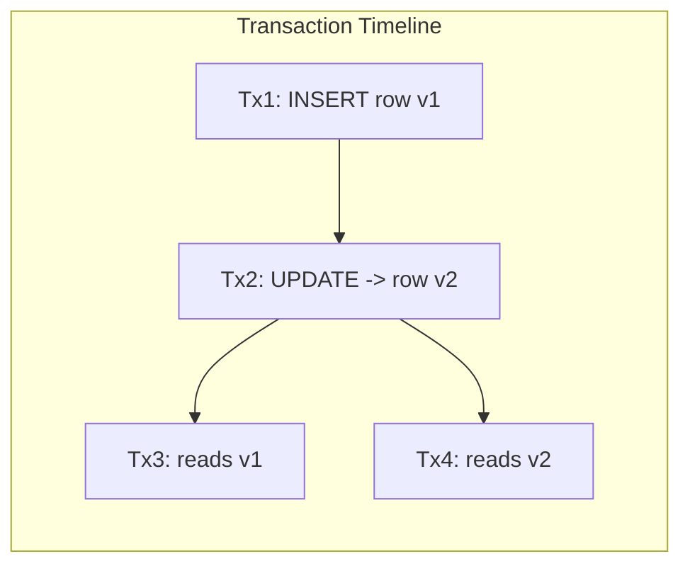

# PostgreSQL Fundamentals: Internals, Architecture, and MVCC

## Overview

Understanding PostgreSQL internals is essential for senior data engineers and database administrators. This guide covers Postgres architecture, storage engine, MVCC (Multi-Version Concurrency Control), query execution, and how the database handles concurrent banking workloads.

## PostgreSQL Architecture

```mermaid
graph TB
    subgraph Client Connections
    C1[Client App 1]
    C2[Client App 2]
    C3[PgBouncer]
    end
    
    subgraph Postgres Server
    PM[Postmaster - Main Process]
    BGW[Background Writer]
    CKPT[Checkpointer]
    WALW[WAL Writer]
    AUTOV[AutoVacuum Launcher]
    end
    
    subgraph Backend Processes
    BE1[Backend 1 - Query Executor]
    BE2[Backend 2 - Query Executor]
    end
    
    subgraph Shared Memory
    SHBUF[Shared Buffer Pool]
    WALBUF[WAL Buffer]
    CLOG[Commit Log (CLOG)]
    end
    
    subgraph Disk Storage
    DATA[Data Files (Heap)]
    WALF[WAL Files]
    IDX[Index Files]
    end
    
    C1 --> BE1
    C2 --> BE2
    C3 --> BE1
    C3 --> BE2
    PM --> BE1
    PM --> BE2
    PM --> BGW
    PM --> CKPT
    PM --> WALW
    PM --> AUTOV
    BE1 --> SHBUF
    BE2 --> SHBUF
    SHBUF --> DATA
    WALBUF --> WALF
    SHBUF --> WALBUF
```

## Process Architecture

### Postmaster

The postmaster is the main PostgreSQL process that:
- Listens for incoming connections
- Spawns backend processes for each connection
- Manages shared memory and background processes
- Handles crash recovery

### Backend Processes

Each client connection gets a dedicated backend process (not thread). This is why connection pooling (PgBouncer) is essential for high-concurrency workloads.

```
Connection flow:
Client -> PgBouncer -> Postmaster -> Backend Process -> Query Execution
```

### Background Processes

```
Background Writer (bgwriter):
- Periodically writes dirty buffers to disk
- Reduces I/O spikes during checkpoints
- Configurable: bgwriter_delay, bgwriter_lru_maxpages

Checkpointer (checkpointer):
- Writes all dirty buffers during checkpoint
- Ensures crash recovery point
- Configurable: checkpoint_timeout, checkpoint_completion_target

WAL Writer (walwriter):
- Flushes WAL buffer to disk
- Configurable: wal_writer_delay

AutoVacuum Launcher (autovacuum):
- Launches vacuum workers for tables needing cleanup
- Configurable: autovacuum_max_workers, autovacuum_naptime

WAL Receiver/Sender (replication):
- Handles streaming replication between primary and standby
```

## Storage Engine

### Data Files (Heap)

```
PostgreSQL stores table data in heap files:
- Files are located in: $PGDATA/base/<database_oid>/<relfilenode>
- Each file is typically 1GB (split when exceeded)
- Data is stored as 8KB pages (blocks)
- Pages contain: PageHeader, ItemPointers, Items (tuples), Free Space

Page structure:
┌─────────────────────────────────────────┐
│ PageHeader (24 bytes)                   │
│  - lsn, checksum, flags                │
├─────────────────────────────────────────┤
│ ItemPointers (4 bytes each)             │
│  - Points to actual tuple location     │
├─────────────────────────────────────────┤
│ Free Space                              │
│  - Grows/shrinks as tuples added/removed│
├─────────────────────────────────────────┤
│ Tuples (variable size)                  │
│  - Actual row data                     │
│  - Header (23 bytes) + data            │
└─────────────────────────────────────────┘
```

### Tuple Structure

```sql
-- Each tuple (row) has a header with metadata
-- Header fields (23 bytes minimum):
-- t_xmin: Inserting transaction ID
-- t_xmax: Deleting/locking transaction ID (0 if not deleted)
-- t_cid: Command ID within transaction
-- t_ctid: Physical location (page, offset)

-- This is how MVCC works:
-- When you INSERT: t_xmin = current transaction ID
-- When you UPDATE: old tuple gets t_xmax = current txid, new tuple gets new t_xmin
-- When you DELETE: tuple gets t_xmax = current txid

-- Visible to transaction T if:
-- t_xmin was committed before T started AND
-- (t_xmax = 0 OR t_xmax was not committed OR t_xmax started after T)
```

## MVCC: Multi-Version Concurrency Control



### How MVCC Works

```
Without MVCC:
- Reader blocks writer, writer blocks reader (traditional locking)
- Poor concurrency

With MVCC:
- Readers never block writers
- Writers never block readers
- Multiple versions of a row coexist
- Each transaction sees a consistent snapshot

Example timeline:
Time 1: Tx100 INSERTS row (name='Alice', balance=1000)
         -> Tuple v1: xmin=100, xmax=0

Time 2: Tx200 READS row (snapshot at time 2)
         -> Sees v1 (xmin=100 committed, xmax=0)

Time 3: Tx300 UPDATES row (balance=1500)
         -> Tuple v1: xmin=100, xmax=300 (marked for deletion)
         -> Tuple v2: xmin=300, xmax=0 (new version)

Time 4: Tx200 still READS row
         -> Still sees v1 (Tx200's snapshot predates Tx300)

Time 5: Tx400 READS row (snapshot at time 5)
         -> Sees v2 (xmax=300 committed, new version visible)
```

### MVCC Implications for Banking

```sql
-- Long-running transactions prevent vacuum cleanup
-- This causes table bloat

-- Problem: Analytics query runs for 2 hours
BEGIN;
SELECT * FROM transactions 
WHERE transaction_time >= '2024-01-01';  -- Takes 2 hours
-- During this time, all updated/deleted rows must be kept
-- because this transaction might need them

-- Solution: Set statement timeout
SET statement_timeout = '30min';

-- Or use a dedicated read replica for analytics

-- Vacuum: cleans up dead tuples (old versions)
-- VACUUM does NOT return space to OS, just marks as reusable
-- VACUUM FULL rewrites the table, returns space, but locks table

-- Check table bloat
SELECT 
    schemaname,
    relname AS table_name,
    n_dead_tup,
    n_live_tup,
    ROUND(100.0 * n_dead_tup / NULLIF(n_live_tup + n_dead_tup, 0), 2) AS dead_pct
FROM pg_stat_user_tables
WHERE n_dead_tup > 10000
ORDER BY n_dead_tup DESC
LIMIT 20;
```

## Transaction IDs and Wraparound

```
PostgreSQL uses 32-bit transaction IDs (~4 billion)
After 2 billion transactions, wraparound occurs
PostgreSQL prevents wraparound with aggressive vacuuming

-- Monitor transaction ID age
SELECT 
    datname,
    age(datfrozenxid) AS xid_age,
    2147483647 - age(datfrozenxid) AS xids_remaining
FROM pg_database
ORDER BY age(datfrozenxid) DESC;

-- When xid_age approaches 2 billion, autovacuum freezes tuples
-- If it reaches 2 billion, database shuts down to prevent corruption

-- Configuration:
-- autovacuum_freeze_max_age = 200000000 (default)
-- Trigger aggressive vacuum when this age is reached
```

## Write-Ahead Logging (WAL)

```
WAL ensures durability: changes are logged before data files are modified

Write flow:
1. Backend modifies shared buffer (in memory)
2. WAL record written to WAL buffer
3. On COMMIT: WAL buffer flushed to disk
4. Dirty buffers written to data files by background writer/checkpointer

Recovery flow (after crash):
1. Read last checkpoint
2. Replay WAL records from checkpoint to end
3. All committed transactions are recovered
4. Uncommitted transactions are rolled back

-- WAL configuration
-- wal_level = replica (for replication) or logical (for CDC)
-- max_wal_size = 1GB (max WAL before checkpoint)
-- min_wal_size = 80MB (minimum WAL to keep)
-- wal_keep_size = 0 (how much WAL to keep for replication)
```

## Cross-References

- **Postgres Performance**: See [postgres-performance.md](postgres-performance.md) for tuning
- **Transactions**: See [transactions.md](transactions.md) for ACID properties
- **MVCC**: See [isolation-levels.md](isolation-levels.md) for isolation behavior

## Interview Questions

1. **How does MVCC work in PostgreSQL? Why is it important for concurrency?**
2. **What happens when you UPDATE a row in PostgreSQL? Explain at the storage level.**
3. **Why does PostgreSQL need VACUUM? What does it clean up?**
4. **Your PostgreSQL table has 50% dead tuples. What caused this and how do you fix it?**
5. **Explain the difference between VACUUM and VACUUM FULL. When would you use each?**
6. **What is WAL and how does it ensure durability?**
7. **What happens when transaction IDs wrap around in PostgreSQL?**

## Checklist: PostgreSQL Fundamentals

- [ ] Connection pooling configured (PgBouncer)
- [ ] Shared buffers sized appropriately (25% of RAM)
- [ ] WAL level set correctly (replica or logical)
- [ ] Checkpoint timeout configured for workload
- [ ] Autovacuum tuned for high-churn tables
- [ ] Transaction ID age monitored
- [ ] Table bloat monitored and addressed
- [ ] Statement timeouts configured
- [ ] Long-running transactions identified and addressed
- [ ] Read replicas used for analytics workloads
