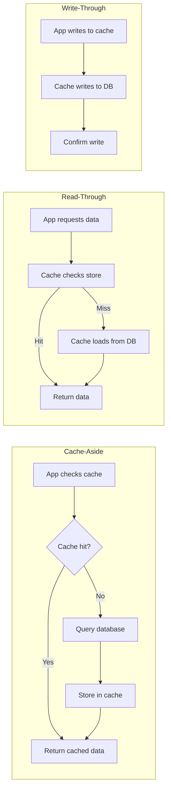

# Redis Caching Patterns and Optimization

## Overview

Redis caching is a critical performance layer in banking platforms, reducing database load and improving API response times. This guide covers advanced caching patterns, cache invalidation strategies, cache stampede prevention, and operational best practices for production banking workloads.

## Caching Strategies



## Cache-Aside Pattern (Most Common)

```python
"""Cache-aside pattern for banking data."""
import redis
import json
import logging
from typing import Optional, Callable, Any
from datetime import timedelta

logger = logging.getLogger(__name__)

class CacheAsideManager:
    """Manage cache-aside pattern for banking operations."""
    
    def __init__(self, redis_client: redis.Redis):
        self.client = redis_client
    
    def get(
        self, 
        key: str, 
        loader: Callable, 
        ttl: int = 300,
        serializer: Callable = json.dumps,
        deserializer: Callable = json.loads,
    ) -> Any:
        """
        Get data from cache or load from source.
        
        Args:
            key: Cache key
            loader: Function to call if cache miss
            ttl: Time-to-live in seconds
            serializer: Function to serialize value
            deserializer: Function to deserialize value
        """
        # Try cache
        cached = self.client.get(key)
        if cached is not None:
            logger.debug(f"Cache hit: {key}")
            return deserializer(cached)
        
        # Cache miss: load from source
        logger.debug(f"Cache miss: {key}")
        value = loader()
        
        if value is not None:
            # Store in cache
            serialized = serializer(value)
            # Add jitter to TTL to prevent thundering herd
            import random
            jittered_ttl = ttl + random.randint(-ttl // 4, ttl // 4)
            self.client.setex(key, jittered_ttl, serialized)
        
        return value
    
    def invalidate(self, key: str):
        """Invalidate a cache entry."""
        self.client.delete(key)
    
    def invalidate_pattern(self, pattern: str):
        """Invalidate all keys matching pattern (use with caution)."""
        # Use SCAN instead of KEYS for production
        cursor = 0
        while True:
            cursor, keys = self.client.scan(cursor, match=pattern, count=100)
            if keys:
                self.client.delete(*keys)
            if cursor == 0:
                break

# Usage
cache = CacheAsideManager(redis_client)

def get_account_balance(account_id: int) -> float:
    """Get account balance with caching."""
    def loader():
        # Expensive database query
        return fetch_balance_from_db(account_id)
    
    return cache.get(
        key=f"account:{account_id}:balance",
        loader=loader,
        ttl=60,  # Short TTL for frequently changing data
    )

def get_customer_profile(customer_id: int) -> dict:
    """Get customer profile with longer cache TTL."""
    def loader():
        return fetch_profile_from_db(customer_id)
    
    return cache.get(
        key=f"customer:{customer_id}:profile",
        loader=loader,
        ttl=600,  # Longer TTL for less frequently changing data
    )
```

## Cache Stampede Prevention

```python
"""Prevent cache stampede (thundering herd) when popular keys expire."""
import redis
import time
import threading
from typing import Any, Callable

class StampedeProtection:
    """Prevent multiple simultaneous cache rebuilds."""
    
    def __init__(self, redis_client: redis.Redis):
        self.client = redis_client
    
    def get_with_lock(
        self,
        key: str,
        loader: Callable,
        ttl: int = 300,
        lock_ttl: int = 10,
    ) -> Any:
        """
        Get data with distributed lock to prevent stampede.
        Only one thread rebuilds the cache, others wait or return stale data.
        """
        # Try normal cache hit
        cached = self.client.get(key)
        if cached is not None:
            return cached
        
        # Cache miss: try to acquire lock
        lock_key = f"lock:{key}"
        acquired = self.client.set(lock_key, "1", nx=True, ex=lock_ttl)
        
        if acquired:
            # This thread rebuilds the cache
            try:
                value = loader()
                self.client.setex(key, ttl, value)
                return value
            finally:
                self.client.delete(lock_key)
        else:
            # Another thread is rebuilding
            # Option 1: Wait and retry
            for _ in range(lock_ttl):
                time.sleep(1)
                cached = self.client.get(key)
                if cached is not None:
                    return cached
            
            # Option 2: Return stale data if available
            stale_key = f"stale:{key}"
            stale = self.client.get(stale_key)
            if stale is not None:
                return stale
            
            # Option 3: Call loader anyway (fallback)
            return loader()
    
    def refresh_early(
        self,
        key: str,
        loader: Callable,
        ttl: int = 300,
        refresh_threshold: float = 0.2,
    ) -> Any:
        """
        Proactively refresh cache before expiration.
        If TTL has passed (1 - refresh_threshold)%, refresh early.
        """
        cached = self.client.get(key)
        if cached is not None:
            # Check TTL remaining
            ttl_remaining = self.client.ttl(key)
            if ttl_remaining > 0 and ttl_remaining < ttl * refresh_threshold:
                # Refresh in background
                threading.Thread(
                    target=self._refresh,
                    args=(key, loader, ttl),
                    daemon=True,
                ).start()
            return cached
        
        # Cache miss
        value = loader()
        self.client.setex(key, ttl, value)
        return value
    
    def _refresh(self, key: str, loader: Callable, ttl: int):
        """Background refresh."""
        try:
            value = loader()
            self.client.setex(key, ttl, value)
        except Exception as e:
            logger.error(f"Background refresh failed for {key}: {e}")
```

## Cache Invalidation Strategies

```python
"""Cache invalidation patterns for banking."""

class CacheInvalidationManager:
    """Manage cache invalidation for banking data."""
    
    def __init__(self, redis_client: redis.Redis):
        self.client = redis_client
    
    def invalidate_on_write(self, table: str, record_id: int):
        """Invalidate cache when data is updated."""
        # Invalidate specific key
        self.client.delete(f"{table}:{record_id}:*")  # Pattern doesn't work with delete
        
        # Better: Track related keys
        keys = self.client.smembers(f"cache_keys:{table}:{record_id}")
        if keys:
            self.client.delete(*keys)
            self.client.delete(f"cache_keys:{table}:{record_id}")
    
    def track_cache_keys(self, table: str, record_id: int, cache_keys: list):
        """Track which cache keys are associated with a record."""
        pipe = self.client.pipeline(True)
        for key in cache_keys:
            pipe.sadd(f"cache_keys:{table}:{record_id}", key)
            pipe.expire(f"cache_keys:{table}:{record_id}", 86400)  # 24 hours
        pipe.execute()
    
    def invalidate_related(self, entity_type: str, entity_id: int):
        """Invalidate all caches related to an entity."""
        # Example: When customer is updated, invalidate all customer-related caches
        patterns = [
            f"customer:{entity_id}:*",
            f"customer:{entity_id}:accounts:*",
            f"customer:{entity_id}:transactions:*",
        ]
        
        for pattern in patterns:
            cursor = 0
            while True:
                cursor, keys = self.client.scan(cursor, match=pattern, count=100)
                if keys:
                    self.client.delete(*keys)
                if cursor == 0:
                    break
    
    def versioned_cache(self, key_prefix: str, version: int, loader: Callable, ttl: int):
        """Use version-based invalidation."""
        key = f"{key_prefix}:v{version}"
        cached = self.client.get(key)
        if cached is not None:
            return cached
        
        value = loader()
        self.client.setex(key, ttl, value)
        return value
    
    def bump_version(self, key_prefix: str, version_key: str):
        """Bump cache version to invalidate all old caches."""
        new_version = self.client.incr(version_key)
        return new_version

# Usage: Invalidate on transaction
def record_transaction(account_id: int, amount: float, txn_type: str):
    """Record transaction and invalidate related caches."""
    # Write to database
    txn_id = write_transaction_to_db(account_id, amount, txn_type)
    
    # Invalidate caches
    invalidation = CacheInvalidationManager(redis_client)
    invalidation.invalidate_related('account', account_id)
    invalidation.invalidate_on_write('transaction', txn_id)
    
    return txn_id
```

## Cache Monitoring

```python
"""Redis cache monitoring for banking."""
import redis

class CacheMonitor:
    """Monitor Redis cache health and performance."""
    
    def __init__(self, redis_client: redis.Redis):
        self.client = redis_client
    
    def get_stats(self) -> dict:
        """Get cache statistics."""
        info = self.client.info()
        
        return {
            'connected_clients': info.get('connected_clients', 0),
            'used_memory_human': info.get('used_memory_human', '0B'),
            'used_memory_peak_human': info.get('used_memory_peak_human', '0B'),
            'mem_fragmentation_ratio': info.get('mem_fragmentation_ratio', 0),
            'keyspace_hits': info.get('keyspace_hits', 0),
            'keyspace_misses': info.get('keyspace_misses', 0),
            'evicted_keys': info.get('evicted_keys', 0),
            'expired_keys': info.get('expired_keys', 0),
        }
    
    def hit_rate(self) -> float:
        """Calculate cache hit rate."""
        info = self.client.info()
        hits = info.get('keyspace_hits', 0)
        misses = info.get('keyspace_misses', 0)
        total = hits + misses
        return hits / total if total > 0 else 0.0
    
    def memory_usage(self) -> dict:
        """Get memory usage details."""
        info = self.client.info()
        maxmemory = info.get('maxmemory', 0)
        used = info.get('used_memory', 0)
        
        return {
            'used_bytes': used,
            'max_bytes': maxmemory,
            'usage_pct': (used / maxmemory * 100) if maxmemory > 0 else 0,
            'used_human': info.get('used_memory_human'),
            'max_human': info.get('maxmemory_human'),
        }
    
    def top_keys_by_memory(self, limit: int = 10) -> list:
        """Find keys using most memory (requires MEMORY USAGE command)."""
        # This is expensive for large databases
        cursor = 0
        key_sizes = []
        
        while True:
            cursor, keys = self.client.scan(cursor, count=100)
            for key in keys:
                size = self.client.memory_usage(key)
                key_sizes.append((key, size))
            if cursor == 0:
                break
        
        return sorted(key_sizes, key=lambda x: x[1], reverse=True)[:limit]
```

## Cross-References

- **Redis**: See [redis.md](redis.md) for Redis fundamentals
- **Postgres Performance**: See [postgres-performance.md](postgres-performance.md) for caching impact

## Interview Questions

1. **What is cache stampede and how do you prevent it?**
2. **Compare cache-aside, read-through, and write-through caching strategies.**
3. **How do you handle cache invalidation when data changes in the database?**
4. **Your cache hit rate dropped from 95% to 60%. What could cause this?**
5. **How do you decide the TTL for different types of cached data in banking?**
6. **What is the difference between volatile-lru and allkeys-lru eviction policies?**

## Checklist: Caching Best Practices

- [ ] Cache-aside pattern used for most caching scenarios
- [ ] TTLs set with jitter to prevent thundering herd
- [ ] Cache stampede prevention implemented (locks or early refresh)
- [ ] Cache invalidation tied to data writes
- [ ] Memory limits configured with appropriate eviction policy
- [ ] Cache hit rate monitored and alerted
- [ ] Key naming convention documented and followed
- [ ] Cache warming strategy for critical data
- [ ] Stale-while-revalidate pattern for high-traffic keys
- [ ] Slow queries to Redis monitored (Redis Slow Log)
