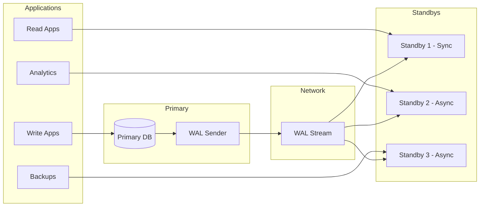

# Replication: Streaming and Logical Replication

## Overview

PostgreSQL replication creates copies of databases for high availability, read scaling, and zero-downtime migrations. This guide covers streaming replication (physical) and logical replication, with banking-specific patterns for CDC, read replicas, and disaster recovery.

## Streaming Replication



```sql
-- Primary configuration (postgresql.conf)
-- wal_level = replica           -- or 'logical' for logical replication
-- max_wal_senders = 10          -- Max replication connections
-- max_replication_slots = 10    -- Max replication slots
-- wal_keep_size = 1GB           -- How much WAL to keep for standby
-- hot_standby = on              -- Allow queries on standby

-- Create replication user
CREATE ROLE replicator WITH REPLICATION LOGIN PASSWORD 'secure_password';

-- pg_hba.conf (allow replication connections)
-- host replication replicator <standby-ip>/32 md5

-- Create replication slot (prevents WAL removal until standby consumes)
SELECT pg_create_physical_replication_slot('standby_1');

-- Check replication status
SELECT 
    client_addr,
    state,
    sent_lsn,
    write_lsn,
    flush_lsn,
    replay_lsn,
    pg_wal_lsn_diff(sent_lsn, replay_lsn) AS replication_lag_bytes,
    EXTRACT(EPOCH FROM replay_lag) AS replay_lag_seconds,
    sync_state
FROM pg_stat_replication;

-- Synchronous replication (zero data loss)
-- postgresql.conf on primary:
-- synchronous_standby_names = 'standby_1'

-- Standby configuration (postgresql.conf)
-- hot_standby = on
-- primary_conninfo = 'host=primary-ip port=5432 user=replicator password=secure_password application_name=standby_1'
-- primary_slot_name = 'standby_1'

-- Create standby.signal file in standby data directory
-- touch $PGDATA/standby.signal
```

## Logical Replication

```sql
-- Logical replication: Replicates specific tables, not entire cluster
-- Used for: CDC, selective replication, zero-downtime migration

-- Primary configuration
-- wal_level = logical  -- Required for logical replication

-- Create publication
CREATE PUBLICATION banking_publication FOR TABLE 
    customers, accounts, transactions;

-- Or publish all tables
-- CREATE PUBLICATION all_tables FOR ALL TABLES;

-- Check publications
SELECT * FROM pg_publication;
SELECT * FROM pg_publication_tables;

-- Subscriber (separate database)
CREATE SUBSCRIPTION banking_subscription
    CONNECTION 'host=primary-ip dbname=banking user=replicator password=secure'
    PUBLICATION banking_publication
    WITH (
        copy_data = true,           -- Copy existing data
        create_slot = true,         -- Create replication slot
        enabled = true,
        slot_name = 'banking_sub_slot'
    );

-- Check subscription status
SELECT 
    subname,
    subenabled,
    subslotname,
    subconninfo
FROM pg_subscription;

-- Monitor replication lag
SELECT 
    srsubid,
    srrelid::regclass AS table_name,
    srsubstate,
    CASE srsubstate
        WHEN 'i' THEN 'Initializing'
        WHEN 'd' THEN 'Data copy'
        WHEN 's' THEN 'Synchronized'
        WHEN 'r' THEN 'Ready (streaming)'
    END AS state
FROM pg_subscription_rel;
```

## Banking CDC with Logical Replication

```sql
-- Logical replication for CDC to analytics database
-- Only specific tables, transformed schema

-- Primary: Create publication for CDC
CREATE PUBLICATION cdc_publication FOR TABLE
    banking.customers,
    banking.accounts,
    banking.transactions,
    banking.transfers;

-- Analytics DB: Subscribe to CDC events
CREATE SUBSCRIPTION cdc_subscription
    CONNECTION 'host=core-banking dbname=banking user=cdc_user password=xxx'
    PUBLICATION cdc_publication
    WITH (
        copy_data = true,
        slot_name = 'analytics_cdc_slot',
        stream_params = 'on'
    );

-- Transform on subscriber using triggers
CREATE OR REPLACE FUNCTION transform_cdc_transaction() 
RETURNS TRIGGER AS $$
BEGIN
    -- Transform raw CDC data to analytics schema
    INSERT INTO analytics.fact_transactions (
        transaction_id, date_key, account_key, amount, ...
    )
    VALUES (
        NEW.transaction_id,
        EXTRACT(YEAR FROM NEW.transaction_time) * 10000 + 
        EXTRACT(MONTH FROM NEW.transaction_time) * 100 + 
        EXTRACT(DAY FROM NEW.transaction_time),
        ...
    );
    RETURN NEW;
END;
$$ LANGUAGE plpgsql;

CREATE TRIGGER transform_cdc_txn
    AFTER INSERT ON stg_transactions
    FOR EACH ROW
    EXECUTE FUNCTION transform_cdc_transaction();
```

## Read Replica Routing

```python
"""
Route read queries to replicas, writes to primary.
"""
from typing import Optional
import psycopg2
import random

class DatabaseRouter:
    """Route queries to primary or replica based on query type."""
    
    def __init__(self, primary_dsn: str, replica_dsns: list):
        self.primary = psycopg2.connect(primary_dsn)
        self.replicas = [psycopg2.connect(dsn) for dsn in replica_dsns]
        self.replica_index = 0
    
    def get_read_connection(self) -> psycopg2.extensions.connection:
        """Get a connection to a read replica (round-robin)."""
        if not self.replicas:
            return self.primary
        
        conn = self.replicas[self.replica_index % len(self.replicas)]
        self.replica_index += 1
        return conn
    
    def get_write_connection(self) -> psycopg2.extensions.connection:
        """Get a connection to the primary."""
        return self.primary
    
    def check_replica_lag(self) -> dict:
        """Check replication lag on all replicas."""
        results = {}
        for i, replica in enumerate(self.replicas):
            with replica.cursor() as cur:
                cur.execute("""
                    SELECT 
                        EXTRACT(EPOCH FROM 
                            NOW() - pg_last_xact_replay_timestamp()
                        ) AS lag_seconds
                """)
                result = cur.fetchone()
                results[f'replica_{i}'] = result[0] if result else None
        return results
    
    def execute_read(self, query: str, params: tuple = None) -> list:
        """Execute read query on replica."""
        conn = self.get_read_connection()
        with conn.cursor() as cur:
            cur.execute(query, params)
            return cur.fetchall()
    
    def execute_write(self, query: str, params: tuple = None) -> None:
        """Execute write query on primary."""
        conn = self.get_write_connection()
        with conn.cursor() as cur:
            cur.execute(query, params)
            conn.commit()
```

## Cross-References

- **High Availability**: See [high-availability.md](high-availability.md) for Patroni setup
- **CDC**: See [cdc.md](../data-engineering/cdc.md) for change data capture
- **Backups**: See [backups.md](backups.md) for backup strategies

## Interview Questions

1. **What is the difference between streaming replication and logical replication?**
2. **How do you monitor replication lag? What is an acceptable lag for banking?**
3. **What happens to the primary when a synchronous standby goes down?**
4. **How do you use logical replication for zero-downtime major version upgrades?**
5. **Your replication slot is holding gigabytes of WAL. What caused this?**
6. **How do you promote a standby to primary during failover?**

## Checklist: Replication

- [ ] WAL level set correctly (replica or logical)
- [ ] Replication slots created and monitored
- [ ] Replication lag monitored and alerted
- [ ] Synchronous replication configured for critical data
- [ ] Read replicas used for analytics and reporting
- [ ] Logical replication configured for CDC pipelines
- [ ] Replication user with minimal privileges
- [ ] WAL archive configured for PITR
- [ ] Failover procedure documented and tested
- [ ] Replica lag acceptable for read-after-write consistency
