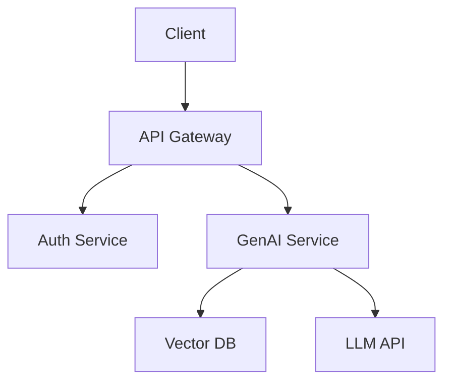
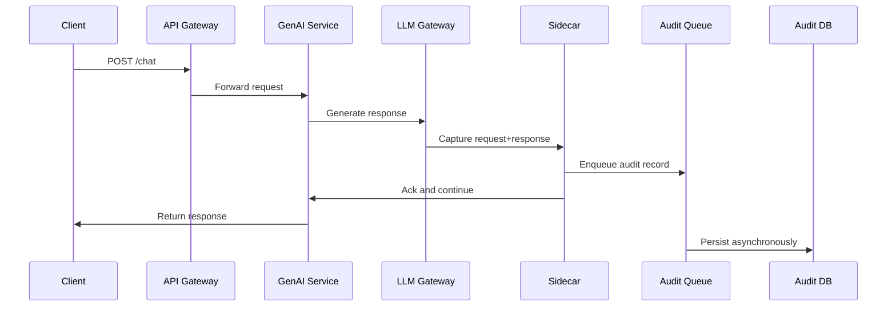

# Design Documents

> "If you can't write it down clearly, you don't understand it well enough. If you can't get agreement in writing, the team doesn't understand it well enough."

## Why Design Docs Matter in Banking GenAI

In a startup, you can build first and figure out the architecture later. In banking GenAI:

- A poorly designed RAG pipeline can expose customer data to unauthorized users
- An architecture without clear interfaces becomes impossible to audit
- Undocumented design decisions become "tribal knowledge" that vanishes when people leave
- Compliance teams require documented designs for regulatory approval

**Design docs are not bureaucracy. They are the blueprint before the build.**

## When to Write a Design Doc

Write a design doc when:

| Situation | Why |
|-----------|-----|
| Building a new service | Others need to understand the architecture before you build it |
| Changing an existing system's architecture | Impact analysis is needed before changes |
| Adopting a new technology | The team needs to evaluate trade-offs |
| Cross-team integration | Multiple teams need to align on interfaces |
| Solving a complex problem | The solution space is large and needs exploration |
| Regulatory or security-significant change | Compliance needs documented evidence |

**Don't write a design doc for:** Bug fixes, small refactors, configuration changes, UI tweaks.

**Rule of thumb:** If the change will take more than 3 days of engineering effort, or affects multiple systems, write a design doc.

## Design Doc Lifecycle

```
Draft (Author)
    │
    ▼
Internal Review (Team)
    │
    ├─── Feedback incorporated or rejected with rationale
    │
    ▼
Cross-Team Review (Affected Teams)
    │
    ├─── Security review (if applicable)
    ├─── Compliance review (if applicable)
    ├─── Platform review (if applicable)
    │
    ▼
Decision (Approve / Revise / Reject)
    │
    ├─── Approved → Implementation begins
    ├─── Revise → Return to draft with feedback
    └─── Reject → Document the rationale for future reference
    │
    ▼
Implementation
    │
    └─── Design doc is updated if implementation diverges
    │
    ▼
Post-Implementation Review (optional)
    │
    └─── Did the design achieve its goals?
```

## Design Doc Template

```markdown
# Design Doc: [Title]

| Field | Value |
|-------|-------|
| **Author** | [Name, team] |
| **Reviewers** | [Names, teams] |
| **Status** | Draft / In Review / Approved / Rejected / Superseded |
| **Created** | [Date] |
| **Updated** | [Date] |
| **Jira/Confluence** | [Link] |

## 1. Problem Statement

What problem are we solving? Who is affected? Why now?

[2-3 paragraphs. No solution discussion yet.]

## 2. Goals and Non-Goals

### Goals
- [Specific, measurable outcomes]
- [What success looks like]

### Non-Goals
- [What we're explicitly NOT doing]
- [Out of scope items]

## 3. Context

### Current State
How does the system work today? What are its limitations?

[Include architecture diagram if applicable.]

### Constraints
- Regulatory: [Any compliance requirements]
- Security: [Any security requirements]
- Technical: [Existing systems we must integrate with]
- Timeline: [Any deadline constraints]
- Budget: [Any resource constraints]

## 4. Proposed Solution

### Architecture Overview
[High-level description with architecture diagram]



### Components

#### Component 1: [Name]
- **Purpose:** What it does
- **Technology:** What it's built with
- **Interfaces:** How other components interact with it
- **Data model:** Key data structures
- **Error handling:** How it fails

#### Component 2: [Name]
[same structure]

### Data Flow
Describe the key data flows through the system.

### API Contracts
Key API endpoints (or link to OpenAPI spec).

## 5. Alternatives Considered

### Alternative 1: [Description]
- **Pros:** [...]
- **Cons:** [...]
- **Why not chosen:** [...]

### Alternative 2: [Description]
[same structure]

## 6. Trade-offs

| Decision | Trade-off | Rationale |
|----------|-----------|-----------|
| [Decision 1] | [What we gain vs. what we lose] | [Why this is acceptable] |

## 7. Security Considerations

- Authentication/authorization approach
- Data protection (at rest, in transit, in use)
- Threat model summary
- PII handling
- Audit logging

## 8. Compliance Considerations

- Regulatory requirements addressed
- Audit trail design
- Data retention policy
- Right to erasure support (GDPR)

## 9. Operational Considerations

### Monitoring
- Key metrics
- Alerting thresholds
- Dashboard requirements

### Deployment
- Rollout strategy
- Feature flags
- Rollback plan

### Scalability
- Expected load
- Scaling strategy
- Bottlenecks and mitigation

## 10. Migration Plan

If changing an existing system:
- Phase 1: [What, when]
- Phase 2: [What, when]
- Phase 3: [What, when]
- Rollback strategy at each phase

## 11. Timeline and Milestones

| Milestone | Target Date | Dependencies |
|-----------|-------------|-------------|
| Design approved | [Date] | — |
| Phase 1 complete | [Date] | [Dependencies] |
| Phase 2 complete | [Date] | [Dependencies] |
| Production launch | [Date] | [Dependencies] |

## 12. Open Questions

- [ ] [Question that needs resolution]
- [ ] [Question assigned to person]

## 13. Appendix

- Links to related design docs
- Links to prototypes or proofs of concept
- Links to relevant research or papers
- Glossary of terms
```

## Real Example: GenAI Audit Logging System

Here's an excerpt from an actual design doc:

```markdown
## 4. Proposed Solution (excerpt)

### Architecture Overview

We propose a sidecar-based audit logging pattern where every GenAI
service request/response is captured by an audit sidecar before
being sent to the response handler.



### Why Sidecar Instead of In-Process?

| Aspect | In-Process | Sidecar |
|--------|-----------|---------|
| Latency impact | Adds to request latency | Async, no impact |
| Failure isolation | Audit failure blocks request | Audit failure doesn't block |
| Technology flexibility | Tied to service language | Can use any language |
| Operational complexity | Lower | Higher (more pods) |

**Decision:** Sidecar, because audit logging must never block the
user-facing request, even if the audit system is degraded.

### Audit Record Schema

```json
{
  "audit_id": "uuid",
  "timestamp": "ISO8601",
  "service": "genai-chat-v2",
  "user_id": "redacted-hashed",
  "prompt_hash": "sha256-of-redacted-prompt",
  "prompt_length": 1234,
  "model": "gpt-4-turbo-2024-04-09",
  "model_version": "v2.1.0",
  "response_length": 567,
  "response_content_filtered": true,
  "latency_ms": 342,
  "tokens_used": {"prompt": 120, "completion": 89},
  "pii_detected": false,
  "injection_score": 0.02,
  "compliance_flags": [],
  "retention_days": 2555
}
```

Note: We store the prompt hash, not the prompt itself, for
privacy. The full prompt is available in the secure audit vault
for compliance investigations with proper authorization.
```

## Review Process

### Stage 1: Internal Review (1-3 days)

- Share with immediate team
- Team provides feedback in comments
- Author revises
- Goal: Catch obvious issues before wider review

### Stage 2: Cross-Team Review (3-5 days)

- Share with affected teams
- Security review (mandatory for any system handling user data)
- Compliance review (mandatory for any system in regulatory scope)
- Platform review (mandatory for any system requiring infrastructure)
- Goal: Get all stakeholders aligned

### Stage 3: Decision (1-2 days)

- Reviewers indicate: Approve / Approve with comments / Needs revision / Reject
- Decision is recorded in the doc header
- If approved, implementation can begin
- If revised, author addresses feedback and re-submits

### Review Comment Etiquette

Same as code review comments:
- Be specific and constructive
- Distinguish between blocking and non-blocking concerns
- Provide alternatives, not just criticism
- Focus on the design, not the designer

## Common Design Doc Mistakes

| Mistake | What It Looks Like | Better Approach |
|---------|-------------------|-----------------|
| **Solution-first** | Starts with the chosen solution, works backward | Start with the problem, explore alternatives |
| **No non-goals** | Everything is in scope | Explicitly state what's out of scope |
| **No alternatives** | Only one option presented | Show 2-3 alternatives with honest trade-offs |
| **Ignoring constraints** | No mention of regulatory/security needs | Every banking design doc must address these |
| **Vague timeline** | "We'll build it over the next few months" | Specific milestones with dates |
| **No operational plan** | Design stops at "it works" | Include monitoring, deployment, rollback |
| **Write and forget** | Approved doc never referenced again | Update during implementation if design changes |

## Design Docs and ADRs

Design docs and Architecture Decision Records (ADRs) are related but different:

| Aspect | Design Doc | ADR |
|--------|-----------|-----|
| **Scope** | Full system design | Single decision |
| **Length** | 5-15 pages | 1-2 pages |
| **When** | Before building | When a key decision is made |
| **Audience** | Review team, stakeholders | Future engineers |
| **Relationship** | May produce multiple ADRs | May reference a design doc |

**Example:** A design doc for a new RAG system might produce ADRs for:
- ADR-142: Use pgvector over Pinecone for embeddings storage
- ADR-143: Use sidecar pattern for audit logging
- ADR-144: Implement circuit breaker for LLM API calls

## Making Design Docs Accessible

Design docs are often the bottleneck in delivery. Here's how to keep them lightweight:

1. **Use the template.** Don't write from scratch.
2. **Diagrams over text.** A good Mermaid diagram replaces 3 paragraphs.
3. **Link, don't repeat.** Reference existing docs instead of copying content.
4. **Progressive disclosure.** High-level overview first, details in appendix.
5. **Time-box the review.** A design doc that takes 3 weeks to approve is worse than a good-enough doc approved in 1 week.

## Cross-References

- `engineering-culture/rfcs.md` — RFC process (lighter-weight than design docs)
- `architecture/adr-template.md` — ADR template for specific decisions
- `templates/architecture-review-template.md` — How to review a design doc
- `templates/design-doc-example.md` — Filled design doc example
- `leadership-and-collaboration/building-alignment.md` — Getting teams aligned on design decisions
