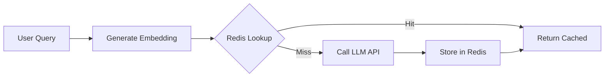

# RFCs (Request for Comments)

> "An RFC is a lightweight proposal that gathers feedback before significant work begins. It's cheaper to change your mind on paper than in code."

## RFCs vs. Design Docs

RF Cs are lighter-weight than design docs. Use the right tool:

| Aspect | RFC | Design Doc |
|--------|-----|-----------|
| **Purpose** | Explore an idea, gather feedback | Document a finalized design |
| **Commitment** | No commitment to implement | Commitment to implement |
| **Length** | 1-3 pages | 5-15 pages |
| **Review** | Discussion and feedback | Formal approval process |
| **Outcome** | Decision to proceed, revise, or abandon | Approved design ready for implementation |
| **When** | Early in thinking | After thinking is crystallized |

**Use an RFC when:** You're not sure if this is the right approach and want the team's input before investing in a full design doc.

**Use a design doc when:** You've decided to build something and need the team to agree on how.

## RFC Lifecycle

```
Idea
  │
  ▼
Draft RFC (Author writes 1-3 pages)
  │
  ▼
Publish to team (GitHub Discussion / Confluence)
  │
  ▼
Discussion Period (3-5 business days)
  │
  ├─── Comments, questions, concerns from team
  ├─── Author responds, updates RFC
  │
  ▼
Decision Point
  ├─── Accept: Move to design doc or implementation
  ├─── Revise: Address feedback, re-publish
  └─── Decline: Document the learning, move on
  │
  ▼
Status: Accepted / Declined / Superseded
```

## RFC Template

```markdown
# RFC-[Number]: [Title]

| Field | Value |
|-------|-------|
| **Author** | [Name, team] |
| **Status** | Draft / In Discussion / Accepted / Declined / Superseded |
| **Created** | [Date] |
| **Discussion Link** | [GitHub/Confluence link] |

## Summary

[One paragraph: What are you proposing and why?]

## Problem

[What problem are you trying to solve? Who experiences this problem?
How do they currently work around it?]

## Proposed Change

[What are you proposing? Be specific but concise.
Include diagrams if they help.]

## Alternatives Considered

[What other approaches did you consider? Why are you not
proposing them?]

## Impact Analysis

### Who is affected?
- [Teams, systems, users]

### What changes?
- [Behavior, interfaces, processes]

### What stays the same?
- [What this does NOT change]

### Risks
- [What could go wrong?]

### Migration
- [How do we transition from current state?]

## Open Questions

- [ ] [Question 1]
- [ ] [Question 2]

## Decision Criteria

[How will we know if this RFC is a good idea? What metrics or
signals will indicate success?]

## Timeline

[If accepted, when would this happen? What are the key milestones?]
```

## Example: RFC for Prompt Caching

```markdown
# RFC-047: Implement Prompt Response Caching for Common Queries

| Field | Value |
|-------|-------|
| **Author** | Sarah Chen, GenAI Platform |
| **Status** | Accepted |
| **Created** | 2026-03-15 |
| **Discussion Link** | github.com/org/repo/discussions/47 |

## Summary

We propose implementing a Redis-based cache for frequently-asked
questions to the GenAI assistant, reducing LLM API costs by an
estimated 15-25% and improving p50 latency from 1.2s to 50ms for
cached responses.

## Problem

Our GenAI assistant processes ~50K queries per day. Analysis of
query logs shows that 22% of queries are semantically similar to
queries we've already answered (e.g., "What's the expense report
policy?" asked by hundreds of employees).

Each uncached query costs $0.003-0.015 in LLM API fees and takes
800ms-2s. Caching common responses would:
- Reduce monthly LLM costs by $8K-15K
- Improve response times for common queries from 1.2s to <50ms
- Reduce load on the LLM API during peak hours

Currently, there is no caching. Every query, even identical
repetitions, calls the LLM API.

## Proposed Change

Implement a semantic similarity-based cache using Redis:

1. On incoming query, generate embedding (using our existing
   embedding model, no additional cost)
2. Query Redis for cached responses with cosine similarity > 0.95
3. If cache hit, return cached response
4. If cache miss, call LLM API, store response in Redis with 7-day TTL



Cache key: Embedding vector (quantized to 256 dimensions)
Cache value: Response text + metadata (model version, timestamp)
TTL: 7 days (responses may become stale as policies change)

## Alternatives Considered

### Exact-match cache (hash-based)
- **Pros:** Simpler implementation
- **Cons:** Only catches identical queries, misses paraphrases
- **Rejected because:** Semantic similarity catches 3x more cacheable queries

### LLM-based deduplication
- **Pros:** More accurate similarity detection
- **Cons:** Adds LLM call for every query (defeats the purpose)
- **Rejected because:** Cost and latency overhead

## Impact Analysis

### Who is affected?
- GenAI Platform team (implementation)
- All assistant users (transparent, faster responses)
- Security team (new Redis dependency)

### What changes?
- Response path includes cache lookup (adds 5-10ms for cache miss)
- Redis cluster added to GenAI platform infrastructure
- Cache hit/miss metrics added to dashboard

### What stays the same?
- LLM API call for uncached queries
- Audit logging (cache hits are also logged)
- Content filtering (cached responses were already filtered)

### Risks
- Stale cached responses if policies change (mitigated by 7-day TTL)
- Cache serving incorrect response for sensitive queries (mitigated by high similarity threshold)
- Additional Redis operational overhead (mitigated by using existing Redis cluster)

### Migration
1. Deploy Redis cache alongside existing flow (no change to current behavior)
2. Enable cache in "shadow mode" (check cache but always call LLM, compare responses)
3. After 1 week validation, enable cache for production
4. Roll back to full LLM calls if any issues detected

## Open Questions

- [ ] Should we implement manual cache invalidation for policy updates?
- [ ] What similarity threshold is appropriate for compliance-sensitive queries?
- [ ] Do we need different TTLs for different document categories?

## Decision Criteria

- Cache hit rate > 15% after 30 days
- No increase in user-reported incorrect responses
- P50 latency improvement for cached queries
- No security or compliance concerns from review

## Timeline

- Week 1: Implementation
- Week 2: Shadow mode testing
- Week 3: Production rollout (10% → 50% → 100%)
- Week 4: Review metrics and adjust
```

## RFC Discussion Process

### Publishing

1. Create the RFC document using the template
2. Post a link in the team's discussion channel with a brief summary
3. Tag relevant stakeholders (security, compliance, platform as applicable)
4. Set a discussion deadline (default: 5 business days)

### Discussion

- Comments happen in the discussion thread, not in DMs
- Authors are expected to respond to every comment
- Disagreements should be resolved through discussion, not escalation
- If consensus isn't reached, escalate to tech lead for decision

### Decision

The decision-maker depends on the RFC's scope:

| RFC Scope | Decision Maker |
|-----------|---------------|
| Team-internal | Tech lead |
| Cross-team | Engineering manager |
| Security-significant | Security lead + tech lead |
| Compliance-significant | Compliance lead + engineering manager |
| Platform-wide | Principal engineer |

### After Decision

- **Accepted:** Update status, link to design doc or implementation ticket
- **Declined:** Update status with rationale, archive the RFC
- **Superseded:** Link to the superseding RFC or design doc

## RFC Best Practices

### Writing Good RFCs

1. **Lead with the problem, not the solution.** If people don't agree there's a problem, they won't care about your solution.
2. **Be concise.** If your RFC is more than 3 pages, it's probably a design doc.
3. **Acknowledge trade-offs honestly.** Don't present your solution as obviously correct.
4. **Include impact analysis.** Who needs to change their behavior?
5. **Propose a timeline.** "Sometime" is not a timeline.

### Running Good RFC Discussions

1. **Set a deadline.** Open-ended discussions never conclude.
2. **Respond to every comment.** Even if it's "Good point, I'll add that."
3. **Summarize disagreements.** "The disagreement is about X. Here are the two positions."
4. **Know when to decide.** After 5 business days, make a call even if not everyone agrees.
5. **Document the decision.** A concluded RFC with no decision is worse than no RFC.

## Anti-Patterns

| Anti-Pattern | What It Looks Like | Why It's Bad |
|--------------|-------------------|--------------|
| **Surprise RFC** | Published Friday, decision expected Monday | No time for thoughtful review |
| **Done deal** | RFC written as if decision is already made | Discourages genuine feedback |
| **Analysis paralysis** | 47 comments, no decision | RFCs are decision tools, not debates |
| **RFC graveyard** | Dozens of RFCs, none decided | Wastes everyone's time |
| **Bypassing the process** | "It's just a small change, no RFC needed" | Small changes can have large impacts |
| **Vague problem statement** | "We should use technology X" without explaining why | No basis for evaluation |

## RFC Metrics

Track the health of your RFC process:

| Metric | Target | Why |
|--------|--------|-----|
| RFC completion rate | > 75% reach a decision | RFCs should conclude, not drift |
| Average discussion time | < 10 business days | Faster is better, within reason |
| Acceptance rate | 40-70% | Too high = rubber stamp, too low = discourages proposals |
| Author satisfaction | > 4/5 | Is the process useful? |
| Reviewer satisfaction | > 3.5/5 | Is the process worth participating in? |

## Cross-References

- `engineering-culture/design-docs.md` — Full design document process
- `architecture/adr-template.md` — ADR template for specific decisions
- `engineering-culture/async-communication.md` — Async-first decision making
- `templates/rfc-template.md` — Reusable RFC template
- `leadership-and-collaboration/building-alignment.md` — Getting team alignment on decisions
