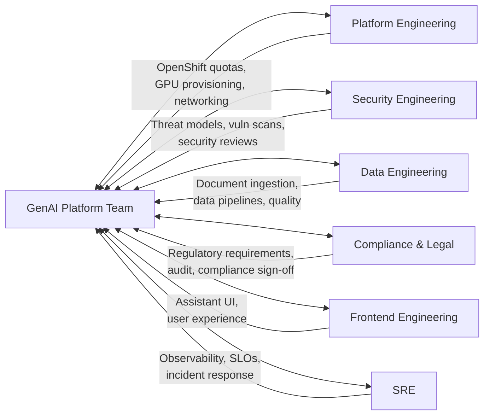

# Collaborative Engineering

> **Cross-team collaboration, helping blocked peers, knowledge sharing.**
> **Audience:** All engineers on the GenAI Platform team
> **Owner:** Engineering Leadership

---

## Core Principle

**No engineer is an island. No platform is built by one team.**

The GenAI Platform does not exist in a vacuum. It depends on:

- **Platform Engineering** for OpenShift, networking, and compute resources
- **Security Engineering** for threat models, vulnerability scans, and compliance reviews
- **Data Engineering** for document ingestion, classification, and pipeline management
- **Compliance and Legal** for regulatory interpretation and audit requirements
- **Frontend Engineering** for the assistant user interface
- **SRE** for observability, incident response, and reliability engineering
- **Infrastructure** for GPU provisioning, database management, and secrets handling
- **Product and Business Units** for requirements, prioritization, and user feedback

Your ability to collaborate across these groups is as important as your ability to write code. An engineer who ships alone is an engineer who ships the wrong thing, breaks something they did not know about, or builds something nobody will operate.

---

## Cross-Team Collaboration

### The Collaboration Spectrum

```
Level 0: Awareness
  "I know that team exists and what they do."

Level 1: Communication
  "I have contacted them about a dependency or shared concern."

Level 2: Coordination
  "We have aligned on timelines, interfaces, and expectations."

Level 3: Collaboration
  "We are working together on a shared deliverable."

Level 4: Partnership
  "We jointly own a system and share responsibility for its success."
```

Most cross-team interactions should be at Level 2 or above. Level 0 and 1 are how incidents happen.

### The Cross-Team Engagement Model



### Cross-Team Engagement Rules

```
Before engaging with another team:

1. Do your homework.
   - Check their docs, runbooks, and existing tickets.
   - Formulate a specific question or request.
   - "Can you help us with AI?" is not a valid request.
   - "We need 4 GPU pods for the genai-compliance namespace by Friday.
     Here is the business case and the JIRA ticket." is a valid request.

2. Use the right channel.
   - Routine requests: JIRA ticket with clear description.
   - Urgent requests: Direct message to team lead + ticket reference.
   - Complex discussions: Schedule a meeting with an agenda sent in advance.
   - Emergencies: Page the on-call, then follow up with context.

3. Respect their priorities.
   - Your "urgent" is their "interruption."
   - Provide context on why this matters to the business.
   - Be prepared for "not this sprint" and have a contingency.

4. Follow up in writing.
   - Verbal agreements are not agreements until documented.
   - Send a summary email or ticket comment after meetings.
   - "As discussed, Team X will deliver Y by Z date."
```

### Real Story: The Cross-Team Misalignment

> **Situation (Q1 2025):** The GenAI Platform team was building a multi-tenant RAG system. The design required namespace-level isolation on OpenShift. The platform team (who manages OpenShift) was not engaged until 6 weeks into the project.
>
> **What happened:** When the platform team was finally consulted, they revealed:
> - Namespace provisioning required a change to their OpenShift Operator
> - The change was not on their roadmap
> - Their next available sprint slot was 8 weeks away
> - The GenAI team's Q3 deadline was now impossible
>
> **The fix:** An emergency alignment meeting with both team leads, the engineering director, and the product owner. The platform team reprioritized, but the GenAI team had to reduce scope (fewer tenants in the initial release).
>
> **Cost of late engagement:** 6 weeks of GenAI team work on a design that assumed infrastructure capabilities that did not exist. An additional 8 weeks of platform team work that was not planned.
>
> **Total cost:** 14 weeks of delayed delivery.
>
> **Lesson:** Engage dependent teams on Day 1, not when you need their deliverable.

---

## Helping Peers When Blocked

### The Philosophy

When a peer is blocked, helping them is not an interruption of your work. It is an **investment in the team's throughput.**

```
The Math of Helping:

Your time invested: 45 minutes
Peer's time saved: 4 hours
Net team gain: 3.25 hours

If you help 2 peers per week:
Your time invested: 1.5 hours/week
Team time saved: 6.5 hours/week
Annual team time saved: ~260 hours (6.5 weeks of engineering)

This is the highest-ROI activity you can do as a team member.
```

### How to Help Effectively

```
Step 1 — Understand the block (5 min)
  "Tell me what you are trying to do, what you have tried, and where
   you are stuck."

Step 2 — Diagnose, do not solve (15 min)
  Ask guiding questions:
  - "What error are you seeing?"
  - "What did you expect to happen?"
  - "Have you checked the runbook?"
  - "What does the log say at that point?"
  Lead them to the answer. Do not take the keyboard.

Step 3 — Solve together (15 min)
  If they cannot get there on their own, pair on the solution.
  Share your screen. Explain your reasoning as you go.

Step 4 — Document the learning (10 min)
  "Was there a gap in the docs? Let us fix it now."
  "Was the error message unclear? Let me file a ticket."
  "Would a runbook entry have prevented this? Let me write one."

Step 5 — Follow up (next day)
  "Did it work out? Any further issues?"
  This takes 30 seconds and builds trust.
```

### What NOT to Do

```
The Takeover:
  "Give me the keyboard." -> You solved it, they learned nothing.
  Next time they are blocked, they will come to you again.
  You have created a dependency, not an empowered peer.

The Dismissal:
  "Just read the docs." -> The docs might be wrong, incomplete, or unclear.
  If the docs were good, they would not be blocked.
  Help them, then fix the docs.

The Time Sink:
  Spending 4 hours on a problem that should take 30 minutes.
  If you cannot unblock them in 30 minutes, escalate to Level 3.
  Involve the team lead or the system owner.

The Silent Helper:
  Helping someone but not documenting the fix.
  The next person will hit the same block and need the same help.
  Fix the systemic issue, not just the individual instance.
```

### Real Story: The Multiplier Effect

> **Situation:** Three engineers in one month independently struggled with the same issue: connecting to the guardrails service from a new namespace. The error message was "connection refused" with no guidance on the cause (missing network policy).
>
> **What happened the first time:** An engineer (David) helped his peer (Ana) debug it. It took 40 minutes. They discovered a missing network policy. David fixed it.
>
> **What happened the second time:** A different engineer (Ravi) hit the same issue. David helped again. Same 40 minutes. Same root cause.
>
> **What David did after the second time:**
> 1. Wrote a runbook entry: "Connecting to Guardrails from a New Namespace"
> 2. Filed a ticket to improve the error message (PROJ-5021)
> 3. Posted in the team channel: "If you get 'connection refused' from
>    guardrails, check the network policy. See runbook entry X."
>
> **What happened the third time:** The third engineer (Lisa) read the runbook entry, added the network policy, and was unblocked in 5 minutes without anyone's help.
>
> **Total time invested by David:** ~50 minutes (40 + 10 for docs).
> **Total time saved:** 40 minutes (the third incident avoided) + all future incidents.
> **This is what the multiplier effect looks like in practice.**

---

## Offering and Receiving Constructive Code Reviews

Code review is the most frequent form of engineering collaboration. It is also the most common source of interpersonal friction.

### The Purpose of Code Review

```
Code review exists for:

1. Quality assurance — catching bugs, security issues, and design problems.
2. Knowledge sharing — ensuring multiple people understand the code.
3. Standards enforcement — maintaining consistency across the codebase.
4. Mentoring — helping less experienced engineers grow.

Code review does NOT exist for:

1. Proving you are smarter than the author.
2. Enforcing personal style preferences.
3. Gatekeeping or power dynamics.
4. Delaying deployment.
```

### How to Offer Constructive Review Feedback

#### The Review Framework

```
For every comment, follow this structure:

1. Observation: What you see in the code.
2. Concern: Why it matters.
3. Suggestion (optional): What could be different.
4. Severity: Blocking or non-blocking.

Example:

  "I see that the database migration drops the user_preferences column
   (observation). This will delete existing user preference data for
   all 2,400 users, which will cause a support incident (concern).
   Consider adding a data migration step that preserves existing
   preferences (suggestion). This is a blocking concern — we cannot
   ship this migration without data preservation (severity)."
```

#### Tone Matters

```
Confrontational (bad):
  "This is wrong. You cannot just drop the column."

Condescending (bad):
  "Anyone with database experience would know this is a bad idea."

Curious and constructive (good):
  "I noticed this migration drops the user_preferences column. My concern
   is that this will delete existing data for all 2,400 users. Can you
   help me understand the reasoning? I would suggest a data migration
   step to preserve existing preferences."

The difference: The first two put the author on the defensive. The third
invites a conversation and assumes good intent.
```

#### The 5-Comment Rule

```
If you have more than 5 non-blocking "nit" comments, you are being
a nitpicker, not a reviewer.

Strategy:
- Group nits into a single comment: "A few style nits: [list]"
- Ask yourself: "Is this important enough to delay the PR?"
- If not, fix it yourself in a follow-up PR.

Authors tune out reviewers who consistently leave excessive nits.
Save your review capital for the comments that matter.
```

### How to Receive Constructive Review Feedback

#### The Response Protocol

```
For every review comment:

1. Read it fully. Do not skim.
2. Respond to every comment, even if just "Done" or "Good point."
3. If you agree: make the change and say "Done."
4. If you disagree: explain your reasoning respectfully.
   "I considered that approach. The reason I went with this one is [X].
    I agree your approach is cleaner, but it would require refactoring
    the dependency injection setup. Happy to discuss whether the tradeoff
    is worth it."
5. If you are unsure: ask for clarification.
   "I am not sure I follow the concern here. Can you elaborate?"
6. Thank your reviewer when they are done.
   "Thanks for the thorough review. This is much better now."
```

#### Handling Difficult Reviews

```
Scenario: A reviewer is being confrontational or condescending.

Bad response:
  "Well, maybe if you had written docs, I would have known that."
  (Escalates the conflict.)

Good response:
  "I understand the concern. I was not aware of the network policy
   requirement because I could not find it documented. I have added
   it now and filed a ticket to improve the documentation. Thanks
   for catching this."
  (Acknowledges the substance, ignores the tone, moves forward.)

Over time, consistent professionalism from your side will raise the
bar for the whole team. If a reviewer is consistently toxic, that is
an engineering manager conversation, not a code review conversation.
```

---

## Sharing Knowledge

### The Knowledge Responsibility Matrix

```
Knowledge Type | Storage Method | Owner | Update Trigger
───────────────|────────────────|───────|──────────────
Architecture   | Design docs,   | Tech  | When architecture
               | ADRs, diagrams | Lead  | changes
Operational    | Runbooks,      | On-   | After every
               | playbooks      | call  | incident
               |                | lead  | or system change
Code-level     | Code comments, | Code  | When the "why"
               | PR descriptions| author| is non-obvious
Team process   | Team wiki,     | Eng   | When process
               | READMEs        | Mgr   | changes
Discoveries    | Team channel,  | Any-  | When something
               | tech talks     | one   | useful is learned
```

### The Tech Talk Program

```
Monthly tech talks are a team tradition. Rules:

- 30-45 minutes, recorded, shared with the broader engineering org.
- Topics can be technical (architecture deep-dive) or cultural
  (how to give good code reviews).
- Anyone can propose a topic. Rotate speakers.
- No slides required. Live demos and code walkthroughs are encouraged.

Past tech talks that had high impact:
- "How the Prompt Injection Detection System Works" (Meera)
- "Building and Running GPU Workloads on OpenShift" (David)
- "The Compliance Document Retrieval Pipeline: A Walkthrough" (Ana)
- "How to Write a Design Doc That Actually Gets Read" (Rahul)
```

### The Pair Debugging Practice

```
When something breaks in production and nobody knows why:

1. Grab the most relevant subject matter expert.
2. Share screen.
3. Walk through the system together, component by component.
4. The SME explains what each component does and how it should behave.
5. The investigator compares actual behavior to expected behavior.
6. Together, they narrow down the discrepancy.

This is both an debugging technique AND a knowledge transfer mechanism.
The next time the investigator sees a similar issue, they will have
the SME's mental model in their head.
```

---

## How Senior Engineers Influence Teams Without Formal Authority

### The Influence Without Authority Model

Senior, Staff, and Principal engineers rarely have direct reports. Their impact comes from **influence, not authority**.

```
Influence Mechanisms:

1. Technical credibility
   → Your past decisions and implementations earn trust.
   → When you propose a direction, people listen because you have
     a track record of good calls.

2. Information advantage
   → You read more code, talk to more teams, and understand more
     context than anyone else.
   → You connect dots that others cannot see.

3. Facilitation
   → You bring the right people together for the right conversation.
   → You write the design doc that becomes the decision framework.
   → You ask the question that reframes the debate.

4. Mentorship
   → You grow the engineers around you.
   → Your mentees become senior engineers who amplify your impact.

5. Leading by example
   → You write the design docs you want to see.
   → You give the thorough code reviews you expect from others.
   → You are the first to help when someone is blocked.
   → People follow your behavior, not your directives.
```

### Real Story: The Engineer Who Changed the Team's Direction

> **Situation (Q4 2024):** The GenAI Platform team was heading in a direction that a Staff Engineer (Carlos) believed was wrong. The plan was to build a custom orchestration layer for LLM interactions. Carlos believed this was unnecessary complexity — an existing open-source framework would serve better.
>
> **Carlos did NOT:**
> - Tell the team they were wrong (no authority).
> - Complain to the engineering manager (not productive).
> - Refuse to work on the custom layer (not collaborative).
>
> **Carlos DID:**
> 1. Spent 2 days building a prototype with the open-source framework.
> 2. Wrote a comparison document: custom vs. open-source, with data.
> 3. Presented the prototype in a team meeting (not a sales pitch — a demo).
> 4. Acknowledged the gaps in the open-source framework honestly.
> 5. Proposed a hybrid: start with open-source, build custom components
>    only where open-source fell short.
> 6. Offered to own the open-source integration as his next project.
>
> **Result:** The team adopted the hybrid approach. The open-source framework
> covered 80% of requirements. The 20% custom work was built incrementally
> as needed. The estimated 12-week custom build was reduced to a 3-week
> integration + incremental custom work.
>
> **Carlos changed the team's technical direction without authority.**
> He did it with prototypes, data, honest tradeoff analysis, and a
> willingness to do the work himself.

### Influence Anti-Patterns

```
The Dictator:
  "We are going to use X because I say so."
  (You are not a manager. This does not work.)

The Obstructionist:
  "I will not work on Y because it is the wrong approach."
  (This is insubordination. Raise concerns, do not refuse work.)

The Know-It-All:
  Correcting every minor mistake, dominating every meeting.
  (People stop listening to you. You become background noise.)

The Ghost:
  Brilliant but silent. Never shares opinions, never volunteers.
  (Your brilliance does not help the team if it stays in your head.)
```

---

## Cross-References

- **Clear Communication** (`clear-communication.md`) — How to write design docs, status updates, and escalations that enable collaboration.
- **Ownership and Accountability** (`ownership-and-accountability.md`) — Helping blocked peers is ownership beyond your boundary.
- **Engineering Craftsmanship** (`engineering-craftsmanship.md`) — Offering and receiving constructive code reviews.
- **Engineering in Large Organisations** (`engineering-in-large-organisations.md`) — Navigating bureaucracy and building alignment across teams.
- **Leadership and Collaboration** (leadership-and-collaboration/ folder) — Broader influence and teamwork patterns.

---

## Interview Preparation

### Questions You Might Be Asked

1. **"Tell me about a time you collaborated with another team to deliver something."**
   - Use the multi-tenant RAG story (the misalignment and the fix).

2. **"Tell me about a time you helped an unblock a peer."**
   - Use the multiplier effect story (David and the guardrails network policy).

3. **"How do you handle disagreement on a technical approach?"**
   - Use Carlos's story. Prototype, compare, propose, own the work.

4. **"Describe a time you influenced a team's direction without formal authority."**
   - Carlos's story is perfect here. Show the influence mechanisms.

5. **"How do you share knowledge with your team?"**
   - Discuss runbooks, tech talks, pair debugging, bus factor.

### STAR Story: Cross-Team Collaboration

```
Situation:  "We were building a multi-tenant RAG system and discovered
             6 weeks in that the platform team's OpenShift capabilities
             did not support our design. Their timeline was 8 weeks out."

Task:       "Align both teams, adjust scope, and deliver as much as
             possible within the Q3 deadline."

Action:     "I organized an emergency alignment meeting with both team
             leads and the engineering director. I presented a reduced-scope
             plan that delivered 4 of 8 tenants in Q3, with the remaining
             4 following the platform team's timeline. I updated the design
             doc, re-planned the sprint, and communicated the change to
             compliance stakeholders proactively."

Result:     "Q3 deadline was met with 4 tenants. The remaining 4 were
             delivered on the platform team's timeline. Both teams were
             aligned. We instituted a 'Day 1 dependency check' rule to
             prevent this from happening again."
```

---

## Summary

1. **Collaboration is a force multiplier.** No platform is built by one team.
2. **Engage dependent teams on Day 1.** Not when you need their deliverable.
3. **Helping blocked peers is the highest-ROI activity.** The math is clear.
4. **Code reviews are collaborative, not adversarial.** Review the code, not the engineer.
5. **Knowledge sharing reduces team risk.** Bus factor >= 3 for every system.
6. **Influence without authority is earned through credibility, action, and facilitation.**
7. **Fix the systemic issue, not just the individual instance.** Document, improve errors, update runbooks.

> "The best engineers are not the ones who can solve every problem alone.
> They are the ones who make everyone around them better."
