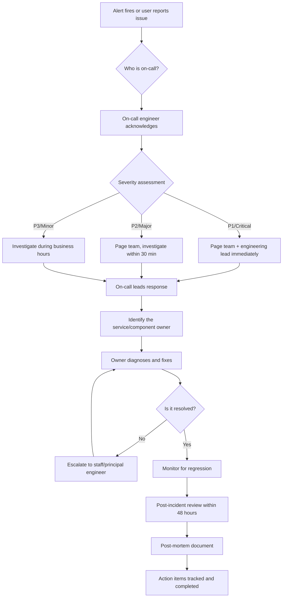

# Ownership and Accountability

> **End-to-end ownership. Production responsibility. Incident ownership.**
> **Audience:** All engineers on the GenAI Platform team
> **Owner:** Engineering Leadership

---

## Core Principle

**If you build it, you own it. In production. At 2 AM. On a holiday.**

Ownership is not assigned. It is assumed. The difference between an engineer who waits for someone else to fix a production issue and an engineer who investigates, diagnoses, and resolves it is not seniority — it is **ownership mindset**.

In a global bank's GenAI platform, "somebody else's problem" is the most dangerous phrase in the engineering vocabulary. When the platform goes down, when a guardrail fails, when data is mishandled — users do not care whose "area" it is. They care that **the platform they depend on is broken**.

---

## End-to-End Ownership

### What It Means

End-to-end ownership means you are responsible for your work from conception through production operation:

```
What you own when you build a feature:

1. Design      — Architecture, tradeoffs, alternatives considered
2. Implementation — Code, tests, documentation
3. Review      — Addressing feedback, justifying decisions
4. Deployment  — Deployment process, rollback plan, monitoring setup
5. Operation   — On-call support, incident response, bug fixes
6. Evolution   — Performance improvements, feature enhancements, debt repayment
7. Retirement  — Migration plan when the feature is replaced
```

### The "Throw It Over the Wall" Anti-Pattern

```
Bad Ownership Flow:

Engineer A: "I built the RAG retriever. It works locally."
Engineer B: "Who deploys it?"
Engineer A: "The platform team?"
Platform:   "We do not have a runbook for this."
On-Call:    "It broke at 3 AM. I do not know how it works."
Result:     4-hour outage because nobody owned the full lifecycle.

Good Ownership Flow:

Engineer A: "I built the RAG retriever. Here is the deployment guide,
             the rollback procedure, the monitoring dashboard, and the
             runbook for common failure modes. I am on-call next week,
             so I will be the first responder if anything breaks."
Result:     Feature ships. When it does break (as all things do),
            the on-call engineer has a runbook and the owner is engaged.
```

### The You-Built-It-You-Run-It Model

Our platform follows the You-Built-It-You-Run-It model, adapted from Amazon and Netflix:

```
┌────────────────────────────────────────────────────────────────┐
│                    Ownership Lifecycle                         │
│                                                                │
│   Design ──► Build ──► Test ──► Deploy ──► Monitor            │
│     ▲                                          │               │
│     │                                          ▼               │
│   Retire ◄── Evolve ◄── Respond ◄── Alert ◄── Operate          │
│                                                                │
│   You own the entire cycle for what you build.                 │
└────────────────────────────────────────────────────────────────┘
```

This does not mean you are alone. It means you are **accountable**. The platform team provides infrastructure. The SRE team provides tooling. But **you** are the person who knows the system best, and **you** are responsible for making sure it runs.

---

## Production Responsibility

### The Production Readiness Checklist

Before any code reaches production, the owner must verify:

```markdown
## Production Readiness Checklist

### Code Health
- [ ] All tests passing (unit, integration, quality)
- [ ] Code review completed with at least 2 approvals
- [ ] No known bugs or edge cases unaddressed
- [ ] Technical debt tracked with repayment plan

### Observability
- [ ] Health check endpoint returns meaningful status
- [ ] Key metrics exposed (latency, error rate, throughput)
- [ ] Structured logging in place (no sensitive data in logs)
- [ ] Dashboard created or updated
- [ ] Alerts configured for critical failure modes

### Operational Readiness
- [ ] Runbook exists for common failure scenarios
- [ ] Rollback procedure documented and tested
- [ ] Deployment procedure documented
- [ ] On-call engineer briefed on the new service/feature
- [ ] Feature flag in place (if applicable)

### Security and Compliance
- [ ] Security review completed (if required)
- [ ] No secrets or credentials in code or configs
- [ ] Access controls verified (least privilege)
- [ ] Audit logging in place (if handling sensitive data)
- [ ] Data classification verified
```

### Real Story: The Deployment Without a Runbook

> **Situation (Q1 2025):** A new response caching layer was deployed to improve RAG pipeline latency. The engineer who built it went on vacation the next day.
>
> **What happened:** The cache started serving stale compliance policy documents. The old documents had been superseded by a new regulatory requirement. The cache had no TTL-based invalidation — only manual flush.
>
> **The incident:** At 11 PM, a compliance officer reported that the assistant was citing outdated regulations. The on-call engineer:
> - Could not find a runbook for the caching layer
> - Did not know how to flush the cache
> - Could not reach the engineer who built it (vacation)
> - Had to figure out the cache flush mechanism by reading the code
>
> **Resolution time:** 90 minutes to flush the cache and add a TTL-based invalidation.
>
> **Consequences:**
> - 90 minutes of compliance officers receiving incorrect regulatory information
> - Incident report required (Level 2 severity)
> - The engineer who built it was not blamed — but the missing runbook was cited as a contributing factor
>
> **Lesson:** Production readiness is not optional. A feature without a runbook is an incomplete feature. The owner is responsible for operational readiness, not just code correctness.

---

## Incident Ownership

### When Something Breaks, You Own It

There are three levels of incident ownership:

```
Level 1: You caused it.
→ You lead the response, fix it, and write the post-mortem.
→ This is non-negotiable.

Level 2: It is in your area, but you did not cause it.
→ You are the subject matter expert. You assist the on-call engineer.
→ You write the technical analysis section of the post-mortem.

Level 3: It is not your area, but you can help.
→ You help. Period.
→ "Not my area" is not an acceptable response during an active incident.
```

### The Incident Response Process



### The Post-Mortem Standard

Every Level 1 or Level 2 incident requires a post-mortem within 48 hours.

```markdown
## Post-Mortem Template

**Incident ID:** INC-2025-0842
**Date:** 2025-09-15
**Severity:** Level 2
**Duration:** 47 minutes
**Impact:** 12% of compliance queries returned stale policy documents

### Timeline
| Time | Event |
|------|-------|
| 23:12 | Cache began serving stale documents (root cause trigger) |
| 23:47 | User report received via support channel |
| 23:52 | On-call engineer acknowledged and began investigation |
| 00:15 | Root cause identified: no TTL-based cache invalidation |
| 00:28 | Cache flushed, fresh documents served |
| 00:34 | Verification complete, all queries returning current documents |

### Root Cause
The response caching layer had no TTL-based invalidation. When source
documents were updated, the cache continued serving stale content until
manual flush. The cache invalidation was only triggered by explicit
deployment, not by source data changes.

### Contributing Factors
- No runbook existed for the caching layer
- No alert was configured for cache staleness
- The deployment happened the day before the engineer went on vacation
- Source document updates have no notification mechanism to consumers

### Impact
- 47 minutes of stale compliance information served
- ~340 users affected (compliance officers querying the assistant)
- No regulatory action was taken based on stale information (verified)
- User satisfaction temporarily dropped from 4.2 to 3.8

### Action Items
| Item | Owner | Due Date | Status |
|------|-------|----------|--------|
| Add TTL-based cache invalidation (24h default) | [Owner] | 2025-09-22 | Done |
| Add cache staleness alert (> 24h old content) | [Owner] | 2025-09-22 | Done |
| Create runbook for caching layer operations | [Owner] | 2025-09-20 | Done |
| Implement source document change notification | [Owner] | 2025-10-01 | In Progress |
| Add vacation handoff checklist to team process | [Manager] | 2025-09-30 | Done |
```

### Blameless Post-Mortems

Our post-mortems are **blameless**. This does not mean there are no consequences. It means we focus on **systemic failures, not individual failures**.

```
Blameful:  "John deployed without a runbook. John should have known better."
Blameless: "The deployment process allowed a feature to go live without a
            runbook. We need to add a runbook check to the deployment gate."
```

The blameless approach is more productive because it reveals systemic issues:
- Why did the process allow deployment without a runbook?
- Why was there no automated check?
- Why did the cache have no TTL invalidation in the design?
- Why is vacation handoff not a formal process?

These are the questions that prevent future incidents.

---

## Accountability vs. Blame

### What Accountability Means

```
Accountability is:
- "I own this. I will fix it."
- "I missed something. Here is how I will prevent it next time."
- "The process failed. Here is how we improve it."
- Following through on commitments without being chased.

Accountability is NOT:
- Being punished for honest mistakes.
- Working 80-hour weeks to prove dedication.
- Taking blame for systemic failures.
- Silent suffering when you need help.
```

### The Accountability Contract

When you join the GenAI Platform team, you implicitly sign an accountability contract:

```
What the team owes you:
- Clear expectations and priorities
- The tools and infrastructure to succeed
- Support when things go wrong
- Blameless post-mortems focused on learning
- Career growth opportunities

What you owe the team:
- End-to-end ownership of your work
- Production readiness before deployment
- Incident participation when things break
- Honest communication about progress and blockers
- Post-mortem action item completion
```

---

## Real Story: Ownership in Action

### The Cross-Team Incident

> **Situation (Q3 2025):** The GenAI assistant started returning responses with corrupted citations (broken document links). The issue was traced to a document ingestion pipeline owned by the Data Engineering team, not the GenAI Platform team.
>
> **What happened:**
>
> Priya (GenAI Platform) noticed the alert. She could have filed a ticket with the Data Engineering team and waited. Instead:
>
> 1. She investigated the GenAI side first to rule out our platform as the cause.
> 2. She identified that the ingestion pipeline was producing malformed document IDs.
> 3. She contacted the Data Engineering on-call directly (not via ticket).
> 4. She helped them diagnose the issue (a schema migration had changed the ID format).
> 5. Together, they wrote a data repair script to fix the existing malformed IDs.
> 6. Priya stayed on the call until citations were working again (total: 2 hours).
> 7. She then coordinated the GenAI-side fix (adding validation for document ID format).
>
> **Why this matters:** Priya owned the **user experience**, not just her code. The user does not care which team owns the ingestion pipeline. They care that the assistant they depend on is broken. Priya acted like an owner of the platform, not just her service.
>
> **This is what end-to-end ownership looks like at the Staff level.**

---

## Helping Peers When Blocked

Ownership extends beyond your own work. When a peer is blocked, helping them unblock is a shared responsibility.

### The Blocking Pyramid

```
When a peer is blocked, escalate through these levels:

Level 1 — Self-Service (0-30 min):
  Peer has checked docs, runbooks, and existing code.
  They have a specific question.
  → Answer the question directly.

Level 2 — Pair Debugging (30 min - 2 hours):
  Peer has a problem they cannot solve alone.
  → Pair with them. Share screen. Debug together.
  → You are not solving it for them. You are solving it with them.

Level 3 — Escalation (2+ hours):
  The blocker is a systemic issue (infrastructure, dependency, process).
  → Engage the appropriate team or lead.
  → Create a ticket, assign an owner, set a deadline.
  → Follow up until resolved.
```

### Real Example: The Blocked Integration

> **Situation:** A new engineer, Carlos, was blocked integrating the guardrails service into a new RAG pipeline. The guardrails API documentation was outdated, and the service was returning unexpected errors.
>
> **What should NOT happen:**
> Carlos: "Hey, the guardrails API is broken."
> You: "Works for me. Check the docs."
> Carlos spends another 4 hours going in circles.
>
> **What DID happen:**
> You recognized this as a Level 2 block. You spent 45 minutes pairing
> with Carlos. You discovered the docs were missing a required header
> (`X-Guardrail-Version: v2`). The error message was unhelpful.
>
> You then:
> 1. Fixed the docs immediately (5-minute PR)
> 2. Filed a ticket to improve the error message (PROJ-5021)
> 3. Added the missing header to the integration test suite
> 4. Carlos was unblocked and shipped his feature the next day
>
> **Time invested:** 45 minutes of your time.
> **Time saved:** 4+ hours of Carlos's time, plus future engineers who
> would have hit the same issue.
>
> **This is the multiplier effect of collaborative ownership.**

---

## Cross-References

- **Bias for Action** (`bias-for-action.md`) — When you own something, you act on it.
- **Engineering Craftsmanship** (`engineering-craftsmanship.md`) — Ownership includes quality standards.
- **Clear Communication** (`clear-communication.md`) — Communicating status, escalations, and incidents.
- **Collaborative Engineering** (`collaborative-engineering.md`) — Helping blocked peers is ownership beyond your boundary.
- **Incident Management** (incident-management/ folder) — Detailed incident response procedures.

---

## Interview Preparation

### Questions You Might Be Asked

1. **"Tell me about a time you owned something end-to-end."**
   - Walk through the full lifecycle: design, build, deploy, operate, evolve.

2. **"Tell me about a production incident you handled."**
   - Use the post-mortem framework. Show blameless analysis and action items.

3. **"How do you handle a situation where a system you did not build breaks?"**
   - Use Priya's cross-team incident story. Show ownership of user experience.

4. **"Describe a time you helped an unblock a peer."**
   - Use the Carlos/guardrails story. Show the multiplier effect.

### STAR Story: Production Incident

```
Situation:  "Our GenAI assistant began returning stale compliance documents
             due to a caching layer without TTL invalidation. I was on-call."

Task:       "Diagnose and resolve the issue, then prevent recurrence."

Action:     "I investigated the cache, identified the missing invalidation,
             flushed it manually, and restored correct responses within
             28 minutes. I wrote the post-mortem, added TTL invalidation,
             created cache staleness alerts, wrote a runbook, and added
             a deployment gate that requires a runbook before deployment."

Result:     "Zero recurrence of this issue. The deployment gate improvement
             was adopted by two other teams. The runbook template became
             a team standard."
```

---

## Summary

1. **Ownership is assumed, not assigned.** If you built it, you own it — in production, at 2 AM.
2. **End-to-end means end-to-end.** Design through retirement, not just code-complete.
3. **Production readiness is part of the feature.** No runbook = incomplete feature.
4. **Incidents are learning opportunities.** Blameless post-mortems prevent recurrence.
5. **Ownership extends beyond your boundary.** Help peers. Own the user experience.
6. **Accountability is a contract.** The team owes you support. You owe them reliability.

> "Ownership is not about being the person who wrote the code.
> It is about being the person who ensures the code works,
> the users are served, and the system improves after every failure."
