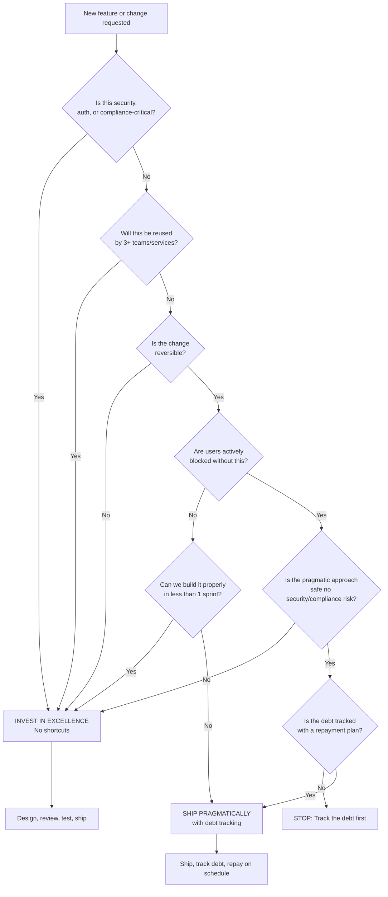

# Pragmatism vs. Technical Excellence

> **The framework for deciding when to ship vs. when to invest, with real examples.**
> **Audience:** All engineers on the GenAI Platform team
> **Owner:** Engineering Leadership

---

## Core Principle

**Technical excellence is a virtue, but shipping is a responsibility.**

Every engineer wants to write clean, well-architected, thoroughly tested code. Every engineer wants to use the best tools, the most elegant patterns, and the most maintainable abstractions.

But in a global bank with regulatory deadlines, competitive pressure, and real users depending on your platform, **the perfect solution delivered late is sometimes worse than a good solution delivered now.**

The tension between pragmatism and technical excellence is not a problem to solve. It is a **permanent tension to manage**. Senior engineers do not pick a side. They develop a **framework for deciding**.

---

## The Decision Framework

### When to Ship Pragmatically

```
Ship pragmatically when ALL of the following are true:

[ ] The change is reversible (feature flag, config, rollback possible)
[ ] The blast radius is limited (one team, internal users)
[ ] The technical debt is tracked and has an owner
[ ] The code is safe (no security or compliance risk)
[ ] The delay cost of doing it "right" is higher than the debt cost
[ ] Users are actively blocked without this change
```

### When to Invest in Technical Excellence

```
Invest in engineering when ANY of the following are true:

[ ] The code will be reused by 3+ teams or services
[ ] The code handles authentication, authorization, or sensitive data
[ ] The code is in the critical path of a compliance workflow
[ ] The code will be modified frequently over the next 6+ months
[ ] The "quick fix" would create ongoing operational burden
[ ] The decision is a one-way door (irreversible or costly to undo)
[ ] The code defines the architecture for a new platform component
```

---

## The Technical Debt Ledger

Pragmatic shipping requires **tracking the debt you take on**. Untracked technical debt is not debt — it is a gift to your future self with no repayment plan.

```markdown
## Technical Debt Entry

**Date:** 2025-09-15
**Engineer:** Rahul S.
**Description:** Hardcoded the compliance document list in the RAG
               retriever instead of building the dynamic classification
               system we designed. We need to ship the HR policy
               feature for the Q3 all-hands demo.

**Debt:**
- Adding a new compliance document requires a code change and redeploy
- The retriever cannot dynamically adjust to new document types
- Test coverage for the retriever is incomplete (missing edge cases)

**Repayment Plan:**
- Build the dynamic document classification system in Q4 Sprint 3
- Owner: Rahul S.
- JIRA: PROJ-4521
- Estimated effort: 3 story points

**Risk if Not Repaid:**
- Every new document type requires engineering intervention
- Scales linearly with document count (currently 12 types, expected 40+)
- Violates the platform's self-service design principle
```

**Rule:** Every pragmatic decision must have a debt entry with a repayment plan. If you are not willing to track it, you should not ship it pragmatically.

---

## Real Examples from Our Platform

### Example 1: The Prompt Template That Should Have Been Clean

```
Situation: The compliance team needed 15 different prompt templates
           for different regulatory queries (Basel III, GDPR, CCPA, etc.).

Pragmatic approach (chosen):
  - Created 15 separate prompt template files
  - Each template was ~200 lines of hardcoded text
  - A simple routing function selected the template based on query category
  - Shipped in 2 days

What "proper" engineering would have looked like:
  - Built a template composition system with variable substitution
  - Created a prompt testing framework to validate each template
  - Added a template management UI for compliance officers
  - Shipped in 3 weeks

Why pragmatism was correct:
  - Compliance needed this for a regulatory submission deadline
  - Templates were unlikely to change frequently
  - The routing function was trivial (category -> filename)
  - If we needed a composition system later, the templates were
    well-structured enough to migrate easily
  - Cost of delay: compliance team would have missed their deadline

Technical debt: None tracked. The templates were clear enough that
                this did not create ongoing burden. We got lucky.

Lesson: Sometimes the "messy" solution is the right one. The key
        is being honest about WHY it is messy and whether it will
        cause problems later.
```

### Example 2: The Authentication System That Needed Excellence

```
Situation: We needed to implement token exchange for the GenAI platform
           so that users' SSO tokens could be exchanged for service-specific
           tokens with scoped permissions.

Pragmatic approach (rejected):
  - Hardcoded token exchange logic in the API gateway
  - Direct database lookup for user permissions
  - No token caching (simple but slow)
  - Ship in 1 week

What we built instead (technical excellence):
  - Dedicated token exchange microservice
  - JWT-based scoped tokens with expiration
  - Redis caching layer for token validation
  - Circuit breaker for upstream auth service failures
  - Complete audit logging for compliance
  - Shipped in 6 weeks

Why excellence was required:
  - This is the authentication layer — a one-way door decision
  - Every GenAI service depends on it
  - Handles sensitive user identity data
  - Must pass security review and compliance audit
  - Will be modified frequently as we add new auth providers
  - A flaw here compromises the entire platform

Cost of pragmatism: If we had shipped the quick version, we would have:
  - Failed security review (no audit logging)
  - Caused latency issues (no caching, every request hits auth DB)
  - Created a single point of failure (no circuit breaker)
  - Required a complete rewrite within 3 months anyway

Lesson: Some things are never worth shipping pragmatically.
        Authentication is always one of them.
```

### Example 3: The RAG Retriever That Needed Both

```
Situation: Our initial RAG retriever used a simple cosine similarity
           search against pgvector. It worked but had quality issues.

Phase 1 — Pragmatic improvement (2 days):
  - Added a re-ranking step using a cross-encoder model
  - Wrapped it as a post-processing function on top of existing retriever
  - Code was ugly: hardcoded model path, no abstraction layer
  - Result: retrieval accuracy improved from 62% to 78%
  - Shipped because users were actively complaining

Phase 2 — Technical excellence (3 weeks):
  - Built a proper retriever abstraction with plugin interface
  - Supported multiple retriever types (vector, BM25, hybrid)
  - Added retriever evaluation framework
  - Built monitoring for retrieval quality over time
  - Result: accuracy improved to 89%, and we could now evaluate
    new retriever strategies without touching production code

Why this two-phase approach was correct:
  - Phase 1 validated that re-ranking actually helped (it did)
  - Phase 2 would have been premature without Phase 1 validation
  - Phase 1 gave us data to justify the Phase 2 investment
  - Phase 2 would not have been approved without Phase 1 results

Lesson: Pragmatism can validate the need for excellence.
        Ship the proof of concept. Then build it properly.
```

---

## When Senior Engineers Choose Pragmatism (And When They Do Not)

### The Maturity Model

```
Junior Engineer:     "Let's do it right. We need the proper architecture."
                     (Always defaults to technical excellence, ignores shipping)

Mid-Level Engineer:  "Let's just ship it. We can fix it later."
                     (Always defaults to pragmatism, ignores quality)

Senior Engineer:     "It depends. Let me evaluate the tradeoffs."
                     (Uses a framework to decide)

Staff Engineer:      "The pragmatic approach is X, the excellent approach
                      is Y. I recommend X now with a plan for Y in Q4,
                      because the data shows the pragmatic approach buys
                      us 6 weeks and the quality risk is low."
                     (Frames the decision for the team with data)

Principal Engineer:  "The question is not whether we ship or invest. The
                      question is which investment creates option value.
                      Approach X constrains our future options. Approach Y
                      keeps them open. The additional 2 weeks of investment
                      in Y is insurance against a much larger rewrite later."
                     (Thinks in terms of future optionality)
```

---

## The Technical Excellence Checklist

When you are tempted to ship pragmatically, run through this checklist. If any item fails, reconsider.

```markdown
## Technical Excellence Checklist

### Safety
- [ ] No hardcoded secrets or credentials
- [ ] Input validation on all user-facing endpoints
- [ ] No SQL injection, command injection, or prompt injection vectors
- [ ] Error messages do not leak internal details
- [ ] Rate limiting is in place for public endpoints

### Maintainability
- [ ] Variable and function names clearly describe their purpose
- [ ] Functions are small and single-purpose (< 30 lines preferred)
- [ ] No duplicated logic (DRY)
- [ ] Dependencies are minimal and justified

### Operability
- [ ] Logging is sufficient for debugging production issues
- [ ] Health check endpoint exists
- [ ] Metrics are exposed for key operations
- [ ] Runbook exists for common failure scenarios

### Testability
- [ ] Core logic can be unit tested without mocking the world
- [ ] Integration tests cover the happy path
- [ ] Edge cases are identified and tested

### Reversibility
- [ ] Can be rolled back in under 15 minutes
- [ ] Feature flag exists for user-facing changes
- [ ] Database migrations are backward-compatible
```

---

## The Pragmatism Defense

When you decide to ship pragmatically, you must be able to defend the decision:

```
Questions to answer:

1. "What are we deferring, and why?"
   → "We are deferring the dynamic classification system because the
      compliance deadline is in 3 days and the current approach works
      for the 12 document types we have today."

2. "What is the cost of doing this properly later?"
   → "Refactoring will take 3 story points. The templates are structured
      consistently, so the migration is mechanical, not creative."

3. "What happens if we never repay this debt?"
   → "Every new document type requires engineering intervention. At the
      current rate of 2 new types per month, this becomes a bottleneck
      by Q1 2026."

4. "Who owns repaying this debt?"
   → "Rahul S. owns it. JIRA ticket PROJ-4521 is in the Q4 backlog."

5. "What is the trigger that forces us to repay it?"
   → "When we hit 20 document types (currently at 12), the manual
      approach becomes unsustainable. We will monitor and repay
      before that threshold."
```

If you cannot answer these questions honestly, you are not shipping pragmatically. You are accumulating hidden debt.

---

## Mermaid: The Decision Flow



---

## The "Good Enough" Definition

What does "good enough for pragmatic shipping" actually mean?

```
Good enough means:

1. It works correctly for the current requirements.
   (Not "it works most of the time.")

2. It is safe. No security, compliance, or data integrity shortcuts.

3. It is understandable. Another engineer can read it and know what it does.

4. It is monitored. If it breaks, we will know.

5. The debt is tracked. We have a plan and an owner for repaying it.

Good enough does NOT mean:

1. "It works on my machine."
2. No tests because "we will add them later."
3. No documentation because "the code is self-explanatory."
4. No monitoring because "it is just a temporary change."
5. No debt tracking because "we will remember to fix it."
```

---

## The Cost of Over-Engineering

Pragmatism exists because over-engineering is a real and expensive problem:

```
Story: The Abstraction That Nobody Needed
──────────────────────────────────────────

In early 2025, a senior engineer on a neighboring team built a beautiful
"LLM Provider Abstraction Layer." It supported OpenAI, Anthropic, Azure
OpenAI, and a local model server. It had a clean interface, dependency
injection, and comprehensive error handling.

It was also completely unnecessary.

The bank had standardized on Azure OpenAI for the next 18 months. The
contract was signed. The security review was done. There was zero
probability of switching providers in the near term.

The abstraction added 2,000 lines of code, a new service to deploy,
and a cognitive overhead for every engineer who interacted with it.

When the team finally needed to add support for a local model, the
abstraction was 9 months old and did not match the actual requirements.
They rewrote it.

Cost: 6 weeks of engineering time ($30,000+ in salary) for an
      abstraction that was used once and then discarded.

Lesson: Building for hypothetical future requirements is not technical
        excellence. It is speculation dressed as engineering.
```

---

## Cross-References

- **Bias for Action** (`bias-for-action.md`) — How to calibrate your shipping speed.
- **Solutions-First Mindset** (`solutions-first-mindset.md`) — Ensure you are solving the right problem before deciding how thoroughly.
- **Engineering Craftsmanship** (`engineering-craftsmanship.md`) — What "excellence" actually means in practice.
- **Balancing Speed, Risk, and Quality** (`balancing-speed-risk-and-quality.md`) — The broader decision framework.
- **Thinking in Systems** (`thinking-in-systems.md`) — Second-order effects of technical debt accumulation.

---

## Interview Preparation

### Questions You Might Be Asked

1. **"Tell me about a time you chose pragmatism over technical perfection."**
   - Use the prompt template or RAG retriever examples. Show the framework.

2. **"Tell me about a time you insisted on technical excellence despite pressure to ship."**
   - Use the authentication system example. Show why shortcuts were unacceptable.

3. **"How do you manage technical debt?"**
   - Discuss the Technical Debt Ledger. Show that untracked debt is hidden debt.

4. **"How do you know when to build an abstraction vs. write simple code?"**
   - Discuss the "three users" rule and the over-engineering story.

### STAR Story: Pragmatism with a Plan

```
Situation:  "The compliance team needed urgent RAG support for HR policy
             documents before a regulatory deadline. The proper design
             would have taken 3 weeks; we had 3 days."

Task:       "Ship a working solution in 3 days without creating unmanageable
             technical debt or compromising safety."

Action:     "I shipped a pragmatic solution with hardcoded document routes
             but tracked the technical debt in our ledger with a JIRA ticket,
             an owner, and a repayment deadline. I documented the limitations
             clearly and set up monitoring to detect when the approach was
             becoming unsustainable."

Result:     "Compliance team met their deadline. We repaid the debt in Q4
             as planned. The monitoring showed exactly when the approach
             was breaking (at 18 document types), which validated our
             repayment timeline. The engineering manager used this as a
             case study for how to ship pragmatically responsibly."
```

---

## Summary

1. **The tension is permanent.** You will always balance pragmatism and excellence.
2. **Use a framework, not a feeling.** The decision matrix removes emotion from the choice.
3. **Track every debt.** Untracked debt is a lie you tell yourself.
4. **Some things are never pragmatic.** Authentication, security, and compliance code always get the full investment.
5. **Pragmatism can validate excellence.** Ship the proof of concept, then build it properly.
6. **Over-engineering is also waste.** Building for hypotheticals is speculation, not engineering.
7. **Good enough has a definition.** It means correct, safe, understandable, monitored, and tracked.

> "The best engineers are not the ones who write the most elegant code.
> They are the ones who write the right amount of elegance for the situation."
