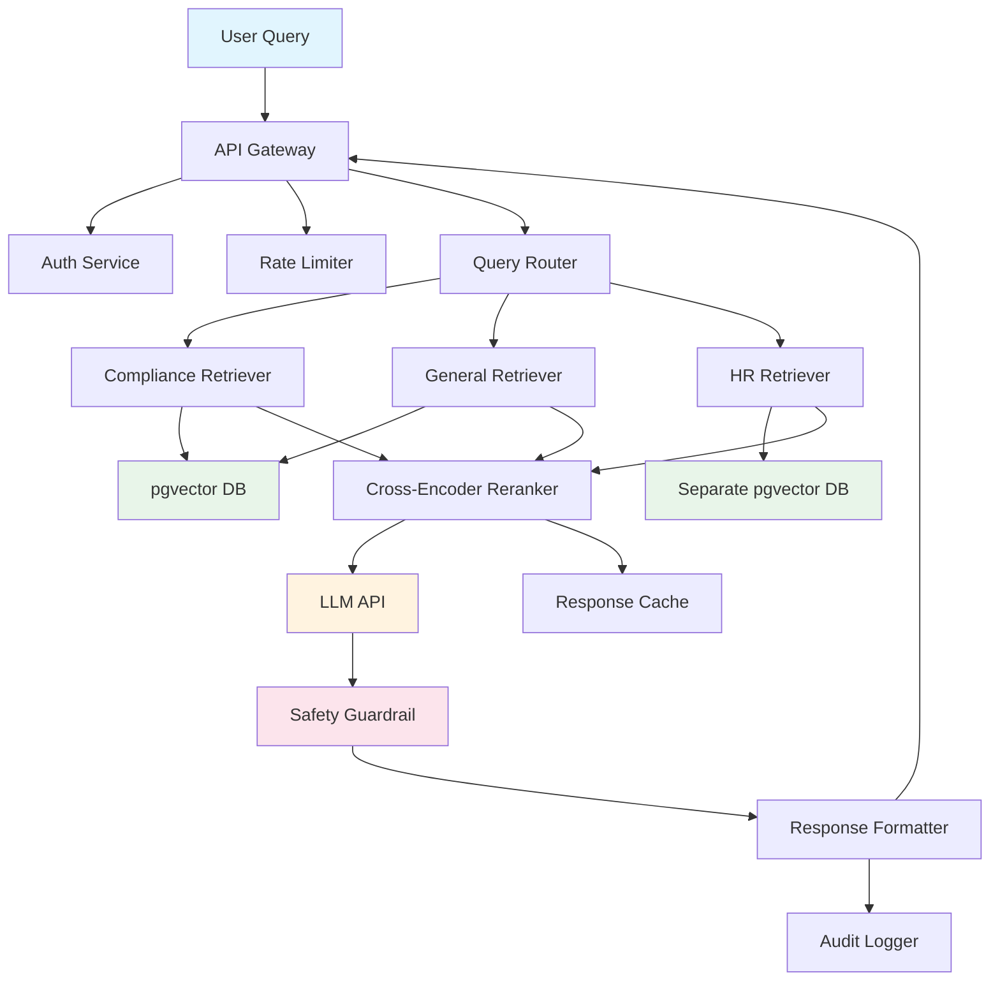

# Thinking in Systems

> **Systems thinking, second-order effects, feedback loops, emergent behavior.**
> **Audience:** All engineers on the GenAI Platform team
> **Owner:** Engineering Leadership

---

## Core Principle

**Nothing exists in isolation. Every change ripples through the system.**

When you modify one component of a distributed system, you are not just changing that component. You are changing the behavior of every component that interacts with it, and every component that interacts with those components.

In a GenAI platform serving hundreds of thousands of employees, the system is so complex that **no single person understands all of it**. The best you can do is develop **systems thinking**: the ability to reason about interactions, feedback loops, and emergent behavior, not just individual components.

---

## What Is Systems Thinking?

### Linear Thinking vs. Systems Thinking

```
Linear Thinking (wrong):
  "The retriever is slow. I will make it faster."
  → Does not ask: What happens when the retriever is faster?
    Does the LLM API become the bottleneck?
    Does token consumption increase?
    Does the cost per query go up?

Systems Thinking (right):
  "The retriever is slow. If I make it 3x faster, the end-to-end
   latency will be dominated by the LLM API call. The LLM API has
   a rate limit of 1000 requests/minute. Currently we average 400.
   If retrieval is faster, users will send more queries. We may hit
   the rate limit during peak hours. I need to coordinate with the
   LLM API team before optimizing retrieval."
```

### The System Map

Before making a significant change, map the system:



When you change one box, trace the arrows. Every arrow is a dependency. Every dependency is a potential failure point or amplification path.

---

## Second-Order Effects

### Definition

- **First-order effect:** The direct, intended consequence of a change.
- **Second-order effect:** The consequence of the first-order effect.
- **Third-order effect:** The consequence of the second-order effect.

Most incidents are caused by second or third-order effects that nobody anticipated.

### Examples from Our Platform

```
Change: "We increased the RAG context window from 4,000 to 8,000 tokens."

First-order effect:  The LLM has more context, answers are more comprehensive.
Second-order effect: Each query costs 2x more in tokens. Monthly LLM cost
                     increases by $12,000.
Third-order effect:  The budget committee questions the GenAI platform ROI.
                     Budget for next quarter is reduced. Planned GPU upgrade
                     is deferred.
Fourth-order effect: Without the GPU upgrade, the cross-encoder reranker
                     cannot be deployed on-prem. We remain dependent on
                     the external LLM provider, increasing vendor risk.

Net result: A well-intentioned quality improvement triggered a cost increase
that reduced our strategic flexibility.

What should have happened: Before increasing context window, calculate the
cost impact, present it to the engineering manager, and decide whether the
quality improvement is worth the cost increase.
```

```
Change: "We added retry logic with 3 attempts to the embedding API."

First-order effect: Transient failures are recovered automatically.
Second-order effect: During a real outage, each query is retried 3x,
                     tripling the load on the embedding API when it is
                     already struggling.
Third-order effect: The embedding API is overwhelmed by retries and
                     cannot recover. The outage is extended from 5 minutes
                     to 25 minutes.
Fourth-order effect: During the extended outage, the RAG pipeline falls
                     back to stale embeddings. Users receive outdated
                     compliance information.

Net result: Retry logic, intended to improve reliability, amplified a
minor outage into a major incident.

What should have happened: Retries with exponential backoff AND circuit
breaker. The circuit breaker detects that the service is unhealthy and
stops retrying, allowing it to recover.
```

```
Change: "We added a caching layer for frequent queries."

First-order effect: Common queries are served instantly. Latency improves.
Second-order effect: When source documents are updated, the cache serves
                     stale content (the incident from ownership-and-accountability.md).
Third-order effect: Compliance officers lose trust in the assistant and
                     escalate to manual document review.
Fourth-order effect: The compliance team's manual review process takes
                     4 hours per policy change. During that window,
                     employees are acting on outdated compliance guidance.

Net result: A performance optimization created a regulatory risk.

What should have happened: Cache design should have included TTL-based
invalidation AND source-document-change-triggered invalidation from the start.
```

---

## Feedback Loops

### Positive Feedback Loops (Reinforcing)

A positive feedback loop amplifies change. The output of a system feeds back as input that increases the output further.

```
Example: The Popularity Loop

More users ──► More queries ──► More data ──► Better model ──► More users
    │                                                              │
    └──────────────────────────────────────────────────────────────┘

This is a VIRTUOUS cycle. Good when it works in your favor.

But the same pattern can be VICIOUS:

Slower response ──► Users retry ──► More load ──► Slower response
    │                                                    │
    └────────────────────────────────────────────────────┘

This is a DEATH SPIRAL. The system gets slower, users retry,
load increases, it gets slower, more users retry, etc.

The fix: Break the loop. At any point in the cycle, intervene:
- Rate limit to prevent retries
- Circuit breaker to stop sending load to failing service
- Cached fallback to serve stale but fast responses
```

### Negative Feedback Loops (Balancing)

A negative feedback loop stabilizes the system. The output feeds back as input that reduces the output.

```
Example: The Auto-Scaling Loop

High load ──► Auto-scale triggers ──► More pods ──► Lower load ──► Scale down
    │                                                                         │
    └─────────────────────────────────────────────────────────────────────────┘

This is a STABILIZING cycle. The system self-regulates.

But negative feedback can also PREVENT IMPROVEMENT:

Quality issue reported ──► Team investigates ──► Root cause is complex
                           ──► Fix requires significant effort ──► Team
                           decides effort is not justified ──► Issue remains
                           ──► Users report again ──► Same cycle repeats

This is a STABILIZING cycle around a bad equilibrium. The system
resists change even when change is needed.

The fix: Change the feedback mechanism. Make the cost of NOT fixing
the issue visible and increasing over time.
```

### Feedback Loops in GenAI Systems

```
The Quality Feedback Loop:

Users query ──► LLM responds ──► User rates response ──► Rating stored
    │                                                        │
    │                                                        ▼
    │                                              Quality dashboard
    │                                                        │
    │          ◄── Prompt updated based on ratings ◄─────────┘
    │
    └── User queries again (with updated prompts)

If this loop works: Quality improves over time.
If this loop is broken: Nobody looks at the dashboard. Prompts never
change. Users stop rating. The loop collapses.

The Guardrail Feedback Loop:

User query ──► Guardrail blocks ──► User frustrated ──► User reformulates
    │                                                           │
    │                         ◄─── Query passes ────────────────┘
    │
    ▼
Guardrail is too aggressive. Users learn to work around it.
The guardrail provides a FALSE sense of security because users
are bypassing it through reformulation.

This is why guardrail tuning requires analyzing blocked queries
AND user reformulation patterns, not just the block rate.
```

---

## Emergent Behavior

### Definition

Emergent behavior is system-level behavior that cannot be predicted from the behavior of individual components.

```
Individual components:
- Service A has a 99.9% uptime (0.1% failure rate)
- Service B has a 99.9% uptime
- Service C has a 99.9% uptime
- Service D has a 99.9% uptime

Emergent behavior:
- The GenAI platform depends on A, B, C, and D
- Platform uptime = 0.999 × 0.999 × 0.999 × 0.999 = 99.6%
- That is 4x the failure rate of any individual service
- If any one of 10 services fails, the platform fails
- Platform uptime = 0.999^10 = 99.0%

The system is less reliable than any of its components.
This is emergent behavior. Nobody designed it to be this way.
It is the mathematical consequence of串联 dependencies.
```

### Real Example: The Cascading Failure

> **Situation (Q3 2025):** A minor issue in the OpenShift DNS configuration caused intermittent resolution delays (50-200ms) for internal service names.
>
> **The cascade:**
>
> 1. **DNS delay increases** → The API Gateway takes longer to resolve the Auth Service hostname.
> 2. **Auth Service timeouts increase** → The API Gateway's connection pool to Auth Service fills up.
> 3. **Connection pool exhaustion** → New requests to the API Gateway are queued waiting for Auth Service connections.
> 4. **Request queue grows** → API Gateway response latency increases from 50ms to 5,000ms.
> 5. **Clients retry** → The retry traffic doubles the load on the already-struggling API Gateway.
> 6. **LLM API calls timeout** → The RAG pipeline's calls to the LLM API timeout because the gateway is slow.
> 7. **Circuit breaker opens** → The RAG pipeline stops calling the LLM API.
> 8. **Fallback serves cached responses** → Users receive stale compliance information.
>
> **Root cause:** A 50-200ms DNS delay.
> **Impact:** 45-minute platform-wide degradation with stale responses.
>
> **The lesson:** Small perturbations in foundational infrastructure can cascade through the system in unpredictable ways. The DNS team did not consider the GenAI platform when making the change. The GenAI team did not consider DNS as a critical dependency. Neither was wrong — the system is too complex for any one team to model perfectly.
>
> **The fix:**
> - Add DNS latency monitoring to the platform dashboard
> - Implement connection pool sizing that accounts for DNS delays
> - Add circuit breakers at every service boundary
> - Design fallback paths that do not depend on the failing component

---

## The Systems Thinking Toolkit

### Tool 1: Dependency Mapping

```
Before making a change:

1. List all components your change touches (direct dependencies).
2. For each direct dependency, list its dependencies (indirect dependencies).
3. For each dependency, ask:
   - What happens if this component fails?
   - What happens if this component is slow?
   - What happens if this component returns wrong data?
   - What happens if this component is under load?
4. Map the failure paths. Where does the cascade stop?
```

### Tool 2: The Pre-Mortem

```
Before deploying a significant change:

"It is 6 months from now. This change has caused a major incident.
What happened?"

This exercise forces you to think about failure modes proactively.
The best pre-mortems I have seen have predicted actual failure modes
that later occurred — because the team had already thought about them.

Example pre-mortem for adding a new RAG source:
- "The new source contains outdated documents that the assistant cites
  as current policy." → Fix: Document freshness validation.
- "The new source has a different access control model, and users can
  retrieve documents they should not see." → Fix: ACL mapping at ingestion.
- "The new source is large enough to skew the retrieval results, pushing
  out more relevant documents from other sources." → Fix: Source weighting.
```

### Tool 3: The Blast Radius Analysis

```
For any change, determine the blast radius:

Component changed: RAG Retriever
Direct users: 2,400 compliance officers
Indirect users: Anyone who receives compliance summaries from them
Direct systems: RAG pipeline, LLM API, response cache
Indirect systems: Audit logging, compliance reporting, regulatory filing

Blast radius: Enterprise-wide.

This tells you the level of testing, review, and caution required.
A component with an enterprise blast radius needs enterprise-level scrutiny.
```

### Tool 4: The Rate of Change Analysis

```
Systems can absorb change, but only at a certain rate.

Example: Migrating the embedding model

Too fast (big bang cutover):
  Day 1: Switch all queries to new model.
  Risk: If the new model is worse, every query is worse immediately.
  Blast radius: 100% of users, 100% of queries.

Too slow (never):
  Risk: The old model is deprecated, support will end, and you have
  no migration experience.

Just right (progressive):
  Week 1: Route 1% of queries to new model. Measure quality.
  Week 2: If quality is acceptable, route 5%. Monitor.
  Week 3: Route 20%. Monitor user satisfaction.
  Week 4: Route 50%. A/B test results.
  Week 5: Route 100%. Old model on standby for 2 weeks.
  Week 7: Retire old model.

The progressive approach limits the blast radius at each step.
If the new model is worse, you detect it at 1% — not at 100%.
```

---

## Cross-References

- **Solutions-First Mindset** (`solutions-first-mindset.md`) — Understanding the full system impact of your solution.
- **Security Is Everyone's Job** (`security-is-everyones-job.md`) — Security failures cascade through systems.
- **Balancing Speed, Risk, and Quality** (`balancing-speed-risk-and-quality.md`) — Systems thinking informs the risk assessment.
- **Pragmatism vs. Technical Excellence** (`pragmatism-vs-technical-excellence.md`) — Technical debt accumulates system-wide.

---

## Interview Preparation

### Questions You Might Be Asked

1. **"Tell me about a time you anticipated a second-order effect that others missed."**
   - Use any of the examples above. Show the chain of reasoning.

2. **"Describe a cascading failure you experienced."**
   - Use the DNS cascade story. Show how small causes have large effects.

3. **"How do you design for failure in a distributed system?"**
   - Discuss circuit breakers, fallback paths, blast radius analysis.

4. **"How do you reason about the reliability of a system with many dependencies?"**
   - Discuss the emergent behavior math and the dependency mapping exercise.

### STAR Story: Systems Thinking in Action

```
Situation:  "We planned to increase the RAG context window from 4,000 to
             8,000 tokens to improve answer quality."

Task:       "Evaluate the full system impact before making the change."

Action:     "I calculated the cost impact (2x token consumption, $12K/month
             increase), checked the LLM API rate limits (risk of hitting
             caps during peak hours), consulted with the finance team on
             budget impact, and presented a tradeoff analysis: quality
             improvement vs. cost increase vs. rate limit risk."

Result:     "We decided to increase to 6,000 tokens as a compromise — enough
             quality improvement to be meaningful, but not enough to break
             the budget or rate limits. We also negotiated a higher rate limit
             with the LLM provider before the change. The progressive approach
             prevented any surprises."
```

---

## Summary

1. **Everything is connected.** Changing one component changes the system.
2. **Second-order effects cause most incidents.** Think beyond the immediate impact.
3. **Feedback loops amplify or stabilize.** Know which type you are dealing with.
4. **Emergent behavior is unpredictable.** The system is less reliable than its best component.
5. **Map dependencies before changing anything.** Trace the arrows.
6. **Pre-mortems are cheap insurance.** Imagine the failure before it happens.
7. **Blast radius determines scrutiny.** Enterprise-impact changes need enterprise-level review.
8. **Rate of change matters.** Progressive rollouts limit the blast radius at each step.

> "The system always wins. You cannot fight emergent behavior with
> individual component optimization. You must think in systems,
> design for failure, and respect the complexity you are working within."
