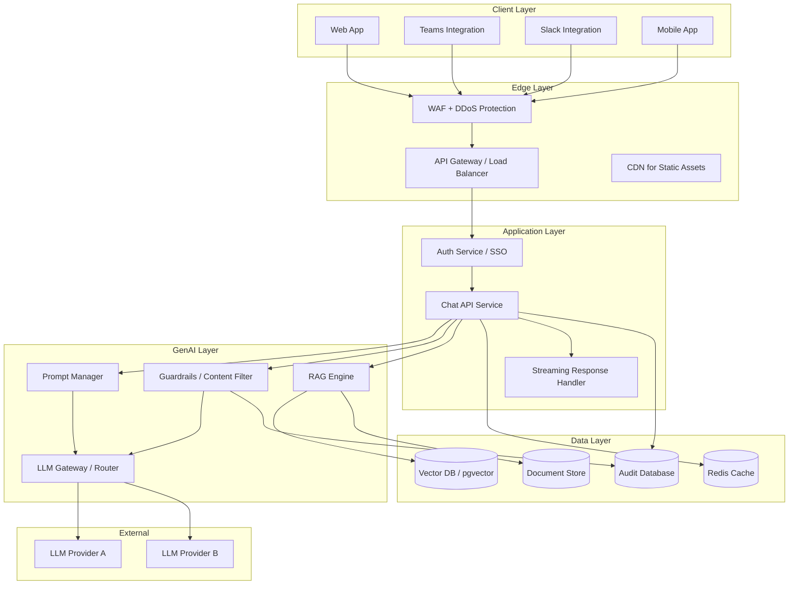

# Architecture Exercise 01: Enterprise Chatbot Design

> Design a GenAI chatbot architecture for 100,000 banking employees — from requirements to production deployment.

## Problem Statement

The bank wants to deploy an enterprise GenAI assistant for 100,000 employees across 40 countries. The assistant must:

1. Answer questions about internal policies, procedures, and systems
2. Respect document-level access controls (employees see only what they're authorized to see)
3. Be available 24/7 with 99.9% uptime
4. Respond within 2 seconds (p95)
5. Log all interactions for compliance
6. Support 12 languages
7. Handle 50,000 queries per day at launch, scaling to 500,000

Design the system architecture.

## Constraints

- All data must remain within the bank's infrastructure (no external SaaS)
- LLM inference can use approved external APIs (with data protection)
- Budget: $500K for initial build, $200K/month operating
- Must pass security review before launch
- Must support rollback to previous model versions
- Compliance requires 7-year audit log retention

## Expected Deliverables

1. **Architecture diagram** (Mermaid) showing all components
2. **Component descriptions** with technology choices and rationale
3. **Data flow** for a single query from user to response
4. **Access control design** for document retrieval
5. **Scalability analysis** — how the system handles 10x growth
6. **Failure mode analysis** — what happens when each component fails

## Hints

### Hint 1: Key Components to Consider

```
Required components:
├── Frontend (web app, mobile, Teams/Slack integration)
├── API Gateway (authentication, rate limiting, routing)
├── Auth Service (SSO integration, authorization)
├── GenAI Service (orchestration, prompt management)
├── LLM Gateway (model routing, fallback, rate limiting)
├── RAG Pipeline (document retrieval, embedding)
├── Vector Database (embeddings storage, similarity search)
├── Document Store (source documents, metadata, access control)
├── Audit Logger (compliance logging)
├── Cache Layer (response caching for common queries)
├── Content Filter (input/output safety screening)
└── Monitoring (metrics, logging, alerting, dashboards)
```

### Hint 2: Access Control Design

```
Document-level access control:
1. Each document has a list of authorized groups/roles
2. Each user has a list of groups/roles from SSO
3. At retrieval time, filter documents by user access
4. This must happen BEFORE the LLM sees any content

Options:
A. Pre-filter: Check access before retrieval (safe, but complex)
B. Post-filter: Check access after retrieval (simpler, but risky)
C. Hybrid: Embed access metadata in embeddings, filter at query time
```

### Hint 3: Scalability

```
50K queries/day = ~0.6 queries/second average
500K queries/day = ~6 queries/second average
Peak (10x average): 60 queries/second

If each LLM call takes 2 seconds:
- Concurrent requests at peak: 60 × 2 = 120
- Need at least 120 worker slots
- With 4 replicas of the GenAI service: 30 concurrent each
- Plus cache hit rate of 30%: reduces LLM calls to 84/second
```

## Example Architecture



## Evaluation Criteria

Your design will be evaluated on:

| Criterion | What Good Looks Like |
|-----------|---------------------|
| **Security** | Auth at every layer, data encryption, prompt injection defense |
| **Access Control** | Document-level filtering, no data leakage between users |
| **Scalability** | Horizontal scaling, caching strategy, connection pooling |
| **Reliability** | Fallback providers, circuit breakers, graceful degradation |
| **Compliance** | Complete audit trail, data retention, model versioning |
| **Cost** | Cache hit rate optimization, model routing by complexity |
| **Observability** | End-to-end tracing, quality metrics, cost tracking |

## Extensions

1. **Multi-tenant design:** Extend the architecture to serve multiple business units with isolated data but shared infrastructure.

2. **Model fine-tuning:** Add a fine-tuned model for banking-specific tasks. How does this change the architecture?

3. **Real-time analytics:** Add a streaming analytics pipeline that monitors query quality in real-time and alerts on degradation.

4. **Cost optimization:** Design a tiered model routing system where simple queries use cheaper models and complex queries use premium models.

5. **Disaster recovery:** Design the DR plan. What happens if an entire region goes down?

## Interview Relevance

System design is the core of senior engineering interviews:

| Skill | Why It Matters |
|-------|---------------|
| Architecture design | Can you design systems, not just write code? |
| Trade-off analysis | Can you evaluate alternatives honestly? |
| Scalability thinking | Can you design for 100x the current load? |
| Security mindset | Do you consider security at every layer? |
| Banking context | Do you understand compliance and access control? |

**Follow-up questions:**
- "How would you handle a sudden 100x spike in traffic?"
- "What happens when both LLM providers are down?"
- "How do you prevent one user's query from influencing another's response?"
- "How would you A/B test two different model versions?"
- "What's your data retention and deletion strategy for GDPR?"
