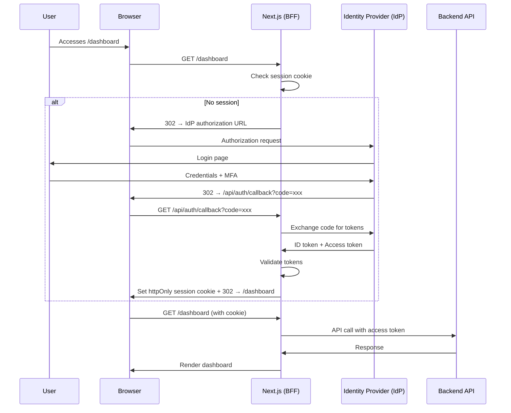

# Authentication Flows — OAuth2/OIDC, Session Management, Token Refresh, MFA

## Overview

Authentication in a banking environment follows enterprise identity standards. We use OAuth2 with OpenID Connect (OIDC) via the bank's central identity provider (Keycloak/Okta/Azure AD). The frontend never handles raw credentials — all authentication flows through the identity provider.

## Architecture



## BFF (Backend for Frontend) Pattern

The Next.js API routes act as a BFF layer. Tokens never reach the browser.

```tsx
// src/lib/auth/session.ts
import { cookies } from 'next/headers';
import { SignJWT, jwtVerify } from 'jose';

const SESSION_COOKIE_NAME = '__session';
const SESSION_SECRET = new TextEncoder().process.env.SESSION_SECRET!);

interface SessionPayload {
  userId: string;
  role: string;
  permissions: string[];
  securityClassification: string;
  exp: number;
}

export async function createSession(payload: SessionPayload) {
  const cookieStore = await cookies();
  const token = await new SignJWT(payload)
    .setProtectedHeader({ alg: 'HS256' })
    .setExpirationTime('8h')
    .sign(SESSION_SECRET);

  cookieStore.set(SESSION_COOKIE_NAME, token, {
    httpOnly: true,
    secure: process.env.NODE_ENV === 'production',
    sameSite: 'lax',
    maxAge: 8 * 60 * 60, // 8 hours
    path: '/',
  });
}

export async function getSession(): Promise<SessionPayload | null> {
  const cookieStore = await cookies();
  const sessionCookie = cookieStore.get(SESSION_COOKIE_NAME);

  if (!sessionCookie) return null;

  try {
    const { payload } = await jwtVerify(sessionCookie.value, SESSION_SECRET);
    return payload as SessionPayload;
  } catch {
    return null;
  }
}

export async function destroySession() {
  const cookieStore = await cookies();
  cookieStore.delete(SESSION_COOKIE_NAME);
}
```

## OAuth2/OIDC Flow (BFF)

```tsx
// src/app/api/auth/login/route.ts
import { NextResponse } from 'next/server';

export async function GET(request: Request) {
  const { searchParams } = new URL(request.url);
  const redirectTo = searchParams.get('redirectTo') ?? '/dashboard';

  // Build authorization URL
  const authUrl = new URL(`${process.env.IDP_AUTHORIZATION_ENDPOINT}`);
  authUrl.searchParams.set('response_type', 'code');
  authUrl.searchParams.set('client_id', process.env.OIDC_CLIENT_ID!);
  authUrl.searchParams.set('redirect_uri', `${process.env.APP_URL}/api/auth/callback`);
  authUrl.searchParams.set('scope', 'openid profile email');
  authUrl.searchParams.set('state', crypto.randomUUID());
  authUrl.searchParams.set('nonce', crypto.randomUUID());
  authUrl.searchParams.set('prompt', 'consent login');

  // Store redirect URL in a secure cookie for post-login redirect
  const response = NextResponse.redirect(authUrl.toString());
  response.cookies.set('post-login-redirect', redirectTo, {
    httpOnly: true,
    secure: process.env.NODE_ENV === 'production',
    sameSite: 'lax',
    maxAge: 300, // 5 minutes
    path: '/',
  });

  return response;
}
```

```tsx
// src/app/api/auth/callback/route.ts
import { NextResponse } from 'next/server';
import { createSession } from '@/lib/auth/session';

export async function GET(request: Request) {
  const { searchParams } = new URL(request.url);
  const code = searchParams.get('code');
  const state = searchParams.get('state');

  if (!code) {
    return NextResponse.redirect(new URL('/login?error=missing_code', process.env.APP_URL));
  }

  // Exchange code for tokens
  const tokenResponse = await fetch(process.env.IDP_TOKEN_ENDPOINT!, {
    method: 'POST',
    headers: { 'Content-Type': 'application/json' },
    body: JSON.stringify({
      grant_type: 'authorization_code',
      code,
      client_id: process.env.OIDC_CLIENT_ID,
      client_secret: process.env.OIDC_CLIENT_SECRET,
      redirect_uri: `${process.env.APP_URL}/api/auth/callback`,
    }),
  });

  if (!tokenResponse.ok) {
    return NextResponse.redirect(new URL('/login?error=token_exchange_failed', process.env.APP_URL));
  }

  const { id_token, access_token, refresh_token } = await tokenResponse.json();

  // Decode ID token to extract user info
  const idTokenPayload = decodeJwt(id_token);

  // Create session with relevant user info
  await createSession({
    userId: idTokenPayload.sub,
    role: idTokenPayload.role ?? 'employee',
    permissions: idTokenPayload.permissions ?? [],
    securityClassification: idTokenPayload.classification ?? 'internal',
    exp: idTokenPayload.exp,
  });

  // Get post-login redirect URL
  const cookieStore = cookies();
  const redirectTo = cookieStore.get('post-login-redirect')?.value ?? '/dashboard';
  cookieStore.delete('post-login-redirect');

  return NextResponse.redirect(new URL(redirectTo, process.env.APP_URL));
}
```

## Token Refresh (Silent)

```tsx
// src/app/api/auth/refresh/route.ts
import { NextResponse } from 'next/server';
import { createSession, getSession, destroySession } from '@/lib/auth/session';

export async function POST() {
  const session = await getSession();
  if (!session) {
    return NextResponse.json({ error: 'No session' }, { status: 401 });
  }

  try {
    // Call backend to refresh tokens using refresh_token grant
    const response = await fetch(process.env.IDP_TOKEN_ENDPOINT!, {
      method: 'POST',
      headers: { 'Content-Type': 'application/json' },
      body: JSON.stringify({
        grant_type: 'refresh_token',
        refresh_token: session.refreshToken,
        client_id: process.env.OIDC_CLIENT_ID,
        client_secret: process.env.OIDC_CLIENT_SECRET,
      }),
    });

    if (!response.ok) {
      // Refresh failed — user must re-authenticate
      await destroySession();
      return NextResponse.json({ error: 'Refresh failed' }, { status: 401 });
    }

    const { id_token, access_token, refresh_token } = await response.json();
    const idTokenPayload = decodeJwt(id_token);

    // Update session with new tokens
    await createSession({
      userId: idTokenPayload.sub,
      role: idTokenPayload.role,
      permissions: idTokenPayload.permissions,
      securityClassification: idTokenPayload.classification,
      exp: idTokenPayload.exp,
    });

    return NextResponse.json({ success: true });
  } catch {
    await destroySession();
    return NextResponse.json({ error: 'Refresh failed' }, { status: 401 });
  }
}
```

## Auto-Refresh on Frontend

```tsx
// src/hooks/useSessionRefresh.ts
import { useEffect, useCallback, useRef } from 'react';

// Refresh session 5 minutes before expiry
const REFRESH_BUFFER_MS = 5 * 60 * 1000;

export function useSessionRefresh(expirationTime: number) {
  const timerRef = useRef<NodeJS.Timeout>();

  const scheduleRefresh = useCallback(() => {
    const now = Date.now();
    const timeUntilExpiry = expirationTime * 1000 - now;
    const refreshIn = Math.max(0, timeUntilExpiry - REFRESH_BUFFER_MS);

    if (timerRef.current) clearTimeout(timerRef.current);

    timerRef.current = setTimeout(async () => {
      try {
        const response = await fetch('/api/auth/refresh', { method: 'POST' });
        if (!response.ok) {
          // Session expired — redirect to login
          window.location.href = `/api/auth/login?redirectTo=${encodeURIComponent(window.location.pathname)}`;
        }
      } catch {
        // Refresh failed — redirect to login
        window.location.href = `/api/auth/login?redirectTo=${encodeURIComponent(window.location.pathname)}`;
      }
    }, refreshIn);
  }, [expirationTime]);

  useEffect(() => {
    scheduleRefresh();
    return () => {
      if (timerRef.current) clearTimeout(timerRef.current);
    };
  }, [scheduleRefresh]);
}
```

## MFA Integration

```tsx
// src/app/api/auth/mfa/verify/route.ts
import { NextResponse } from 'next/server';

export async function POST(request: Request) {
  const { code } = await request.json();

  // Verify MFA code with IdP
  const response = await fetch(process.env.IDP_MFA_VERIFY_ENDPOINT!, {
    method: 'POST',
    headers: {
      'Content-Type': 'application/json',
      Authorization: `Bearer ${getSessionCookie()}`,
    },
    body: JSON.stringify({ code }),
  });

  if (!response.ok) {
    return NextResponse.json(
      { error: 'Invalid MFA code', remainingAttempts: 2 },
      { status: 401 },
    );
  }

  return NextResponse.json({ success: true });
}
```

```tsx
// src/app/(auth)/mfa/page.tsx
'use client';

import { useState } from 'react';
import { useRouter } from 'next/navigation';

export default function MFAVerificationPage() {
  const [code, setCode] = useState('');
  const [error, setError] = useState('');
  const [remainingAttempts, setRemainingAttempts] = useState(3);
  const router = useRouter();

  const handleSubmit = async (e: React.FormEvent) => {
    e.preventDefault();
    setError('');

    const response = await fetch('/api/auth/mfa/verify', {
      method: 'POST',
      headers: { 'Content-Type': 'application/json' },
      body: JSON.stringify({ code }),
    });

    if (!response.ok) {
      const data = await response.json();
      setError(data.error);
      setRemainingAttempts(data.remainingAttempts ?? 0);
      return;
    }

    // MFA verified — redirect to intended destination
    router.push('/dashboard');
  };

  return (
    <div className="flex min-h-screen items-center justify-center">
      <div className="w-full max-w-md space-y-6 p-8">
        <h1 className="text-2xl font-bold">Two-Step Verification</h1>
        <p className="text-muted-foreground">
          Enter the 6-digit code from your authenticator app.
        </p>

        <form onSubmit={handleSubmit} className="space-y-4">
          <div>
            <label htmlFor="mfa-code" className="text-sm font-medium">
              Authentication Code
            </label>
            <input
              id="mfa-code"
              type="text"
              inputMode="numeric"
              pattern="[0-9]{6}"
              maxLength={6}
              value={code}
              onChange={(e) => setCode(e.target.value.replace(/\D/g, ''))}
              className="mt-1 flex h-12 w-full rounded-md border border-input bg-background px-3 py-2 text-center text-2xl tracking-widest"
              autoComplete="one-time-code"
              aria-invalid={!!error}
              aria-describedby={error ? 'mfa-error' : undefined}
              autoFocus
            />
          </div>

          {error && (
            <p id="mfa-error" className="text-sm text-destructive" role="alert">
              {error}
              {remainingAttempts > 0 && (
                <span> {remainingAttempts} attempts remaining.</span>
              )}
            </p>
          )}

          <button
            type="submit"
            disabled={code.length !== 6}
            className="w-full h-10 rounded-md bg-primary text-primary-foreground font-medium"
          >
            Verify
          </button>
        </form>
      </div>
    </div>
  );
}
```

## Middleware for Route Protection

```tsx
// middleware.ts
import { NextResponse } from 'next/server';
import type { NextRequest } from 'next/server';

const PUBLIC_PATHS = ['/login', '/error', '/api/health'];

export function middleware(request: NextRequest) {
  const sessionCookie = request.cookies.get('__session');
  const { pathname } = request.nextUrl;

  // Public paths don't need authentication
  if (PUBLIC_PATHS.some(path => pathname.startsWith(path))) {
    return NextResponse.next();
  }

  // No session — redirect to login
  if (!sessionCookie) {
    const loginUrl = new URL('/api/auth/login', request.url);
    loginUrl.searchParams.set('redirectTo', pathname);
    return NextResponse.redirect(loginUrl);
  }

  return NextResponse.next();
}

export const config = {
  matcher: ['/((?!_next/static|_next/image|favicon.ico|public).*)'],
};
```

## Common Mistakes

### 1. Storing Tokens in localStorage

```tsx
// ❌ NEVER DO THIS
localStorage.setItem('access_token', token);
// localStorage is accessible via JavaScript = XSS can steal it

// ✅ GOOD: httpOnly cookies
// Tokens stored in httpOnly cookies — not accessible via JavaScript
```

### 2. Not Validating ID Tokens

```tsx
// ❌ BAD: Trusting tokens without validation
const payload = decodeJwt(token); // Just decodes, doesn't validate

// ✅ GOOD: Validate signature, expiry, issuer, audience
import { jwtVerify } from 'jose';
const { payload } = await jwtVerify(token, secret, {
  issuer: process.env.IDP_ISSUER,
  audience: process.env.OIDC_CLIENT_ID,
});
```

### 3. No Session Timeout

Every session must expire. Banking sessions should not exceed 8 hours.

## Cross-References

- `./secure-frontend-patterns.md` — Secure token storage, CSP, CSRF
- `./role-based-ui.md` — Role-based rendering after authentication
- `./authentication-flows.md` — This document
- `../security/` — Identity and access management
- `../backend-engineering/api-design/` — Authenticated API patterns

## Interview Questions

1. Explain the OAuth2 Authorization Code flow with PKCE.
2. Why does the frontend never see the access token in a BFF architecture?
3. How do you implement silent token refresh?
4. Design a middleware strategy for protecting routes in Next.js.
5. What is the difference between authentication and authorization?
6. How do you handle session expiry gracefully in a chat application?
