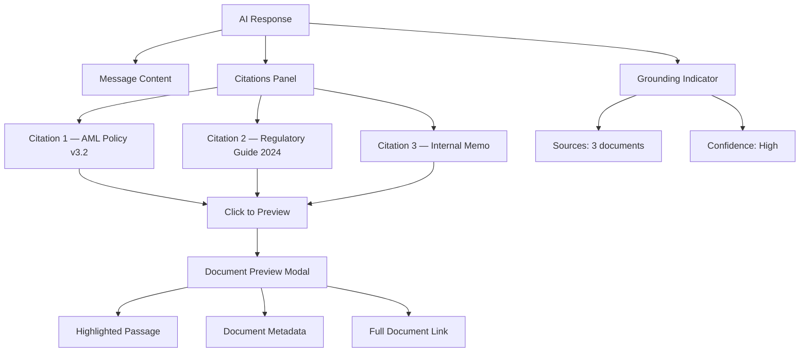

# Citations and Grounding UI — Citation Display, Source Document Preview, Grounding Indicators

## Overview

In a banking GenAI platform, every AI response must be grounded in verifiable source documents. Citations provide transparency, enable human verification, and support compliance requirements. This document covers the UI patterns for displaying citations and source grounding.

## Architecture



## Citation Data Structure

```tsx
// src/types/citations.ts
export interface Citation {
  id: string;
  documentId: string;
  documentTitle: string;
  documentType: 'policy' | 'regulation' | 'memo' | 'report' | 'procedure';
  section?: string;
  page?: number;
  passage: string;      // The exact text that was referenced
  relevanceScore: number; // 0-1, how relevant this source is
  classification: 'public' | 'internal' | 'confidential' | 'restricted';
  lastUpdated: Date;
}

interface Message {
  id: string;
  role: 'user' | 'assistant' | 'system';
  content: string;
  citations?: Citation[];
  groundingQuality?: 'high' | 'medium' | 'low' | 'ungrounded';
  timestamp: Date;
}
```

## Citations Panel

```tsx
// src/components/chat/MessageCitations.tsx
import { useState } from 'react';
import type { Citation } from '@/types';
import { SourceDocumentPreview } from './SourceDocumentPreview';

interface MessageCitationsProps {
  citations: Citation[];
}

export function MessageCitations({ citations }: MessageCitationsProps) {
  const [expandedId, setExpandedId] = useState<string | null>(null);

  return (
    <div className="mt-3 space-y-2">
      <details className="group">
        <summary className="flex items-center gap-2 text-sm text-muted-foreground cursor-pointer hover:text-primary list-none">
          <ChevronRightIcon
            className="h-4 w-4 transition-transform group-open:rotate-90"
            aria-hidden="true"
          />
          <span>Sources ({citations.length})</span>
        </summary>

        <div className="mt-2 space-y-2 pl-6">
          {citations.map((citation, index) => (
            <div key={citation.id} className="border rounded-lg">
              <button
                onClick={() => setExpandedId(expandedId === citation.id ? null : citation.id)}
                className="w-full text-left px-3 py-2 text-sm hover:bg-muted/50 rounded-t-lg"
                aria-expanded={expandedId === citation.id}
                aria-controls={`citation-content-${citation.id}`}
              >
                <div className="flex items-start gap-2">
                  <span className="flex-shrink-0 w-5 h-5 rounded-full bg-primary/10 text-primary text-xs flex items-center justify-center font-medium">
                    {index + 1}
                  </span>
                  <div className="flex-1 min-w-0">
                    <p className="font-medium truncate">{citation.documentTitle}</p>
                    <p className="text-xs text-muted-foreground">
                      {citation.documentType}
                      {citation.section && ` • Section ${citation.section}`}
                      {citation.page && ` • Page ${citation.page}`}
                    </p>
                  </div>
                  <ClassificationBadge classification={citation.classification} />
                </div>
              </button>

              {expandedId === citation.id && (
                <div
                  id={`citation-content-${citation.id}`}
                  className="px-3 py-2 border-t bg-muted/30 text-sm"
                >
                  <blockquote className="border-l-2 border-primary pl-3 text-muted-foreground italic">
                    "{citation.passage}"
                  </blockquote>
                  <div className="mt-2 flex items-center justify-between text-xs text-muted-foreground">
                    <span>Relevance: {Math.round(citation.relevanceScore * 100)}%</span>
                    <span>Updated: {citation.lastUpdated.toLocaleDateString()}</span>
                  </div>
                  <div className="mt-2 flex gap-2">
                    <button
                      onClick={(e) => {
                        e.stopPropagation();
                        openDocumentPreview(citation.documentId);
                      }}
                      className="text-xs text-primary underline"
                    >
                      Preview source document
                    </button>
                    <a
                      href={`/documents/${citation.documentId}`}
                      className="text-xs text-primary underline"
                      target="_blank"
                      rel="noopener noreferrer"
                    >
                      Open full document
                    </a>
                  </div>
                </div>
              )}
            </div>
          ))}
        </div>
      </details>
    </div>
  );
}
```

## Grounding Indicator

```tsx
// src/components/chat/GroundingIndicator.tsx
interface GroundingIndicatorProps {
  quality: 'high' | 'medium' | 'low' | 'ungrounded';
  sourceCount: number;
}

const GROUNDING_CONFIG = {
  high: {
    label: 'Well-grounded',
    color: 'text-green-700 dark:text-green-400',
    bgColor: 'bg-green-50 dark:bg-green-900/20',
    borderColor: 'border-green-200 dark:border-green-800',
    icon: CheckCircleIcon,
  },
  medium: {
    label: 'Partially grounded',
    color: 'text-yellow-700 dark:text-yellow-400',
    bgColor: 'bg-yellow-50 dark:bg-yellow-900/20',
    borderColor: 'border-yellow-200 dark:border-yellow-800',
    icon: AlertTriangleIcon,
  },
  low: {
    label: 'Limited sources',
    color: 'text-orange-700 dark:text-orange-400',
    bgColor: 'bg-orange-50 dark:bg-orange-900/20',
    borderColor: 'border-orange-200 dark:border-orange-800',
    icon: AlertCircleIcon,
  },
  ungrounded: {
    label: 'No source documents',
    color: 'text-destructive',
    bgColor: 'bg-destructive/5',
    borderColor: 'border-destructive/20',
    icon: XCircleIcon,
  },
};

export function GroundingIndicator({ quality, sourceCount }: GroundingIndicatorProps) {
  const config = GROUNDING_CONFIG[quality];
  const Icon = config.icon;

  return (
    <div
      className={cn(
        'inline-flex items-center gap-1.5 px-2 py-1 rounded-full text-xs border',
        config.color,
        config.bgColor,
        config.borderColor,
      )}
      role="status"
      aria-label={`Response quality: ${config.label}, ${sourceCount} sources`}
    >
      <Icon className="h-3 w-3" aria-hidden="true" />
      <span>{config.label}</span>
      {sourceCount > 0 && (
        <span className="text-muted-foreground">• {sourceCount} source{sourceCount !== 1 ? 's' : ''}</span>
      )}
    </div>
  );
}
```

## Source Document Preview

```tsx
// src/components/chat/SourceDocumentPreview.tsx
import { useState, useCallback } from 'react';
import { Dialog } from '@/components/ui/Dialog';
import type { Citation } from '@/types';

interface SourceDocumentPreviewProps {
  citation: Citation;
  isOpen: boolean;
  onClose: () => void;
}

export function SourceDocumentPreview({ citation, isOpen, onClose }: SourceDocumentPreviewProps) {
  const [document, setDocument] = useState<Document | null>(null);
  const [loading, setLoading] = useState(false);

  const loadDocument = useCallback(async () => {
    setLoading(true);
    try {
      const response = await fetch(`/api/documents/${citation.documentId}`);
      if (!response.ok) throw new Error('Failed to load document');
      const data = await response.json();
      setDocument(data);
    } catch (error) {
      console.error('Failed to load document', error);
    } finally {
      setLoading(false);
    }
  }, [citation.documentId]);

  return (
    <Dialog isOpen={isOpen} onClose={onClose} title={citation.documentTitle}>
      <div className="space-y-4">
        {/* Document metadata */}
        <div className="text-sm space-y-1">
          <p><span className="font-medium">Type:</span> {citation.documentType}</p>
          <p><span className="font-medium">Classification:</span> {citation.classification}</p>
          <p><span className="font-medium">Last updated:</span> {citation.lastUpdated.toLocaleDateString()}</p>
          {citation.section && (
            <p><span className="font-medium">Section:</span> {citation.section}</p>
          )}
        </div>

        {/* Loading state */}
        {loading && (
          <div className="text-center py-8">
            <div className="animate-spin h-6 w-6 border-2 border-primary border-t-transparent rounded-full mx-auto" />
            <p className="text-sm text-muted-foreground mt-2">Loading document...</p>
          </div>
        )}

        {/* Document content with highlighted passage */}
        {document && (
          <div className="border rounded-lg p-4 bg-muted/20 max-h-96 overflow-auto">
            <DocumentContent
              content={document.content}
              highlightPassage={citation.passage}
            />
          </div>
        )}

        {/* Actions */}
        <div className="flex gap-2 justify-end pt-2">
          <a
            href={`/documents/${citation.documentId}`}
            className="text-sm text-primary underline"
            target="_blank"
            rel="noopener noreferrer"
          >
            Open in document viewer
          </a>
        </div>
      </div>
    </Dialog>
  );
}
```

## Highlighted Passage in Document

```tsx
// src/components/shared/DocumentContent.tsx
interface DocumentContentProps {
  content: string;
  highlightPassage?: string;
}

export function DocumentContent({ content, highlightPassage }: DocumentContentProps) {
  if (!highlightPassage) {
    return <div className="prose prose-sm max-w-none">{content}</div>;
  }

  // Find and highlight the passage
  const parts = content.split(highlightPassage);

  return (
    <div className="prose prose-sm max-w-none">
      {parts.map((part, index) => (
        <span key={index}>
          {part}
          {index < parts.length - 1 && (
            <mark className="bg-yellow-200 dark:bg-yellow-900/40 px-1 rounded">
              {highlightPassage}
            </mark>
          )}
        </span>
      ))}
    </div>
  );
}
```

## Inline Citation References in Text

```tsx
// Citations rendered inline as superscript numbers
function MessageContentWithInlineCitations({
  content,
  citations,
}: {
  content: string;
  citations: Citation[];
}) {
  // Parse content for citation markers like [1], [2], etc.
  const parts = content.split(/(\[\d+\])/g);

  return (
    <div>
      {parts.map((part, index) => {
        const match = part.match(/\[(\d+)\]/);
        if (match) {
          const citationIndex = parseInt(match[1], 10);
          const citation = citations[citationIndex - 1];

          if (citation) {
            return (
              <sup key={index}>
                <button
                  className="text-primary font-medium hover:underline"
                  title={citation.documentTitle}
                  onClick={() => openCitation(citation)}
                >
                  {citationIndex}
                </button>
              </sup>
            );
          }
        }

        return <span key={index}>{part}</span>;
      })}
    </div>
  );
}
```

## Common Mistakes

### 1. Hiding Citations Behind a Click Without Indication

```tsx
// ❌ BAD: No indication that citations exist
{citations && <CitationsPanel citations={citations} />}

// ✅ GOOD: Show count and quality indicator
<GroundingIndicator quality="high" sourceCount={citations.length} />
<details>
  <summary>Sources ({citations.length})</summary>
  <CitationsPanel citations={citations} />
</details>
```

### 2. Not Checking Access Permissions

```tsx
// ❌ BAD: Showing citation content without checking permissions
<blockquote>{citation.passage}</blockquote>

// ✅ GOOD: Check classification access
if (!session.canAccess(citation.classification)) {
  return <span className="text-muted-foreground">[Source restricted — {citation.classification}]</span>;
}
```

### 3. Not Handling Missing Citations

```tsx
// ✅ GOOD: Graceful degradation for ungrounded responses
{message.groundingQuality === 'ungrounded' && (
  <div className="text-xs text-muted-foreground mt-2" role="note">
    This response was generated without source documents. Please verify the information independently.
  </div>
)}
```

## Cross-References

- `./genai-chat-interfaces.md` — Chat message structure
- `./streaming-responses.md` — Citations arrive during streaming
- `./safe-ai-content-rendering.md` — Sanitizing citation content
- `./role-based-ui.md` — Classification-based access control
- `../genai-platforms/` — Citation generation backend
- `../rag-and-search/` — RAG citation pipeline

## Interview Questions

1. How do you design a citation display that links AI responses to source documents?
2. What accessibility considerations apply to citation references?
3. How do you handle a user who does not have permission to view a cited document?
4. Design an indicator that shows the grounding quality of an AI response.
5. How do you implement inline citation markers (superscript numbers) in rendered text?
