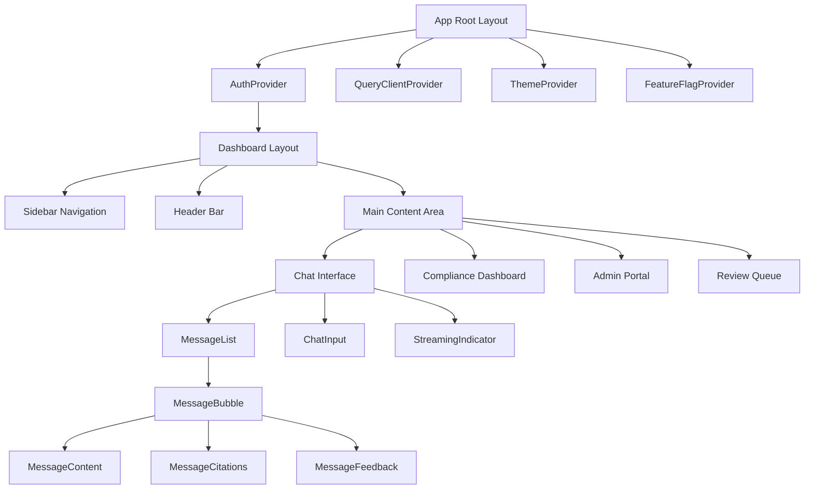

# Component Architecture — Patterns, Composition, Hooks, Context

## Overview

This document defines the component architecture for the banking GenAI frontend platform. Our approach prioritizes composability, accessibility, and clear boundaries between server-rendered and client-interactive code.

## Core Principles

### 1. Server Components by Default

Every component starts as a Server Component. Only add `"use client"` when interactivity is required.

```tsx
// ✅ GOOD: Server Component (no "use client")
// src/components/compliance/PolicySummary.tsx
import { fetchPolicyDocument } from '@/lib/api/policies';

interface PolicySummaryProps {
  policyId: string;
}

export async function PolicySummary({ policyId }: PolicySummaryProps) {
  const policy = await fetchPolicyDocument(policyId);

  return (
    <article className="prose max-w-none">
      <h2>{policy.title}</h2>
      <p className="text-muted-foreground">
        Last updated: {policy.lastUpdated.toLocaleDateString()}
      </p>
      <div dangerouslySetInnerHTML={{
        __html: sanitizeMarkdown(policy.summary),
      }} />
      <PolicyCitations citations={policy.citations} />
    </article>
  );
}

// ❌ BAD: Client Component when server would suffice
// "use client" with no interactivity
"use client";
export function PolicySummary({ policyId }: PolicySummaryProps) {
  const [policy, setPolicy] = useState(null);
  useEffect(() => {
    fetchPolicyDocument(policyId).then(setPolicy);
  }, [policyId]);
  // ... unnecessary client-side fetching
}
```

### 2. Composition Over Configuration

Build components that compose rather than accept dozens of boolean props.

```tsx
// ✅ GOOD: Compositional API
// src/components/chat/MessageBubble.tsx
interface MessageBubbleProps {
  children: React.ReactNode;
  variant: 'user' | 'assistant' | 'system';
}

export function MessageBubble({ children, variant }: MessageBubbleProps) {
  return (
    <div
      role="listitem"
      className={cn(
        'flex gap-3 px-4 py-3',
        variant === 'user' && 'bg-primary/5 justify-end',
        variant === 'assistant' && 'bg-muted/30 justify-start',
        variant === 'system' && 'bg-warning/10 justify-center',
      )}
    >
      {variant === 'assistant' && <AssistantAvatar />}
      <div className="flex-1 min-w-0">{children}</div>
      {variant === 'user' && <UserAvatar />}
    </div>
  );
}

// Usage — consumers compose the content
<MessageBubble variant="assistant">
  <MessageContent markdown={response.text} />
  <MessageCitations sources={response.citations} />
  <MessageFeedback messageId={response.id} />
</MessageBubble>

// ❌ BAD: Boolean prop explosion
interface MessageBubbleProps {
  showAvatar: boolean;
  showCitations: boolean;
  showFeedback: boolean;
  showTimestamp: boolean;
  showCopyButton: boolean;
  variant: 'user' | 'assistant' | 'system';
  // ... grows unbounded
}
```

### 3. Colocation

Keep related code together. A component, its styles, its tests, and its stories live in the same directory.

```
src/components/chat/
├── MessageBubble.tsx          # Component
├── MessageBubble.test.tsx     # Unit test
├── MessageContent.tsx         # Sub-component
├── MessageCitations.tsx       # Sub-component
├── MessageFeedback.tsx        # Sub-component
├── ChatInput.tsx
├── ChatWindow.tsx
├── useChatStream.ts           # Custom hook
└── chat.types.ts              # Shared types
```

## Component Hierarchy



## Custom Hooks

Hooks encapsulate reusable logic. Each hook should have a single responsibility.

```tsx
// src/hooks/useConversation.ts
import { useState, useCallback, useRef } from 'react';
import type { Message, Conversation } from '@/types/chat';

interface UseConversationOptions {
  conversationId?: string;
  maxMessages?: number;
  onMessage?: (message: Message) => void;
}

export function useConversation({
  conversationId,
  maxMessages = 100,
  onMessage,
}: UseConversationOptions = {}) {
  const [messages, setMessages] = useState<Message[]>([]);
  const [isStreaming, setIsStreaming] = useState(false);
  const [error, setError] = useState<Error | null>(null);
  const abortControllerRef = useRef<AbortController | null>(null);

  const sendMessage = useCallback(async (content: string) => {
    if (isStreaming) return;

    const userMessage: Message = {
      id: crypto.randomUUID(),
      role: 'user',
      content,
      timestamp: new Date(),
    };

    setMessages(prev => [...prev.slice(-(maxMessages - 1)), userMessage]);
    setIsStreaming(true);
    setError(null);

    abortControllerRef.current = new AbortController();

    try {
      const response = await fetch('/api/chat/stream', {
        method: 'POST',
        headers: { 'Content-Type': 'application/json' },
        body: JSON.stringify({
          conversationId,
          message: content,
        }),
        signal: abortControllerRef.current.signal,
      });

      if (!response.ok) {
        throw new Error(`Chat API error: ${response.status}`);
      }

      // Handle streaming response (see streaming-responses.md)
      const reader = response.body?.getReader();
      const decoder = new TextDecoder();
      let assistantContent = '';

      const assistantMessage: Message = {
        id: crypto.randomUUID(),
        role: 'assistant',
        content: '',
        timestamp: new Date(),
      };

      setMessages(prev => [...prev, assistantMessage]);

      while (reader) {
        const { done, value } = await reader.read();
        if (done) break;

        const chunk = decoder.decode(value, { stream: true });
        const lines = chunk.split('\n');

        for (const line of lines) {
          if (line.startsWith('data: ')) {
            const data = JSON.parse(line.slice(6));
            if (delta?.content) {
              assistantContent += data.delta.content;
              setMessages(prev =>
                prev.map(msg =>
                  msg.id === assistantMessage.id
                    ? { ...msg, content: assistantContent }
                    : msg,
                ),
              );
              onMessage?.({ ...assistantMessage, content: assistantContent });
            }
          }
        }
      }
    } catch (err) {
      if (err instanceof Error && err.name !== 'AbortError') {
        setError(err);
      }
    } finally {
      setIsStreaming(false);
      abortControllerRef.current = null;
    }
  }, [conversationId, isStreaming, maxMessages, onMessage]);

  const stopStreaming = useCallback(() => {
    abortControllerRef.current?.abort();
    setIsStreaming(false);
  }, []);

  return {
    messages,
    isStreaming,
    error,
    sendMessage,
    stopStreaming,
  };
}
```

```tsx
// src/hooks/useFeatureFlag.ts
import { createContext, useContext, useMemo } from 'react';

interface FeatureFlags {
  newChatInterface: boolean;
  citationDisplay: boolean;
  humanReviewFlow: boolean;
  advancedSearch: boolean;
  modelSelector: boolean;
}

interface FeatureFlagContextType {
  flags: FeatureFlags;
  isEnabled: (flag: keyof FeatureFlags) => boolean;
}

const FeatureFlagContext = createContext<FeatureFlagContextType>({
  flags: {} as FeatureFlags,
  isEnabled: () => false,
});

export function FeatureFlagProvider({
  flags,
  children,
}: {
  flags: FeatureFlags;
  children: React.ReactNode;
}) {
  const value = useMemo(
    () => ({
      flags,
      isEnabled: (flag: keyof FeatureFlags) => flags[flag] ?? false,
    }),
    [flags],
  );

  return (
    <FeatureFlagContext.Provider value={value}>
      {children}
    </FeatureFlagContext.Provider>
  );
}

export function useFeatureFlag() {
  return useContext(FeatureFlagContext);
}

// Usage in any component
function ChatInterface() {
  const { isEnabled } = useFeatureFlag();

  if (isEnabled('newChatInterface')) {
    return <NewChatUI />;
  }

  return <LegacyChatUI />;
}
```

## Context Patterns

Use Context for values that many components need. Do not use Context for rapidly changing state.

```tsx
// ✅ GOOD: Context for stable, global values
// src/contexts/SecurityClassificationContext.tsx
import { createContext, useContext, useMemo } from 'react';

export type SecurityClassification =
  | 'public'
  | 'internal'
  | 'confidential'
  | 'restricted';

interface SecurityContextValue {
  classification: SecurityClassification;
  canAccess: (required: SecurityClassification) => boolean;
}

const SecurityClassificationContext = createContext<SecurityContextValue>({
  classification: 'public',
  canAccess: () => false,
});

const classificationLevels: Record<SecurityClassification, number> = {
  public: 0,
  internal: 1,
  confidential: 2,
  restricted: 3,
};

export function SecurityClassificationProvider({
  classification,
  children,
}: {
  classification: SecurityClassification;
  children: React.ReactNode;
}) {
  const value = useMemo<SecurityContextValue>(() => ({
    classification,
    canAccess: (required: SecurityClassification) =>
      classificationLevels[classification] >= classificationLevels[required],
  }), [classification]);

  return (
    <SecurityClassificationContext.Provider value={value}>
      {children}
    </SecurityClassificationContext.Provider>
  );
}

// ❌ BAD: Context for rapidly changing state
// Don't put streaming text tokens in context — every token
// update re-renders every context consumer
```

## Compound Components

For complex components with flexible layouts, use the compound component pattern.

```tsx
// src/components/forms/FormGroup.tsx
import { createContext, useContext, useId } from 'react';

interface FormGroupContextValue {
  fieldId: string;
  hasError: boolean;
}

const FormGroupContext = createContext<FormGroupContextValue>({
  fieldId: '',
  hasError: false,
});

function FormGroup({
  children,
  error,
  ...props
}: React.HTMLAttributes<HTMLDivElement> & { error?: string }) {
  const fieldId = useId();

  return (
    <FormGroupContext.Provider value={{ fieldId, hasError: !!error }}>
      <div className="space-y-2" {...props}>
        {children}
        {error && (
          <p className="text-sm text-destructive" role="alert" aria-live="polite">
            {error}
          </p>
        )}
      </div>
    </FormGroupContext.Provider>
  );
}

function FormGroupLabel({
  children,
  required,
}: {
  children: React.ReactNode;
  required?: boolean;
}) {
  const { fieldId } = useContext(FormGroupContext);

  return (
    <label htmlFor={fieldId} className="text-sm font-medium">
      {children}
      {required && <span className="text-destructive ml-1" aria-hidden="true">*</span>}
    </label>
  );
}

function FormGroupInput(props: React.InputHTMLAttributes<HTMLInputElement>) {
  const { fieldId } = useContext(FormGroupContext);

  return (
    <input
      id={fieldId}
      className="flex h-10 w-full rounded-md border border-input bg-background px-3 py-2 text-sm"
      {...props}
    />
  );
}

// Attach as properties for dot notation API
FormGroup.Label = FormGroupLabel;
FormGroup.Input = FormGroupInput;

// Usage:
<FormGroup error={errors.accountNumber}>
  <FormGroup.Label required>Account Number</FormGroup.Label>
  <FormGroup.Input
    type="text"
    name="accountNumber"
    aria-describedby="account-help"
  />
</FormGroup>
```

## Common Mistakes and Anti-Patterns

### 1. Prop Drilling Instead of Composition

```tsx
// ❌ BAD: Passing props through 4 levels
function App({ user }) {
  return <Layout user={user}><Dashboard user={user}><Panel user={user}><Greeting user={user} /></Panel></Dashboard></Layout>;
}

// ✅ GOOD: Context for global values, composition for structure
function App({ user }) {
  return (
    <UserProvider user={user}>
      <Layout>
        <Dashboard>
          <Panel>
            <Greeting /> {/* reads from UserContext */}
          </Panel>
        </Dashboard>
      </Layout>
    </UserProvider>
  );
}
```

### 2. useEffect for Data Fetching

```tsx
// ❌ BAD: Manual fetch in useEffect
function PolicyList() {
  const [policies, setPolicies] = useState([]);
  const [loading, setLoading] = useState(true);

  useEffect(() => {
    fetch('/api/policies')
      .then(r => r.json())
      .then(setPolicies)
      .finally(() => setLoading(false));
  }, []);

  if (loading) return <Spinner />;
  return <ul>{policies.map(p => <li key={p.id}>{p.title}</li>)}</ul>;
}

// ✅ GOOD: React Query handles all the boilerplate
function PolicyList() {
  const { data: policies, isLoading } = useQuery({
    queryKey: ['policies'],
    queryFn: () => fetchPolicies(),
  });

  if (isLoading) return <Spinner />;
  return <ul>{policies.map(p => <li key={p.id}>{p.title}</li>)}</ul>;
}
```

### 3. Inline Styles Instead of Design Tokens

```tsx
// ❌ BAD: Inline magic numbers
<div style={{ padding: '16px', color: '#1a73e8', fontSize: '14px' }} />

// ✅ GOOD: Design token classes
<div className="p-4 text-primary text-sm" />
```

## Performance Guidelines

- Keep Client Components small and focused
- Use `React.memo()` only when profiling shows re-render issues
- Avoid creating objects/functions in render that become dependency arrays
- Use `useId()` for accessible form labels, not manual IDs
- Server Components cannot use hooks, Context, or event handlers — by design

## Cross-References

- `./state-management.md` — When to use Context vs Zustand vs React Query
- `./accessibility.md` — ARIA patterns for compound components
- `./design-systems.md` — Design system component conventions
- `./genai-chat-interfaces.md` — Chat-specific component patterns
- `./error-boundaries.md` — Error boundary placement strategy
- `./role-based-ui.md` — Feature flag provider patterns

## Interview Questions

1. When do you choose a Server Component over a Client Component?
2. Explain the compound component pattern and when you would use it.
3. How do you prevent unnecessary re-renders in a Context Provider?
4. Design a custom hook for managing a multi-step form with validation.
5. Why is `useEffect` for data fetching an anti-pattern in modern React?
