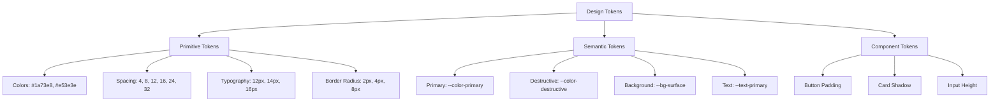

# Design Systems — Building and Maintaining a Design System, Component Library, Tokens

## Overview

A design system is the single source of truth for UI components, styles, and patterns. For a banking GenAI platform, the design system ensures consistency, accessibility, and compliance across all interfaces.

## Design Token Architecture



### Token Definition

```css
/* src/styles/tokens.css */
:root {
  /* Primitive tokens — raw values */
  --color-blue-50: #eff6ff;
  --color-blue-100: #dbeafe;
  --color-blue-500: #3b82f6;
  --color-blue-600: #2563eb;
  --color-blue-700: #1d4ed8;

  --color-red-50: #fef2f2;
  --color-red-100: #fee2e2;
  --color-red-500: #ef4444;
  --color-red-600: #dc2626;
  --color-red-700: #b91c1c;

  --color-gray-50: #f9fafb;
  --color-gray-100: #f3f4f6;
  --color-gray-500: #6b7280;
  --color-gray-600: #4b5563;
  --color-gray-700: #374151;
  --color-gray-900: #111827;

  --spacing-0: 0px;
  --spacing-1: 4px;
  --spacing-2: 8px;
  --spacing-3: 12px;
  --spacing-4: 16px;
  --spacing-6: 24px;
  --spacing-8: 32px;

  --font-size-xs: 0.75rem;
  --font-size-sm: 0.875rem;
  --font-size-base: 1rem;
  --font-size-lg: 1.125rem;
  --font-size-xl: 1.25rem;
  --font-size-2xl: 1.5rem;

  --radius-sm: 2px;
  --radius-md: 4px;
  --radius-lg: 8px;

  /* Semantic tokens — mapped to primitives */
  --color-primary: var(--color-blue-600);
  --color-primary-hover: var(--color-blue-700);
  --color-primary-foreground: #ffffff;

  --color-destructive: var(--color-red-600);
  --color-destructive-hover: var(--color-red-700);

  --color-muted: var(--color-gray-100);
  --color-muted-foreground: var(--color-gray-500);

  --color-border: var(--color-gray-200);
  --color-input: var(--color-gray-200);

  --bg-background: #ffffff;
  --bg-surface: #ffffff;
  --bg-muted: var(--color-gray-50);

  --text-primary: var(--color-gray-900);
  --text-secondary: var(--color-gray-600);
  --text-muted: var(--color-gray-500);
  --text-destructive: var(--color-red-600);

  --shadow-sm: 0 1px 2px rgba(0, 0, 0, 0.05);
  --shadow-md: 0 4px 6px rgba(0, 0, 0, 0.1);

  /* Dark mode overrides */
  &.dark {
    --color-primary: var(--color-blue-500);
    --color-primary-hover: var(--color-blue-600);
    --color-destructive: var(--color-red-500);

    --bg-background: var(--color-gray-900);
    --bg-surface: #1f2937;
    --bg-muted: #1f2937;

    --text-primary: #f9fafb;
    --text-secondary: #d1d5db;
    --text-muted: #9ca3af;

    --color-border: #374151;
    --color-input: #374151;
  }
}
```

### Tailwind Configuration

```ts
// tailwind.config.ts
import type { Config } from 'tailwindcss';

export default {
  darkMode: 'class',
  content: ['./src/**/*.{ts,tsx}'],
  theme: {
    extend: {
      colors: {
        primary: {
          DEFAULT: 'hsl(var(--color-primary))',
          hover: 'hsl(var(--color-primary-hover))',
          foreground: 'hsl(var(--color-primary-foreground))',
        },
        destructive: {
          DEFAULT: 'hsl(var(--color-destructive))',
          hover: 'hsl(var(--color-destructive-hover))',
        },
        muted: {
          DEFAULT: 'hsl(var(--color-muted))',
          foreground: 'hsl(var(--color-muted-foreground))',
        },
        background: 'hsl(var(--bg-background))',
        surface: 'hsl(var(--bg-surface))',
        border: 'hsl(var(--color-border))',
        input: 'hsl(var(--color-input))',
      },
      spacing: {
        '1': 'var(--spacing-1)',
        '2': 'var(--spacing-2)',
        '3': 'var(--spacing-3)',
        '4': 'var(--spacing-4)',
        '6': 'var(--spacing-6)',
        '8': 'var(--spacing-8)',
      },
      borderRadius: {
        sm: 'var(--radius-sm)',
        md: 'var(--radius-md)',
        lg: 'var(--radius-lg)',
      },
    },
  },
  plugins: [require('@tailwindcss/typography'), require('@tailwindcss/forms')],
} satisfies Config;
```

## Core Component — Button

```tsx
// src/components/ui/Button.tsx
import { forwardRef } from 'react';
import { cn } from '@/lib/utils';

export interface ButtonProps extends React.ButtonHTMLAttributes<HTMLButtonElement> {
  variant?: 'primary' | 'secondary' | 'destructive' | 'ghost' | 'link';
  size?: 'sm' | 'md' | 'lg';
  isLoading?: boolean;
}

export const Button = forwardRef<HTMLButtonElement, ButtonProps>(
  (
    {
      className,
      variant = 'primary',
      size = 'md',
      isLoading = false,
      disabled,
      children,
      ...props
    },
    ref,
  ) => {
    const variantClasses = {
      primary: 'bg-primary text-primary-foreground hover:bg-primary-hover focus-visible:ring-primary',
      secondary: 'bg-surface text-primary border border-border hover:bg-muted',
      destructive: 'bg-destructive text-white hover:bg-destructive-hover',
      ghost: 'hover:bg-muted text-primary',
      link: 'text-primary underline-offset-4 hover:underline',
    };

    const sizeClasses = {
      sm: 'h-8 px-3 text-xs',
      md: 'h-10 px-4 text-sm',
      lg: 'h-12 px-6 text-base',
    };

    return (
      <button
        ref={ref}
        className={cn(
          'inline-flex items-center justify-center rounded-md font-medium transition-colors',
          'focus-visible:outline-none focus-visible:ring-2 focus-visible:ring-offset-2',
          'disabled:pointer-events-none disabled:opacity-50',
          'cursor-pointer',
          variantClasses[variant],
          sizeClasses[size],
          className,
        )}
        disabled={disabled || isLoading}
        {...props}
      >
        {isLoading && (
          <svg className="mr-2 h-4 w-4 animate-spin" aria-hidden="true">
            <circle cx="12" cy="12" r="10" stroke="currentColor" strokeWidth="4" fill="none" opacity="0.25" />
            <path
              fill="currentColor"
              d="M4 12a8 8 0 018-8V0C5.373 0 0 5.373 0 12h4z"
              opacity="0.75"
            />
          </svg>
        )}
        {children}
      </button>
    );
  },
);

Button.displayName = 'Button';
```

## Core Component — Card

```tsx
// src/components/ui/Card.tsx
import { forwardRef } from 'react';
import { cn } from '@/lib/utils';

export const Card = forwardRef<HTMLDivElement, React.HTMLAttributes<HTMLDivElement>>(
  ({ className, ...props }, ref) => (
    <div
      ref={ref}
      className={cn('rounded-lg border bg-surface shadow-sm', className)}
      {...props}
    />
  ),
);
Card.displayName = 'Card';

export const CardHeader = forwardRef<HTMLDivElement, React.HTMLAttributes<HTMLDivElement>>(
  ({ className, ...props }, ref) => (
    <div ref={ref} className={cn('flex flex-col space-y-1.5 p-6 pb-3', className)} {...props} />
  ),
);
CardHeader.displayName = 'CardHeader';

export const CardTitle = forwardRef<HTMLParagraphElement, React.HTMLAttributes<HTMLHeadingElement>>(
  ({ className, ...props }, ref) => (
    <h3
      ref={ref}
      className={cn('text-lg font-semibold leading-none tracking-tight', className)}
      {...props}
    />
  ),
);
CardTitle.displayName = 'CardTitle';

export const CardContent = forwardRef<HTMLDivElement, React.HTMLAttributes<HTMLDivElement>>(
  ({ className, ...props }, ref) => (
    <div ref={ref} className={cn('p-6 pt-0', className)} {...props} />
  ),
);
CardContent.displayName = 'CardContent';
```

## Design System Governance

### Component Lifecycle

```
1. Proposal — Engineer or designer proposes a new component
2. Design — Figma mockups with variants and states
3. Review — Design system team reviews for consistency and a11y
4. Implementation — Code with tests, stories, and documentation
5. Release — Published in design system package
6. Adoption — Teams migrate from local implementations
7. Deprecation — Marked deprecated, migration guide provided
8. Removal — Removed in next major version
```

### Adding a New Component

```
src/components/ui/NewComponent/
├── NewComponent.tsx         # Component implementation
├── NewComponent.test.tsx    # Unit tests
├── NewComponent.stories.tsx # Storybook stories
├── NewComponent.docs.md     # Usage documentation
└── index.ts                 # Barrel export
```

### Documentation Template

```tsx
// src/components/ui/Badge/Badge.docs.md
# Badge

Visual indicator for status, category, or count.

## Usage

```tsx
import { Badge } from '@/components/ui';

<Badge variant="default">New</Badge>
<Badge variant="secondary">Internal</Badge>
<Badge variant="destructive">Violation</Badge>
<Badge variant="outline">Pending</Badge>
```

## Variants

| Variant | Use Case | Example |
|---------|----------|---------|
| default | Primary status | `default` |
| secondary | Supplementary info | `secondary` |
| destructive | Error, violation | `destructive` |
| outline | Subtle indicator | `outline` |
| success | Positive status | `success` |

## Accessibility

- Sufficient color contrast (4.5:1 minimum)
- Not used as the sole means of conveying information
- Screen reader compatible

## Compliance Notes

- All compliance status badges must use the semantic color tokens
- Never create custom badge variants — request additions to the design system
```

## Banking-Specific Components

### Compliance Status Badge

```tsx
// src/components/compliance/StatusBadge.tsx
import { cn } from '@/lib/utils';

export type ComplianceStatus = 'compliant' | 'pending' | 'violation' | 'not-applicable';

interface StatusBadgeProps {
  status: ComplianceStatus;
}

const STATUS_CONFIG: Record<ComplianceStatus, { label: string; className: string }> = {
  compliant: { label: 'Compliant', className: 'bg-green-100 text-green-800 dark:bg-green-900/30 dark:text-green-400' },
  pending: { label: 'Pending Review', className: 'bg-yellow-100 text-yellow-800 dark:bg-yellow-900/30 dark:text-yellow-400' },
  violation: { label: 'Violation', className: 'bg-destructive/10 text-destructive' },
  'not-applicable': { label: 'N/A', className: 'bg-muted text-muted-foreground' },
};

export function StatusBadge({ status }: StatusBadgeProps) {
  const config = STATUS_CONFIG[status];

  return (
    <span
      className={cn('inline-flex items-center rounded-full px-2.5 py-0.5 text-xs font-medium', config.className)}
      role="status"
    >
      {config.label}
    </span>
  );
}
```

### Audit Log Entry

```tsx
// src/components/audit/AuditLogEntry.tsx
import type { AuditLog } from '@/types';

interface AuditLogEntryProps {
  log: AuditLog;
}

export function AuditLogEntry({ log }: AuditLogEntryProps) {
  return (
    <div className="flex items-start gap-3 border-b py-3 px-4">
      <div className="flex-1 min-w-0">
        <div className="flex items-center gap-2">
          <span className="text-sm font-medium">{log.user}</span>
          <span className="text-xs text-muted-foreground">
            {log.timestamp.toLocaleString()}
          </span>
        </div>
        <p className="text-sm text-muted-foreground mt-1">
          <span className="font-medium text-primary">{log.action}</span>
          {' on '}
          <span className="font-medium">{log.resource}</span>
        </p>
        {log.details && (
          <p className="text-xs text-muted-foreground mt-1 truncate">
            {log.details}
          </p>
        )}
      </div>
    </div>
  );
}
```

## Common Mistakes

### 1. Bypassing the Design System

```tsx
// ❌ BAD: Inline styles instead of tokens
<div style={{ padding: '13px', color: '#1a73e8', borderRadius: '5px' }} />

// ✅ GOOD: Design system components and tokens
<Card className="p-4">
  <p className="text-primary">{content}</p>
</Card>
```

### 2. Creating Ad-Hoc Variants

```tsx
// ❌ BAD: Every team invents their own button style
<Button className="bg-indigo-500 hover:bg-indigo-600 rounded-full" />

// ✅ GOOD: Request new variant in design system
// Submit a component change request to the design system team
```

### 3. Not Documenting Components

Every design system component needs documentation. If it is not documented, it does not exist.

## Cross-References

- `./design-systems.md` — This document
- `./accessibility.md` — Accessibility requirements for all components
- `./component-architecture.md` — Component composition patterns
- `./building-enterprise-uis.md` — Complex UI built from design system
- `./performance-optimization.md` — Design system bundle size management

## Interview Questions

1. How do you structure a design token system that supports theming?
2. What is the lifecycle of adding a new component to a design system?
3. How do you ensure design system adoption across multiple teams?
4. Design a Button component that supports variants, sizes, and loading states.
5. How do you handle design system versioning and migration?
