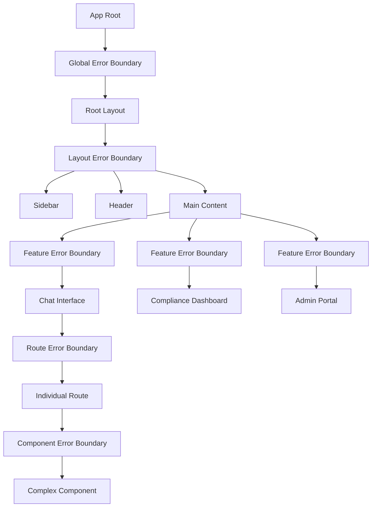

# Error Boundaries — Graceful Degradation, User-Friendly Errors

## Overview

Error boundaries are the last line of defense when React components fail. In a banking application, a crashed component should never result in a white screen or exposed stack trace. Every error must degrade gracefully and provide the user with a clear, helpful message.

## Error Boundary Placement Strategy



### Three-Tier Strategy

1. **Route-level boundary**: Catches errors in entire route segments
2. **Feature-level boundary**: Catches errors in major features (chat, dashboard, admin)
3. **Component-level boundary**: Catches errors in complex, risky components

## Route Error Boundary (Next.js)

Next.js has built-in error boundaries for route segments. Customize them for banking:

```tsx
// src/app/(dashboard)/error.tsx
'use client';

import { useEffect } from 'react';

export default function DashboardError({
  error,
  reset,
}: {
  error: Error & { digest?: string };
  reset: () => void;
}) {
  useEffect(() => {
    // Log to our error tracking service
    reportErrorToSentry({
      error,
      context: 'dashboard-route',
    });
  }, [error]);

  return (
    <div className="flex min-h-screen items-center justify-center">
      <div className="text-center space-y-4 max-w-md px-6">
        <div className="mx-auto flex h-12 w-12 items-center justify-center rounded-full bg-destructive/10">
          <AlertTriangleIcon className="h-6 w-6 text-destructive" />
        </div>
        <h2 className="text-lg font-semibold">Something went wrong</h2>
        <p className="text-sm text-muted-foreground">
          We were unable to load this page. Please try again. If the problem persists,
          contact the platform team with reference ID shown below.
        </p>
        <div className="flex gap-3 justify-center">
          <button
            onClick={() => reset()}
            className="px-4 py-2 rounded-md bg-primary text-primary-foreground text-sm font-medium"
          >
            Try Again
          </button>
          <a
            href="/dashboard"
            className="px-4 py-2 rounded-md border text-sm font-medium"
          >
            Return to Dashboard
          </a>
        </div>
        {process.env.NODE_ENV === 'development' && (
          <pre className="text-xs text-muted-foreground mt-4 text-left bg-muted p-3 rounded">
            {error.message}
          </pre>
        )}
      </div>
    </div>
  );
}
```

## Feature-Level Error Boundary

```tsx
// src/components/shared/ErrorBoundary.tsx
import { Component, type ErrorInfo, type ReactNode } from 'react';

interface ErrorBoundaryProps {
  children: ReactNode;
  fallback?: ReactNode;
  name: string;           // Feature name for logging
  onError?: (error: Error, info: ErrorInfo) => void;
}

interface ErrorBoundaryState {
  hasError: boolean;
  error: Error | null;
}

export class ErrorBoundary extends Component<ErrorBoundaryProps, ErrorBoundaryState> {
  constructor(props: ErrorBoundaryProps) {
    super(props);
    this.state = { hasError: false, error: null };
  }

  static getDerivedStateFromError(error: Error): ErrorBoundaryState {
    return { hasError: true, error };
  }

  componentDidCatch(error: Error, errorInfo: ErrorInfo) {
    // Log to error tracking
    reportErrorToSentry({
      error,
      componentStack: errorInfo.componentStack,
      feature: this.props.name,
    });

    // Call custom handler
    this.props.onError?.(error, errorInfo);
  }

  render() {
    if (this.state.hasError) {
      return (
        this.props.fallback ?? (
          <DefaultErrorFallback
            feature={this.props.name}
            error={this.state.error}
            onRetry={() => this.setState({ hasError: false, error: null })}
          />
        )
      );
    }

    return this.props.children;
  }
}
```

## Default Error Fallback

```tsx
// src/components/shared/DefaultErrorFallback.tsx
interface DefaultErrorFallbackProps {
  feature: string;
  error: Error | null;
  onRetry: () => void;
}

function DefaultErrorFallback({ feature, error, onRetry }: DefaultErrorFallbackProps) {
  return (
    <div
      role="alert"
      aria-live="assertive"
      className="rounded-lg border border-destructive/50 bg-destructive/5 p-6"
    >
      <div className="flex items-start gap-3">
        <AlertCircleIcon className="h-5 w-5 text-destructive mt-0.5" />
        <div className="flex-1 space-y-2">
          <h3 className="font-medium text-destructive">
            {feature} is temporarily unavailable
          </h3>
          <p className="text-sm text-muted-foreground">
            This feature encountered an unexpected error. Our team has been notified.
            You can try again or continue using other features.
          </p>
          <div className="flex gap-2">
            <button onClick={onRetry} className="text-sm text-primary underline">
              Try Again
            </button>
            <span className="text-sm text-muted-foreground">or</span>
            <a href="/dashboard" className="text-sm text-primary underline">
              Return to Dashboard
            </a>
          </div>
        </div>
      </div>
    </div>
  );
}
```

## Usage in Features

```tsx
// src/app/(dashboard)/chat/page.tsx
import { ErrorBoundary } from '@/components/shared/ErrorBoundary';
import { ChatInterface } from '@/components/chat/ChatInterface';
import { ConversationList } from '@/components/chat/ConversationList';

export default function ChatPage() {
  return (
    <div className="flex h-full">
      {/* Conversation list — isolated error boundary */}
      <ErrorBoundary name="conversation-list" fallback={<ConversationListSkeleton />}>
        <ConversationList />
      </ErrorBoundary>

      {/* Chat interface — isolated error boundary */}
      <ErrorBoundary name="chat-interface" fallback={<ChatFallback />}>
        <ChatInterface />
      </ErrorBoundary>
    </div>
  );
}

function ChatFallback() {
  return (
    <div className="flex-1 flex items-center justify-center">
      <div className="text-center space-y-3">
        <p className="text-muted-foreground">Chat is temporarily unavailable</p>
        <a href="/dashboard" className="text-sm text-primary underline">
          Return to Dashboard
        </a>
      </div>
    </div>
  );
}
```

## Error Tracking Integration

```tsx
// src/lib/error-tracking.ts
import * as Sentry from '@sentry/nextjs';

interface ReportErrorOptions {
  error: Error;
  componentStack?: string | null;
  feature?: string;
  userId?: string;
  context?: Record<string, unknown>;
}

export function reportErrorToSentry({
  error,
  componentStack,
  feature,
  userId,
  context,
}: ReportErrorOptions) {
  Sentry.withScope((scope) => {
    scope.setTag('feature', feature ?? 'unknown');
    scope.setTag('error_type', error.name);

    if (userId) {
      scope.setUser({ id: userId });
    }

    if (context) {
      scope.setContext('component', context);
    }

    if (componentStack) {
      scope.setExtra('componentStack', componentStack);
    }

    Sentry.captureException(error);
  });
}
```

## Async Error Handling (Server Components)

Server Components cannot use error boundaries. Use Next.js `error.tsx` files and try/catch in data fetching.

```tsx
// src/app/(dashboard)/compliance/page.tsx
import { ErrorBoundary } from '@/components/shared/ErrorBoundary';

export default async function CompliancePage() {
  // Try/catch in Server Component — errors bubble to error.tsx
  let complianceData;
  try {
    complianceData = await fetchComplianceDashboard();
  } catch (error) {
    // Log server-side error
    console.error('Failed to load compliance dashboard', error);
    // Re-throw to trigger Next.js error boundary
    throw error;
  }

  return (
    <div className="space-y-6">
      <h1 className="text-2xl font-bold">Compliance Dashboard</h1>
      <ErrorBoundary name="compliance-metrics">
        <ComplianceMetrics data={complianceData.metrics} />
      </ErrorBoundary>
      <ErrorBoundary name="compliance-alerts">
        <ComplianceAlerts alerts={complianceData.alerts} />
      </ErrorBoundary>
    </div>
  );
}

// src/app/(dashboard)/compliance/error.tsx
'use client';
// ... same as route error boundary above
```

## Graceful Degradation Patterns

### Partial Data Rendering

```tsx
// When some data fails to load, still show what we can
async function ComplianceDashboard() {
  const [metrics, alerts, trends] = await Promise.allSettled([
    fetchMetrics(),
    fetchAlerts(),
    fetchTrends(),
  ]);

  return (
    <div className="space-y-6">
      {metrics.status === 'fulfilled' ? (
        <MetricsPanel data={metrics.value} />
      ) : (
        <DataFallback title="Metrics" />
      )}

      {alerts.status === 'fulfilled' ? (
        <AlertsPanel data={alerts.value} />
      ) : (
        <DataFallback title="Alerts" />
      )}

      {trends.status === 'fulfilled' ? (
        <TrendsChart data={trends.value} />
      ) : (
        <DataFallback title="Trends" />
      )}
    </div>
  );
}

function DataFallback({ title }: { title: string }) {
  return (
    <div className="rounded-lg border p-6 text-center" role="status">
      <p className="text-sm text-muted-foreground">
        Unable to load {title.toLowerCase()} at this time
      </p>
    </div>
  );
}
```

## Common Mistakes

### 1. No Error Boundaries at All

A single component crash crashes the entire React tree. Every complex component should be wrapped in an ErrorBoundary.

### 2. Exposing Error Details to Users

```tsx
// ❌ BAD: Exposing internals
<div>{error.stack}</div>
<div>{error.message}</div>

// ✅ GOOD: User-friendly messages
<div>We were unable to load this feature. Please try again.</div>
```

### 3. Not Logging Errors

Error boundaries that swallow errors without logging are worse than no boundaries at all. Every caught error must be reported.

### 4. Catching Errors That Should Propagate

```tsx
// ❌ BAD: Wrapping everything in boundaries
<ErrorBoundary name="tiny-thing">
  <span>{text}</span>
</ErrorBoundary>

// ✅ GOOD: Only wrap meaningful feature boundaries
<ErrorBoundary name="chat-interface">
  <ChatInterface />
</ErrorBoundary>
```

## Cross-References

- `./frontend-observability.md` — Sentry integration, error monitoring
- `./error-boundaries.md` — This document
- `./component-architecture.md` — Component composition with error boundaries
- `./genai-chat-interfaces.md` — Error handling in chat UI
- `./streaming-responses.md` — Handling streaming errors
- `../incident-management/` — Incident response for frontend failures

## Interview Questions

1. Where do you place error boundaries in a React application and why?
2. How do error boundaries differ from try/catch blocks?
3. Design an error boundary that logs to Sentry and provides a retry mechanism.
4. How do you handle errors in Server Components vs Client Components?
5. What is the difference between `error.tsx` and a custom ErrorBoundary class?
6. How do you implement partial rendering when some data sources fail?
