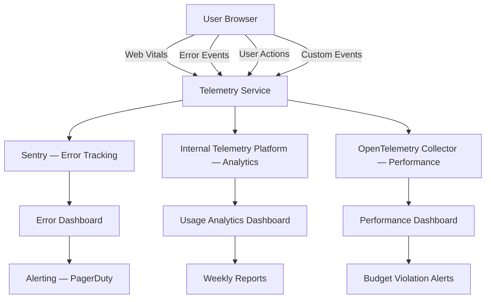

# Frontend Observability — Error Tracking, Performance Monitoring, User Analytics

## Overview

Frontend observability answers three questions:
1. **Is it broken?** — Error tracking and alerting
2. **Is it slow?** — Performance monitoring
3. **Is it being used?** — User analytics and telemetry

In a banking GenAI platform, we need all three to ensure reliability, compliance, and continuous improvement.

## Architecture



## Error Tracking — Sentry Integration

### Setup

```tsx
// sentry.client.config.ts
import * as Sentry from '@sentry/nextjs';

Sentry.init({
  dsn: process.env.NEXT_PUBLIC_SENTRY_DSN,
  environment: process.env.NODE_ENV,
  release: process.env.NEXT_PUBLIC_SENTRY_RELEASE,

  // Capture 10% of transactions in production
  tracesSampleRate: process.env.NODE_ENV === 'production' ? 0.1 : 1.0,

  // Replays
  replaysSessionSampleRate: 0.01,  // 1% of sessions
  replaysOnErrorSampleRate: 1.0,   // 100% of sessions with errors

  // Filter out noise
  ignoreErrors: [
    'ResizeObserver loop limit exceeded',
    'Non-Error promise rejection captured with keys: undefined',
    "Can't find variable: gtag",  // Ad blocker noise
    'top.GLOBALS',  // Chrome extension noise
  ],

  // Remove PII from breadcrumbs
  beforeBreadcrumb(breadcrumb) {
    // Strip PII from network breadcrumbs
    if (breadcrumb.category === 'fetch') {
      breadcrumb.data = breadcrumb.data
        ? Object.fromEntries(
            Object.entries(breadcrumb.data).filter(
              ([key]) => !['password', 'token', 'secret', 'ssn', 'accountNumber'].includes(key),
            ),
          )
        : breadcrumb.data;
    }
    return breadcrumb;
  },

  // Tag with banking context
  beforeSend(event) {
    // Add environment and region tags
    event.tags = {
      ...event.tags,
      environment: process.env.NODE_ENV,
      region: process.env.REGION ?? 'unknown',
    };

    // Don't send user's PII to Sentry
    if (event.user) {
      event.user = {
        id: event.user.id,  // Only user ID, no email or name
        role: event.user.role,
      };
    }

    return event;
  },
});
```

### Custom Error Reporting

```tsx
// src/lib/error-reporting.ts
import * as Sentry from '@sentry/nextjs';

interface ReportErrorOptions {
  error: Error;
  feature?: string;
  userId?: string;
  context?: Record<string, unknown>;
  level?: 'fatal' | 'error' | 'warning' | 'info';
}

export function reportError({
  error,
  feature,
  userId,
  context,
  level = 'error',
}: ReportErrorOptions) {
  Sentry.withScope((scope) => {
    scope.setLevel(Sentry.SeverityLevel[level]);
    scope.setTag('feature', feature ?? 'unknown');

    if (userId) {
      scope.setUser({ id: userId });
    }

    if (context) {
      scope.setContext('details', context);
    }

    Sentry.captureException(error);
  });
}
```

### Error Boundary Integration

```tsx
// src/components/shared/ErrorBoundary.tsx
import { Component, type ErrorInfo, type ReactNode } from 'react';
import { reportError } from '@/lib/error-reporting';

export class ErrorBoundary extends Component<
  { children: ReactNode; name: string },
  { hasError: boolean }
> {
  constructor(props: { children: ReactNode; name: string }) {
    super(props);
    this.state = { hasError: false };
  }

  static getDerivedStateFromError() {
    return { hasError: true };
  }

  componentDidCatch(error: Error, errorInfo: ErrorInfo) {
    reportError({
      error,
      feature: this.props.name,
      context: { componentStack: errorInfo.componentStack },
    });
  }

  render() {
    if (this.state.hasError) {
      return <ErrorFallback feature={this.props.name} />;
    }
    return this.props.children;
  }
}
```

## Performance Monitoring — Web Vitals

```tsx
// src/lib/performance-monitoring.ts
import type { Metric } from 'next/web-vitals';

const performanceBudgets = {
  FCP: 1500,    // First Contentful Paint
  LCP: 2500,    // Largest Contentful Paint
  INP: 200,     // Interaction to Next Paint
  CLS: 0.1,     // Cumulative Layout Shift
  TTFB: 800,    // Time to First Byte
};

export function reportWebVital(metric: Metric) {
  const roundedValue = Math.round(metric.value * 100) / 100;
  const budget = performanceBudgets[metric.name as keyof typeof performanceBudgets];
  const isOverBudget = budget ? roundedValue > budget : false;

  // Send to telemetry
  sendToTelemetry({
    type: 'web-vital',
    name: metric.name,
    value: roundedValue,
    rating: metric.rating,
    delta: metric.delta,
    isOverBudget,
    budget,
    url: window.location.href,
    timestamp: Date.now(),
  });

  // Alert if over budget in production
  if (isOverBudget && process.env.NODE_ENV === 'production') {
    reportError({
      error: new Error(`Performance budget exceeded: ${metric.name} = ${roundedValue}ms (budget: ${budget}ms)`),
      feature: 'performance-budget',
      level: 'warning',
      context: { metric: metric.name, value: roundedValue, budget },
    });
  }
}

// Usage in layout
'use client';
import { useReportWebVitals } from 'next/web-vitals';

export function WebVitalsReporter() {
  useReportWebVitals(reportWebVital);
  return null;
}
```

## User Telemetry

```tsx
// src/lib/telemetry.ts
interface TelemetryEvent {
  type: string;
  event: string;
  properties: Record<string, unknown>;
  timestamp: number;
  userId?: string;
  sessionId: string;
  url: string;
}

let sessionId: string;
function getSessionId(): string {
  if (!sessionId) {
    sessionId = crypto.randomUUID();
  }
  return sessionId;
}

export function trackEvent(event: Omit<TelemetryEvent, 'sessionId' | 'url' | 'timestamp'>) {
  const telemetryEvent: TelemetryEvent = {
    ...event,
    sessionId: getSessionId(),
    url: window.location.href,
    timestamp: Date.now(),
  };

  // Batch and send to telemetry endpoint
  telemetryQueue.push(telemetryEvent);
  if (telemetryQueue.length >= 10) {
    flushTelemetry();
  }
}

const telemetryQueue: TelemetryEvent[] = [];
let flushTimer: NodeJS.Timeout | null = null;

function flushTelemetry() {
  if (telemetryQueue.length === 0) return;

  const events = telemetryQueue.splice(0);

  navigator.sendBeacon?.(
    '/api/telemetry',
    JSON.stringify({ events }),
  );
}

// Flush on page unload
window.addEventListener('beforeunload', () => {
  flushTelemetry();
});

// Flush periodically
flushTimer = setInterval(flushTelemetry, 30_000);
```

### Banking-Specific Events

```tsx
// src/lib/telemetry-events.ts
// Track key user actions for compliance and analytics

export function trackConversationStarted(model: string) {
  trackEvent({
    type: 'user-action',
    event: 'conversation_started',
    properties: { model },
  });
}

export function trackMessageSent(messageLength: number, hasCodeBlock: boolean) {
  trackEvent({
    type: 'user-action',
    event: 'message_sent',
    properties: { messageLength, hasCodeBlock },
  });
}

export function trackFeedbackSubmitted(rating: 'thumbs-up' | 'thumbs-down', hasComment: boolean) {
  trackEvent({
    type: 'user-action',
    event: 'feedback_submitted',
    properties: { rating, hasComment },
  });
}

export function trackPolicyViewed(policyId: string, policyCategory: string) {
  trackEvent({
    type: 'user-action',
    event: 'policy_viewed',
    properties: { policyId, policyCategory },
  });
}

export function trackComplianceReportExported(reportType: string) {
  trackEvent({
    type: 'user-action',
    event: 'compliance_report_exported',
    properties: { reportType },
  });
}
```

## Custom Dashboards

### Frontend Health Dashboard

```tsx
// src/app/(dashboard)/admin/frontend-health/page.tsx
import { Suspense } from 'react';

export default async function FrontendHealthPage() {
  return (
    <div className="space-y-6">
      <h1 className="text-2xl font-bold">Frontend Health Dashboard</h1>

      <div className="grid grid-cols-1 md:grid-cols-3 gap-4">
        <Suspense fallback={<MetricCardSkeleton />}>
          <ErrorRateCard />
        </Suspense>
        <Suspense fallback={<MetricCardSkeleton />}>
          <PerformanceBudgetCard />
        </Suspense>
        <Suspense fallback={<MetricCardSkeleton />}>
          <ActiveUsersCard />
        </Suspense>
      </div>

      <Suspense fallback={<ChartSkeleton />}>
        <ErrorTrendChart />
      </Suspense>

      <Suspense fallback={<TableSkeleton />}>
        <TopErrorsTable />
      </Suspense>
    </div>
  );
}
```

## Monitoring GenAI-Specific Metrics

```tsx
// src/lib/ai-telemetry.ts
// Track AI-specific frontend metrics

export function trackStreamingStarted() {
  trackEvent({
    type: 'ai-metric',
    event: 'streaming_started',
    properties: {},
  });
}

export function trackStreamingCompleted(timeToFirstToken: number, totalTokens: number) {
  trackEvent({
    type: 'ai-metric',
    event: 'streaming_completed',
    properties: { timeToFirstToken, totalTokens },
  });
}

export function trackStreamingError(error: string) {
  trackEvent({
    type: 'ai-metric',
    event: 'streaming_error',
    properties: { error },
  });
}

export function trackConversationAbandoned(messageCount: number, totalDuration: number) {
  trackEvent({
    type: 'ai-metric',
    event: 'conversation_abandoned',
    properties: { messageCount, totalDuration },
  });
}
```

## Common Mistakes

### 1. Not Filtering PII from Telemetry

```tsx
// ❌ BAD: Sending user's message to telemetry
trackEvent({
  event: 'message_sent',
  properties: { content: userInput },  // Could contain PII
});

// ✅ GOOD: Only metadata
trackEvent({
  event: 'message_sent',
  properties: { length: userInput.length, hasCodeBlock: userInput.includes('```') },
});
```

### 2. Sampling Too Aggressively

```tsx
// ❌ BAD: 0.01% sample rate in production
tracesSampleRate: 0.0001;

// You'll miss rare but critical errors
// ✅ GOOD: 10% in production, 100% in staging
tracesSampleRate: process.env.NODE_ENV === 'production' ? 0.1 : 1.0;
```

### 3. No Performance Budget Alerts

Without budget alerts, performance degrades gradually until users complain. Set up alerts now.

## Cross-References

- `./performance-optimization.md` — Performance budgets and Web Vitals
- `./error-boundaries.md` — Error boundary patterns
- `./frontend-observability.md` — This document
- `./genai-chat-interfaces.md` — AI-specific telemetry
- `../observability/` — Backend observability patterns
- `./streaming-responses.md` — Streaming performance metrics

## Interview Questions

1. How do you set up frontend error tracking without leaking PII?
2. What are Web Vitals and how do you monitor them in production?
3. Design a telemetry system that batches events and sends them reliably.
4. How do you detect and alert on performance budget violations?
5. What GenAI-specific metrics would you track on the frontend?
6. How do you correlate frontend errors with backend traces?
