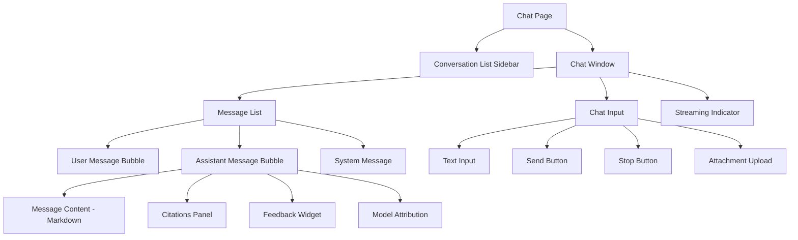

# GenAI Chat Interfaces — Chat UI Architecture, Message Components, Conversation Management

## Overview

The GenAI chat interface is the primary interaction point for our banking employees. It must be fast, accessible, secure, and provide a natural conversation experience while handling complex enterprise requirements like citations, feedback, and compliance logging.

## Chat Architecture



## Conversation Management

```tsx
// src/hooks/useConversations.ts
import { useQuery, useMutation, useQueryClient } from '@tanstack/react-query';
import { conversationKeys } from '@/lib/api/queryKeys';

export function useConversations(userId: string) {
  return useQuery({
    queryKey: conversationKeys.list(userId),
    queryFn: () => fetchConversations(userId),
    staleTime: 5 * 60 * 1000,
  });
}

export function useCreateConversation() {
  const queryClient = useQueryClient();

  return useMutation({
    mutationFn: async (input: { title?: string; model?: string }) => {
      const response = await fetch('/api/chat/conversations', {
        method: 'POST',
        headers: { 'Content-Type': 'application/json' },
        body: JSON.stringify(input),
      });
      if (!response.ok) throw new Error('Failed to create conversation');
      return response.json();
    },
    onSuccess: (data, _variables, context) => {
      queryClient.invalidateQueries({ queryKey: conversationKeys.list(context.userId) });
    },
  });
}

export function useDeleteConversation() {
  const queryClient = useQueryClient();

  return useMutation({
    mutationFn: async (conversationId: string) => {
      const response = await fetch(`/api/chat/conversations/${conversationId}`, {
        method: 'DELETE',
      });
      if (!response.ok) throw new Error('Failed to delete conversation');
    },
    onSuccess: (_data, conversationId) => {
      queryClient.invalidateQueries({ queryKey: conversationKeys.lists() });
      queryClient.removeQueries({ queryKey: conversationKeys.detail(conversationId) });
    },
  });
}
```

## Message List

```tsx
// src/components/chat/MessageList.tsx
import { useRef, useEffect } from 'react';
import type { Message } from '@/types';
import { MessageBubble } from './MessageBubble';
import { StreamingIndicator } from './StreamingIndicator';

interface MessageListProps {
  messages: Message[];
  isStreaming: boolean;
  error: Error | null;
}

export function MessageList({ messages, isStreaming, error }: MessageListProps) {
  const bottomRef = useRef<HTMLDivElement>(null);

  // Auto-scroll when new messages arrive
  useEffect(() => {
    bottomRef.current?.scrollIntoView({ behavior: 'smooth' });
  }, [messages.length, isStreaming]);

  return (
    <div className="flex-1 overflow-y-auto" role="log" aria-live="polite" aria-label="Chat messages">
      <div className="max-w-3xl mx-auto space-y-4 py-4">
        {messages.length === 0 && (
          <WelcomeMessage />
        )}

        {messages.map((message) => (
          <MessageBubble
            key={message.id}
            variant={message.role}
            timestamp={message.timestamp}
          >
            <MessageContent message={message} />
            {message.role === 'assistant' && message.citations && message.citations.length > 0 && (
              <MessageCitations citations={message.citations} />
            )}
            {message.role === 'assistant' && (
              <MessageFeedback messageId={message.id} />
            )}
          </MessageBubble>
        ))}

        {isStreaming && <StreamingIndicator />}
        {error && <MessageError error={error} />}

        <div ref={bottomRef} />
      </div>
    </div>
  );
}

function WelcomeMessage() {
  return (
    <div className="text-center py-16 space-y-4">
      <div className="mx-auto w-12 h-12 rounded-full bg-primary/10 flex items-center justify-center">
        <SparklesIcon className="w-6 h-6 text-primary" />
      </div>
      <h2 className="text-xl font-semibold">How can I help you today?</h2>
      <p className="text-muted-foreground max-w-md mx-auto">
        Ask me about banking policies, compliance requirements, data analysis, or anything else.
        I can search our internal documents to provide accurate, sourced answers.
      </p>
      <div className="flex flex-wrap gap-2 justify-center mt-6">
        <SuggestionChip text="What's our AML policy?" />
        <SuggestionChip text="Summarize recent regulatory changes" />
        <SuggestionChip text="Review this compliance report" />
      </div>
    </div>
  );
}

function SuggestionChip({ text }: { text: string }) {
  return (
    <button
      className="px-4 py-2 rounded-full border text-sm text-muted-foreground hover:text-primary hover:border-primary transition-colors"
      onClick={() => {
        // Send suggestion as message
      }}
    >
      {text}
    </button>
  );
}
```

## Message Bubble

```tsx
// src/components/chat/MessageBubble.tsx
import { forwardRef } from 'react';
import { cn } from '@/lib/utils';

interface MessageBubbleProps {
  variant: 'user' | 'assistant' | 'system';
  timestamp: Date;
  children: React.ReactNode;
}

export const MessageBubble = forwardRef<HTMLDivElement, MessageBubbleProps>(
  ({ variant, timestamp, children }, ref) => {
    const isUser = variant === 'user';
    const isSystem = variant === 'system';

    if (isSystem) {
      return (
        <div
          ref={ref}
          className="text-center text-xs text-muted-foreground py-2"
          role="status"
        >
          {children}
        </div>
      );
    }

    return (
      <div
        ref={ref}
        role="listitem"
        className={cn(
          'flex gap-3 group',
          isUser ? 'justify-end' : 'justify-start',
        )}
      >
        {!isUser && <AssistantAvatar />}

        <div
          className={cn(
            'max-w-[85%] lg:max-w-[75%] rounded-2xl px-4 py-3',
            isUser
              ? 'bg-primary text-primary-foreground rounded-br-sm'
              : 'bg-muted rounded-bl-sm',
          )}
        >
          <div className="prose prose-sm max-w-none dark:prose-invert">
            {children}
          </div>
          <time
            className={cn(
              'block mt-2 text-xs',
              isUser ? 'text-primary-foreground/70' : 'text-muted-foreground',
            )}
            dateTime={timestamp.toISOString()}
          >
            {timestamp.toLocaleTimeString([], { hour: '2-digit', minute: '2-digit' })}
          </time>
        </div>

        {isUser && <UserAvatar />}
      </div>
    );
  },
);

MessageBubble.displayName = 'MessageBubble';
```

## Chat Input

```tsx
// src/components/chat/ChatInput.tsx
'use client';

import { useState, useRef, useCallback } from 'react';
import { Button } from '@/components/ui/Button';

interface ChatInputProps {
  onSend: (message: string) => void;
  onStop: () => void;
  isStreaming: boolean;
  disabled?: boolean;
}

export function ChatInput({ onSend, onStop, isStreaming, disabled }: ChatInputProps) {
  const [input, setInput] = useState('');
  const textareaRef = useRef<HTMLTextAreaElement>(null);

  const handleSend = useCallback(() => {
    const trimmed = input.trim();
    if (!trimmed || isStreaming) return;
    onSend(trimmed);
    setInput('');
    // Reset textarea height
    if (textareaRef.current) {
      textareaRef.current.style.height = 'auto';
    }
  }, [input, isStreaming, onSend]);

  const handleKeyDown = (e: React.KeyboardEvent) => {
    if (e.key === 'Enter' && !e.shiftKey) {
      e.preventDefault();
      handleSend();
    }
  };

  const handleInput = (e: React.ChangeEvent<HTMLTextAreaElement>) => {
    setInput(e.target.value);

    // Auto-resize textarea
    const textarea = e.target;
    textarea.style.height = 'auto';
    textarea.style.height = Math.min(textarea.scrollHeight, 200) + 'px';
  };

  return (
    <div className="border-t bg-background p-4">
      <div className="max-w-3xl mx-auto">
        <div className="flex items-end gap-2">
          <div className="flex-1 relative">
            <label htmlFor="chat-input" className="sr-only">
              Send a message
            </label>
            <textarea
              id="chat-input"
              ref={textareaRef}
              value={input}
              onChange={handleInput}
              onKeyDown={handleKeyDown}
              placeholder="Ask me anything..."
              rows={1}
              className="w-full resize-none rounded-lg border border-input bg-background px-4 py-3 text-sm focus:outline-none focus:ring-2 focus:ring-primary focus:ring-offset-2"
              disabled={disabled}
              aria-describedby="chat-input-help"
            />
          </div>

          {isStreaming ? (
            <Button
              variant="destructive"
              size="sm"
              onClick={onStop}
              aria-label="Stop generating"
            >
              <StopIcon className="h-4 w-4" />
              Stop
            </Button>
          ) : (
            <Button
              size="sm"
              onClick={handleSend}
              disabled={!input.trim() || disabled}
              aria-label="Send message"
            >
              <SendIcon className="h-4 w-4" />
              Send
            </Button>
          )}
        </div>
        <p id="chat-input-help" className="text-xs text-muted-foreground mt-2">
          Press Enter to send. Shift+Enter for a new line.
        </p>
      </div>
    </div>
  );
}
```

## Conversation Sidebar

```tsx
// src/components/chat/ConversationSidebar.tsx
'use client';

import { useConversations } from '@/hooks/useConversations';
import { useUI } from '@/stores/useUI';

export function ConversationSidebar() {
  const { data: conversations, isLoading } = useConversations();
  const activeConversation = useUI((s) => s.activeConversation);
  const setActiveConversation = useUI((s) => s.setActiveConversation);

  return (
    <aside
      id="conversation-sidebar"
      className="w-64 border-r bg-muted/30 p-4 space-y-4"
    >
      <div className="flex items-center justify-between">
        <h2 className="text-sm font-medium">Conversations</h2>
        <NewConversationButton />
      </div>

      {isLoading ? (
        <div className="space-y-2">
          {[1, 2, 3, 4].map(i => (
            <div key={i} className="h-10 bg-muted rounded animate-pulse" />
          ))}
        </div>
      ) : (
        <ul className="space-y-1" role="list" aria-label="Recent conversations">
          {conversations?.map((conv) => (
            <li key={conv.id}>
              <button
                onClick={() => setActiveConversation(conv.id)}
                className={cn(
                  'w-full text-left px-3 py-2 rounded-md text-sm truncate transition-colors',
                  activeConversation === conv.id
                    ? 'bg-primary/10 text-primary font-medium'
                    : 'hover:bg-muted',
                )}
                aria-current={activeConversation === conv.id ? 'true' : undefined}
              >
                {conv.title || 'New Conversation'}
              </button>
            </li>
          ))}
        </ul>
      )}
    </aside>
  );
}
```

## Common Mistakes

### 1. Not Auto-Scrolling to New Messages

```tsx
// ❌ BAD: User must manually scroll to see new messages
<div className="overflow-auto">{messages.map(...)}</div>

// ✅ GOOD: Auto-scroll to bottom
useEffect(() => {
  bottomRef.current?.scrollIntoView({ behavior: 'smooth' });
}, [messages.length, isStreaming]);
```

### 2. Blocking Input During Streaming

The user should be able to type while the AI streams, but only one message can be "in flight" at a time.

### 3. Not Handling Conversation Context

Every message must be associated with a conversation ID for audit and continuity.

## Cross-References

- `./streaming-responses.md` — Handling streaming AI responses
- `./citations-and-grounding-ui.md` — Displaying citations
- `./safe-ai-content-rendering.md` — Sanitizing AI-generated markdown
- `./human-review-flows.md` — Feedback collection on messages
- `./frontend-observability.md` — Chat-specific telemetry
- `./accessibility.md` — Accessible chat interface requirements
- `../genai-platforms/` — Backend chat API architecture

## Interview Questions

1. Design the architecture for a GenAI chat interface.
2. How do you handle auto-scrolling in a virtualized message list?
3. What state do you need to manage for a conversation?
4. How do you implement a "stop generating" button?
5. Design suggestion chips for a banking chat interface.
6. How do you ensure chat accessibility for screen reader users?
