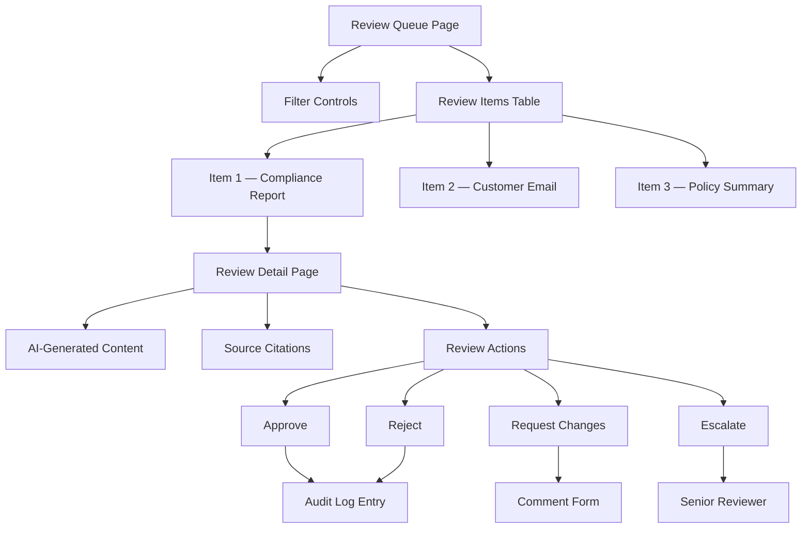

# Human Review Flows — Approval Workflows, Feedback Collection, Review Queues

## Overview

In a banking environment, AI-generated content often requires human review before it can be used for compliance reports, customer communications, or policy documents. This document covers the UI patterns for review workflows, feedback collection, and review queues.

## Review Queue Architecture



## Review Queue Dashboard

```tsx
// src/app/(dashboard)/review/page.tsx
import { Suspense } from 'react';
import { ErrorBoundary } from '@/components/shared/ErrorBoundary';
import { ReviewQueueTable } from '@/components/review/ReviewQueueTable';
import { ReviewQueueStats } from '@/components/review/ReviewQueueStats';

export default async function ReviewQueuePage() {
  const stats = await fetchReviewQueueStats();

  return (
    <div className="space-y-6">
      <div className="flex items-center justify-between">
        <h1 className="text-2xl font-bold">Review Queue</h1>
        <ReviewQueueFilters />
      </div>

      {/* Stats cards */}
      <div className="grid grid-cols-1 sm:grid-cols-4 gap-4">
        <StatCard label="Pending Review" value={stats.pending} variant="warning" />
        <StatCard label="Approved Today" value={stats.approvedToday} variant="success" />
        <StatCard label="Avg Review Time" value={stats.avgReviewTime} />
        <StatCard label="Overdue" value={stats.overdue} variant="destructive" />
      </div>

      {/* Review queue table */}
      <ErrorBoundary name="review-queue">
        <Suspense fallback={<TableSkeleton rows={10} />}>
          <ReviewQueueTable />
        </Suspense>
      </ErrorBoundary>
    </div>
  );
}
```

## Review Queue Table

```tsx
// src/components/review/ReviewQueueTable.tsx
'use client';

import { useQuery } from '@tanstack/react-query';
import { reviewQueueKeys } from '@/lib/api/queryKeys';
import type { ReviewItem } from '@/types';

export function ReviewQueueTable() {
  const { data, isLoading } = useQuery({
    queryKey: reviewQueueKeys.list({ status: 'pending' }),
    queryFn: () => fetchReviewQueue({ status: 'pending' }),
    staleTime: 30_000,
    refetchInterval: 60_000,  // Refresh every minute
  });

  if (isLoading) return <TableSkeleton rows={10} />;

  return (
    <div className="border rounded-lg">
      <table className="w-full text-sm">
        <caption className="sr-only">Items awaiting review</caption>
        <thead className="bg-muted">
          <tr>
            <th scope="col" className="text-left p-3">Type</th>
            <th scope="col" className="text-left p-3">Title</th>
            <th scope="col" className="text-left p-3">Submitted By</th>
            <th scope="col" className="text-left p-3">Submitted</th>
            <th scope="col" className="text-left p-3">Priority</th>
            <th scope="col" className="text-left p-3">SLA</th>
            <th scope="col" className="text-left p-3">Actions</th>
          </tr>
        </thead>
        <tbody>
          {data?.items.map((item) => (
            <tr key={item.id} className="border-t">
              <td className="p-3"><ContentTypeBadge type={item.type} /></td>
              <td className="p-3">
                <a href={`/review/${item.id}`} className="text-primary hover:underline">
                  {item.title}
                </a>
              </td>
              <td className="p-3">{item.submittedBy}</td>
              <td className="p-3">
                <time dateTime={item.submittedAt.toISOString()}>
                  {formatRelativeTime(item.submittedAt)}
                </time>
              </td>
              <td className="p-3"><PriorityBadge priority={item.priority} /></td>
              <td className="p-3">
                <SLAIndicator deadline={item.slaDeadline} />
              </td>
              <td className="p-3">
                <a
                  href={`/review/${item.id}`}
                  className="text-sm text-primary underline"
                >
                  Review
                </a>
              </td>
            </tr>
          ))}
          {data?.items.length === 0 && (
            <tr>
              <td colSpan={7} className="p-8 text-center text-muted-foreground">
                No items awaiting review
              </td>
            </tr>
          )}
        </tbody>
      </table>
    </div>
  );
}
```

## Review Detail Page

```tsx
// src/app/(dashboard)/review/[id]/page.tsx
import { ReviewActions } from '@/components/review/ReviewActions';
import { ReviewCommentThread } from '@/components/review/ReviewCommentThread';
import { ErrorBoundary } from '@/components/shared/ErrorBoundary';

export default async function ReviewDetailPage({
  params,
}: {
  params: { id: string };
}) {
  const item = await fetchReviewItem(params.id);

  return (
    <div className="space-y-6">
      <Breadcrumbs items={[
        { label: 'Review Queue', href: '/review' },
        { label: item.title },
      ]} />

      <div className="flex items-center justify-between">
        <h1 className="text-2xl font-bold">{item.title}</h1>
        <ContentTypeBadge type={item.type} />
      </div>

      <div className="grid grid-cols-1 lg:grid-cols-3 gap-6">
        {/* Main content — AI-generated content to review */}
        <div className="lg:col-span-2 space-y-6">
          <Card>
            <CardHeader>
              <CardTitle>AI-Generated Content</CardTitle>
            </CardHeader>
            <CardContent>
              <ErrorBoundary name="review-content">
                <AiGeneratedContent content={item.content} citations={item.citations} />
              </ErrorBoundary>
            </CardContent>
          </Card>

          {/* Source citations */}
          {item.citations && item.citations.length > 0 && (
            <Card>
              <CardHeader>
                <CardTitle>Source Documents</CardTitle>
              </CardHeader>
              <CardContent>
                <CitationList citations={item.citations} />
              </CardContent>
            </Card>
          )}
        </div>

        {/* Sidebar — review actions */}
        <div className="space-y-6">
          <ReviewMetadata item={item} />
          <ReviewActions itemId={item.id} />
          <ReviewCommentThread itemId={item.id} />
        </div>
      </div>
    </div>
  );
}
```

## Review Actions

```tsx
// src/components/review/ReviewActions.tsx
'use client';

import { useState } from 'react';
import { Button } from '@/components/ui/Button';
import { Dialog } from '@/components/ui/Dialog';
import { AccessibleTextarea } from '@/components/forms/AccessibleTextarea';

interface ReviewActionsProps {
  itemId: string;
}

type ReviewDecision = 'approve' | 'request-changes' | 'reject' | 'escalate';

export function ReviewActions({ itemId }: ReviewActionsProps) {
  const [decision, setDecision] = useState<ReviewDecision | null>(null);
  const [comment, setComment] = useState('');
  const [isSubmitting, setIsSubmitting] = useState(false);
  const [error, setError] = useState<string | null>(null);

  const handleSubmit = async () => {
    if (!decision) return;

    setIsSubmitting(true);
    setError(null);

    try {
      const response = await fetch(`/api/review/${itemId}/decision`, {
        method: 'POST',
        headers: { 'Content-Type': 'application/json' },
        body: JSON.stringify({ decision, comment }),
      });

      if (!response.ok) {
        throw new Error('Failed to submit review decision');
      }

      // Navigate away after successful submission
      window.location.href = '/review';
    } catch (err) {
      setError(err instanceof Error ? err.message : 'An error occurred');
    } finally {
      setIsSubmitting(false);
    }
  };

  return (
    <Card>
      <CardHeader>
        <CardTitle>Review Actions</CardTitle>
      </CardHeader>
      <CardContent className="space-y-4">
        <div className="grid grid-cols-2 gap-2">
          <Button
            variant="primary"
            onClick={() => setDecision('approve')}
            className={decision === 'approve' ? 'ring-2 ring-primary' : ''}
          >
            <CheckIcon className="h-4 w-4 mr-1" />
            Approve
          </Button>
          <Button
            variant="secondary"
            onClick={() => setDecision('request-changes')}
            className={decision === 'request-changes' ? 'ring-2 ring-primary' : ''}
          >
            <EditIcon className="h-4 w-4 mr-1" />
            Request Changes
          </Button>
          <Button
            variant="destructive"
            onClick={() => setDecision('reject')}
            className={decision === 'reject' ? 'ring-2 ring-destructive' : ''}
          >
            <XIcon className="h-4 w-4 mr-1" />
            Reject
          </Button>
          <Button
            variant="outline"
            onClick={() => setDecision('escalate')}
            className={decision === 'escalate' ? 'ring-2 ring-primary' : ''}
          >
            <ArrowUpIcon className="h-4 w-4 mr-1" />
            Escalate
          </Button>
        </div>

        {decision && (decision === 'request-changes' || decision === 'reject' || decision === 'escalate') && (
          <div className="space-y-2">
            <label htmlFor="review-comment" className="text-sm font-medium">
              Comment {decision !== 'approve' && <span className="text-destructive">*</span>}
            </label>
            <textarea
              id="review-comment"
              value={comment}
              onChange={(e) => setComment(e.target.value)}
              placeholder={
                decision === 'request-changes'
                  ? 'Describe the changes needed...'
                  : decision === 'reject'
                  ? 'Explain why this is being rejected...'
                  : 'Explain why this needs escalation...'
              }
              rows={4}
              className="w-full rounded-md border border-input bg-background px-3 py-2 text-sm"
              required
              aria-describedby="review-comment-help"
            />
            <p id="review-comment-help" className="text-xs text-muted-foreground">
              This comment will be visible to the original author.
            </p>
          </div>
        )}

        {error && (
          <p className="text-sm text-destructive" role="alert">{error}</p>
        )}

        <Button
          onClick={handleSubmit}
          disabled={!decision || isSubmitting}
          isLoading={isSubmitting}
          className="w-full"
        >
          Submit Review
        </Button>
      </CardContent>
    </Card>
  );
}
```

## Inline Feedback on AI Responses

```tsx
// src/components/chat/MessageFeedback.tsx
'use client';

import { useState } from 'react';
import { useSubmitFeedback } from '@/hooks/useFeedback';
import { AccessibleTextarea } from '@/components/forms/AccessibleTextarea';

interface MessageFeedbackProps {
  messageId: string;
}

export function MessageFeedback({ messageId }: MessageFeedbackProps) {
  const [hasSubmitted, setHasSubmitted] = useState(false);
  const [showCommentForm, setShowCommentForm] = useState(false);
  const [comment, setComment] = useState('');

  const { mutate: submitFeedback, isPending } = useSubmitFeedback();

  const handleRating = (rating: 'thumbs-up' | 'thumbs-down') => {
    submitFeedback({ messageId, rating, comment: '' });
    setHasSubmitted(true);
  };

  const handleSubmitWithComment = () => {
    const rating = comment.length > 10 ? 'thumbs-down' : 'thumbs-up';
    // If the user writes a detailed comment, assume it's constructive feedback
    submitFeedback({ messageId, rating: 'thumbs-down', comment });
    setHasSubmitted(true);
    setShowCommentForm(false);
  };

  if (hasSubmitted) {
    return (
      <p className="text-xs text-muted-foreground mt-2" role="status">
        Thank you for your feedback.
      </p>
    );
  }

  return (
    <div className="mt-3 flex items-center gap-2">
      <span className="text-xs text-muted-foreground">Was this helpful?</span>
      <button
        onClick={() => handleRating('thumbs-up')}
        className="p-1 rounded hover:bg-muted"
        aria-label="This response was helpful"
      >
        <ThumbsUpIcon className="h-4 w-4" />
      </button>
      <button
        onClick={() => {
          handleRating('thumbs-down');
          setShowCommentForm(true);
        }}
        className="p-1 rounded hover:bg-muted"
        aria-label="This response was not helpful"
      >
        <ThumbsDownIcon className="h-4 w-4" />
      </button>

      {showCommentForm && (
        <div className="ml-2 flex-1 max-w-sm">
          <textarea
            value={comment}
            onChange={(e) => setComment(e.target.value)}
            placeholder="Tell us what went wrong..."
            rows={2}
            className="w-full text-xs rounded border px-2 py-1"
            autoFocus
          />
          <div className="flex gap-2 mt-1">
            <button
              onClick={handleSubmitWithComment}
              disabled={!comment.trim() || isPending}
              className="text-xs text-primary underline"
            >
              Submit feedback
            </button>
            <button
              onClick={() => setShowCommentForm(false)}
              className="text-xs text-muted-foreground underline"
            >
              Cancel
            </button>
          </div>
        </div>
      )}
    </div>
  );
}
```

## Common Mistakes

### 1. No Audit Trail for Review Decisions

Every review action must be logged for compliance.

```tsx
// ✅ GOOD: Log everything
await fetch(`/api/review/${itemId}/decision`, {
  method: 'POST',
  body: JSON.stringify({ decision, comment, timestamp: new Date().toISOString() }),
});
// Backend logs this to the audit trail
```

### 2. No SLA Indicators

Review items can sit indefinitely without SLA awareness.

```tsx
// ✅ GOOD: Show SLA status
function SLAIndicator({ deadline }: { deadline: Date }) {
  const remaining = deadline.getTime() - Date.now();
  const hoursRemaining = Math.round(remaining / (1000 * 60 * 60));

  if (hoursRemaining < 0) {
    return <span className="text-destructive font-medium">Overdue</span>;
  }
  if (hoursRemaining < 4) {
    return <span className="text-yellow-600">{hoursRemaining}h remaining</span>;
  }
  return <span className="text-muted-foreground">{hoursRemaining}h remaining</span>;
}
```

## Cross-References

- `./genai-chat-interfaces.md` — Feedback on chat messages
- `./human-review-flows.md` — This document
- `./citations-and-grounding-ui.md` — Citations in review context
- `./building-enterprise-uis.md` — Data tables for review queues
- `./frontend-observability.md` — Tracking review actions

## Interview Questions

1. Design a review queue dashboard for AI-generated compliance reports.
2. How do you implement a review workflow with approve/reject/escalate actions?
3. What telemetry would you collect from a human review flow?
4. How do you handle SLA tracking and alerting for review items?
5. Design an inline feedback widget for a GenAI chat interface.
