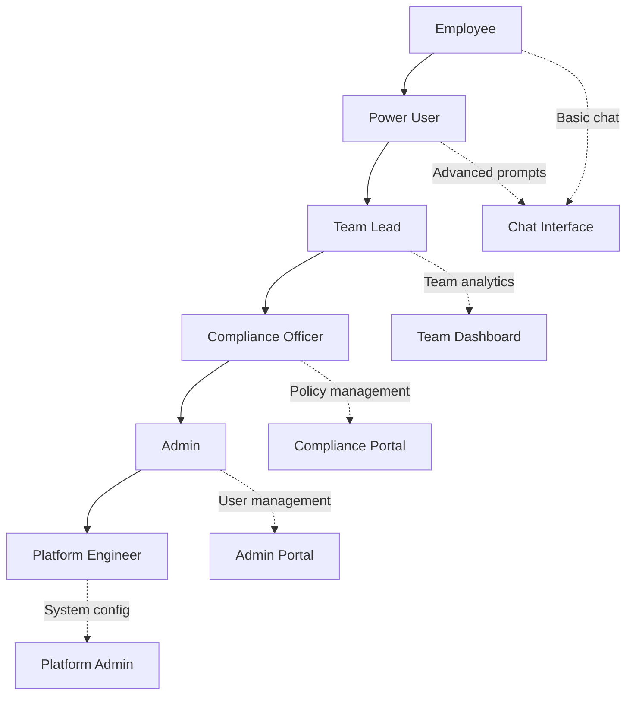

# Role-Based UI — Feature Flags, Role-Based Rendering, Dynamic Navigation, Permission Checks

## Overview

In a banking GenAI platform, what a user sees and can do depends on their role, permissions, and the security classification of the data they are accessing. This document defines patterns for implementing role-based UI rendering.

## Role Hierarchy



## Session-Based Role Detection

```tsx
// src/lib/auth/session.ts
import { cookies } from 'next/headers';
import { jwtVerify } from 'jose';

export type UserRole =
  | 'employee'
  | 'power-user'
  | 'team-lead'
  | 'compliance-officer'
  | 'admin'
  | 'platform-engineer';

export interface Session {
  userId: string;
  role: UserRole;
  permissions: string[];
  securityClassification: 'public' | 'internal' | 'confidential' | 'restricted';
  exp: number;
}

export async function getSession(): Promise<Session | null> {
  const cookieStore = await cookies();
  const sessionCookie = cookieStore.get('__session');
  if (!sessionCookie) return null;

  try {
    const { payload } = await jwtVerify(sessionCookie.value, SESSION_SECRET);
    return payload as Session;
  } catch {
    return null;
  }
}

// Permission check helper
export function hasPermission(session: Session, permission: string): boolean {
  return session.permissions.includes(permission);
}

// Role hierarchy check
const ROLE_HIERARCHY: Record<UserRole, number> = {
  'employee': 0,
  'power-user': 1,
  'team-lead': 2,
  'compliance-officer': 3,
  'admin': 4,
  'platform-engineer': 5,
};

export function hasMinimumRole(session: Session, minimumRole: UserRole): boolean {
  return ROLE_HIERARCHY[session.role] >= ROLE_HIERARCHY[minimumRole];
}
```

## Server-Side Role-Based Rendering

```tsx
// src/app/(dashboard)/layout.tsx
import { getSession, type UserRole } from '@/lib/auth/session';
import { redirect } from 'next/navigation';
import { Sidebar } from '@/components/layout/Sidebar';
import { Header } from '@/components/layout/Header';

interface NavItem {
  label: string;
  href: string;
  icon: React.ReactNode;
  minRole?: UserRole;
  permission?: string;
}

const NAV_ITEMS: NavItem[] = [
  {
    label: 'Chat',
    href: '/dashboard/chat',
    icon: <ChatIcon />,
    // Available to all authenticated users
  },
  {
    label: 'My Conversations',
    href: '/dashboard/conversations',
    icon: <HistoryIcon />,
    minRole: 'employee',
  },
  {
    label: 'Team Analytics',
    href: '/dashboard/analytics',
    icon: <BarChartIcon />,
    minRole: 'team-lead',
    permission: 'analytics:view',
  },
  {
    label: 'Compliance',
    href: '/dashboard/compliance',
    icon: <ShieldIcon />,
    minRole: 'compliance-officer',
    permission: 'compliance:view',
  },
  {
    label: 'Admin',
    href: '/dashboard/admin',
    icon: <SettingsIcon />,
    minRole: 'admin',
    permission: 'admin:access',
  },
  {
    label: 'Platform',
    href: '/dashboard/platform',
    icon: <ServerIcon />,
    minRole: 'platform-engineer',
    permission: 'platform:manage',
  },
];

export default async function DashboardLayout({
  children,
}: {
  children: React.ReactNode;
}) {
  const session = await getSession();

  if (!session) {
    redirect('/api/auth/login');
  }

  // Filter navigation items based on role and permissions
  const visibleNavItems = NAV_ITEMS.filter((item) => {
    if (item.minRole && session.role < ROLE_HIERARCHY[item.minRole]) return false;
    if (item.permission && !session.permissions.includes(item.permission)) return false;
    return true;
  });

  return (
    <div className="flex h-screen">
      <Sidebar items={visibleNavItems} />
      <div className="flex flex-col flex-1">
        <Header user={session} />
        <main className="flex-1 overflow-auto">{children}</main>
      </div>
    </div>
  );
}
```

## Feature Flags

```tsx
// src/config/featureFlags.ts
export interface FeatureFlags {
  newChatInterface: boolean;
  citationDisplay: boolean;
  humanReviewFlow: boolean;
  advancedSearch: boolean;
  modelSelector: boolean;
  exportConversations: boolean;
  complianceDashboard: boolean;
}

// Server-side: resolved from config service + user targeting
export async function resolveFeatureFlags(session: Session): Promise<FeatureFlags> {
  const flags: FeatureFlags = {
    newChatInterface: true,
    citationDisplay: true,
    humanReviewFlow: hasMinimumRole(session, 'compliance-officer'),
    advancedSearch: hasMinimumRole(session, 'power-user'),
    modelSelector: hasMinimumRole(session, 'team-lead'),
    exportConversations: hasPermission(session, 'conversations:export'),
    complianceDashboard: hasMinimumRole(session, 'compliance-officer'),
  };

  // Override from remote config service (if available)
  try {
    const response = await fetch(`${process.env.CONFIG_SERVICE}/flags/${session.userId}`, {
      signal: AbortSignal.timeout(2000),
    });
    if (response.ok) {
      const remoteFlags = await response.json();
      return { ...flags, ...remoteFlags };
    }
  } catch {
    // Fall back to default flags
  }

  return flags;
}
```

```tsx
// src/contexts/FeatureFlagProvider.tsx
'use client';

import { createContext, useContext, useMemo } from 'react';
import type { FeatureFlags } from '@/config/featureFlags';

interface FeatureFlagContextValue {
  flags: FeatureFlags;
  isEnabled: (flag: keyof FeatureFlags) => boolean;
}

const FeatureFlagContext = createContext<FeatureFlagContextValue>({
  flags: {} as FeatureFlags,
  isEnabled: () => false,
});

export function FeatureFlagProvider({
  flags,
  children,
}: {
  flags: FeatureFlags;
  children: React.ReactNode;
}) {
  const value = useMemo(
    () => ({
      flags,
      isEnabled: (flag: keyof FeatureFlags) => flags[flag] ?? false,
    }),
    [flags],
  );

  return (
    <FeatureFlagContext.Provider value={value}>
      {children}
    </FeatureFlagContext.Provider>
  );
}

export function useFeatureFlag() {
  const context = useContext(FeatureFlagContext);
  if (!context) {
    throw new Error('useFeatureFlag must be used within FeatureFlagProvider');
  }
  return context;
}
```

## Conditional Component Rendering

```tsx
// src/components/shared/IfAllowed.tsx
import { useFeatureFlag } from '@/contexts/FeatureFlagProvider';
import { useSession } from '@/contexts/SessionProvider';
import { hasPermission, hasMinimumRole, type UserRole } from '@/lib/auth/session';

interface IfAllowedProps {
  children: React.ReactNode;
  flag?: keyof FeatureFlags;
  role?: UserRole;
  permission?: string;
  fallback?: React.ReactNode;
}

export function IfAllowed({ children, flag, role, permission, fallback }: IfAllowedProps) {
  const { isEnabled } = useFeatureFlag();
  const session = useSession();

  // Check feature flag
  if (flag && !isEnabled(flag)) return <>{fallback}</>;

  // Check minimum role
  if (role && !hasMinimumRole(session, role)) return <>{fallback}</>;

  // Check specific permission
  if (permission && !hasPermission(session, permission)) return <>{fallback}</>;

  return <>{children}</>;
}

// Usage
function AdminToolbar() {
  return (
    <IfAllowed
      permission="admin:access"
      fallback={<span className="text-xs text-muted-foreground">Admin tools unavailable</span>}
    >
      <AdminToolbarContent />
    </IfAllowed>
  );
}
```

## Model Selector (Role-Gated Feature)

```tsx
// src/components/chat/ModelSelector.tsx
'use client';

import { useFeatureFlag } from '@/contexts/FeatureFlagProvider';

interface ModelOption {
  id: string;
  name: string;
  description: string;
  minRole?: UserRole;
}

const MODEL_OPTIONS: ModelOption[] = [
  { id: 'fast', name: 'Fast', description: 'Quick responses for simple queries' },
  {
    id: 'balanced',
    name: 'Balanced',
    description: 'Good balance of speed and quality',
  },
  {
    id: 'precise',
    name: 'Precise',
    description: 'Maximum accuracy for complex analysis',
    minRole: 'power-user',
  },
  {
    id: 'creative',
    name: 'Creative',
    description: 'Creative writing and brainstorming',
    minRole: 'team-lead',
  },
];

export function ModelSelector() {
  const { isEnabled } = useFeatureFlag();
  const { selectedModel, setSelectedModel } = useChatSettings();
  const session = useSession();

  if (!isEnabled('modelSelector')) return null;

  const availableModels = MODEL_OPTIONS.filter(
    (model) => !model.minRole || hasMinimumRole(session, model.minRole),
  );

  return (
    <select
      value={selectedModel}
      onChange={(e) => setSelectedModel(e.target.value)}
      aria-label="Select AI model"
      className="rounded-md border bg-background text-sm"
    >
      {availableModels.map((model) => (
        <option key={model.id} value={model.id}>
          {model.name} — {model.description}
        </option>
      ))}
    </select>
  );
}
```

## Dynamic Route Protection

```tsx
// src/app/(dashboard)/admin/page.tsx
import { getSession } from '@/lib/auth/session';
import { redirect } from 'next/navigation';
import { hasPermission, hasMinimumRole } from '@/lib/auth/session';

export default async function AdminPage() {
  const session = await getSession();

  if (!session) {
    redirect('/api/auth/login');
  }

  if (!hasMinimumRole(session, 'admin')) {
    redirect('/dashboard');  // Silently redirect — no error page for permission denied
  }

  if (!hasPermission(session, 'admin:access')) {
    redirect('/dashboard');
  }

  return <AdminContent />;
}
```

## Common Mistakes

### 1. Client-Side-Only Permission Checks

```tsx
// ❌ BAD: Only checking on client — server still renders the content
'use client';
function AdminPanel() {
  const { role } = useSession();
  if (role !== 'admin') return null;
  return <AdminContent />;
}

// ✅ GOOD: Check on server first
export default async function AdminPage() {
  const session = await getSession();
  if (!hasMinimumRole(session, 'admin')) redirect('/dashboard');
  return <AdminContent />;
}
```

### 2. Hardcoded Role Checks

```tsx
// ❌ BAD: Hardcoded strings
if (session.role === 'admin') { ... }

// ✅ GOOD: Use constants and hierarchy
if (hasMinimumRole(session, 'admin')) { ... }
```

### 3. Feature Flags Without Fallbacks

```tsx
// ❌ BAD: Feature disappears without explanation
{isEnabled('newFeature') && <NewFeature />}

// ✅ GOOD: Provide context
<IfAllowed flag="newFeature" fallback={<FeatureComingSoon />}>
  <NewFeature />
</IfAllowed>
```

## Cross-References

- `./authentication-flows.md` — Session establishment
- `./secure-frontend-patterns.md` — Authorization enforcement
- `./component-architecture.md` — Conditional rendering patterns
- `./role-based-ui.md` — This document
- `../security/` — Authorization and access control
- `./genai-chat-interfaces.md` — Role-gated chat features

## Interview Questions

1. How do you implement role-based navigation in a Next.js application?
2. Explain why client-side-only permission checks are insufficient.
3. Design a feature flag system that supports user targeting.
4. How do you handle a user whose role changes mid-session?
5. What is the difference between role-based access control and permission-based access control?
