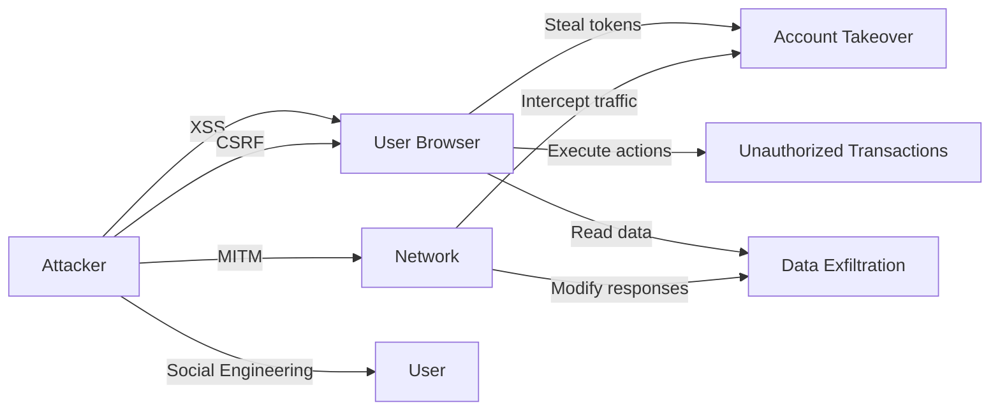

# Secure Frontend Patterns — XSS Prevention, CSP, Secure Token Storage, CSRF Protection

## Overview

The frontend is the primary attack surface for user-facing applications. In a banking context, a frontend vulnerability can lead to data exfiltration, account takeover, and regulatory violations. This document defines the security patterns every frontend engineer must follow.

## Threat Model



## XSS Prevention

### Principle: Never Trust User Input

Every value rendered in the UI that originates from user input, API responses, or AI-generated content must be treated as potentially malicious.

### Safe Rendering

```tsx
// ✅ GOOD: React automatically escapes text content
function SafeComponent({ userInput }: { userInput: string }) {
  // React renders text as textContent — XSS-safe
  return <p>{userInput}</p>;
}

// ❌ BAD: dangerouslySetInnerHTML with unsanitized input
function UnsafeComponent({ userInput }: { userInput: string }) {
  return <div dangerouslySetInnerHTML={{ __html: userInput }} />;
}

// ✅ GOOD: Sanitize before using dangerouslySetInnerHTML
import DOMPurify from 'dompurify';

function SafeHtmlComponent({ userInput }: { userInput: string }) {
  const sanitized = DOMPurify.sanitize(userInput, {
    ALLOWED_TAGS: ['p', 'br', 'strong', 'em', 'ul', 'ol', 'li', 'a', 'code', 'pre', 'blockquote'],
    ALLOWED_ATTR: ['href', 'title', 'class'],
    ALLOWED_URI_REGEXP: /^(?:(?:(?:f|ht)tps?|mailto|tel|callto|cid|xmpp):|[^a-z]|[a-z+.-]+(?:[^a-z+.\-:]|$))/i,
  });

  return <div dangerouslySetInnerHTML={{ __html: sanitized }} />;
}
```

### Markdown Sanitization for AI Responses

```tsx
// src/lib/security/sanitizeMarkdown.ts
import DOMPurify from 'dompurify';
import { marked } from 'marked';

export function sanitizeAndRenderMarkdown(markdown: string): string {
  // Step 1: Parse markdown to HTML
  const html = marked.parse(markdown, {
    gfm: true,
    breaks: false,
  }) as string;

  // Step 2: Sanitize HTML
  const sanitized = DOMPurify.sanitize(html, {
    ALLOWED_TAGS: [
      'p', 'br', 'strong', 'em', 'u', 's',
      'h1', 'h2', 'h3', 'h4', 'h5', 'h6',
      'ul', 'ol', 'li',
      'a', 'code', 'pre', 'blockquote',
      'table', 'thead', 'tbody', 'tr', 'th', 'td',
      'img', 'hr',
    ],
    ALLOWED_ATTR: ['href', 'title', 'class', 'alt', 'src', 'width', 'height'],
    ALLOWED_URI_REGEXP: /^(?:(?:(?:f|ht)tps?|mailto):|[^a-z]|[a-z+.-]+(?:[^a-z+.\-:]|$))/i,
    // NEVER allow:
    // - <script> tags
    // - event handlers (onclick, onerror, etc.)
    // - javascript: URIs
    // - <iframe>, <object>, <embed>, <form>
    FORBID_TAGS: ['script', 'iframe', 'object', 'embed', 'form', 'input', 'button'],
    FORBID_ATTR: ['onerror', 'onclick', 'onload', 'onmouseover', 'onfocus', 'style'],
  });

  return sanitized;
}
```

### URL Sanitization

```tsx
// src/lib/security/sanitizeUrl.ts
const ALLOWED_PROTOCOLS = ['http:', 'https:', 'mailto:', 'tel:'];

export function sanitizeUrl(url: string | null | undefined): string {
  if (!url) return '';

  try {
    const parsed = new URL(url, 'https://example.com');
    if (ALLOWED_PROTOCOLS.includes(parsed.protocol)) {
      return parsed.toString();
    }
  } catch {
    // Invalid URL
  }

  return '';  // Return empty string for unsafe URLs
}

// Usage
function SafeLink({ href, children }: { href: string; children: React.ReactNode }) {
  const safeHref = sanitizeUrl(href);
  if (!safeHref) return <span>{children}</span>;  // Render as text if URL is unsafe

  return (
    <a
      href={safeHref}
      target="_blank"
      rel="noopener noreferrer"
    >
      {children}
    </a>
  );
}
```

## Content Security Policy (CSP)

```tsx
// middleware.ts — CSP headers on every response
import { NextResponse } from 'next/server';
import type { NextRequest } from 'next/server';

export function middleware(request: NextRequest) {
  const response = NextResponse.next();

  // Content Security Policy
  const csp = [
    "default-src 'self'",
    "script-src 'self' 'strict-dynamic'",
    "style-src 'self' 'unsafe-inline'",
    "img-src 'self' data: https:",
    "font-src 'self'",
    "connect-src 'self' https://api.bank-domain.com",
    "frame-ancestors 'none'",
    "base-uri 'self'",
    "form-action 'self'",
    "upgrade-insecure-requests",
  ].join('; ');

  response.headers.set('Content-Security-Policy', csp);

  // Additional security headers
  response.headers.set('X-Content-Type-Options', 'nosniff');
  response.headers.set('X-Frame-Options', 'DENY');
  response.headers.set('Referrer-Policy', 'strict-origin-when-cross-origin');
  response.headers.set(
    'Permissions-Policy',
    'camera=(), microphone=(), geolocation=(), interest-cohort=()',
  );
  response.headers.set(
    'Strict-Transport-Security',
    'max-age=31536000; includeSubDomains; preload',
  );

  return response;
}
```

## Secure Token Storage

### BFF Pattern — Tokens Never Reach the Browser

```
┌──────────┐    ┌──────────────┐    ┌──────────┐    ┌─────────────┐
│ Browser   │    │ Next.js BFF  │    │ IdP      │    │ Backend API │
│           │    │              │    │          │    │             │
│ Cookies   │◄──►│ Session Mgmt │◄──►│ OAuth2   │◄──►│ Services    │
│ (httpOnly)│    │ Token Store  │    │          │    │             │
└──────────┘    └──────────────┘    └──────────┘    └─────────────┘
     │                  │                                    │
     │  No tokens       │  Holds tokens                      │  Validates
     │  in JavaScript   │  (server-side only)                 │  tokens
     │                  │                                    │
```

```tsx
// ✅ GOOD: httpOnly cookie — not accessible via JavaScript
document.cookie;  // Does NOT include __session cookie

// ❌ BAD: localStorage
localStorage.setItem('token', accessToken);  // Accessible to any script

// ❌ BAD: sessionStorage
sessionStorage.setItem('token', accessToken);  // Also accessible

// ❌ BAD: Regular cookie
document.cookie = 'token=xxx';  // Accessible via document.cookie
```

## CSRF Protection

### SameSite Cookie Attribute

```tsx
// Session cookie configuration
cookieStore.set('__session', token, {
  httpOnly: true,
  secure: true,                  // Only sent over HTTPS
  sameSite: 'lax',              // Protects against CSRF for cross-site requests
  maxAge: 8 * 60 * 60,
  path: '/',
});
```

### Double Submit Cookie Pattern for Mutations

```tsx
// src/lib/api/client.ts
import { cookies } from 'next/headers';

// Server-side: generate CSRF token
export async function generateCsrfToken(): Promise<string> {
  const token = crypto.randomUUID();
  const cookieStore = await cookies();

  cookieStore.set('csrf_token', token, {
    httpOnly: true,
    secure: true,
    sameSite: 'strict',
    maxAge: 8 * 60 * 60,
    path: '/',
  });

  return token;
}

// Client-side: include CSRF token in requests
'use client';

async function fetchWithCsrf(url: string, options: RequestInit = {}) {
  // Get CSRF token from meta tag (rendered by server)
  const csrfToken = document.querySelector('meta[name="csrf-token"]')?.getAttribute('content');

  const headers = {
    'Content-Type': 'application/json',
    ...(csrfToken && { 'X-CSRF-Token': csrfToken }),
    ...options.headers,
  };

  return fetch(url, {
    ...options,
    headers,
    credentials: 'include',  // Include cookies
  });
}

// Usage
await fetchWithCsrf('/api/feedback', {
  method: 'POST',
  body: JSON.stringify({ messageId: '123', rating: 'thumbs-up' }),
});
```

## API Request Security

```tsx
// src/lib/api/client.ts
class ApiClient {
  private baseUrl: string;

  constructor(baseUrl: string) {
    this.baseUrl = baseUrl;
  }

  async request<T>(endpoint: string, options: RequestInit = {}): Promise<T> {
    const response = await fetch(`${this.baseUrl}${endpoint}`, {
      ...options,
      credentials: 'include',  // Include session cookie
      headers: {
        'Content-Type': 'application/json',
        'X-Request-Origin': window.location.origin,
        ...options.headers,
      },
    });

    if (!response.ok) {
      if (response.status === 401) {
        // Session expired — redirect to login
        window.location.href = '/api/auth/login';
        throw new Error('Session expired');
      }
      if (response.status === 403) {
        throw new Error('Permission denied');
      }
      throw new Error(`API error: ${response.status}`);
    }

    return response.json();
  }

  get<T>(endpoint: string) {
    return this.request<T>(endpoint, { method: 'GET' });
  }

  post<T>(endpoint: string, body: unknown) {
    return this.request<T>(endpoint, {
      method: 'POST',
      body: JSON.stringify(body),
    });
  }

  put<T>(endpoint: string, body: unknown) {
    return this.request<T>(endpoint, {
      method: 'PUT',
      body: JSON.stringify(body),
    });
  }

  delete<T>(endpoint: string) {
    return this.request<T>(endpoint, { method: 'DELETE' });
  }
}

export const api = new ApiClient('/api');
```

## Preventing Data Leakage

### Sensitive Data in URLs

```tsx
// ❌ BAD: Sensitive data in URL (logged, cached, bookmarked)
/search?accountNumber=1234567890&ssn=123-45-6789

// ✅ GOOD: Sensitive data in request body
await fetch('/api/search', {
  method: 'POST',
  body: JSON.stringify({ accountNumber, ssn }),
});
```

### Preventing Data in Browser Console

```tsx
// ❌ BAD: Logging sensitive data
console.log('User session:', session);  // Includes tokens, PII

// ❌ BAD: Exposing error details
catch (error) {
  console.error(error);  // May include stack traces, internal URLs
}

// ✅ GOOD: Sanitized logging
console.log('User authenticated:', { userId: session.userId, role: session.role });

// ✅ GOOD: User-friendly errors
catch (error) {
  reportErrorToSentry({ error, context: 'feedback-submission' });
  // User sees generic message — details go to Sentry
}
```

## Common Mistakes

### 1. Trusting AI-Generated Content

```tsx
// ❌ BAD: Rendering AI response directly
<div>{aiResponse.content}</div>

// If the AI response contains:
// 
// ...the attacker has the user's session

// ✅ GOOD: Sanitize AI responses
const safeContent = sanitizeAndRenderMarkdown(aiResponse.content);
<div dangerouslySetInnerHTML={{ __html: safeContent }} />
```

### 2. Exposing Data in Error Messages

```tsx
// ❌ BAD
throw new Error(`Database error: ${dbError.details} at ${dbError.stack}`);

// ✅ GOOD
throw new Error('An unexpected error occurred. Please try again.');
// Log details server-side only
```

### 3. Missing rel="noopener noreferrer" on External Links

```tsx
// ❌ BAD
<a href={externalUrl} target="_blank">{text}</a>
// new tab can access window.opener

// ✅ GOOD
<a href={sanitizeUrl(externalUrl)} target="_blank" rel="noopener noreferrer">{text}</a>
```

### 4. Inline Event Handlers

```tsx
// ❌ BAD: Inline handlers bypass CSP
<button onclick="handleClick()">Click</button>

// ✅ GOOD: React event handlers
<button onClick={handleClick}>Click</button>
```

## Cross-References

- `./secure-frontend-patterns.md` — This document
- `./safe-ai-content-rendering.md` — Sanitizing AI-generated content
- `./authentication-flows.md` — Secure session management
- `./error-boundaries.md` — Safe error message display
- `../security/` — Comprehensive security engineering practices
- `./role-based-ui.md` — Authorization enforcement

## Interview Questions

1. How do you prevent XSS in a React application that renders markdown?
2. Explain the BFF pattern for token management. Why is it safer than client-side storage?
3. What does a Content Security Policy header look like for a Next.js application?
4. How do you protect against CSRF attacks in a cookie-based auth system?
5. Why should AI-generated content be treated as untrusted input?
6. Design a secure API client that handles session expiry and CSRF tokens.
