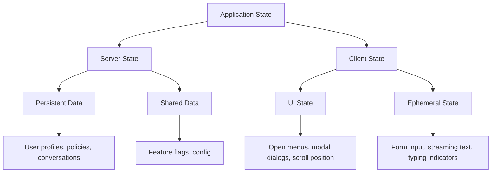

# State Management — Server State vs Client State

## Overview

State management is one of the most misunderstood aspects of React application architecture. The fundamental principle for our banking GenAI platform is simple:

**Server state and client state are different concerns that require different tools.**

Mixing them leads to unnecessary complexity, stale data, cache invalidation bugs, and performance issues.

## State Classification



### Server State

**Definition:** Data that lives on a server and is fetched by the client.

**Characteristics:**
- Controlled by someone else (the backend)
- Can become outdated (stale)
- Can be cached
- Can be updated by other users
- Requires network requests to change

**Examples in our platform:**
- Conversation history
- Policy documents
- Compliance reports
- User permissions
- Feature flag values
- Audit logs

### Client State

**Definition:** Data that lives only in the UI and controls its behavior.

**Characteristics:**
- Controlled by the current user
- Changes instantly
- Does not need to be persisted
- No risk of becoming stale

**Examples in our platform:**
- Sidebar collapsed/expanded
- Active tab selection
- Form field values (before submission)
- Streaming text buffer
- Modal open/close
- Toast notifications

## Server State — React Query

**Tool:** TanStack React Query v5

React Query handles all the complexity of server state: caching, deduplication, background refetching, pagination, and optimistic updates.

```tsx
// src/hooks/usePolicies.ts
import { useQuery, useMutation, useQueryClient } from '@tanstack/react-query';
import type { Policy } from '@/types/policy';

// ---- QUERIES ----

// Query key factory — essential for cache invalidation
const policyKeys = {
  all: ['policies'] as const,
  lists: () => [...policyKeys.all, 'list'] as const,
  list: (filters: PolicyFilters) => [...policyKeys.lists(), filters] as const,
  details: () => [...policyKeys.all, 'detail'] as const,
  detail: (id: string) => [...policyKeys.details(), id] as const,
  citations: (id: string) => [...policyKeys.detail(id), 'citations'] as const,
};

interface PolicyFilters {
  category?: string;
  status?: 'active' | 'archived';
  page?: number;
  pageSize?: number;
}

export function usePolicies(filters?: PolicyFilters) {
  return useQuery({
    queryKey: policyKeys.list(filters ?? {}),
    queryFn: () => fetchPolicies(filters),
    staleTime: 5 * 60 * 1000, // 5 minutes — policies don't change often
    gcTime: 30 * 60 * 1000,   // Keep in garbage for 30 min
  });
}

export function usePolicy(id: string) {
  return useQuery({
    queryKey: policyKeys.detail(id),
    queryFn: () => fetchPolicy(id),
    staleTime: 10 * 60 * 1000,
  });
}

// ---- MUTATIONS ----

export function useUpdatePolicy() {
  const queryClient = useQueryClient();

  return useMutation({
    mutationFn: ({ id, ...data }: PolicyUpdateRequest) =>
      updatePolicy(id, data),

    // Optimistic update
    onMutate: async ({ id, ...data }) => {
      // Cancel any outgoing refetches
      await queryClient.cancelQueries({ queryKey: policyKeys.detail(id) });

      // Snapshot the previous value
      const previousPolicy = queryClient.getQueryData(policyKeys.detail(id));

      // Optimistically update
      queryClient.setQueryData(policyKeys.detail(id), (old: Policy) => ({
        ...old,
        ...data,
        updatedAt: new Date().toISOString(),
      }));

      // Return context for rollback
      return { previousPolicy };
    },

    // On error, roll back
    onError: (err, variables, context) => {
      if (context?.previousPolicy) {
        queryClient.setQueryData(
          policyKeys.detail(variables.id),
          context.previousPolicy,
        );
      }
    },

    // Always refetch after error or success
    onSettled: (data, error, variables) => {
      queryClient.invalidateQueries({ queryKey: policyKeys.detail(variables.id) });
      queryClient.invalidateQueries({ queryKey: policyKeys.lists() });
    },
  });
}
```

### Query Key Factory Pattern

The query key factory pattern above is critical. It ensures:
- Keys are consistent across the application
- Invalidation targets are precise
- No magic strings scattered across components

```tsx
// ❌ BAD: Inconsistent query keys
useQuery({ queryKey: ['policy', id], queryFn: ... });    // component A
useQuery({ queryKey: ['policies', id], queryFn: ... });   // component B
// These are different cache entries!

// ✅ GOOD: Factory ensures consistency
useQuery({ queryKey: policyKeys.detail(id), queryFn: ... });
useQuery({ queryKey: policyKeys.detail(id), queryFn: ... });
// Same key everywhere
```

### Banking-Specific Query Configuration

```tsx
// src/lib/queryClient.ts
import { QueryClient } from '@tanstack/react-query';

export const queryClient = new QueryClient({
  defaultOptions: {
    queries: {
      // Conservative defaults for banking
      staleTime: 60 * 1000,           // 1 minute default
      gcTime: 10 * 60 * 1000,         // 10 minutes garbage collection
      retry: (failureCount, error) => {
        // Don't retry auth errors
        if (error instanceof Response && error.status === 401) return false;
        if (error instanceof Response && error.status === 403) return false;
        return failureCount < 2;      // Max 2 retries (banking conservative)
      },
      retryDelay: (attempt) => Math.min(1000 * 2 ** attempt, 5000),
      refetchOnWindowFocus: false,    // Compliance: don't hammer servers
      refetchOnMount: true,
    },
    mutations: {
      retry: false,                   // Never auto-retry mutations in banking
    },
  },
});
```

## Client State — Zustand

**Tool:** Zustand

For client-only state that multiple components need, Zustand provides a lightweight store without the boilerplate of Redux or the re-render issues of Context.

```tsx
// src/stores/useUIS.ts
import { create } from 'zustand';

interface UIState {
  // Sidebar
  sidebarOpen: boolean;
  setSidebarOpen: (open: boolean) => void;
  toggleSidebar: () => void;

  // Theme
  theme: 'light' | 'dark' | 'system';
  setTheme: (theme: 'light' | 'dark' | 'system') => void;

  // Chat
  activeConversation: string | null;
  setActiveConversation: (id: string | null) => void;

  // Modals
  openModals: Record<string, boolean>;
  openModal: (key: string) => void;
  closeModal: (key: string) => void;
}

export const useUI = create<UIState>((set) => ({
  sidebarOpen: true,
  setSidebarOpen: (open) => set({ sidebarOpen: open }),
  toggleSidebar: () => set((state) => ({ sidebarOpen: !state.sidebarOpen })),

  theme: 'system',
  setTheme: (theme) => set({ theme }),

  activeConversation: null,
  setActiveConversation: (id) => set({ activeConversation: id }),

  openModals: {},
  openModal: (key) => set((state) => ({
    openModals: { ...state.openModals, [key]: true },
  })),
  closeModal: (key) => set((state) => ({
    openModals: { ...state.openModals, [key]: false },
  })),
}));

// Usage — no provider needed
function SidebarToggle() {
  const { sidebarOpen, toggleSidebar } = useUI();

  return (
    <button
      onClick={toggleSidebar}
      aria-expanded={sidebarOpen}
      aria-controls="main-sidebar"
    >
      {sidebarOpen ? 'Close Sidebar' : 'Open Sidebar'}
    </button>
  );
}
```

### Selective Subscriptions

Zustand's `useStore(selector)` pattern prevents unnecessary re-renders.

```tsx
// ✅ GOOD: Subscribe only to what you need
function ChatInput() {
  const activeConversation = useUI((s) => s.activeConversation);
  // Re-renders only when activeConversation changes, not sidebar or theme
}

// ❌ BAD: Subscribe to entire store
function ChatInput() {
  const { activeConversation } = useUI();
  // Re-renders when ANY store value changes
}
```

## When to Use Redux

We do **not** use Redux in the GenAI frontend platform. Redux was designed for complex state management with middleware, time-travel debugging, and predictable state transitions. Our state falls into two categories:

- **Server state** → React Query (handles caching, synchronization)
- **Client state** → Zustand (lightweight, minimal boilerplate)

The only exception would be if we were building an extremely complex interactive application like a collaborative document editor with conflict resolution — which is not in our current scope.

## When to Use Context

React Context is appropriate for:

- **Dependency injection**: Providing theme, locale, or auth to the component tree
- **Stable, low-frequency values**: Feature flags, security classification, user role
- **Component APIs**: Compound component state (FormGroup, Accordion)

```tsx
// ✅ GOOD: Context for stable values
const AuthContext = createContext<UserRole | null>(null);

// ❌ BAD: Context for rapidly changing values
// Don't put streaming tokens, form input, or real-time metrics in Context
```

## State Decision Flowchart

```
Is this data persisted on a server?
├── YES → Is it shared with other users?
│   ├── YES → React Query (server state)
│   └── NO → Is it user-specific data from API?
│       └── YES → React Query (server state)
│
└── NO → Does multiple components need it?
    ├── YES → Is it stable (changes < once/second)?
    │   ├── YES → Context or Zustand
    │   └── NO → Zustand with selectors
    └── NO → useState in the component
```

## Common Mistakes

### 1. Treating Server State as Client State

```tsx
// ❌ BAD: Manually managing API cache
const [users, setUsers] = useState([]);
useEffect(() => {
  fetch('/api/users').then(r => r.json()).then(setUsers);
}, []);

// When user updates, you need to manually refetch, handle loading, errors...
// This is what React Query solves.
```

### 2. Storing Sensitive Data in Client State

```tsx
// ❌ NEVER DO THIS: Storing tokens in Zustand
export const useAuth = create((set) => ({
  token: 'eyJhbGci...',  // Token in JavaScript memory = XSS risk
}));

// ✅ GOOD: Tokens in httpOnly cookies, managed by auth library
// The frontend reads auth status from a session endpoint, not the token itself
```

### 3. Over-Invalidating Queries

```tsx
// ❌ BAD: Invalidating everything
queryClient.invalidateQueries();

// ✅ GOOD: Target specific queries
queryClient.invalidateQueries({ queryKey: policyKeys.detail(policyId) });
```

## Cross-References

- `./react-query.md` — Detailed React Query patterns, mutations, infinite queries
- `./component-architecture.md` — Context provider patterns
- `./genai-chat-interfaces.md` — Managing conversation state
- `./streaming-responses.md` — Streaming state management
- `./frontend-observability.md` — Monitoring state-related performance
- `../observability/` — Backend observability for API calls

## Interview Questions

1. Explain the difference between server state and client state. Give examples of each from a banking application.
2. Why is `useEffect` for data fetching considered an anti-pattern?
3. How does the query key factory pattern prevent cache bugs?
4. When would you choose Context over Zustand for client state?
5. Design an optimistic update for a "flag inappropriate AI response" feature.
6. How do you prevent sensitive data from leaking into client-side state?
