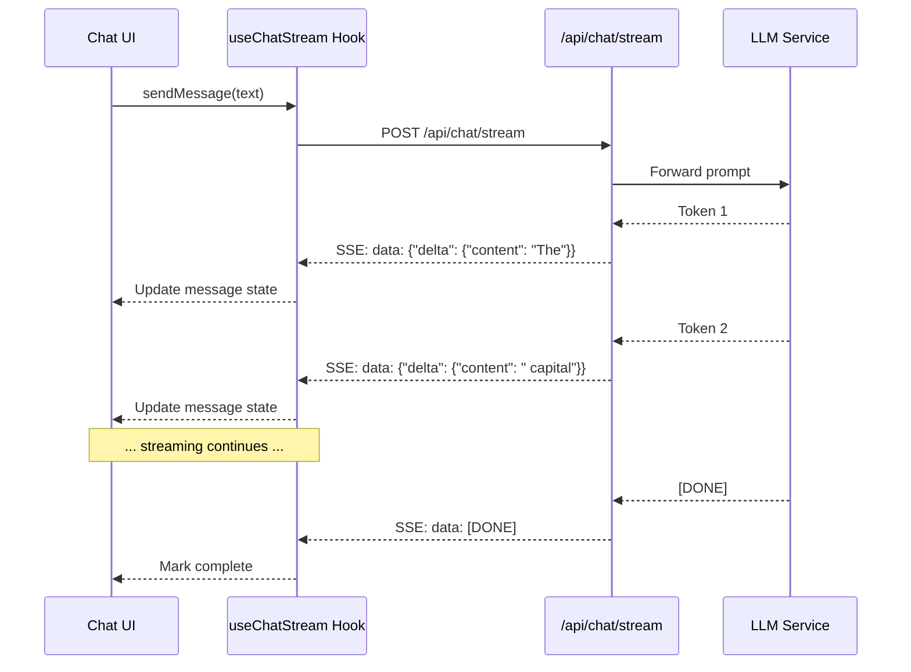

# Streaming Responses — SSE Handling, Streaming Render, Loading States, Interruption

## Overview

GenAI models generate responses token by token. Streaming delivers these tokens to the UI as they arrive, providing immediate feedback to the user. This document covers the frontend patterns for consuming, rendering, and managing streaming responses.

## Architecture



## SSE Client Hook

```tsx
// src/hooks/useChatStream.ts
import { useState, useCallback, useRef } from 'react';
import type { Message } from '@/types';
import { trackStreamingStarted, trackStreamingCompleted, trackStreamingError } from '@/lib/ai-telemetry';

interface UseChatStreamOptions {
  conversationId?: string;
  model?: string;
  onMessageComplete?: (message: Message) => void;
}

interface StreamState {
  messages: Message[];
  isStreaming: boolean;
  error: Error | null;
  timeToFirstToken: number | null;
}

export function useChatStream({
  conversationId,
  model,
  onMessageComplete,
}: UseChatStreamOptions = {}) {
  const [state, setState] = useState<StreamState>({
    messages: [],
    isStreaming: false,
    error: null,
    timeToFirstToken: null,
  });

  const abortControllerRef = useRef<AbortController | null>(null);
  const streamingStartTimeRef = useRef<number | null>(null);

  const sendMessage = useCallback(async (content: string) => {
    if (state.isStreaming) return;

    const userMessage: Message = {
      id: crypto.randomUUID(),
      role: 'user',
      content,
      timestamp: new Date(),
    };

    // Add user message immediately
    setState(prev => ({
      ...prev,
      messages: [...prev.messages, userMessage],
      isStreaming: true,
      error: null,
    }));

    // Create placeholder for assistant response
    const assistantMessageId = crypto.randomUUID();
    const assistantMessage: Message = {
      id: assistantMessageId,
      role: 'assistant',
      content: '',
      timestamp: new Date(),
    };

    setState(prev => ({
      ...prev,
      messages: [...prev.messages, assistantMessage],
    }));

    // Start streaming
    const abortController = new AbortController();
    abortControllerRef.current = abortController;
    streamingStartTimeRef.current = Date.now();

    try {
      trackStreamingStarted();

      const response = await fetch('/api/chat/stream', {
        method: 'POST',
        headers: {
          'Content-Type': 'application/json',
          Accept: 'text/event-stream',
        },
        body: JSON.stringify({
          conversationId,
          message: content,
          model,
        }),
        signal: abortController.signal,
      });

      if (!response.ok) {
        throw new Error(`Chat API error: ${response.status}`);
      }

      const reader = response.body?.getReader();
      if (!reader) {
        throw new Error('Response body is not readable');
      }

      const decoder = new TextDecoder();
      let assistantContent = '';
      let citations: Citation[] = [];
      let firstTokenReceived = false;

      while (true) {
        const { done, value } = await reader.read();
        if (done) break;

        const chunk = decoder.decode(value, { stream: true });
        const lines = chunk.split('\n');

        for (const line of lines) {
          if (line.startsWith('data: ')) {
            const data = line.slice(6);

            if (data === '[DONE]') {
              break;
            }

            try {
              const parsed = JSON.parse(data);

              if (parsed.delta?.content) {
                assistantContent += parsed.delta.content;

                if (!firstTokenReceived) {
                  firstTokenReceived = true;
                  const timeToFirstToken = streamingStartTimeRef.current
                    ? Date.now() - streamingStartTimeRef.current
                    : null;

                  setState(prev => ({ ...prev, timeToFirstToken }));
                }

                // Update assistant message with accumulated content
                setState(prev => ({
                  ...prev,
                  messages: prev.messages.map(msg =>
                    msg.id === assistantMessageId
                      ? { ...msg, content: assistantContent }
                      : msg,
                  ),
                }));
              }

              if (parsed.citations) {
                citations = parsed.citations;
              }
            } catch {
              // Skip malformed JSON in stream
              console.warn('Failed to parse SSE data:', data);
            }
          }
        }
      }

      // Finalize the message
      setState(prev => ({
        ...prev,
        isStreaming: false,
        messages: prev.messages.map(msg =>
          msg.id === assistantMessageId
            ? { ...msg, content: assistantContent, citations, complete: true }
            : msg,
        ),
      }));

      const completedMessage = {
        id: assistantMessageId,
        role: 'assistant' as const,
        content: assistantContent,
        citations,
        timestamp: new Date(),
        complete: true,
      };

      onMessageComplete?.(completedMessage);

      const totalDuration = streamingStartTimeRef.current
        ? Date.now() - streamingStartTimeRef.current
        : null;

      trackStreamingCompleted(
        state.timeToFirstToken ?? 0,
        assistantContent.split(/\s+/).length,
      );

    } catch (err) {
      if (err instanceof Error && err.name === 'AbortError') {
        // User cancelled — finalize with partial content
        setState(prev => ({
          ...prev,
          isStreaming: false,
          messages: prev.messages.map(msg =>
            msg.id === assistantMessageId
              ? { ...msg, interrupted: true }
              : msg,
          ),
        }));
      } else {
        setState(prev => ({
          ...prev,
          isStreaming: false,
          error: err instanceof Error ? err : new Error('Unknown error'),
        }));

        trackStreamingError(err instanceof Error ? err.message : 'Unknown error');
      }
    } finally {
      abortControllerRef.current = null;
      streamingStartTimeRef.current = null;
    }
  }, [state.isStreaming, conversationId, model, onMessageComplete]);

  const stopStreaming = useCallback(() => {
    abortControllerRef.current?.abort();
  }, []);

  return {
    messages: state.messages,
    isStreaming: state.isStreaming,
    error: state.error,
    timeToFirstToken: state.timeToFirstToken,
    sendMessage,
    stopStreaming,
  };
}
```

## Streaming Indicator

```tsx
// src/components/chat/StreamingIndicator.tsx
export function StreamingIndicator() {
  return (
    <div className="flex items-center gap-2 text-sm text-muted-foreground px-4 py-2" role="status" aria-live="polite">
      <div className="flex gap-1" aria-hidden="true">
        <span className="w-2 h-2 bg-muted-foreground rounded-full animate-bounce" style={{ animationDelay: '0ms' }} />
        <span className="w-2 h-2 bg-muted-foreground rounded-full animate-bounce" style={{ animationDelay: '150ms' }} />
        <span className="w-2 h-2 bg-muted-foreground rounded-full animate-bounce" style={{ animationDelay: '300ms' }} />
      </div>
      <span className="sr-only">AI is generating a response</span>
      <span aria-hidden="true">Thinking...</span>
    </div>
  );
}
```

## Streaming with Optimistic Markdown Rendering

```tsx
// src/components/chat/StreamingMessageContent.tsx
import { useMemo } from 'react';
import { sanitizeAndRenderMarkdown } from '@/lib/security/sanitizeMarkdown';

interface StreamingMessageContentProps {
  content: string;
}

export function StreamingMessageContent({ content }: StreamingMessageContentProps) {
  const renderedHtml = useMemo(() => {
    // Sanitize on every render — content changes with each token
    return sanitizeAndRenderMarkdown(content);
  }, [content]);

  return <div dangerouslySetInnerHTML={{ __html: renderedHtml }} />;
}
```

## Interruption Handling

```tsx
// src/components/chat/InterruptedMessage.tsx
interface InterruptedMessageProps {
  content: string;
  onRetry: () => void;
  onContinue: () => void;
}

export function InterruptedMessage({ content, onRetry, onContinue }: InterruptedMessageProps) {
  return (
    <div className="mt-2 pt-2 border-t">
      <div className="flex items-center gap-2 text-sm text-muted-foreground">
        <AlertTriangleIcon className="h-4 w-4" />
        <span>Response was interrupted</span>
        <div className="flex gap-2 ml-2">
          <button
            onClick={onContinue}
            className="text-xs text-primary underline"
          >
            Continue
          </button>
          <button
            onClick={onRetry}
            className="text-xs text-primary underline"
          >
            Regenerate
          </button>
        </div>
      </div>
    </div>
  );
}
```

## Error States During Streaming

```tsx
// src/components/chat/MessageError.tsx
interface MessageErrorProps {
  error: Error;
  onRetry: () => void;
}

export function MessageError({ error, onRetry }: MessageErrorProps) {
  return (
    <div
      role="alert"
      className="mx-auto max-w-3xl px-4 py-3"
    >
      <div className="flex items-center gap-2 text-sm text-destructive bg-destructive/10 rounded-lg p-3">
        <AlertCircleIcon className="h-4 w-4" />
        <span>
          {error.message === 'Chat API error: 429'
            ? 'Rate limit reached. Please wait a moment and try again.'
            : error.message === 'Chat API error: 500'
            ? 'The AI service is temporarily unavailable. Please try again.'
            : 'An error occurred while generating the response.'}
        </span>
        <button onClick={onRetry} className="ml-auto text-xs underline">
          Retry
        </button>
      </div>
    </div>
  );
}
```

## BFF API Route for SSE

```tsx
// src/app/api/chat/stream/route.ts
import { NextResponse } from 'next/server';
import { getSession } from '@/lib/auth/session';

export async function POST(request: Request) {
  const session = await getSession();
  if (!session) {
    return NextResponse.json({ error: 'Unauthorized' }, { status: 401 });
  }

  const { message, conversationId, model } = await request.json();

  // Forward to LLM service with streaming
  const response = await fetch(`${process.env.LLM_SERVICE_URL}/chat/stream`, {
    method: 'POST',
    headers: {
      'Content-Type': 'application/json',
      Authorization: `Bearer ${getBackendToken()}`,
    },
    body: JSON.stringify({
      message,
      conversationId,
      model,
      userId: session.userId,
    }),
  });

  if (!response.ok) {
    return NextResponse.json(
      { error: 'Failed to get AI response' },
      { status: response.status },
    );
  }

  // Stream the response back to the client
  return new NextResponse(response.body, {
    headers: {
      'Content-Type': 'text/event-stream',
      'Cache-Control': 'no-cache',
      Connection: 'keep-alive',
    },
  });
}
```

## Common Mistakes

### 1. Not Handling Abort Signal

```tsx
// ❌ BAD: No way to cancel streaming
const response = await fetch('/api/chat/stream', { ... });
// User navigates away — request continues in background

// ✅ GOOD: Abort on unmount or user action
const abortController = new AbortController();
// ... pass signal to fetch
// ... call abortController.abort() when user clicks "Stop"
```

### 2. Not Sanitizing Streaming Content

Each token update re-renders. Without sanitization, malicious content in the stream executes.

### 3. Memory Leaks from Streaming

```tsx
// ❌ BAD: Accumulating strings without bounds
let content = '';
content += token; // Grows unbounded

// ✅ GOOD: Limit message length
if (content.length > MAX_MESSAGE_LENGTH) {
  // Truncate or stop
}
```

## Cross-References

- `./genai-chat-interfaces.md` — Chat UI architecture
- `./safe-ai-content-rendering.md` — Sanitizing streamed markdown
- `./citations-and-grounding-ui.md` — Citations in streaming responses
- `./frontend-observability.md` — Streaming performance metrics
- `../genai-platforms/` — Backend streaming architecture

## Interview Questions

1. How do you consume Server-Sent Events in a React application?
2. Design a hook that manages streaming chat responses.
3. How do you implement a "stop generating" feature?
4. What are the security implications of streaming AI responses?
5. How do you measure streaming performance on the frontend?
