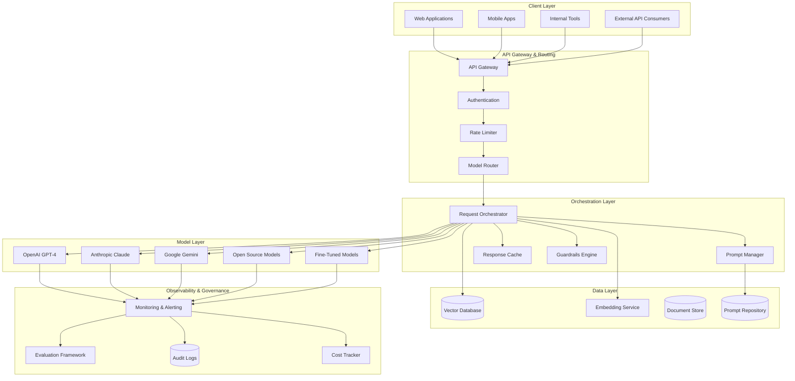

# GenAI Platform Engineering

The definitive guide to building, operating, and scaling enterprise Generative AI platforms in a global banking environment. This is the most technically comprehensive section in the academy, covering everything from foundational LLM mechanics to production-grade multi-model architectures.

## Why a GenAI Platform?

In a global bank, GenAI is not a single application — it is a **platform capability** that serves hundreds of use cases across retail banking, investment banking, risk management, compliance, HR, IT operations, and software engineering. Building this platform requires:

- **Reliability**: 99.9%+ availability for customer-facing and employee-facing AI services
- **Security**: Zero-trust architecture, PII protection, data residency compliance across 60+ countries
- **Cost Efficiency**: Token cost management at scale (billions of tokens/month)
- **Governance**: Audit trails, model risk management (SR 11-7), regulatory compliance
- **Developer Experience**: Self-service APIs, SDKs, and tooling for internal teams

## Platform Architecture Principles

1. **Model Agnosticism**: Never couple business logic to a specific model provider. Abstract model access behind a gateway layer that supports routing, fallback, and A/B testing.

2. **Defense in Depth**: Every GenAI application has multiple layers of protection: input validation, prompt injection detection, output filtering, human review, and audit logging.

3. **Observability First**: Every request is traced from input to output with latency, cost, quality scores, and safety signals. No black-box deployments.

4. **Progressive Rollout**: No model or prompt change reaches 100% of users without phased testing, canary analysis, and automated rollback triggers.

5. **Cost Accountability**: Every team's GenAI usage is tracked, budgeted, and chargeback-ready. No shared pools without attribution.

## Platform Components

## File Structure

### Core Concepts
| File | Description |
|------|-------------|
| [llm-fundamentals.md](./llm-fundamentals.md) | How LLMs work: tokens, attention, context windows, limitations |
| [tokenization.md](./tokenization.md) | Token counting, cost implications, optimization strategies |
| [embeddings.md](./embeddings.md) | Embedding models, vector representations, similarity search |
| [prompt-engineering.md](./prompt-engineering.md) | Systematic prompt design, patterns, anti-patterns |

### Advanced Techniques
| File | Description |
|------|-------------|
| [fine-tuning.md](./fine-tuning.md) | When to fine-tune, LoRA, QLoRA, data requirements |
| [hallucinations.md](./hallucinations.md) | Why hallucinations happen, detection, mitigation |
| [agents.md](./agents.md) | Agent architectures, ReAct, planning, tool use |
| [tool-calling.md](./tool-calling.md) | Function calling, tool schemas, result handling, security |

### Safety & Governance
| File | Description |
|------|-------------|
| [ai-safety.md](./ai-safety.md) | AI safety principles, red teaming, harm prevention |
| [human-in-the-loop.md](./human-in-the-loop.md) | Human review workflows, approval flows, escalation |
| [cost-optimization.md](./cost-optimization.md) | Token cost management, caching, model selection |
| [model-routing.md](./model-routing.md) | Intelligent model selection, routing logic, fallbacks |

### Platform Operations
| File | Description |
|------|-------------|
| [caching.md](./caching.md) | Response caching, embedding caching, semantic cache |
| [multi-model-architecture.md](./multi-model-architecture.md) | Multi-provider strategy, abstraction layers, migration |
| [model-observability.md](./model-observability.md) | Model quality monitoring, drift detection, degradation |
| [prompt-versioning.md](./prompt-versioning.md) | Prompt management, versioning, A/B testing |
| [ai-product-metrics.md](./ai-product-metrics.md) | Key metrics: satisfaction, groundedness, latency, cost |
| [enterprise-genai-architecture.md](./enterprise-genai-architecture.md) | Full enterprise architecture with diagrams |
| [safe-rollout-strategies.md](./safe-rollout-strategies.md) | Phased rollout, canary, feature flags, monitoring |

### Banking Use Cases
| File | Description |
|------|-------------|
| [banking-use-cases/internal-assistant.md](./banking-use-cases/internal-assistant.md) | Employee assistant, policy search, HR Q&A |
| [banking-use-cases/compliance-assistant.md](./banking-use-cases/compliance-assistant.md) | Regulatory research, policy interpretation |
| [banking-use-cases/code-assistant.md](./banking-use-cases/code-assistant.md) | Developer copilot, code review assistance |
| [banking-use-cases/contact-center-copilot.md](./banking-use-cases/contact-center-copilot.md) | Agent assistance, call summarization |
| [banking-use-cases/fraud-detection-support.md](./banking-use-cases/fraud-detection-support.md) | AI-assisted fraud analysis |
| [banking-use-cases/kyc-assistant.md](./banking-use-cases/kyc-assistant.md) | KYC process automation, document analysis |

### Platform Integrations
| Directory | Description |
|-----------|-------------|
| [openai/](./openai/) | OpenAI integration, model selection, enterprise considerations |
| [claude/](./claude/) | Claude integration, strengths, banking use cases |
| [gemini/](./gemini/) | Gemini integration, Google ecosystem, data residency |
| [open-source-models/](./open-source-models/) | Llama, Mistral, self-hosted models |
| [langchain/](./langchain/) | LangChain for production, chains, agents |
| [llamaindex/](./llamaindex/) | LlamaIndex for RAG, data connectors |
| [guardrails/](./guardrails/) | Guardrails AI, NeMo Guardrails, content filtering |
| [evaluation-frameworks/](./evaluation-frameworks/) | RAGAS, DeepEval, custom evaluation frameworks |
| [vector-databases/](./vector-databases/) | Vector DB comparison and selection |
| [multi-agent-systems/](./multi-agent-systems/) | Multi-agent orchestration and coordination |
| [prompt-libraries/](./prompt-libraries/) | Centralized prompt management and versioning |
| [ai-red-teaming/](./ai-red-teaming/) | Red team methodology and automation |
| [ai-safety-reviews/](./ai-safety-reviews/) | Safety review process and checklists |

## Cross-References

- **RAG and Search**: See [../rag-and-search/](../rag-and-search/) for retrieval-augmented generation, vector search, and document processing
- **Security**: See [../security/](../security/) for prompt injection defense, data leakage prevention, and zero-trust architecture
- **Observability**: See [../observability/](../observability/) for monitoring, alerting, and tracing GenAI applications
- **Backend Engineering**: See [../backend-engineering/](../backend-engineering/) for API design, microservices patterns
- **Incident Management**: See [../incident-management/](../incident-management/) for production incident response

## Key Design Decisions

### Build vs. Buy vs. Open Source

| Component | Recommendation | Rationale |
|-----------|---------------|-----------|
| Model Access | Multi-provider (buy) | Avoid vendor lock-in, ensure fallback |
| Orchestration | Build on OSS frameworks | Customize for banking requirements |
| Vector Database | Evaluate per use case | Different needs for different workloads |
| Guardrails | Build + OSS | Banking-specific safety requirements |
| Evaluation | Build custom + OSS | Standard frameworks insufficient for banking |
| Monitoring | Build on existing platform | Leverage bank's existing observability stack |

### Model Selection Matrix

| Use Case | Primary Model | Fallback | Rationale |
|----------|--------------|----------|-----------|
| Customer-facing chat | GPT-4o | Claude 3.5 Sonnet | Best balance of quality and cost |
| Compliance analysis | Claude 3.5 Opus | GPT-4o | Superior long-context reasoning |
| Code generation | Claude 3.5 Sonnet | GPT-4o | Leading code generation capability |
| Internal search | Fine-tuned Llama 3 | GPT-4o-mini | Data residency, cost efficiency |
| Document summarization | GPT-4o | Gemini 1.5 Pro | Consistent quality, good context window |
| Embeddings | text-embedding-3-large | nomic-embed-text | Quality and dimensionality |

## Getting Started

1. Read [llm-fundamentals.md](./llm-fundamentals.md) to understand how models work
2. Study [prompt-engineering.md](./prompt-engineering.md) for systematic prompt design
3. Review [enterprise-genai-architecture.md](./enterprise-genai-architecture.md) for full architecture
4. Explore [banking-use-cases/](./banking-use-cases/) for domain-specific patterns
5. Understand [ai-safety.md](./ai-safety.md) before any production deployment

## Interview Preparation

This section maps to the following interview topics:
- "Design a GenAI platform for 100M users"
- "How do you prevent hallucinations in a compliance assistant?"
- "What is your model routing strategy?"
- "How do you measure and improve AI product quality?"
- "Design a safe rollout strategy for a new model version"

See [../interview-prep/](../interview-prep/) for practice questions and system design exercises.
