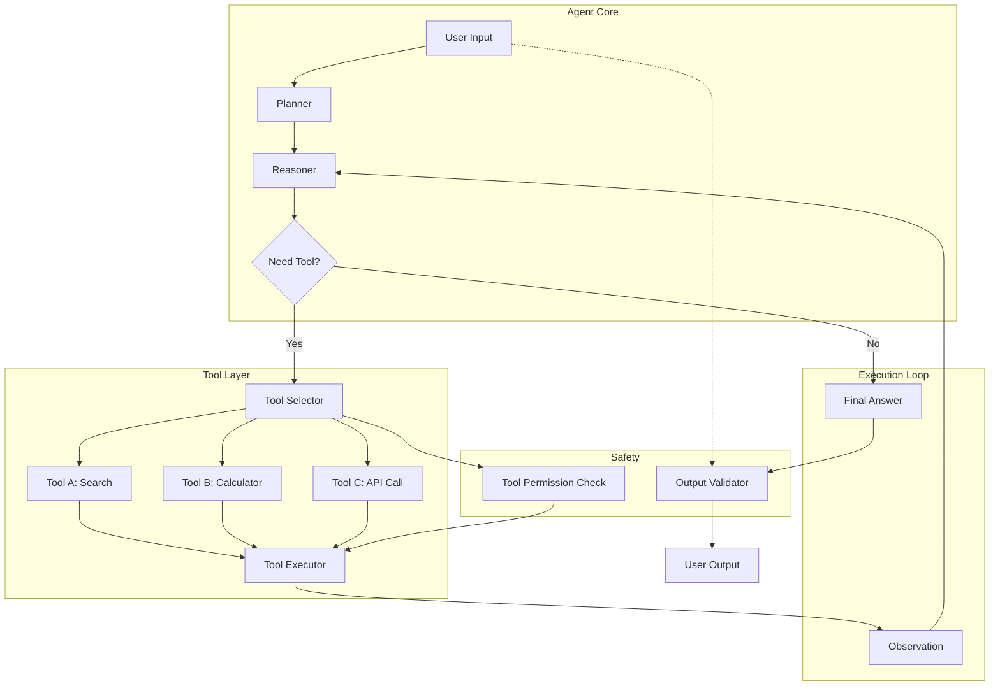

# Agents

AI agents extend LLMs with the ability to reason, plan, and take actions using tools. Unlike simple prompt-response patterns, agents can autonomously complete multi-step tasks by iterating between thinking and acting.

## Agent Architecture Overview



## Agent Design Patterns

### Pattern 1: ReAct (Reasoning + Acting)

ReAct interleaves reasoning traces with tool actions, enabling the agent to think through problems step by step.

```python
REACT_TEMPLATE = """
You are a banking operations assistant. Answer the user's question by \
thinking step by step and using tools to gather information.

You have access to these tools:
- search_knowledge_base(query): Search internal policies and procedures
- lookup_customer(customer_id): Get customer profile and account details
- check_transaction(tx_id): Get details of a specific transaction
- calculate(expression): Perform mathematical calculations

Format your response as follows:
Thought: <your reasoning about what to do next>
Action: <tool_name>
Action Input: <tool_input>
Observation: <tool output>
... (repeat Thought/Action/Observation as needed)
Thought: I now have enough information to answer the question.
Final Answer: <complete answer to the user's question>

Begin!

Question: {question}
"""

# Example execution trace:
# Thought: I need to find the customer's account details first.
# Action: lookup_customer
# Action Input: {"customer_id": "CUST-12345"}
# Observation: {"name": "John Smith", "account_type": "Premium", "balance": 15000}
# Thought: Now I need to check the recent transaction.
# Action: check_transaction
# Action Input: {"tx_id": "TXN-67890"}
# Observation: {"amount": 5000, "type": "wire_transfer", "destination": "Offshore Corp"}
# Thought: I now have enough information to answer the question.
# Final Answer: The customer John Smith has a Premium account with a balance of £15,000...
```

### Pattern 2: Plan-and-Execute

```python
# Two-phase approach: Plan first, then execute

class PlanAndExecuteAgent:
    """Plan all steps first, then execute sequentially."""

    def __init__(self, planner_llm, executor_llm, tools: dict):
        self.planner = planner_llm
        self.executor = executor_llm
        self.tools = tools

    async def run(self, task: str) -> dict:
        """Execute task with planning phase."""
        # Phase 1: Create plan
        plan = await self._create_plan(task)

        # Phase 2: Execute plan
        results = []
        for step in plan.steps:
            result = await self._execute_step(step, results)
            results.append(result)

            # Check if step succeeded
            if result.get("status") == "failed":
                # Attempt recovery
                recovery = await self._recover_from_failure(step, results)
                if recovery:
                    results.append(recovery)
                else:
                    return {
                        "status": "failed",
                        "plan": plan,
                        "completed_steps": results,
                        "failed_at": step,
                    }

        # Phase 3: Synthesize final answer
        final_answer = await self._synthesize(task, plan, results)

        return {
            "status": "completed",
            "plan": plan,
            "results": results,
            "final_answer": final_answer,
        }

    async def _create_plan(self, task: str) -> Plan:
        """Use LLM to create a structured plan."""
        planning_prompt = f"""
Create a step-by-step plan to accomplish this task:

Task: {task}

For each step, specify:
1. A description of what to do
2. Which tool to use (or "reasoning" if no tool needed)
3. The expected input and output format

Return the plan as a JSON array of steps.
"""
        plan_json = await self.planner.complete(planning_prompt)
        return Plan.from_json(plan_json)
```

### Pattern 3: Supervisor/Worker

```python
# Multi-agent pattern: Supervisor delegates to specialized workers

class SupervisorAgent:
    """Supervisor routes tasks to specialized worker agents."""

    WORKERS = {
        "researcher": "Searches knowledge base for relevant information",
        "analyst": "Analyzes data and performs calculations",
        "writer": "Generates formatted reports and summaries",
        "reviewer": "Reviews outputs for accuracy and compliance",
    }

    def __init__(self, supervisor_llm, worker_agents: dict):
        self.supervisor = supervisor_llm
        self.workers = worker_agents

    async def run(self, task: str) -> dict:
        """Route task through supervisor to appropriate workers."""
        # Supervisor decides which workers to use
        routing = await self._route_task(task)

        results = {}
        for worker_name in routing["workers"]:
            worker = self.workers[worker_name]
            worker_task = routing["tasks_for_worker"][worker_name]
            result = await worker.run(worker_task)
            results[worker_name] = result

        # Supervisor synthesizes final answer
        final = await self._synthesize_final(task, results)

        return {
            "routing": routing,
            "worker_results": results,
            "final_answer": final,
        }
```

## Building Agents with LangGraph

```python
from langgraph.graph import StateGraph, END
from typing import TypedDict, Annotated
import operator

# Define agent state
class AgentState(TypedDict):
    messages: Annotated[list, operator.add]
    current_step: str
    tool_calls: list
    tool_results: list
    final_answer: str
    confidence: str
    requires_human_review: bool

# Define nodes
async def reason_node(state: AgentState) -> dict:
    """LLM reasons about what to do next."""
    llm_with_tools = llm.bind_tools(tools)
    response = await llm_with_tools.ainvoke(state["messages"])

    updates = {"messages": [response]}

    if response.tool_calls:
        updates["tool_calls"] = response.tool_calls
        updates["current_step"] = "executing_tools"
    else:
        updates["final_answer"] = response.content
        updates["current_step"] = "done"

    return updates

async def tool_execution_node(state: AgentState) -> dict:
    """Execute tool calls."""
    tool_results = []
    for tool_call in state["tool_calls"]:
        tool_name = tool_call["name"]
        tool_input = tool_call["args"]
        tool = tools_by_name[tool_name]

        # SAFETY: Check tool permissions
        if not check_tool_permission(tool_name, state.get("user_role")):
            tool_results.append({
                "tool": tool_name,
                "error": f"Permission denied for tool: {tool_name}",
            })
            continue

        # SAFETY: Validate tool input
        validated_input = validate_tool_input(tool_name, tool_input)

        # Execute
        try:
            result = await tool.ainvoke(validated_input)
            tool_results.append({"tool": tool_name, "result": result})
        except Exception as e:
            tool_results.append({"tool": tool_name, "error": str(e)})

    return {"tool_results": tool_results, "current_step": "reasoning"}

async def human_review_node(state: AgentState) -> dict:
    """Route to human review if confidence is low."""
    if should_review(state):
        return {
            "requires_human_review": True,
            "current_step": "human_review",
        }
    return {"current_step": "done"}

# Build graph
workflow = StateGraph(AgentState)

workflow.add_node("reason", reason_node)
workflow.add_node("execute_tools", tool_execution_node)
workflow.add_node("human_review", human_review_node)

workflow.set_entry_point("reason")

# Conditional edges
def route_after_reason(state: AgentState) -> str:
    if state["current_step"] == "executing_tools":
        return "execute_tools"
    elif state["current_step"] == "done":
        return "human_review"
    return "reason"

workflow.add_conditional_edges("reason", route_after_reason, {
    "execute_tools": "execute_tools",
    "human_review": "human_review",
    "reason": "reason",
})
workflow.add_edge("execute_tools", "reason")
workflow.add_edge("human_review", END)

app = workflow.compile()
```

## Tool Design for Banking Agents

```python
from pydantic import BaseModel, Field
from typing import Literal

# Define tools with strict schemas

class SearchKnowledgeBaseInput(BaseModel):
    query: str = Field(description="Search query for policy/procedure lookup")
    department: Literal["compliance", "risk", "operations", "hr", "it"] = Field(
        default=None, description="Limit search to specific department"
    )
    max_results: int = Field(default=5, description="Maximum results to return")

class LookupCustomerInput(BaseModel):
    customer_id: str = Field(
        description="Customer ID (format: CUST-XXXXX)"
    )
    include_sensitive: bool = Field(
        default=False,
        description="Include PII — requires elevated permissions"
    )

class CheckTransactionInput(BaseModel):
    transaction_id: str = Field(
        description="Transaction ID (format: TXN-XXXXX)"
    )

class CalculateInput(BaseModel):
    expression: str = Field(
        description="Mathematical expression to evaluate, e.g., '15% of 2456.78'"
    )

# Tool implementations
async def search_knowledge_base(input: SearchKnowledgeBaseInput) -> list[dict]:
    """Search internal knowledge base for relevant documents."""
    # Vector search implementation
    embedding = await get_embedding(input.query)
    results = await vector_db.search(
        embedding=embedding,
        filter={"department": input.department} if input.department else None,
        top_k=input.max_results,
    )
    return results

async def lookup_customer(input: LookupCustomerInput) -> dict:
    """Look up customer details — with permission check."""
    # CRITICAL: This tool accesses PII
    if not has_permission("customer_data_read"):
        raise PermissionError("Insufficient permissions to access customer data")

    # Audit log
    audit_log.record(
        action="customer_lookup",
        customer_id=input.customer_id,
        user=current_user.id,
        include_sensitive=input.include_sensitive,
    )

    customer = await customer_db.get(input.customer_id)

    if not input.include_sensitive:
        customer = redact_pii(customer)

    return customer
```

## Agent Safety in Banking

### Tool Permission Matrix

```python
TOOL_PERMISSIONS = {
    "search_knowledge_base": {
        "required_role": "banking_user",  # All staff
        "audit": False,
        "rate_limit": "100/hour",
    },
    "lookup_customer": {
        "required_role": "customer_service",  # Customer-facing staff only
        "audit": True,  # Every access logged
        "rate_limit": "50/hour",
        "sensitive_data_role": "senior_customer_service",
    },
    "check_transaction": {
        "required_role": "banking_user",
        "audit": True,
        "rate_limit": "200/hour",
    },
    "transfer_funds": {
        "required_role": "senior_teller",  # Highly restricted
        "audit": True,
        "rate_limit": "20/hour",
        "requires_human_approval": True,  # Agent cannot execute alone
    },
    "delete_customer_record": {
        "required_role": "compliance_admin",  # Most restricted
        "audit": True,
        "rate_limit": "5/hour",
        "requires_human_approval": True,
        "requires_dual_authorization": True,
    },
}
```

### Agent Loop Protection

```python
class AgentLoopGuard:
    """Prevent infinite agent loops and excessive tool usage."""

    def __init__(
        self,
        max_iterations: int = 10,
        max_tool_calls: int = 15,
        max_total_tokens: int = 50000,
        timeout_seconds: float = 60.0,
    ):
        self.max_iterations = max_iterations
        self.max_tool_calls = max_tool_calls
        self.max_total_tokens = max_total_tokens
        self.timeout = timeout_seconds

    def check(self, state: AgentState) -> bool:
        """Return True if agent should stop."""
        if state["iteration_count"] >= self.max_iterations:
            return True  # Max iterations reached
        if state["total_tool_calls"] >= self.max_tool_calls:
            return True  # Max tool calls reached
        if state["total_tokens"] >= self.max_total_tokens:
            return True  # Token budget exceeded
        if state["elapsed_time"] >= self.timeout:
            return True  # Timeout

        # Detect loops: same tool called 3+ times with same input
        if self._detect_loop(state):
            return True

        return False

    def _detect_loop(self, state: AgentState) -> bool:
        """Detect if agent is repeating the same actions."""
        recent_actions = state["action_history"][-6:]
        if len(recent_actions) < 6:
            return False

        # Check for repeated pattern
        pattern = recent_actions[:3]
        if recent_actions[3:] == pattern:
            return True

        return False
```

## Common Mistakes and Anti-Patterns

### Anti-Pattern 1: Unbounded Agent Loops

```python
# WRONG: No iteration limit
while not done:
    action = agent.thought()
    observation = agent.act(action)
    # Agent can loop indefinitely, consuming tokens and costing money

# RIGHT: Enforce limits
for iteration in range(MAX_ITERATIONS):
    action = agent.thought()
    if action.type == "final_answer":
        break
    observation = agent.act(action)
else:
    raise AgentTimeoutError(f"Agent exceeded {MAX_ITERATIONS} iterations")
```

### Anti-Pattern 2: Over-Tooling

```python
# WRONG: Giving agent 20+ tools
# Agent struggles to choose the right tool, makes wrong choices
# Each tool definition costs tokens in every LLM call

# RIGHT: Start with minimal tools
# 3-5 tools for most use cases
# Add tools only when demonstrably needed
# Group related tools (e.g., one "query_database" tool instead of 5 separate ones)
```

### Anti-Pattern 3: Agent Without Human Oversight

```python
# WRONG: Agent can execute any action autonomously
# Agent could transfer funds, delete records, or send emails

# RIGHT: Define action categories
ACTIONS = {
    "READ_ONLY": {  # Agent can execute freely
        "search_knowledge_base",
        "lookup_public_information",
    },
    "REVIEW_REQUIRED": {  # Agent proposes, human approves
        "send_customer_communication",
        "flag_transaction",
    },
    "HUMAN_ONLY": {  # Agent cannot execute
        "approve_loan",
        "transfer_funds",
        "close_account",
    },
}
```

### Anti-Pattern 4: Not Logging Agent Decisions

```python
# WRONG: No audit trail for agent reasoning
# "Why did the agent recommend escalation?" — Nobody knows

# RIGHT: Log every step
audit_log = {
    "request_id": "req-123",
    "agent_id": "compliance-assistant-v2",
    "user_query": "Is this transaction suspicious?",
    "reasoning_steps": [
        {"step": 1, "thought": "Need to look up customer history"},
        {"step": 2, "action": "search_knowledge_base", "input": "..."},
        {"step": 3, "observation": "Found 3 similar cases..."},
        # ... every step recorded
    ],
    "final_decision": "ESCALATE",
    "confidence": "MEDIUM",
    "timestamp": "2024-01-15T10:30:00Z",
}
```

## Interview Questions

1. When would you use an agent architecture vs. a simple prompt chain?
2. How do you prevent an agent from entering infinite loops?
3. What tools would you give a banking agent? Which would you restrict?
4. How do you test an agent's reliability before deploying to production?
5. An agent keeps making the wrong tool choice. How do you debug?

## Cross-References

- [tool-calling.md](./tool-calling.md) — Function calling and tool schemas
- [prompt-engineering.md](./prompt-engineering.md) — ReAct and chain-of-thought patterns
- [human-in-the-loop.md](./human-in-the-loop.md) — Human review for agent actions
- [ai-safety.md](./ai-safety.md) — Agent safety principles
- [multi-agent-systems/](./multi-agent-systems/) — Multi-agent orchestration
- [../security/](../security/) — Tool permission and access control
