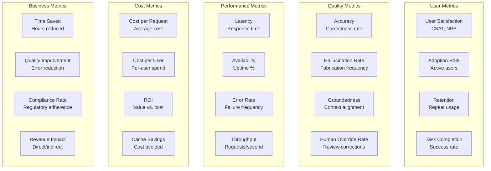

# AI Product Metrics

Measuring the success of GenAI products requires a comprehensive set of metrics spanning user satisfaction, quality, performance, cost, and business impact. This guide defines the key metrics every GenAI product should track.

## Metric Categories



## User Satisfaction Metrics

### CSAT (Customer Satisfaction Score)

```python
class CSATTracker:
    """Track user satisfaction with AI responses."""

    def __init__(self, db_client):
        self.db = db_client

    def record_feedback(self, request_id: str, user_id: str,
                        score: int, feedback: str = None):
        """Record user feedback (1-5 scale)."""
        self.db.insert("user_feedback", {
            "request_id": request_id,
            "user_id": user_id,
            "score": score,  # 1-5
            "feedback": feedback,
            "created_at": datetime.utcnow().isoformat(),
        })

    def get_csat(self, period: str = "7d", filters: dict = None) -> dict:
        """Get CSAT score for period."""
        query = """
            SELECT
                COUNT(*) as total_responses,
                AVG(score) as avg_score,
                SUM(CASE WHEN score >= 4 THEN 1 ELSE 0 END)::float /
                    NULLIF(COUNT(*), 0) as satisfaction_rate,
                SUM(CASE WHEN score = 5 THEN 1 ELSE 0 END) as very_satisfied,
                SUM(CASE WHEN score <= 2 THEN 1 ELSE 0 END) as dissatisfied
            FROM user_feedback
            WHERE created_at > NOW() - INTERVAL %s
        """

        # Optionally filter by model, task type, team, etc.
        results = self.db.query(query, (period,))

        return {
            "total_responses": results["total_responses"],
            "avg_score": results["avg_score"],
            "satisfaction_rate": results["satisfaction_rate"],
            "response_rate": self._calculate_response_rate(period),
            "trend": self._get_csat_trend(period),
        }

    def get_csat_by_dimension(self, period: str = "30d") -> dict:
        """Get CSAT broken down by various dimensions."""
        return {
            "by_model": self._get_csat_grouped_by("model", period),
            "by_task_type": self._get_csat_grouped_by("task_type", period),
            "by_team": self._get_csat_grouped_by("team", period),
            "by_prompt_version": self._get_csat_grouped_by("prompt_version", period),
            "by_time_of_day": self._get_csat_grouped_by("hour", period),
        }
```

### Thumbs Up/Down

```python
# Lightweight feedback mechanism
# Easier to collect than CSAT surveys

class ThumbsTracker:
    """Track thumbs up/down feedback."""

    def record(self, request_id: str, user_id: str, thumbs: str,
               reason: str = None):
        """Record thumbs up/down."""
        if thumbs not in ("up", "down"):
            raise ValueError("thumbs must be 'up' or 'down'")

        self.db.insert("thumbs_feedback", {
            "request_id": request_id,
            "user_id": user_id,
            "thumbs": thumbs,
            "reason": reason,  # Optional: why thumbs down?
            "created_at": datetime.utcnow().isoformat(),
        })

    def get_thumbs_rate(self, period: str = "7d") -> dict:
        """Get thumbs up/down rate."""
        results = self.db.query("""
            SELECT
                COUNT(*) as total,
                SUM(CASE WHEN thumbs = 'up' THEN 1 ELSE 0 END) as ups,
                SUM(CASE WHEN thumbs = 'down' THEN 1 ELSE 0 END) as downs,
                SUM(CASE WHEN thumbs = 'up' THEN 1 ELSE 0 END)::float /
                    NULLIF(COUNT(*), 0) as thumbs_up_rate
            FROM thumbs_feedback
            WHERE created_at > NOW() - INTERVAL %s
        """, (period,))

        # Common reasons for thumbs down
        down_reasons = self.db.query("""
            SELECT reason, COUNT(*) as count
            FROM thumbs_feedback
            WHERE thumbs = 'down'
            AND created_at > NOW() - INTERVAL %s
            GROUP BY reason
            ORDER BY count DESC
        """, (period,))

        return {
            "total": results["total"],
            "ups": results["ups"],
            "downs": results["downs"],
            "thumbs_up_rate": results["thumbs_up_rate"],
            "down_reasons": down_reasons,
        }
```

## Quality Metrics

### Hallucination Rate

```python
class HallucinationRateTracker:
    """Track hallucination rate in production."""

    def __init__(self, detector, db_client):
        self.detector = detector
        self.db = db_client

    async def check_and_record(self, request_id: str, context: str,
                               response: str) -> bool:
        """Check for hallucination and record."""
        result = self.detector.detect(context, response)

        self.db.insert("hallucination_checks", {
            "request_id": request_id,
            "hallucination_detected": result["hallucination_detected"],
            "risk_score": result["max_risk_score"],
            "checked_at": datetime.utcnow().isoformat(),
        })

        return result["hallucination_detected"]

    def get_hallucination_rate(self, period: str = "7d") -> dict:
        """Get hallucination rate for period."""
        results = self.db.query("""
            SELECT
                COUNT(*) as total_checked,
                SUM(CASE WHEN hallucination_detected THEN 1 ELSE 0 END) as hallucinated,
                AVG(risk_score) as avg_risk_score,
                PERCENTILE_CONT(0.95) WITHIN GROUP (ORDER BY risk_score) as p95_risk_score
            FROM hallucination_checks
            WHERE checked_at > NOW() - INTERVAL %s
        """, (period,))

        return {
            "total_checked": results["total_checked"],
            "hallucinated": results["hallucinated"],
            "hallucination_rate": results["hallucinated"] / results["total_checked"],
            "avg_risk_score": results["avg_risk_score"],
            "p95_risk_score": results["p95_risk_score"],
            "trend": self._get_hallucination_trend(period),
        }
```

### Human Override Rate

```python
class HumanOverrideTracker:
    """Track how often humans override AI decisions."""

    def get_override_rate(self, period: str = "7d",
                          risk_level: str = None) -> dict:
        """Get human override rate."""
        query = """
            SELECT
                COUNT(*) as total_reviews,
                SUM(CASE WHEN action = 'confirmed' THEN 1 ELSE 0 END) as confirmed,
                SUM(CASE WHEN action = 'overridden' THEN 1 ELSE 0 END) as overridden,
                SUM(CASE WHEN action = 'overridden' THEN 1 ELSE 0 END)::float /
                    NULLIF(COUNT(*), 0) as override_rate
            FROM human_reviews
            WHERE reviewed_at > NOW() - INTERVAL %s
        """

        params = [period]
        if risk_level:
            query += " AND risk_level = %s"
            params.append(risk_level)

        results = self.db.query(query, params)

        return {
            "total_reviews": results["total_reviews"],
            "confirmed": results["confirmed"],
            "overridden": results["overridden"],
            "override_rate": results["override_rate"],
            "trend": self._get_override_trend(period),
        }
```

## Cost Metrics

### Cost Dashboard

```python
class CostDashboard:
    """Comprehensive cost tracking."""

    def get_dashboard(self, period: str = "30d") -> dict:
        """Get full cost dashboard."""
        return {
            "total_spend": self._get_total_spend(period),
            "cost_per_request": self._get_cost_per_request(period),
            "cost_per_user": self._get_cost_per_user(period),
            "cost_by_model": self._get_cost_by_model(period),
            "cost_by_team": self._get_cost_by_team(period),
            "cost_by_application": self._get_cost_by_application(period),
            "cache_savings": self._get_cache_savings(period),
            "forecast": self._get_cost_forecast(),
            "budget_utilization": self._get_budget_utilization(period),
        }

    def get_cost_per_request(self, period: str = "7d") -> dict:
        """Get cost per request metrics."""
        results = self.db.query("""
            SELECT
                COUNT(*) as total_requests,
                AVG(cost_usd) as avg_cost,
                PERCENTILE_CONT(0.50) WITHIN GROUP (ORDER BY cost_usd) as median_cost,
                PERCENTILE_CONT(0.95) WITHIN GROUP (ORDER BY cost_usd) as p95_cost,
                SUM(cost_usd) as total_cost
            FROM request_costs
            WHERE created_at > NOW() - INTERVAL %s
        """, (period,))

        return {
            "total_requests": results["total_requests"],
            "avg_cost_usd": results["avg_cost"],
            "median_cost_usd": results["median_cost"],
            "p95_cost_usd": results["p95_cost"],
            "total_cost_usd": results["total_cost"],
            "trend": self._get_cost_trend(period),
        }
```

## Business Impact Metrics

### Time Saved Calculation

```python
class TimeSavedTracker:
    """Track time saved by AI vs. manual process."""

    # Estimated time for manual completion of each task
    MANUAL_TIME_ESTIMATES = {
        "transaction_analysis": 300,       # 5 minutes
        "compliance_review": 1800,         # 30 minutes
        "document_summarization": 900,     # 15 minutes
        "customer_email_response": 600,    # 10 minutes
        "code_review": 1200,               # 20 minutes
        "policy_research": 3600,           # 60 minutes
    }

    def record_task_completion(self, request_id: str, task_type: str,
                               ai_time_seconds: float, human_time_seconds: float = None):
        """Record task completion with timing."""
        manual_estimate = self.MANUAL_TIME_ESTIMATES.get(task_type, 300)

        self.db.insert("task_completions", {
            "request_id": request_id,
            "task_type": task_type,
            "ai_time_seconds": ai_time_seconds,
            "manual_time_estimate": manual_estimate,
            "actual_human_time": human_time_seconds,  # If measured
            "time_saved_seconds": manual_estimate - ai_time_seconds,
            "completed_at": datetime.utcnow().isoformat(),
        })

    def get_time_saved_report(self, period: str = "30d") -> dict:
        """Get total time saved by AI."""
        results = self.db.query("""
            SELECT
                COUNT(*) as total_tasks,
                SUM(time_saved_seconds) as total_time_saved_seconds,
                AVG(time_saved_seconds) as avg_time_saved_per_task,
                SUM(ai_time_seconds) as total_ai_time,
                SUM(manual_time_estimate) as estimated_manual_time,
                SUM(time_saved_seconds) / 3600 as total_hours_saved,
                SUM(manual_time_estimate)::float /
                    NULLIF(SUM(ai_time_seconds), 0) as speedup_factor
            FROM task_completions
            WHERE completed_at > NOW() - INTERVAL %s
        """, (period,))

        return {
            "total_tasks_completed": results["total_tasks"],
            "total_hours_saved": results["total_hours_saved"],
            "avg_time_saved_per_task_seconds": results["avg_time_saved_per_task"],
            "speedup_factor": results["speedup_factor"],
            "by_task_type": self._get_time_saved_by_task_type(period),
        }
```

### Key Metric Targets

| Metric | Target | Alert Threshold | Measurement |
|--------|--------|----------------|-------------|
| CSAT | >= 4.2/5.0 | < 3.8 for 7 days | User feedback |
| Thumbs Up Rate | >= 85% | < 80% for 7 days | Thumbs feedback |
| Hallucination Rate | < 2% | > 5% for 1 day | Automated detection |
| Human Override Rate | < 10% | > 20% for 7 days | Review tracking |
| Latency p95 | < 5s | > 8s for 15 min | Monitoring |
| Availability | >= 99.9% | < 99.5% for 1h | Uptime monitoring |
| Cost per Request | Task-dependent | > 2x baseline for 1 day | Cost tracking |
| Time Saved | > 50% vs manual | < 30% for 7 days | Task timing |

## Executive Dashboard

```python
class ExecutiveDashboard:
    """High-level dashboard for leadership."""

    def get_executive_summary(self, period: str = "30d") -> dict:
        """Executive summary of GenAI platform health."""
        return {
            "adoption": {
                "total_users": self._get_total_users(period),
                "active_users": self._get_active_users(period),
                "user_growth": self._get_user_growth(period),
                "total_requests": self._get_total_requests(period),
                "request_growth": self._get_request_growth(period),
            },
            "quality": {
                "csat": self.csat.get_csat(period)["avg_score"],
                "hallucination_rate": self.hallucination.get_hallucination_rate(period)["hallucination_rate"],
                "human_override_rate": self.override.get_override_rate(period)["override_rate"],
            },
            "performance": {
                "availability": self.performance.get_availability(period),
                "latency_p95": self.performance.get_latency_p95(period),
                "error_rate": self.performance.get_error_rate(period),
            },
            "cost": {
                "total_spend": self.cost.get_total_spend(period),
                "cost_per_request": self.cost.get_cost_per_request(period)["avg_cost_usd"],
                "cost_avoided_via_cache": self.cost.get_cache_savings(period),
            },
            "business_impact": {
                "hours_saved": self.time_saved.get_time_saved_report(period)["total_hours_saved"],
                "tasks_completed": self.time_saved.get_time_saved_report(period)["total_tasks"],
                "estimated_productivity_gain": self._estimate_productivity_gain(period),
            },
        }
```

## Interview Questions

1. What are the top 5 metrics you would track for a customer-facing GenAI product?
2. How do you measure whether a GenAI product is delivering business value?
3. CSAT for your AI assistant dropped from 4.3 to 3.6 over a week. How do you investigate?
4. How do you calculate the ROI of a GenAI investment?
5. Design a dashboard that would tell you if your GenAI platform is healthy.

## Cross-References

- [model-observability.md](./model-observability.md) — Technical quality metrics
- [cost-optimization.md](./cost-optimization.md) — Cost tracking and optimization
- [human-in-the-loop.md](./human-in-the-loop.md) — Human override rate tracking
- [evaluation-frameworks/](./evaluation-frameworks/) — Quality evaluation pipelines
- [../observability/](../observability/) — Infrastructure for metric collection
