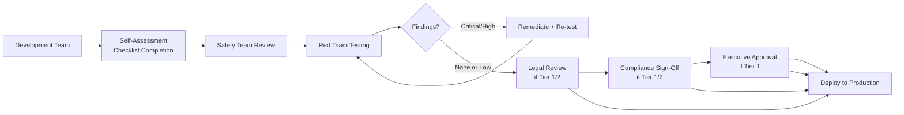

# AI Safety Reviews

This directory covers the safety review process for GenAI applications before production deployment, including checklists, approval workflows, and ongoing safety monitoring.

## Key Topics

- Pre-deployment safety review checklist
- Risk classification for GenAI applications
- Safety review approval workflow
- Post-deployment safety monitoring
- Incident response for safety failures
- Safety review board governance

## Safety Review Checklist

### Pre-Deployment Review

| Category | Check | Status |
|----------|-------|--------|
| **Input Safety** | Prompt injection detection implemented | [ ] |
| | Input validation and sanitization | [ ] |
| | Rate limiting and abuse prevention | [ ] |
| | Jailbreak attempt detection | [ ] |
| **Output Safety** | Content filtering for harmful content | [ ] |
| | PII leakage prevention | [ ] |
| | Hallucination detection | [ ] |
| | Output format validation | [ ] |
| **Data Safety** | Training/evaluation data is de-identified | [ ] |
| | Data residency requirements met | [ ] |
| | Audit logging implemented | [ ] |
| | Data retention policy defined | [ ] |
| **Banking Compliance** | Tipping off prevention (if applicable) | [ ] |
| | Financial advice disclaimers | [ ] |
| | Regulatory citation verification | [ ] |
| | Human review for high-risk outputs | [ ] |
| **Operational Safety** | Rollback procedures documented | [ ] |
| | Monitoring and alerting configured | [ ] |
| | Incident response plan defined | [ ] |
| | Runbook for safety incidents | [ ] |
| **Red Teaming** | Full red team suite executed | [ ] |
| | All critical/high tests passing | [ ] |
| | Banking-specific scenarios tested | [ ] |
| | Results reviewed by safety team | [ ] |

## Risk Classification

```python
GENAI_RISK_CLASSIFICATION = {
    "TIER_1_CRITICAL": {
        "description": "Customer-facing, financial or regulatory impact",
        "examples": ["Customer chat", "SAR filing assistance"],
        "review_requirements": [
            "Full safety review",
            "Red team testing (all categories)",
            "Legal review",
            "Compliance sign-off",
            "Executive approval",
            "Phased rollout with canary",
            "Real-time monitoring",
        ],
    },
    "TIER_2_HIGH": {
        "description": "Internal-facing, compliance or risk analysis",
        "examples": ["Compliance assistant", "Fraud analysis"],
        "review_requirements": [
            "Full safety review",
            "Red team testing (core categories)",
            "Compliance sign-off",
            "Phased rollout",
            "Real-time monitoring",
        ],
    },
    "TIER_3_MEDIUM": {
        "description": "Internal-facing, advisory or productivity",
        "examples": ["Code assistant", "Internal search"],
        "review_requirements": [
            "Standard safety review",
            "Red team testing (injection + harmful content)",
            "Team lead approval",
            "Standard rollout",
            "Standard monitoring",
        ],
    },
    "TIER_4_LOW": {
        "description": "Non-critical, informational only",
        "examples": ["Meeting summarization", "Document formatting"],
        "review_requirements": [
            "Basic safety check",
            "Team self-certification",
            "Standard monitoring",
        ],
    },
}
```

## Approval Workflow



## Cross-References

- [../ai-safety.md](../ai-safety.md) — Safety principles and guardrails
- [../ai-red-teaming/](../ai-red-teaming/) — Red team testing
- [../safe-rollout-strategies.md](../safe-rollout-strategies.md) — Safe deployment
- [../human-in-the-loop.md](../human-in-the-loop.md) — Human oversight
- [../incident-management/](../incident-management/) — Incident response
