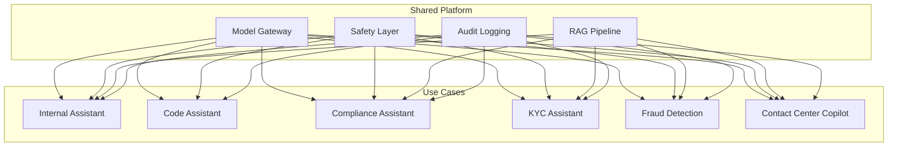
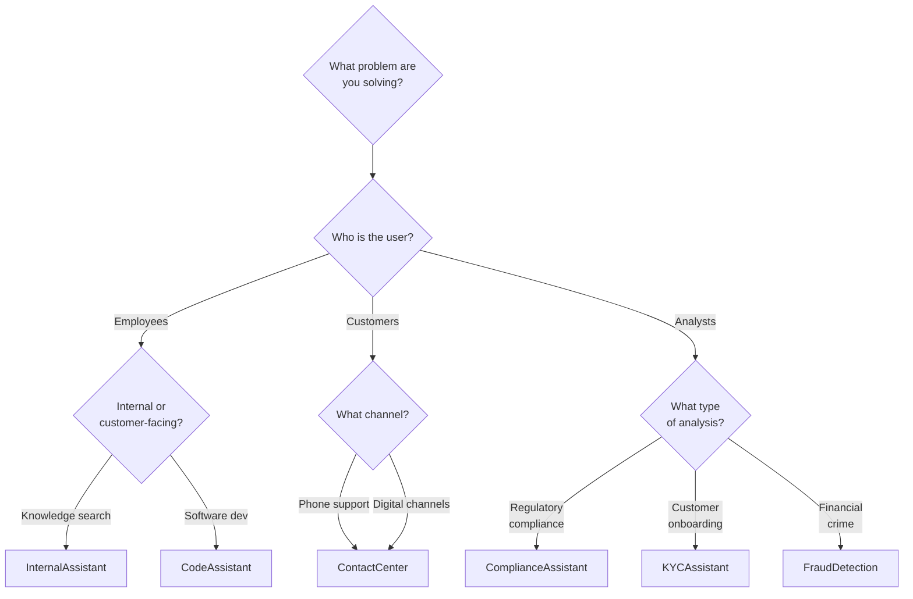

# Banking GenAI Use Cases

This directory covers specific GenAI applications within a global banking environment. Each use case includes architecture, implementation patterns, safety considerations, and lessons learned.

## Use Case Portfolio

### Internal Productivity

| Use Case | Description | Users | Risk Level |
|----------|-------------|-------|-----------|
| [Internal Assistant](./internal-assistant.md) | Employee assistant for policy search, HR Q&A, IT support | All employees | LOW-MEDIUM |
| [Code Assistant](./code-assistant.md) | Developer copilot for code generation, review, documentation | Engineering team | LOW |

### Compliance and Risk

| Use Case | Description | Users | Risk Level |
|----------|-------------|-------|-----------|
| [Compliance Assistant](./compliance-assistant.md) | Regulatory research, policy interpretation, audit support | Compliance team | HIGH |
| [KYC Assistant](./kyc-assistant.md) | KYC process automation, document analysis, risk scoring | KYC analysts | HIGH |
| [Fraud Detection Support](./fraud-detection-support.md) | AI-assisted fraud analysis, pattern detection, investigation support | Fraud team | HIGH |

### Customer-Facing

| Use Case | Description | Users | Risk Level |
|----------|-------------|-------|-----------|
| [Contact Center Copilot](./contact-center-copilot.md) | Agent assistance, call summarization, next-best-action | Contact center agents | MEDIUM |

## Cross-Cutting Concerns

All use cases share common infrastructure:



## Use Case Selection Framework



## Common Architecture Patterns

### Pattern 1: Knowledge Assistant

Used by: Internal Assistant, Compliance Assistant

```
User Query → Intent Classification → RAG Retrieval → Context Assembly → LLM Generation → Response Validation → User
```

### Pattern 2: Analysis Assistant

Used by: KYC Assistant, Fraud Detection

```
Case Data → Data Enrichment → Risk Analysis → LLM Assessment → Human Review → Decision
```

### Pattern 3: Real-Time Copilot

Used by: Contact Center Copilot, Code Assistant

```
Live Context → Background Analysis → Suggestion Generation → Presentation to User → User Action
```

## Implementation Priorities

| Priority | Use Case | Rationale |
|----------|----------|-----------|
| 1 | Code Assistant | Low risk, high developer productivity, easy to measure ROI |
| 2 | Internal Assistant | Internal users only, well-defined knowledge base |
| 3 | Compliance Assistant | High value, but requires careful safety controls |
| 4 | Contact Center Copilot | Agent-facing (not customer-facing), measurable impact |
| 5 | KYC Assistant | High value but complex data integration |
| 6 | Fraud Detection | Complex real-time requirements, high accuracy needed |

## Interview Preparation

Each use case file includes:
- Architecture diagrams
- Implementation code examples
- Safety and compliance considerations
- Common mistakes and anti-patterns
- Interview questions specific to the use case

See [../interview-prep/](../interview-prep/) for system design exercises based on these use cases.

## Cross-References

- [../rag-and-search/](../rag-and-search/) — RAG implementation patterns
- [../security/](../security/) — Security controls for each use case
- [../observability/](../observability/) — Monitoring and alerting
- [../backend-engineering/](../backend-engineering/) — Service implementation patterns
- [genai-platforms/](../genai-platforms/) — Platform capabilities used by all use cases
