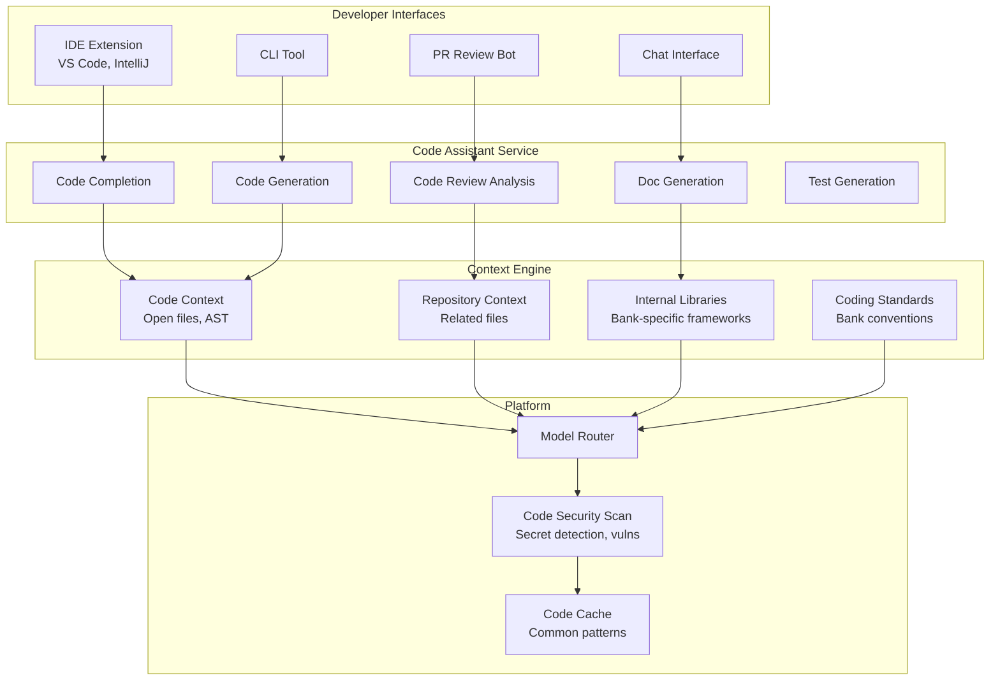

# Code Assistant

An AI-powered developer copilot providing code generation, code review assistance, documentation, and debugging support within the bank's engineering environment.

## Use Case Overview

| Attribute | Detail |
|-----------|--------|
| **Users** | 5,000+ software engineers |
| **Primary Tasks** | Code generation, code review, documentation, debugging, test writing |
| **Risk Level** | LOW |
| **Data Sources** | Internal codebase, API documentation, architecture decision records, coding standards |
| **Model** | Claude 3.5 Sonnet (primary), GPT-4o (fallback) |
| **Interface** | IDE extension (VS Code, IntelliJ), CLI tool, PR integration |

## Architecture



## IDE Integration

```python
# VS Code Extension Architecture
class CodeAssistantExtension:
    """VS Code extension for code assistance."""

    def __init__(self, context):
        self.context = context
        self.client = CodeAssistantClient()

    async def provide_completions(self, document, position):
        """Provide AI code completions."""
        # Gather context
        current_file = document.getText()
        cursor_position = position
        surrounding_code = self._get_surrounding_code(document, position)
        related_files = self._get_related_files(document.uri)

        # Build completion request
        request = {
            "task": "code_completion",
            "language": document.languageId,
            "current_file": current_file,
            "cursor_position": cursor_position,
            "surrounding_code": surrounding_code,
            "related_files": related_files[:3],  # Top 3 related files
            "internal_libraries": await self._get_relevant_internal_libs(),
        }

        response = await self.client.generate(request)
        return self._parse_completions(response)

    def _get_surrounding_code(self, document, position, context_lines: int = 50):
        """Get code around cursor position."""
        start_line = max(0, position.line - context_lines)
        end_line = min(document.lineCount, position.line + context_lines)

        return document.getText(
            Range(start_line, 0, end_line, 0)
        )
```

## Code Review Bot

```python
CODE_REVIEW_PROMPT = """
Review the following code change for a banking application. Focus on:

1. SECURITY: Vulnerabilities, injection risks, authentication issues
2. CORRECTNESS: Logic errors, edge cases, null handling
3. BANKING STANDARDS: Compliance with bank coding standards
4. PERFORMANCE: Obvious performance issues
5. MAINTAINABILITY: Code clarity, documentation, complexity

CODE CHANGE:
{diff}

FILE CONTEXT:
{file_context}

INTERNAL LIBRARIES USED:
{internal_libs}

Provide your review in this format:

## Summary
Brief summary of what the change does.

## Issues Found
List each issue with severity (CRITICAL/WARNING/SUGGESTION):

### [SEVERITY] Issue description
- **Location**: File:Line
- **Problem**: What is wrong
- **Suggestion**: How to fix
- **Example**: Corrected code snippet

## Positive Observations
What the code does well.

## Overall Assessment
APPROVE / APPROVE WITH SUGGESTIONS / REQUEST CHANGES
"""

class CodeReviewBot:
    """Automated code review assistant."""

    async def review_pr(self, pull_request: dict) -> dict:
        """Review a pull request."""
        diff = await self._get_diff(pull_request)
        file_context = await self._get_file_context(pull_request)
        internal_libs = await self._detect_internal_libs(diff)

        response = await llm.complete(
            model="claude-3-5-sonnet",
            prompt=CODE_REVIEW_PROMPT.format(
                diff=diff,
                file_context=file_context,
                internal_libs=internal_libs,
            ),
            temperature=0.2,
            max_tokens=4000,
        )

        review = self._parse_review(response.content)

        # Post review comments to PR
        await self._post_pr_comments(pull_request, review)

        return review
```

## Security Scanning

```python
class CodeSecurityScanner:
    """Scan AI-generated code for security issues."""

    def __init__(self):
        self.secret_detector = SecretDetector()
        self.vuln_scanner = VulnerabilityScanner()
        self.sast_engine = SASTEngine()

    async def scan_generated_code(self, code: str, language: str) -> dict:
        """Scan AI-generated code before presenting to developer."""
        results = {
            "secrets_found": [],
            "vulnerabilities": [],
            "sast_issues": [],
            "safe_to_present": True,
        }

        # Check for secrets/credentials
        secrets = self.secret_detector.scan(code)
        if secrets:
            results["secrets_found"] = secrets
            results["safe_to_present"] = False

        # Check for common vulnerabilities
        vulns = await self.vuln_scanner.scan(code, language)
        results["vulnerabilities"] = vulns

        # Run SAST
        sast_issues = await self.sast_engine.analyze(code, language)
        results["sast_issues"] = sast_issues

        return results
```

## Context Management

```python
class CodeContextEngine:
    """Provide relevant code context for AI assistance."""

    def __init__(self, codebase_index):
        self.index = codebase_index
        self.vector_db = codebase_index.vector_db

    async def get_completion_context(self, file_path: str, position: int,
                                     language: str) -> dict:
        """Build context for code completion."""
        # Current file AST
        ast = await self._parse_file(file_path)

        # Symbols in scope
        symbols_in_scope = self._get_symbols_at_position(ast, position)

        # Similar code from codebase
        similar_patterns = await self._find_similar_patterns(
            self._get_code_window(file_path, position), language
        )

        # Relevant internal libraries
        relevant_libs = await self._find_relevant_libs(symbols_in_scope)

        return {
            "ast_summary": self._summarize_ast(ast),
            "symbols_in_scope": symbols_in_scope,
            "similar_patterns": similar_patterns[:3],
            "relevant_internal_libs": relevant_libs,
        }
```

## Internal Library Awareness

```python
# The code assistant must be aware of the bank's internal libraries

INTERNAL_LIBRARY_INDEX = {
    "bank-common": {
        "description": "Common utilities shared across all services",
        "modules": {
            "date-utils": "Date formatting per bank standards",
            "currency-formatter": "Currency display formatting",
            "validation": "Input validation helpers",
            "logging": "Structured logging with bank correlation IDs",
        },
    },
    "bank-security": {
        "description": "Security utilities and cryptographic functions",
        "modules": {
            "encryption": "AES-256 encryption for sensitive data",
            "tokenization": "PII tokenization service client",
            "auth": "OAuth2/OIDC authentication helpers",
            "audit": "Audit logging with immutable records",
        },
    },
    "bank-compliance": {
        "description": "Compliance and regulatory utilities",
        "modules": {
            "transaction-monitoring": "Transaction monitoring integration",
            "sanctions-screening": "Sanctions list screening",
            "data-retention": "Data retention policy enforcement",
        },
    },
}
```

## Metrics

| Metric | Target | Rationale |
|--------|--------|-----------|
| Adoption Rate | >= 70% of engineers | Primary adoption metric |
| Acceptance Rate | >= 30% of suggestions | Quality of code completions |
| Developer Satisfaction | >= 4.0/5.0 | CSAT from surveys |
| Code Review Time Reduction | >= 30% faster | Time saved on reviews |
| PR Defect Rate | No increase | Must not introduce more bugs |
| Security Issues Found | >= 20% by AI | Value-add in security reviews |

## Safety Considerations

### Code Output Restrictions

```python
# The code assistant must NOT generate:
RESTRICTED_CODE_TYPES = [
    "database_connection_strings",     # Use the bank's connection pool
    "authentication_logic",            # Use the bank's auth library
    "encryption_implementations",      # Use the bank's security library
    "api_keys_or_secrets",            # Use the secret management service
    "hardcoded_urls_or_endpoints",     # Use service discovery
    "raw_sql_queries",                 # Use the ORM / query builder
]

# Instead, the assistant should reference internal libraries:
# "Use `bank-security.encryption.encrypt_field()` instead of raw cryptography"
```

### Data Privacy

```python
# NEVER send proprietary code to external model providers
# without explicit approval and sanitization

CODE_SHARING_POLICY = {
    "open_source_code": {
        "can_send_to_external_models": True,
        "reason": "Already public",
    },
    "internal_business_logic": {
        "can_send_to_external_models": False,
        "use_self_hosted_model": True,
        "reason": "Proprietary bank IP",
    },
    "security_code": {
        "can_send_to_external_models": False,
        "use_self_hosted_model": True,
        "reason": "Security-sensitive",
    },
    "customer_data_handling_code": {
        "can_send_to_external_models": False,
        "use_self_hosted_model": True,
        "reason": "References PII handling",
    },
}
```

## Interview Questions

1. How do you build a code assistant that knows the bank's internal libraries?
2. How do you prevent proprietary bank code from being sent to external AI providers?
3. Design an automated code review system using GenAI.
4. How do you measure the productivity impact of a developer code assistant?
5. An AI code assistant suggests a solution with a security vulnerability. How do you prevent this?

## Cross-References

- [../genai-platforms/tool-calling.md](../genai-platforms/tool-calling.md) — Tool calling for code operations
- [../genai-platforms/open-source-models/](../genai-platforms/open-source-models/) — Self-hosted models for proprietary code
- [../security/](../security/) — Code security and secret detection
- [../backend-engineering/](../backend-engineering/) — Engineering standards
