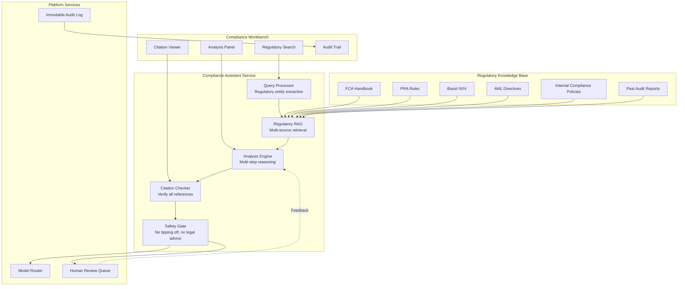

# Compliance Assistant

An AI assistant for compliance teams to research regulations, interpret policies, and support audit activities.

## Use Case Overview

| Attribute | Detail |
|-----------|--------|
| **Users** | Compliance analysts, MLRO, audit team |
| **Primary Tasks** | Regulatory research, policy interpretation, audit support, SAR preparation |
| **Risk Level** | HIGH |
| **Data Sources** | FCA/PRA regulations, Basel III, AML directives, internal compliance policies, audit reports |
| **Model** | Claude 3.5 Sonnet (primary), GPT-4o (fallback) |
| **Interface** | Web application with structured output |

## Architecture



## Regulatory RAG Pipeline

```python
class RegulatoryRAGPipeline:
    """RAG pipeline specifically designed for regulatory compliance."""

    def __init__(self, vector_db, embedding_client, regulation_db):
        self.vector_db = vector_db
        self.embedder = embedding_client
        self.regulation_db = regulation_db  # Authoritative source of current regulations

    async def search(self, query: str, jurisdiction: str = None,
                     regulation_type: str = None) -> list[dict]:
        """Search regulatory knowledge base."""
        # 1. Extract regulatory entities from query
        entities = await self._extract_regulatory_entities(query)

        # 2. Search with entity-aware retrieval
        results = await self._entity_aware_search(
            query, entities, jurisdiction, regulation_type
        )

        # 3. Verify retrieved documents are current (not superseded)
        results = await self._verify_current_versions(results)

        # 4. Rank by relevance and authority
        results = self._rank_by_authority(results)

        return results

    async def _verify_current_versions(self, results: list[dict]) -> list[dict]:
        """Ensure retrieved regulations are current versions."""
        verified = []
        for doc in results:
            current_version = self.regulation_db.get_current_version(
                doc["regulation_id"]
            )

            if doc["version"] == current_version:
                doc["is_current"] = True
                verified.append(doc)
            else:
                # Mark as superseded and fetch current version
                doc["is_current"] = False
                doc["current_version_id"] = current_version
                current_doc = self.regulation_db.get_document(current_version)
                if current_doc:
                    verified.append({**current_doc, "is_current": True})

        return verified

    def _rank_by_authority(self, results: list[dict]) -> list[dict]:
        """Rank results by regulatory authority level."""
        authority_weights = {
            "primary_legislation": 1.0,       # Acts of Parliament
            "regulatory_rule": 0.95,          # FCA/PRA rules
            "regulatory_guidance": 0.90,      # FCA/PRA guidance
            "international_standard": 0.85,   # Basel, FATF
            "internal_policy": 0.80,          # Bank's own policies
            "industry_practice": 0.70,        # Industry best practice
            "interpretive_note": 0.60,        # Commentary
        }

        for doc in results:
            doc["authority_score"] = authority_weights.get(
                doc.get("authority_type", "interpretive_note"), 0.50
            )

        # Combined score: relevance * authority
        for doc in results:
            doc["combined_score"] = (
                doc.get("relevance_score", 0) * 0.6 +
                doc["authority_score"] * 0.4
            )

        return sorted(results, key=lambda d: d["combined_score"], reverse=True)
```

## Compliance Analysis Prompt

```python
COMPLIANCE_ANALYSIS_PROMPT = """
You are a Senior Regulatory Compliance Analyst. Your task is to analyze \
the provided scenario against applicable regulations.

APPLICABLE REGULATIONS:
{regulatory_context}

SCENARIO:
{scenario}

Provide your analysis in the following structure:

1. IDENTIFY APPLICABLE REGULATIONS
   List each regulation that applies to this scenario with specific section references.

2. ANALYSIS
   For each applicable regulation, analyze whether the scenario complies or not.
   Cite specific regulatory text to support your analysis.

3. RISK ASSESSMENT
   Rate the compliance risk:
   - CLEAR: No compliance concerns identified
   - LOW: Minor issues that should be noted
   - MEDIUM: Potential compliance gaps requiring review
   - HIGH: Likely compliance violation requiring immediate attention
   - CRITICAL: Clear violation requiring escalation

4. RECOMMENDATIONS
   Specific actions the compliance team should take.

5. UNCERTAINTIES
   Any areas where the regulatory interpretation is unclear and legal \
   counsel should be consulted.

IMPORTANT RULES:
- Only use the provided regulatory context. Do NOT rely on training data.
- Cite specific regulation sections for every conclusion.
- If regulations conflict, note the conflict and recommend legal counsel review.
- Use "appears to comply" or "may not comply" — never definitive legal conclusions.
- If the scenario involves potential financial crime, recommend SAR consideration.
"""
```

## Citation Verification

```python
class RegulatoryCitationVerifier:
    """Verify all regulatory citations in AI output."""

    def __init__(self, regulation_db):
        self.regulation_db = regulation_db

    def verify(self, analysis_text: str) -> dict:
        """Verify all citations in the analysis."""
        citations = self._extract_citations(analysis_text)
        results = []

        for citation in citations:
            verification = self.regulation_db.verify_citation(citation)
            results.append({
                "citation": citation,
                "valid": verification["exists"],
                "current": verification["is_current"],
                "accurate_description": verification["description_matches"],
            })

        invalid = [r for r in results if not r["valid"]]
        outdated = [r for r in results if not r["current"]]

        return {
            "total_citations": len(citations),
            "valid": len(citations) - len(invalid),
            "invalid": len(invalid),
            "outdated": len(outdated),
            "all_valid": len(invalid) == 0,
            "details": results,
        }
```

## Safety: Tipping Off Prevention

```python
# CRITICAL: The assistant must never "tip off" a customer about AML activity

TIPPING_OFF_GUARDRAILS = """
CRITICAL SAFETY RULES — ANTI-TIPPING OFF:

Under the Proceeds of Crime Act 2002 (POCA) and Money Laundering Regulations,
it is a criminal offense to disclose information that is likely to prejudice
an investigation into money laundering or terrorist financing.

YOU MUST NEVER:
1. Tell anyone that a SAR has been filed or is being considered
2. Suggest that a customer is "under investigation"
3. Advise on how to avoid triggering reporting thresholds
4. Explain why a transaction was delayed if the reason is AML-related
5. Confirm or deny that any monitoring is taking place

If asked about these topics, respond:
"This matter requires specialist input. I will connect you with the \
appropriate compliance team who can assist you."
"""
```

## Human Review Integration

```python
# All compliance analysis goes through human review
# The AI provides analysis, the analyst makes the determination

class ComplianceReviewFlow:
    """Human-in-the-loop for compliance decisions."""

    def __init__(self, review_queue):
        self.review_queue = review_queue

    async def submit_for_review(self, analysis: dict, risk_level: str):
        """Submit AI analysis for human review."""
        review_item = {
            "type": "compliance_analysis",
            "ai_analysis": analysis,
            "risk_level": risk_level,
            "sla_minutes": {
                "MEDIUM": 240,     # 4 hours
                "HIGH": 60,        # 1 hour
                "CRITICAL": 15,    # 15 minutes
            }.get(risk_level, 480),
            "required_role": {
                "MEDIUM": "compliance_analyst",
                "HIGH": "senior_compliance_analyst",
                "CRITICAL": "mlro",  # Money Laundering Reporting Officer
            }.get(risk_level, "compliance_analyst"),
        }

        return await self.review_queue.enqueue(review_item)
```

## Metrics

| Metric | Target | Rationale |
|--------|--------|-----------|
| Citation Accuracy | >= 99% | Every citation must be to a real regulation |
| Analysis Quality | >= 4.0/5.0 | Human analyst satisfaction |
| Hallucination Rate | < 0.5% | Near-zero tolerance for regulatory hallucination |
| Human Override Rate | < 15% | AI analysis should be mostly correct |
| Time Saved | > 60% per analysis | Primary productivity metric |
| SLA Compliance | >= 99% | Reviews completed within SLA |

## Interview Questions

1. How do you ensure a compliance assistant never hallucinates regulatory information?
2. What is "tipping off" and how do you prevent it in an AI system?
3. How do you verify that the AI is citing current (not superseded) regulations?
4. Design the RAG pipeline for a system that searches across 50,000 regulatory documents.
5. When should a compliance AI escalate to human review vs. providing an answer directly?

## Cross-References

- [../genai-platforms/hallucinations.md](../genai-platforms/hallucinations.md) — Hallucination prevention
- [../genai-platforms/ai-safety.md](../genai-platforms/ai-safety.md) — Safety guardrails
- [../genai-platforms/human-in-the-loop.md](../genai-platforms/human-in-the-loop.md) — Human review workflows
- [../rag-and-search/](../rag-and-search/) — RAG implementation
- [../security/](../security/) — Data protection for regulatory data
