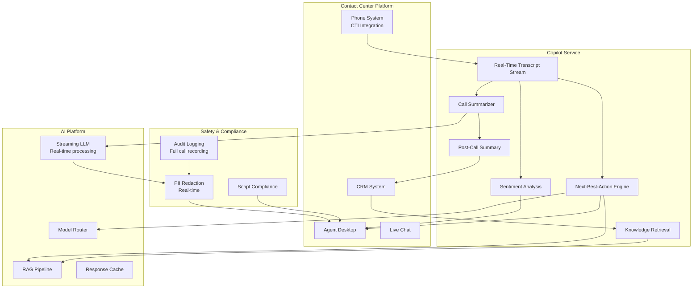

# Contact Center Copilot

An AI copilot that assists contact center agents with real-time call summarization, next-best-action recommendations, and knowledge retrieval during customer interactions.

## Use Case Overview

| Attribute | Detail |
|-----------|--------|
| **Users** | 3,000+ contact center agents |
| **Primary Tasks** | Call summarization, next-best-action, knowledge retrieval, sentiment analysis |
| **Risk Level** | MEDIUM |
| **Data Sources** | CRM, product information, procedures, FAQs, customer account summaries |
| **Model** | GPT-4o (primary), GPT-4o-mini (simple tasks) |
| **Interface** | Desktop sidebar application integrated with contact center platform |

## Architecture



## Real-Time Transcript Processing

```python
class RealTimeTranscriptProcessor:
    """Process real-time call transcripts for copilot assistance."""

    def __init__(self, llm_client, knowledge_base):
        self.llm = llm_client
        self.knowledge_base = knowledge_base
        self.context_window = []  # Rolling context
        self.max_context_tokens = 8000

    async def process_transcript_chunk(self, transcript: str,
                                       call_id: str) -> dict:
        """Process a new chunk of call transcript."""
        # Add to context
        self.context_window.append(transcript)

        # Trim context to fit token budget
        trimmed_context = self._trim_context()

        # Run parallel analyses
        tasks = {
            "summary": self._update_summary(trimmed_context),
            "next_action": self._suggest_next_action(trimmed_context),
            "knowledge": self._retrieve_relevant_knowledge(transcript),
            "sentiment": self._analyze_sentiment(transcript),
        }

        results = await asyncio.gather(*tasks.values(),
                                        return_exceptions=True)

        return {
            "call_id": call_id,
            "current_summary": results[0] if not isinstance(results[0], Exception) else None,
            "suggested_action": results[1] if not isinstance(results[1], Exception) else None,
            "relevant_knowledge": results[2] if not isinstance(results[2], Exception) else None,
            "sentiment": results[3] if not isinstance(results[3], Exception) else None,
            "timestamp": datetime.utcnow().isoformat(),
        }

    async def _suggest_next_action(self, context: list[str]) -> dict:
        """Suggest next-best-action for the agent."""
        prompt = f"""
You are assisting a contact center agent during a live call. Based on the \
conversation so far, suggest the next best action.

Current conversation:
{chr(10).join(context[-10:])}  # Last 10 transcript entries

Available actions:
1. Offer product: [list of eligible products based on customer profile]
2. Process transaction: [types of transactions the agent can process]
3. Escalate to specialist: [when to escalate]
4. Schedule callback: [when to offer callback]
5. Close call: [when the issue is resolved]

Suggest the single best next action with brief reasoning.
Consider: customer sentiment, issue complexity, agent capability.
"""
        response = await self.llm.complete(
            model="gpt-4o-mini",  # Fast response needed
            prompt=prompt,
            temperature=0.3,
            max_tokens=200,
        )

        return self._parse_action_suggestion(response.content)
```

## Call Summarization

```python
class CallSummarizer:
    """Generate call summaries in real-time and post-call."""

    SUMMARY_PROMPT = """
Summarize this customer service call concisely.

CALL TRANSCRIPT:
{transcript}

Provide a structured summary:

CUSTOMER ISSUE: [1-2 sentences describing the customer's problem]
AGENT ACTIONS: [Bullet list of what the agent did/offered]
RESOLUTION: [Was the issue resolved? If not, what is the next step]
FOLLOW-UP REQUIRED: [Yes/No + details if yes]
SENTIMENT: [Customer's emotional state: Satisfied / Neutral / Frustrated / Angry]
KEY TOPICS: [Tags: e.g., "mortgage", "payment_issue", "complaint"]
"""

    async def generate_post_call_summary(self, transcript: str,
                                          call_metadata: dict) -> dict:
        """Generate comprehensive post-call summary."""
        prompt = self.SUMMARY_PROMPT.format(transcript=transcript)

        response = await self.llm.complete(
            model="gpt-4o",
            prompt=prompt,
            temperature=0.2,
            max_tokens=500,
        )

        summary = self._parse_summary(response.content)

        # Enrich with metadata
        summary["call_id"] = call_metadata["call_id"]
        summary["agent_id"] = call_metadata["agent_id"]
        summary["customer_id"] = call_metadata["customer_id"]
        summary["duration_seconds"] = call_metadata["duration"]
        summary["channel"] = call_metadata["channel"]

        # Save to CRM
        await self._save_to_crm(summary, call_metadata)

        return summary
```

## Sentiment Analysis

```python
class RealTimeSentimentAnalyzer:
    """Monitor customer sentiment during the call."""

    def __init__(self, llm_client):
        self.llm = llm_client
        self.sentiment_history = []

    async def analyze(self, recent_transcript: str) -> dict:
        """Analyze current customer sentiment."""
        prompt = f"""
Analyze the customer's sentiment in this conversation excerpt.
Focus on the CUSTOMER's emotional state, not the agent's.

TRANSCRIPT:
{recent_transcript}

Rate sentiment on a scale of 1-5:
1 = Very negative (angry, threatening to leave)
2 = Negative (frustrated, dissatisfied)
3 = Neutral (matter-of-fact)
4 = Positive (pleased, cooperative)
5 = Very positive (delighted, grateful)

Respond with ONLY a JSON:
{{"score": N, "indicators": ["specific phrases showing sentiment"], "trend": "improving|stable|declining"}}
"""
        response = await self.llm.complete(
            model="gpt-4o-mini",
            prompt=prompt,
            temperature=0,
            max_tokens=150,
        )

        result = json.loads(response.content)
        self.sentiment_history.append(result)

        # Check for significant decline (escalation trigger)
        if self._is_declining_rapidly():
            return {
                **result,
                "alert": "SENTIMENT_DECLINING",
                "recommendation": "Consider escalation to supervisor",
            }

        return {**result, "alert": None}

    def _is_declining_rapidly(self) -> bool:
        """Check if sentiment is declining rapidly."""
        if len(self.sentiment_history) < 3:
            return False

        recent = [s["score"] for s in self.sentiment_history[-3:]]
        return (
            recent[0] > recent[1] > recent[2] and
            recent[0] - recent[-1] >= 2  # Dropped 2+ points
        )
```

## Safety Considerations

### Real-Time PII Redaction

```python
# PII must be redacted from transcripts before sending to external models

class RealTimePIIRedactor:
    """Redact PII from transcripts in real-time."""

    def redact(self, transcript: str) -> str:
        """Redact PII from transcript."""
        redacted = transcript

        # Account numbers
        redacted = re.sub(
            r'\b(\d{8})\b',
            '[ACCOUNT_NUMBER]',
            redacted,
        )

        # Credit card numbers
        redacted = re.sub(
            r'\b(\d{4})[\s-]?(\d{4})[\s-]?(\d{4})[\s-]?(\d{4})\b',
            '[CARD_NUMBER]',
            redacted,
        )

        # Names (using NER model for accuracy)
        redacted = self._redact_names(redacted)

        # Phone numbers
        redacted = re.sub(
            r'\b(\+44|0)\d{10}\b',
            '[PHONE_NUMBER]',
            redacted,
        )

        return redacted
```

### Script Compliance

```python
# Ensure agent follows required scripts
SCRIPT_COMPLIANCE_RULES = {
    "greeting": {
        "required": True,
        "check_within_seconds": 15,
        "pattern": r"(good\s+(morning|afternoon|evening)|thank\s+you\s+for\s+calling)",
    },
    "identity_verification": {
        "required": True,
        "check_within_seconds": 60,
        "pattern": r"(can\s+I\s+verify|security\s+question|confirm\s+your\s+identity)",
    },
    "disclaimer_for_financial_advice": {
        "required": True,
        "trigger_words": ["invest", "mortgage", "loan", "insurance"],
        "pattern": r"(this\s+is\s+not\s+financial\s+advice|I.*recommend\s+speaking\s+to.*advisor)",
    },
    "closing": {
        "required": True,
        "pattern": r"(is\s+there\s+anything\s+else|can\s+I\s+help\s+with\s+anything\s+else|thank\s+you\s+for\s+calling)",
    },
}
```

## Metrics

| Metric | Target | Rationale |
|--------|--------|-----------|
| Agent Satisfaction | >= 4.0/5.0 | Agents find copilot helpful |
| Average Handle Time Reduction | >= 15% | Efficiency improvement |
| First Call Resolution Rate | >= 80% | Effectiveness metric |
| Post-Call Summary Quality | >= 4.2/5.0 | Summary accuracy |
| Sentiment Alert Accuracy | >= 90% | Escalation timeliness |
| PII Redaction Accuracy | >= 99.9% | Critical compliance metric |

## Interview Questions

1. How do you build a real-time call summarization system with sub-second latency?
2. How do you ensure PII is never sent to external AI models in a call center?
3. Design a next-best-action engine for contact center agents.
4. How do you measure the impact of an AI copilot on contact center performance?
5. A customer says their account number during a call. How do you handle this in the transcript?

## Cross-References

- [../genai-platforms/caching.md](../genai-platforms/caching.md) — Caching common queries
- [../genai-platforms/human-in-the-loop.md](../genai-platforms/human-in-the-loop.md) — Escalation workflows
- [../security/](../security/) — PII handling and redaction
- [../rag-and-search/](../rag-and-search/) — Knowledge retrieval during calls
