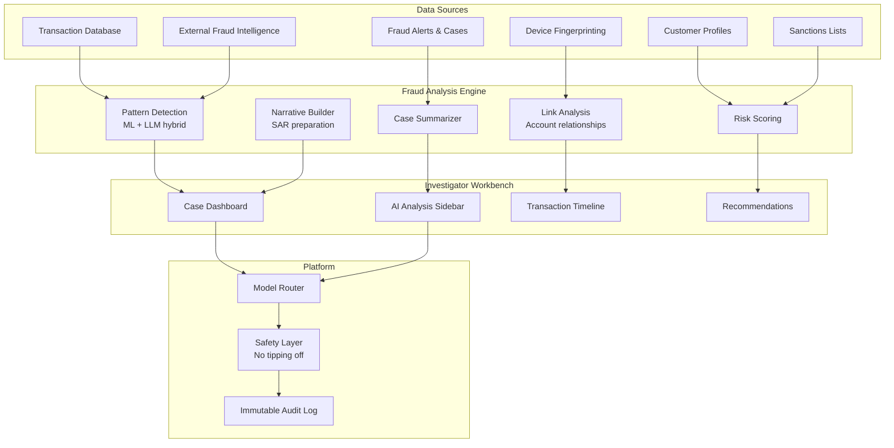

# Fraud Detection Support

An AI-assisted fraud analysis system that helps fraud investigators analyze patterns, review cases, and identify suspicious activities across customer accounts and transactions.

## Use Case Overview

| Attribute | Detail |
|-----------|--------|
| **Users** | 500+ fraud investigators and analysts |
| **Primary Tasks** | Transaction pattern analysis, case summarization, link analysis, SAR preparation |
| **Risk Level** | HIGH |
| **Data Sources** | Transaction history, customer profiles, fraud alerts, external fraud intelligence, sanctions lists |
| **Model** | Claude 3.5 Sonnet (primary), GPT-4o (fallback) |
| **Interface** | Investigation workbench with AI sidebar |

## Architecture



## Transaction Pattern Analysis

```python
class FraudPatternAnalyzer:
    """Analyze transaction patterns for potential fraud."""

    FRAUD_PATTERNS = {
        "structuring": {
            "description": "Multiple transactions just below reporting threshold",
            "indicators": [
                "Multiple cash deposits near £10,000 threshold",
                "Deposits spread across different branches or days",
                "Pattern of deposits just below threshold (e.g., £9,000-£9,999)",
            ],
            "severity": "HIGH",
        },
        "account_takeover": {
            "description": "Sudden change in account behavior suggesting takeover",
            "indicators": [
                "New device or location accessing account",
                "Rapid change of contact details (phone, email, address)",
                "Unusual transaction types or amounts",
                "Transactions to new/unusual beneficiaries",
            ],
            "severity": "CRITICAL",
        },
        "money_mule": {
            "description": "Account used as intermediary for illicit fund transfers",
            "indicators": [
                "Rapid in-and-out transfers (funds move quickly)",
                "No logical connection between source and destination",
                "Account previously dormant becomes active",
                "Multiple incoming transfers from different sources, single outgoing",
            ],
            "severity": "HIGH",
        },
        "authorized_push_payment": {
            "description": "Customer tricked into sending money to fraudster",
            "indicators": [
                "Payment to new beneficiary under pressure/urgency",
                "Beneficiary matches known fraud patterns",
                "Customer behavior inconsistent with history",
                "Large first-time payment to new beneficiary",
            ],
            "severity": "CRITICAL",
        },
    }

    async def analyze_case(self, case_id: str) -> dict:
        """Analyze a fraud case using AI + traditional ML."""
        case_data = await self._gather_case_data(case_id)

        # Run traditional ML fraud scores
        ml_scores = await self._run_ml_models(case_data)

        # Run LLM-based pattern analysis
        llm_analysis = await self._llm_pattern_analysis(case_data)

        # Combine results
        combined_risk = self._combine_scores(ml_scores, llm_analysis)

        return {
            "case_id": case_id,
            "ml_fraud_scores": ml_scores,
            "detected_patterns": llm_analysis["patterns"],
            "combined_risk_score": combined_risk,
            "recommendation": self._make_recommendation(combined_risk),
            "supporting_evidence": llm_analysis["evidence"],
            "narrative": llm_analysis["narrative"],
        }

    async def _llm_pattern_analysis(self, case_data: dict) -> dict:
        """Use LLM to identify fraud patterns in case data."""
        prompt = f"""
Analyze the following case for potential fraud patterns.

CUSTOMER PROFILE:
- Tenure: {case_data["customer"]["tenure_years"]} years
- Typical monthly transactions: {case_data["customer"]["avg_monthly_txns"]}
- Typical transaction range: £{case_data["customer"]["min_amount"]} - \
£{case_data["customer"]["max_amount"]}
- Known beneficiaries: {case_data["customer"]["usual_beneficiaries"]}

RECENT TRANSACTIONS (last 30 days):
{self._format_transactions(case_data["recent_transactions"])}

ALERTS:
{self._format_alerts(case_data["alerts"])}

Identify any suspicious patterns. For each pattern found:
1. Name the pattern
2. Describe the evidence
3. Rate severity (LOW/MEDIUM/HIGH/CRITICAL)
4. Explain why it is suspicious
"""
        response = await llm.complete(
            model="claude-3-5-sonnet",
            prompt=prompt,
            temperature=0.1,
            max_tokens=2000,
        )

        return self._parse_pattern_analysis(response.content)
```

## Link Analysis

```python
class FraudLinkAnalyzer:
    """Analyze connections between accounts and entities."""

    def __init__(self, graph_db, llm_client):
        self.graph_db = graph_db  # Neo4j or similar
        self.llm = llm_client

    async def analyze_connections(self, account_id: str,
                                   depth: int = 2) -> dict:
        """Analyze connections from an account to find linked entities."""
        # Query graph database for connections
        connections = await self.graph_db.find_connections(
            account_id, depth=depth
        )

        # Identify suspicious connections
        suspicious_links = []
        for connection in connections:
            risk = await self._assess_link_risk(connection)
            if risk["suspicious"]:
                suspicious_links.append({
                    "connection": connection,
                    "risk_assessment": risk,
                })

        # Use LLM to synthesize findings
        if suspicious_links:
            narrative = await self._synthesize_link_analysis(
                account_id, suspicious_links
            )
        else:
            narrative = "No suspicious connections identified."

        return {
            "account_id": account_id,
            "total_connections": len(connections),
            "suspicious_links": suspicious_links,
            "narrative": narrative,
        }

    async def _assess_link_risk(self, connection: dict) -> dict:
        """Assess risk of a specific connection."""
        risk_factors = []

        # Shared device fingerprint
        if connection.get("shared_device"):
            risk_factors.append("Shared device with flagged account")

        # Shared contact details
        if connection.get("shared_phone") or connection.get("shared_email"):
            risk_factors.append("Shared contact details")

        # Rapid fund transfers between accounts
        if connection.get("rapid_transfer"):
            risk_factors.append("Rapid fund transfer pattern")

        # Geographic anomalies
        if connection.get("geographic_mismatch"):
            risk_factors.append("Geographic mismatch between accounts")

        # Known fraud association
        if connection.get("fraud_association"):
            risk_factors.append("Association with known fraud case")

        return {
            "suspicious": len(risk_factors) >= 2,
            "risk_factors": risk_factors,
            "risk_score": len(risk_factors) / 5.0,
        }
```

## SAR Narrative Generation

```python
SAR_NARRATIVE_PROMPT = """
Generate a Suspicious Activity Report (SAR) narrative based on the \
following analysis.

CASE DETAILS:
{case_details}

PATTERN ANALYSIS:
{pattern_analysis}

LINK ANALYSIS:
{link_analysis}

Generate a professional SAR narrative in the following structure:

1. SUBJECT INFORMATION
   - Account holder details
   - Account information
   - Relationship to the suspicious activity

2. ACTIVITY SUMMARY
   - Period of suspicious activity
   - Total amounts involved
   - Number and nature of transactions

3. DETAILED DESCRIPTION
   - Chronological description of the suspicious activity
   - Specific transactions of concern
   - Patterns identified and why they are suspicious

4. POTENTIAL VIOLATIONS
   - Types of potential financial crime (money laundering, fraud, etc.)
   - Basis for suspicion

5. SUPPORTING EVIDENCE
   - Transaction records
   - Link analysis findings
   - External intelligence matches

IMPORTANT:
- Use factual, objective language only
- Do NOT use definitive conclusions ("this IS money laundering")
- Use "is consistent with," "suggests," "may indicate"
- All facts must be supported by evidence in the case data
- Follow JMLIT (Joint Money Laundering Intelligence Taskforce) formatting guidelines
"""
```

## Safety: Anti-Tipping Off

```python
# CRITICAL: Fraud investigation outputs must NEVER be shown to customers

FRAUD_INVESTIGATION_SAFETY = """
ANTI-TIPPING OFF SAFETY RULES:

Under POCA 2002, it is a criminal offense to disclose information that
may prejudice a money laundering investigation.

STRICT PROHIBITIONS:
1. SAR narratives must NEVER be shared with the account holder
2. Fraud investigation notes must NEVER be visible to customer-facing staff
3. System alerts about fraud must NEVER explain the real reason to customer
4. If a customer asks why their transaction is delayed:
   — Use generic reason: "We are conducting routine checks"
   — NEVER mention fraud investigation, SAR, or suspicious activity
5. Access to this system is restricted to authorized fraud team members only
"""

class FraudDataAccessControl:
    """Strict access control for fraud investigation data."""

    ROLE_PERMISSIONS = {
        "fraud_investigator": {
            "can_view": ["full_case_data", "link_analysis", "sar_drafts"],
            "can_edit": ["case_notes", "sar_drafts"],
            "can_export": ["sanitized_case_summary"],
        },
        "fraud_analyst": {
            "can_view": ["case_data", "pattern_analysis"],
            "can_edit": ["case_notes"],
            "can_export": [],
        },
        "mlro": {
            "can_view": ["all"],
            "can_edit": ["all"],
            "can_export": ["sanitized_case_summary", "filed_sar"],
        },
        "customer_service": {
            "can_view": ["case_exists"],  # Can only see that a case exists
            "can_edit": [],
            "can_export": [],
        },
    }
```

## Metrics

| Metric | Target | Rationale |
|--------|--------|-----------|
| False Positive Reduction | >= 20% | AI should reduce noise |
| Detection Rate Improvement | >= 10% | AI should catch more fraud |
| Investigation Time Reduction | >= 30% | Faster case resolution |
| SAR Quality Score | >= 4.0/5.0 | Quality of SAR narratives |
| Link Discovery Rate | >= 15% new links found | Value-add of link analysis |
| Zero Tipping Off Incidents | 0 | Absolute compliance requirement |

## Interview Questions

1. How do you combine traditional ML fraud detection with LLM-based analysis?
2. How do you prevent tipping off in a fraud investigation system?
3. Design a link analysis system to find connections between fraudulent accounts.
4. How do you generate SAR narratives that are factual and defensible?
5. A fraud investigator needs to analyze 50 transactions in 5 minutes. How does AI help?

## Cross-References

- [../genai-platforms/agents.md](../genai-platforms/agents.md) — Agent-based investigation workflows
- [../genai-platforms/ai-safety.md](../genai-platforms/ai-safety.md) — Anti-tipping off controls
- [../security/](../security/) — Access control for sensitive fraud data
- [../databases/](../databases/) — Graph databases for link analysis
