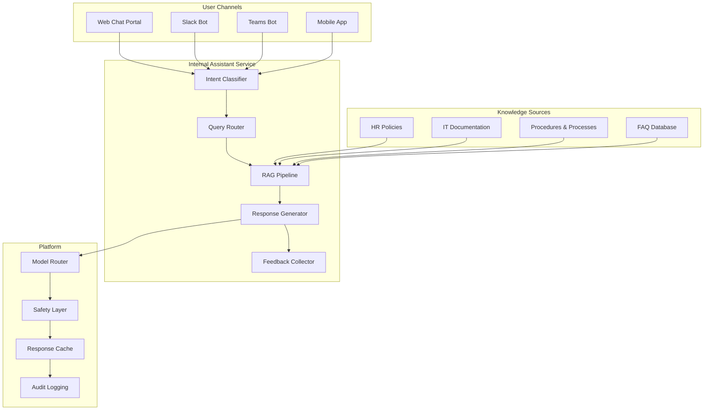

# Internal Assistant

An AI-powered assistant for bank employees to search policies, procedures, HR information, and IT support resources.

## Use Case Overview

| Attribute | Detail |
|-----------|--------|
| **Users** | All 50,000+ employees |
| **Primary Tasks** | Policy search, HR Q&A, IT support, procedure lookup |
| **Risk Level** | LOW-MEDIUM |
| **Data Sources** | HR policies, IT documentation, internal procedures, FAQs |
| **Model** | GPT-4o-mini (primary), GPT-4o (fallback) |
| **Interface** | Web chat, Slack/Teams integration, mobile app |

## Architecture



## Implementation

### Intent Classification

```python
class InternalAssistantIntent(Enum):
    POLICY_SEARCH = "policy_search"
    HR_QUESTION = "hr_question"
    IT_SUPPORT = "it_support"
    PROCEDURE_LOOKUP = "procedure_lookup"
    GENERAL_CHAT = "general_chat"
    OUT_OF_SCOPE = "out_of_scope"

INTENT_CLASSIFICATION_PROMPT = """
Classify the employee's query into one of these categories:
- policy_search: Looking for a specific policy or rule
- hr_question: Questions about HR policies, benefits, leave, etc.
- it_support: IT-related questions (password reset, software access, etc.)
- procedure_lookup: Looking for a specific procedure or process
- general_chat: General conversation
- out_of_scope: Not related to bank operations

Respond with ONLY the category name.

Query: {query}
Category:"""

async def classify_intent(query: str) -> InternalAssistantIntent:
    """Classify employee query intent."""
    response = await llm.complete(
        model="gpt-4o-mini",
        prompt=INTENT_CLASSIFICATION_PROMPT.format(query=query),
        temperature=0,
        max_tokens=20,
    )

    try:
        return InternalAssistantIntent(response.content.strip())
    except ValueError:
        return InternalAssistantIntent.GENERAL_CHAT
```

### RAG Pipeline for Internal Knowledge

```python
class InternalKnowledgeRAG:
    """RAG pipeline for internal bank knowledge."""

    def __init__(self, vector_db, embedding_client):
        self.vector_db = vector_db
        self.embedder = embedding_client

    async def search(self, query: str, intent: InternalAssistantIntent,
                     user_role: str) -> list[dict]:
        """Search internal knowledge base."""
        # Embed query
        query_embedding = await self.embedder.embed(query)

        # Build filters based on intent and user role
        filters = self._build_filters(intent, user_role)

        # Hybrid search
        results = await self.vector_db.hybrid_search(
            query=query,
            query_embedding=query_embedding,
            filters=filters,
            top_k=5,
            semantic_weight=0.7,
            keyword_weight=0.3,
        )

        return results

    def _build_filters(self, intent: InternalAssistantIntent,
                       user_role: str) -> dict:
        """Build search filters."""
        filters = {}

        # Filter by document type based on intent
        intent_to_doc_type = {
            InternalAssistantIntent.POLICY_SEARCH: "policy",
            InternalAssistantIntent.HR_QUESTION: "hr_policy",
            InternalAssistantIntent.IT_SUPPORT: "it_documentation",
            InternalAssistantIntent.PROCEDURE_LOOKUP: "procedure",
        }

        if intent in intent_to_doc_type:
            filters["doc_type"] = intent_to_doc_type[intent]

        # Filter by access level
        filters["access_level"] = self._get_access_levels(user_role)

        return filters
```

### Prompt Design

```python
SYSTEM_PROMPT = """
You are the Internal Assistant for bank employees. You help with:
- Finding and explaining bank policies and procedures
- Answering HR-related questions (benefits, leave, etc.)
- IT support guidance (password reset, software access, etc.)
- General workplace questions

RULES:
1. Only answer using information from the provided reference documents
2. If you cannot find the answer in the documents, say: "I couldn't find this \
   information in our knowledge base. Please contact [appropriate team]."
3. Always cite the source document at the end of your response
4. Be concise — employees need quick, clear answers
5. Do NOT provide personal opinions on policies
6. If a query is about sensitive topics (layoffs, compensation changes), \
   direct to HR

Reference Documents:
{context}
"""
```

### Caching Strategy

```python
# High cache hit rates expected for internal assistant
# Many employees ask the same questions

CACHE_CONFIG = {
    "exact_match": {
        "ttl_hours": 24,  # Policies don't change daily
        "expected_hit_rate": 0.40,  # 40% of queries are repeated
    },
    "semantic": {
        "similarity_threshold": 0.92,
        "ttl_hours": 12,
        "expected_hit_rate": 0.20,  # Additional 20% semantically similar
    },
    "embedding": {
        "ttl_days": 30,  # Stable queries
        "expected_hit_rate": 0.50,  # 50% of embeddings reused
    },
}
```

## Safety Considerations

### Access Control

```python
# Not all employees should access all information
ACCESS_CONTROL = {
    "all_employees": [
        "general_policies",
        "it_documentation",
        "hr_general",
        "workplace_procedures",
    ],
    "managers": [
        "management_procedures",
        "performance_review_policies",
        "hiring_procedures",
    ],
    "hr_team": [
        "compensation_details",
        "employee_records",
        "disciplinary_procedures",
    ],
    "executives": [
        "strategic_plans",
        "organizational_changes",
    ],
}
```

### Sensitive Topic Handling

```python
SENSITIVE_TOPICS = [
    "layoffs", "redundancy", "restructuring",
    "compensation", "salary", "bonus",
    "grievance", "discrimination", "harassment",
    "disciplinary", "termination",
]

def is_sensitive_topic(query: str) -> bool:
    """Check if query touches sensitive topic."""
    return any(topic in query.lower() for topic in SENSITIVE_TOPICS)

def handle_sensitive_query(query: str) -> str:
    """Route sensitive queries to human HR team."""
    return (
        "I appreciate you reaching out. This topic is best discussed with "
        "the HR team directly. You can reach them at:\n"
        "- Email: hr@bank.com\n"
        "- Phone: ext. 1234\n"
        "- Or book a meeting through the HR portal."
    )
```

## Metrics

| Metric | Target | Current |
|--------|--------|---------|
| CSAT | >= 4.2/5.0 | 4.3/5.0 |
| Answer Rate | >= 90% | 92% |
| Cache Hit Rate | >= 50% | 55% |
| Avg Response Time | < 3s | 2.1s |
| Hallucination Rate | < 1% | 0.5% |
| Daily Active Users | 10,000+ | 12,500 |

## Interview Questions

1. How do you design a RAG system for 50,000 employees querying the same knowledge base?
2. How do you ensure the internal assistant doesn't leak confidential information?
3. An employee asks about upcoming layoffs. How should the system respond?
4. How do you measure the productivity impact of an internal assistant?
5. Design the cache strategy for an internal knowledge assistant.

## Cross-References

- [../rag-and-search/](../rag-and-search/) — RAG implementation details
- [genai-platforms/](../genai-platforms/) — Platform capabilities
- [../security/](../security/) — Access control and data protection
