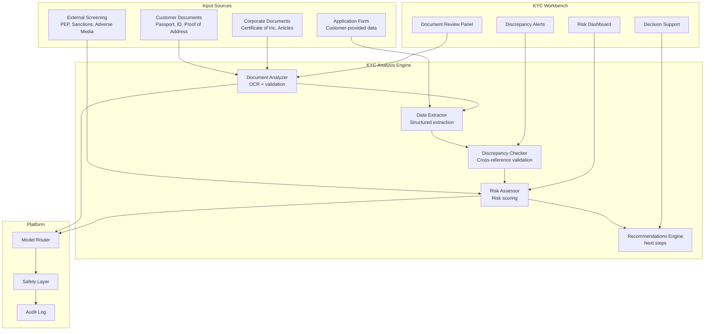

# KYC Assistant

An AI assistant that helps KYC analysts process customer onboarding, review documentation, assess risk, and maintain KYC records efficiently.

## Use Case Overview

| Attribute | Detail |
|-----------|--------|
| **Users** | 1,000+ KYC analysts |
| **Primary Tasks** | Document verification, risk assessment, PEP screening, ongoing monitoring |
| **Risk Level** | HIGH |
| **Data Sources** | Customer documents, PEP/sanctions lists, corporate registries, adverse media |
| **Model** | Claude 3.5 Sonnet (document analysis), GPT-4o (risk assessment) |
| **Interface** | KYC workbench with document review panel |

## Architecture



## Document Analysis

```python
class KYCDocumentAnalyzer:
    """Analyze KYC documents using AI."""

    def __init__(self, ocr_engine, llm_client):
        self.ocr = ocr_engine
        self.llm = llm_client

    async def analyze_passport(self, image: bytes) -> dict:
        """Extract and validate passport data."""
        # OCR extraction
        ocr_result = await self.ocr.extract(image)

        # LLM-based extraction and validation
        prompt = f"""
Extract the following information from this passport image:
- Full name
- Passport number
- Nationality
- Date of birth
- Date of issue
- Date of expiry
- Issuing authority

OCR Text: {ocr_result["text"]}

Additionally, validate:
1. Is the passport currently valid? (check expiry date)
2. Does the format of the passport number match the issuing country's standard?
3. Are there any signs of tampering or alteration visible in the text?

Return results as structured JSON.
"""
        response = await self.llm.complete(
            model="claude-3-5-sonnet",
            prompt=prompt,
            temperature=0,
            max_tokens=1000,
        )

        extraction = self._parse_extraction(response.content)

        # Cross-check with OCR
        discrepancies = self._compare_with_ocr(extraction, ocr_result)

        return {
            "document_type": "passport",
            "extracted_data": extraction,
            "ocr_text": ocr_result["text"],
            "discrepancies": discrepancies,
            "validity_check": self._check_validity(extraction),
            "confidence": self._calculate_confidence(extraction, ocr_result),
        }

    async def analyze_proof_of_address(self, image: bytes) -> dict:
        """Analyze proof of address document."""
        ocr_result = await self.ocr.extract(image)

        prompt = f"""
Analyze this proof of address document. Extract:
- Customer name
- Full address
- Document type (utility bill, bank statement, council tax, etc.)
- Document date
- Issuing organization

OCR Text: {ocr_result["text"]}

Validate:
1. Is the document recent? (within last 3 months)
2. Does the name match the application form?
3. Is the address complete and properly formatted?
4. Is this an acceptable type of proof of address?
"""
        response = await self.llm.complete(
            model="claude-3-5-sonnet",
            prompt=prompt,
            temperature=0,
            max_tokens=1000,
        )

        return self._parse_address_proof(response.content)
```

## Risk Assessment

```python
KYC_RISK_ASSESSMENT_PROMPT = """
Assess the KYC risk level for this customer application.

CUSTOMER INFORMATION:
{customer_data}

DOCUMENT VERIFICATION RESULTS:
{document_results}

SCREENING RESULTS:
{screening_results}

DISCREPANCIES IDENTIFIED:
{discrepancies}

Assess risk across these dimensions:

1. CUSTOMER RISK
   - Individual vs. corporate customer
   - Jurisdiction risk (country of residence/incorporation)
   - Occupation/business type risk
   - Source of wealth clarity

2. PRODUCT RISK
   - Products/services requested
   - Expected transaction patterns
   - Cross-border activity

3. DELIVERY CHANNEL RISK
   - Non-face-to-face onboarding
   - Third-party introductions
   - Intermediary relationships

4. GEOGRAPHIC RISK
   - High-risk jurisdictions (FATF grey/black list)
   - Sanctions exposure
   - Tax haven exposure

Overall Risk Rating: LOW | MEDIUM | HIGH | ENHANCED_DUE-DILIGENCE

Provide specific reasoning for each dimension and the overall rating.
Cite specific evidence from the data above.
"""

class KYCRiskAssessor:
    """Assess KYC risk for customer onboarding."""

    async def assess_risk(self, customer_data: dict,
                          document_results: list,
                          screening_results: dict,
                          discrepancies: list) -> dict:
        """Perform comprehensive KYC risk assessment."""
        prompt = KYC_RISK_ASSESSMENT_PROMPT.format(
            customer_data=self._format_customer(customer_data),
            document_results=self._format_documents(document_results),
            screening_results=self._format_screening(screening_results),
            discrepancies=self._format_discrepancies(discrepancies),
        )

        response = await llm.complete(
            model="gpt-4o",
            prompt=prompt,
            temperature=0.1,
            max_tokens=2000,
        )

        assessment = self._parse_assessment(response.content)

        # Ensure consistency with bank's risk framework
        validated = self._validate_against_risk_framework(assessment)

        return validated
```

## Discrepancy Detection

```python
class KYCDiscrepancyChecker:
    """Cross-reference all KYC data for discrepancies."""

    def check(self, application_data: dict,
              document_data: dict,
              screening_data: dict) -> list[dict]:
        """Check for discrepancies across all data sources."""
        discrepancies = []

        # Name matching
        name_discrepancies = self._check_name_match(
            application_data.get("name"),
            document_data.get("extracted_name"),
        )
        discrepancies.extend(name_discrepancies)

        # Date of birth matching
        dob_discrepancies = self._check_dob_match(
            application_data.get("date_of_birth"),
            document_data.get("extracted_dob"),
        )
        discrepancies.extend(dob_discrepancies)

        # Address consistency
        address_discrepancies = self._check_address(
            application_data.get("address"),
            document_data.get("extracted_address"),
        )
        discrepancies.extend(address_discrepancies)

        # Screening matches
        screening_discrepancies = self._check_screening(screening_data)
        discrepancies.extend(screening_discrepancies)

        # Classify discrepancies by severity
        for d in discrepancies:
            d["severity"] = self._classify_severity(d)

        return sorted(discrepancies,
                     key=lambda x: {"critical": 0, "high": 1,
                                    "medium": 2, "low": 3}[x["severity"]])

    def _check_name_match(self, app_name: str, doc_name: str) -> list[dict]:
        """Check if names match, allowing for minor variations."""
        if not app_name or not doc_name:
            return [{
                "type": "missing_name",
                "description": "Name missing from one source",
                "severity": "high",
            }]

        # Exact match
        if app_name.lower().strip() == doc_name.lower().strip():
            return []

        # Fuzzy match (allow for typos, ordering differences)
        similarity = self._fuzzy_similarity(app_name, doc_name)

        if similarity > 0.85:
            return [{
                "type": "name_minor_variation",
                "app_name": app_name,
                "doc_name": doc_name,
                "similarity": similarity,
                "description": f"Minor name variation (similarity: {similarity:.0%})",
            }]

        return [{
            "type": "name_mismatch",
            "app_name": app_name,
            "doc_name": doc_name,
            "similarity": similarity,
            "description": f"Significant name mismatch (similarity: {similarity:.0%})",
            "severity": "critical",
        }]
```

## Safety Considerations

### Automated Decision Prohibition

```python
# KYC decisions must NEVER be fully automated
# AI provides analysis, human makes the decision

KYC_DECISION_POLICY = """
KYC DECISION POLICY:

AI ROLE:
- Extract and validate document data
- Identify discrepancies
- Assess risk factors
- Recommend next steps
- Generate summary for analyst

HUMAN ROLE:
- Review AI analysis
- Make final risk assessment decision
- Approve or reject customer onboarding
- Determine if Enhanced Due Diligence is required
- File SAR if suspicious activity detected

PROHIBITED:
- AI must NOT automatically approve or reject customers
- AI must NOT automatically file SARs
- AI must NOT make definitive risk determinations
- AI must NOT directly update the KYC record without human review
"""
```

### Data Handling

```python
# KYC documents contain highly sensitive PII
# Strict data handling required

class KYCDataHandler:
    """Handle KYC data with appropriate security."""

    def prepare_for_ai_processing(self, document: bytes) -> dict:
        """Prepare document for AI processing."""
        # 1. Log access for audit
        audit_log.record(
            action="document_ai_processing",
            document_type="KYC",
            user=current_user.id,
            timestamp=datetime.utcnow(),
        )

        # 2. Check if external model is permitted
        if not self._can_send_to_external_model():
            # Use self-hosted model only
            return self._process_with_internal_model(document)

        # 3. Process with appropriate model
        return self._process_with_external_model(document)

    def _can_send_to_external_model(self) -> bool:
        """Check if data can be sent to external models."""
        # Check data residency requirements
        if self.customer.jurisdiction in RESTRICTED_JURISDICTIONS:
            return False

        # Check customer consent
        if not self.customer.ai_processing_consent:
            return False

        # Check document sensitivity
        if self.document.type in HIGHLY_SENSITIVE_TYPES:
            return False

        return True
```

## Metrics

| Metric | Target | Rationale |
|--------|--------|-----------|
| Processing Time Reduction | >= 40% | Faster KYC completion |
| Discrepancy Detection Rate | >= 95% | Missed discrepancies are regulatory risk |
| False Positive Discrepancy Rate | < 10% | Analyst efficiency |
| Risk Assessment Agreement | >= 85% | AI vs. human risk rating agreement |
| Document Extraction Accuracy | >= 98% | Data quality requirement |
| Regulatory Audit Findings | 0 | Compliance effectiveness |

## Interview Questions

1. How do you design a KYC document analysis system that handles passports, IDs, and utility bills?
2. How do you ensure KYC risk assessments are consistent across analysts?
3. Can a KYC system automatically reject a customer? Why or why not?
4. How do you handle data residency requirements when processing KYC documents with AI?
5. Design a discrepancy detection system that cross-references application data with document data.

## Cross-References

- [../genai-platforms/tool-calling.md](../genai-platforms/tool-calling.md) — Document extraction tools
- [../genai-platforms/human-in-the-loop.md](../genai-platforms/human-in-the-loop.md) — Human approval for KYC decisions
- [../security/](../security/) — PII handling for KYC documents
- [../compliance/](../compliance/) — Regulatory requirements for KYC
