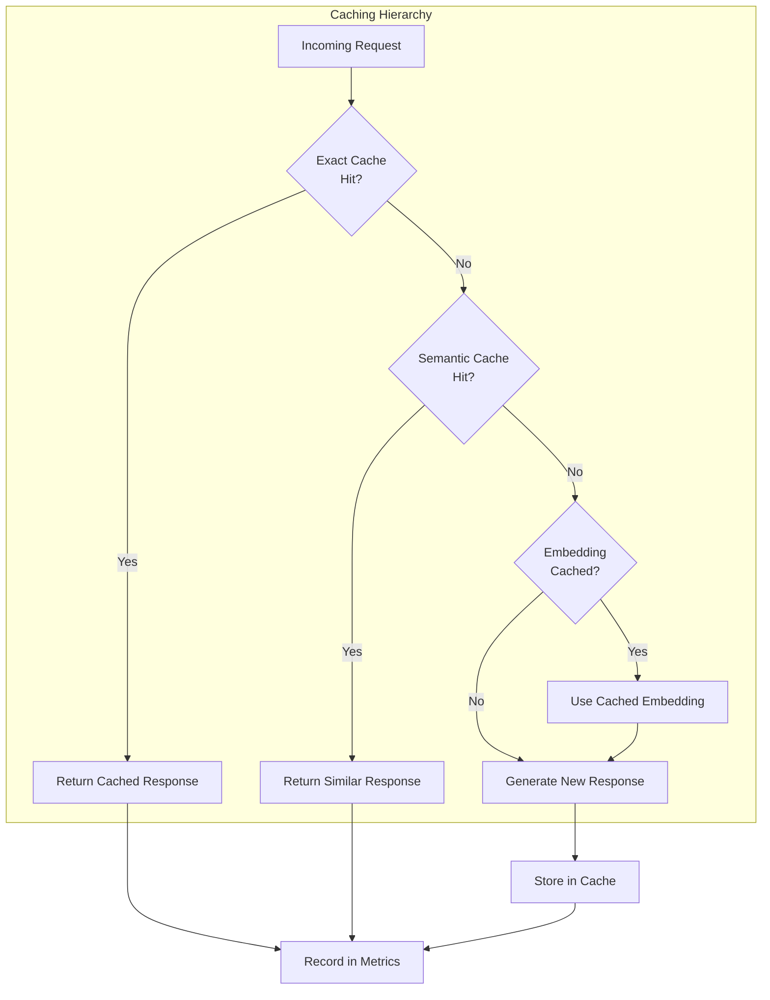

# Caching

Caching is one of the most effective strategies for reducing GenAI costs and latency. By storing and reusing previous results, caching can eliminate 20-60% of API calls in production systems.

## Caching Layers



## Exact Match Caching

### When to Use

Exact match caching works when identical requests produce identical responses:

| Use Case | Cacheable? | TTL | Hit Rate |
|----------|-----------|-----|----------|
| "What are your branch hours?" | Yes | 24h | High |
| "Explain Basel III requirements" | Yes | 7d | Medium |
| "Summarize this specific document" | No* | — | Low |
| "Analyze transaction TXN-12345" | No | — | None |
| "Categorize: POS Purchase AMAZON" | Yes | 30d | High |

*Cacheable if document content is hashed and included in cache key.

### Implementation

```python
import hashlib
import json
from typing import Optional
from datetime import datetime, timedelta

class ExactMatchCache:
    """Cache exact request-response matches."""

    def __init__(self, redis_client, default_ttl_hours: int = 24):
        self.redis = redis_client
        self.default_ttl = default_ttl_hours * 3600

    def _cache_key(self, model: str, messages: list, **kwargs) -> str:
        """Generate deterministic cache key."""
        # Include all inputs that affect the output
        key_data = {
            "model": model,
            "messages": messages,
            "temperature": kwargs.get("temperature", 0),
            "tools": kwargs.get("tools"),
        }

        # Deterministic serialization
        key_string = json.dumps(key_data, sort_keys=True, default=str)
        return f"cache:exact:{hashlib.sha256(key_string.encode()).hexdigest()}"

    def get(self, model: str, messages: list, **kwargs) -> Optional[dict]:
        """Get cached response if available."""
        key = self._cache_key(model, messages, **kwargs)
        cached = self.redis.get(key)

        if cached:
            data = json.loads(cached)
            return {
                "response": data["response"],
                "cache_hit": True,
                "cache_type": "exact",
                "cached_at": data["cached_at"],
                "cost_saved": self._estimate_cost(model, messages),
            }

        return None

    def set(self, model: str, messages: list, response: dict,
            ttl: Optional[int] = None, **kwargs):
        """Cache a response."""
        key = self._cache_key(model, messages, **kwargs)
        data = {
            "response": response,
            "cached_at": datetime.utcnow().isoformat(),
            "model": model,
        }

        self.redis.setex(
            key,
            ttl or self.default_ttl,
            json.dumps(data),
        )

    def _estimate_cost(self, model: str, messages: list) -> float:
        """Estimate cost saved by cache hit."""
        # ... token counting and pricing logic
        return estimated_cost
```

## Semantic Caching

Semantic caching returns cached responses for similar (not identical) requests. This is more powerful but requires careful design to avoid returning inappropriate responses.

```python
class SemanticCache:
    """Cache responses semantically — return cached response for similar queries."""

    def __init__(
        self,
        vector_db,
        embedding_client,
        similarity_threshold: float = 0.92,
        ttl_days: int = 7,
    ):
        self.vector_db = vector_db
        self.embedding_client = embedding_client
        self.threshold = similarity_threshold
        self.ttl = ttl_days

    async def lookup(self, query: str, context: dict = None) -> Optional[dict]:
        """Find a cached response for a semantically similar query."""
        # Embed the query
        query_embedding = await self.embedding_client.embed(query)

        # Search for similar cached queries
        similar = await self.vector_db.search(
            embedding=query_embedding,
            top_k=1,
            filter={
                "context_hash": self._context_hash(context) if context else None,
                "expiry": {"$gt": datetime.utcnow().isoformat()},
            },
        )

        if not similar:
            return None

        best_match = similar[0]
        similarity = best_match["similarity"]

        if similarity < self.threshold:
            return None  # Not similar enough

        return {
            "response": best_match["response"],
            "cache_hit": True,
            "cache_type": "semantic",
            "similarity": similarity,
            "original_query": best_match["query"],
            "cost_saved": best_match["original_cost"],
        }

    async def store(self, query: str, response: dict, context: dict = None,
                    cost: float = 0):
        """Store a response in semantic cache."""
        # Embed the query
        query_embedding = await self.embedding_client.embed(query)

        # Store in vector DB
        await self.vector_db.insert({
            "embedding": query_embedding,
            "query": query,
            "response": response,
            "context": context,
            "original_cost": cost,
            "cached_at": datetime.utcnow().isoformat(),
            "expiry": (datetime.utcnow() + timedelta(days=self.ttl)).isoformat(),
            "context_hash": self._context_hash(context) if context else None,
        })

    def _context_hash(self, context: dict) -> str:
        """Hash context to ensure responses are returned in correct context."""
        return hashlib.sha256(
            json.dumps(context, sort_keys=True).encode()
        ).hexdigest()
```

### Semantic Cache Configuration by Use Case

```python
SEMANTIC_CACHE_CONFIG = {
    "customer_faq": {
        "similarity_threshold": 0.90,  # More lenient — FAQ answers are stable
        "ttl_days": 30,
        "max_cache_size": 10000,
    },
    "policy_lookup": {
        "similarity_threshold": 0.88,  # Lenient — policies are well-defined
        "ttl_days": 7,  # Shorter TTL — policies may change
        "max_cache_size": 5000,
    },
    "compliance_analysis": {
        "similarity_threshold": 0.95,  # Strict — compliance is sensitive to details
        "ttl_days": 1,  # Very short TTL — each case is unique
        "max_cache_size": 1000,
    },
    "creative_content": {
        "similarity_threshold": None,  # Disabled — creative content should be unique
        "ttl_days": 0,
        "max_cache_size": 0,
    },
}
```

## Embedding Caching

Embedding caching is highly effective because:
1. The same text always produces the same embedding
2. Embedding API calls are frequent (every search, every RAG retrieval)
3. Embeddings are deterministic (no temperature variation)

```python
class EmbeddingCache:
    """Cache embeddings to avoid redundant API calls."""

    def __init__(self, redis_client, model: str):
        self.redis = redis_client
        self.model = model
        self.prefix = f"cache:embedding:{model}"

    def _key(self, text: str) -> str:
        """Cache key for embedding."""
        # Normalize: lowercase, strip whitespace
        normalized = text.lower().strip()
        # Truncate to reasonable length (embeddings have max input anyway)
        normalized = normalized[:8000]
        return f"{self.prefix}:{hashlib.md5(normalized.encode()).hexdigest()}"

    def get(self, text: str) -> Optional[list[float]]:
        """Get cached embedding."""
        key = self._key(text)
        cached = self.redis.get(key)
        if cached:
            return json.loads(cached)
        return None

    def set(self, text: str, embedding: list[float], ttl_days: int = 30):
        """Cache embedding."""
        key = self._key(text)
        self.redis.setex(
            key,
            ttl_days * 86400,
            json.dumps(embedding),
        )

    async def get_or_compute(self, text: str, compute_fn) -> list[float]:
        """Get cached embedding or compute and cache."""
        cached = self.get(text)
        if cached is not None:
            return cached

        embedding = await compute_fn(text)
        self.set(text, embedding)
        return embedding
```

## Cache Invalidation

### When to Invalidate

```python
CACHE_INVALIDATION_RULES = {
    "regulatory_change": {
        "invalidate": ["policy_lookup", "compliance_analysis"],
        "reason": "Regulations changed — cached responses may be outdated",
        "scope": "all",
    },
    "policy_update": {
        "invalidate": ["policy_lookup"],
        "reason": "Internal policy updated",
        "scope": "affected_documents_only",
    },
    "model_update": {
        "invalidate": ["exact_match", "semantic"],
        "reason": "Model version changed — responses may differ",
        "scope": "model_specific",
    },
    "prompt_change": {
        "invalidate": ["exact_match", "semantic"],
        "reason": "Prompt changed — cached responses are for old prompt",
        "scope": "prompt_specific",
    },
}

class CacheInvalidationService:
    """Manage cache invalidation events."""

    async def invalidate(self, event_type: str, details: dict):
        """Invalidate caches based on event type."""
        rules = CACHE_INVALIDATION_RULES.get(event_type)
        if not rules:
            return

        for cache_type in rules["invalidate"]:
            if rules["scope"] == "all":
                await self._flush_cache(cache_type)
            elif rules["scope"] == "model_specific":
                await self._flush_cache_by_model(cache_type, details.get("model"))
            elif rules["scope"] == "prompt_specific":
                await self._flush_cache_by_prompt(cache_type, details.get("prompt_id"))
            elif rules["scope"] == "affected_documents_only":
                await self._invalidate_by_documents(cache_type, details.get("document_ids"))

        # Log invalidation
        logger.info(
            f"Cache invalidation: {event_type} — "
            f"invalidated {rules['invalidate']} — scope: {rules['scope']}"
        )
```

## Cache Metrics and Monitoring

```python
class CacheMetrics:
    """Monitor cache effectiveness."""

    def __init__(self, statsd_client):
        self.statsd = statsd_client

    def record_cache_access(self, cache_type: str, hit: bool, cost_saved: float = 0):
        """Record a cache access."""
        tags = [f"cache_type:{cache_type}"]

        self.statsd.increment("genai.cache.access", tags=tags)

        if hit:
            self.statsd.increment("genai.cache.hit", tags=tags)
            self.statsd.increment("genai.cache.cost_saved", cost_saved, tags=tags)

    def get_cache_report(self, period: str = "24h") -> dict:
        """Get cache performance report."""
        report = {}
        for cache_type in ["exact_match", "semantic", "embedding"]:
            accesses = self.statsd.count("genai.cache.access", period,
                                        tags=[f"cache_type:{cache_type}"])
            hits = self.statsd.count("genai.cache.hit", period,
                                    tags=[f"cache_type:{cache_type}"])
            cost_saved = self.statsd.sum("genai.cache.cost_saved", period,
                                        tags=[f"cache_type:{cache_type}"])

            report[cache_type] = {
                "accesses": accesses,
                "hits": hits,
                "hit_rate": hits / accesses if accesses > 0 else 0,
                "cost_saved_usd": cost_saved,
            }

        total_accesses = sum(r["accesses"] for r in report.values())
        total_hits = sum(r["hits"] for r in report.values())
        total_cost_saved = sum(r["cost_saved_usd"] for r in report.values())

        report["overall"] = {
            "accesses": total_accesses,
            "hits": total_hits,
            "hit_rate": total_hits / total_accesses if total_accesses > 0 else 0,
            "cost_saved_usd": total_cost_saved,
        }

        return report
```

## Common Mistakes and Anti-Patterns

### Anti-Pattern 1: Caching Non-Deterministic Responses

```python
# WRONG: Caching responses generated with temperature > 0
# Same prompt + temperature 0.7 = different response each time
# Cache returns wrong response for "different" random output

# RIGHT: Only cache deterministic responses (temperature = 0)
if temperature == 0:
    cache.set(prompt, response)
```

### Anti-Pattern 2: Not Including Full Context in Cache Key

```python
# WRONG: Cache key only includes user query
cache_key = hash(user_query)
# Same query with different system prompts gets wrong cached response

# RIGHT: Include all factors that affect the response
cache_key = hash(json.dumps({
    "model": model,
    "system_prompt": system_prompt,
    "user_query": user_query,
    "context": retrieved_documents,
    "temperature": temperature,
}))
```

### Anti-Pattern 3: Cache Never Expires

```python
# WRONG: Cache entries live forever
redis.set(key, value)  # No TTL

# RIGHT: Always set TTL
redis.setex(key, ttl_seconds, value)  # Expires after TTL

# Exception: Very stable content (e.g., branch locations) can have longer TTL
```

### Anti-Pattern 4: Semantic Cache Too Lenient

```python
# WRONG: Threshold too low — returns wrong answers
semantic_cache.threshold = 0.7  # "How do I open an account?" matches
                                # "How do I close an account?" — BAD

# RIGHT: Start strict, measure and adjust
semantic_cache.threshold = 0.92  # Only very similar queries match

# Monitor: Track "incorrect cache hit" incidents
# If rate is near zero, consider lowering threshold for more hits
# If rate is above 1%, raise threshold
```

## Interview Questions

1. What types of caching are appropriate for a GenAI application?
2. When should you NOT cache a response?
3. How do you handle cache invalidation when regulations change?
4. A semantic cache is returning incorrect responses. How do you debug?
5. Design a caching strategy that reduces GenAI costs by 40%.

## Cross-References

- [cost-optimization.md](./cost-optimization.md) — Cost reduction through caching
- [embeddings.md](./embeddings.md) — Embedding caching
- [model-routing.md](./model-routing.md) — Routing before cache lookup
- [prompt-versioning.md](./prompt-versioning.md) — Cache invalidation on prompt changes
- [../observability/](../observability/) — Cache hit rate monitoring
