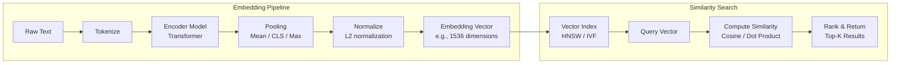

# Embeddings

Embedding models convert text, images, or other data into dense numerical vectors that capture semantic meaning. They are the foundation of semantic search, retrieval-augmented generation (RAG), deduplication, and many other GenAI applications in banking.

## What Are Embeddings?

An embedding is a list of floating-point numbers (a vector) that represents the semantic content of text. Similar texts produce similar vectors.

```
Input: "Wire transfer of $50,000 to offshore account"
Output: [0.023, -0.145, 0.087, 0.234, ...]  # 1536 dimensions

Input: "Large international bank transfer"
Output: [0.019, -0.138, 0.091, 0.241, ...]  # Similar vector

Input: "Recipe for chocolate cake"
Output: [-0.312, 0.456, -0.023, -0.178, ...]  # Very different vector
```

### How Embedding Models Work



## Embedding Model Comparison

### Production Model Comparison (2024-2025)

| Model | Dimensions | Max Input | MTEB Score | Cost per 1K | Notes |
|-------|-----------|-----------|------------|-------------|-------|
| text-embedding-3-large | 3072 | 8191 | 64.6 | $0.13 | OpenAI, highest quality |
| text-embedding-3-small | 1536 | 8191 | 62.3 | $0.02 | OpenAI, cost-effective |
| Cohere embed-v3 | 1024 | 4096 | 65.1 | $0.10 | Multilingual, input/search |
| nomic-embed-text | 768 | 8192 | 62.1 | Free | Open source, self-hosted |
| BGE-m3 | 1024 | 8192 | 64.2 | Free | Open source, multilingual |
| E5-mistral-7b | 4096 | 8192 | 67.1 | Compute cost | Open source, highest quality |
| Voyager (Jina) | 1024 | 8192 | 63.9 | Free/$ | Open source option |

**Banking recommendation**: For production use, evaluate models on YOUR data. MTEB scores are a guide but may not reflect performance on financial/regulatory text.

### Dimensionality Trade-offs

```python
dimensions_comparison = {
    256: {
        "storage": "Minimal (1KB per embedding)",
        "quality": "Lower — loses nuance",
        "latency": "Fastest search",
        "use_case": "High-volume, low-stakes deduplication",
    },
    768: {
        "storage": "Moderate (3KB per embedding)",
        "quality": "Good for most tasks",
        "latency": "Fast search",
        "use_case": "General search, RAG retrieval",
    },
    1536: {
        "storage": "Standard (6KB per embedding)",
        "quality": "Very good — industry standard",
        "latency": "Good search",
        "use_case": "Production RAG, semantic search",
    },
    3072: {
        "storage": "Large (12KB per embedding)",
        "quality": "Best — captures fine nuance",
        "latency": "Slower search",
        "use_case": "High-precision legal/compliance search",
    },
}
```

## Similarity Metrics

### Cosine Similarity (Most Common)

```python
import numpy as np
from numpy.linalg import norm

def cosine_similarity(a: list[float], b: list[float]) -> float:
    """Cosine similarity: measures angle between vectors."""
    a, b = np.array(a), np.array(b)
    return np.dot(a, b) / (norm(a) * norm(b))

# Results range from -1 to 1:
# 1.0 = identical direction (very similar)
# 0.0 = orthogonal (unrelated)
# -1.0 = opposite direction

# Banking examples
wire_transfer = [0.023, -0.145, 0.087, ...]
international_transfer = [0.019, -0.138, 0.091, ...]
chocolate_cake = [-0.312, 0.456, -0.023, ...]

cosine_similarity(wire_transfer, international_transfer)  # ~0.85 (similar)
cosine_similarity(wire_transfer, chocolate_cake)           # ~0.12 (unrelated)
```

### When to Use Each Metric

| Metric | Formula | When to Use | Normalized Vectors? |
|--------|---------|-------------|-------------------|
| Cosine | A·B / (|A||B|) | General semantic similarity | Yes (recommended) |
| Dot Product | A·B | When magnitude matters | No |
| Euclidean | |A - B| | When distance matters | Either |
| Manhattan | Σ|Aᵢ - Bᵢ| | High-dimensional sparse | Either |

**Production recommendation**: Use cosine similarity with L2-normalized vectors for almost all banking use cases. Most embedding models output pre-normalized vectors.

## Generating Embeddings in Production

### Batch Embedding Pipeline

```python
import asyncio
from openai import AsyncOpenAI
from tenacity import retry, stop_after_attempt, wait_exponential

class EmbeddingPipeline:
    """Production embedding pipeline with batching, retries, and monitoring."""

    def __init__(self, model: str = "text-embedding-3-small", batch_size: int = 100):
        self.client = AsyncOpenAI()
        self.model = model
        self.batch_size = batch_size
        self.stats = {"total": 0, "succeeded": 0, "failed": 0, "retries": 0}

    @retry(
        stop=stop_after_attempt(3),
        wait=wait_exponential(multiplier=1, min=2, max=30),
        reraise=True,
    )
    async def _embed_batch(self, texts: list[str]) -> list[list[float]]:
        """Embed a batch of texts with retry."""
        # Filter empty strings and truncate
        cleaned = [t[:8000] for t in texts if t.strip()]
        if not cleaned:
            return []

        response = await self.client.embeddings.create(
            model=self.model,
            input=cleaned,
            encoding_format="float",
        )
        # Sort by index (API may return out of order)
        sorted_embeddings = sorted(response.data, key=lambda x: x.index)
        return [e.embedding for e in sorted_embeddings]

    async def embed_documents(self, documents: list[dict]) -> list[dict]:
        """Embed a list of documents with their metadata."""
        results = []
        for i in range(0, len(documents), self.batch_size):
            batch = documents[i:i + self.batch_size]
            texts = [doc["content"] for doc in batch]

            try:
                embeddings = await self._embed_batch(texts)
                for doc, embedding in zip(batch, embeddings):
                    results.append({
                        **doc,
                        "embedding": embedding,
                        "embedding_model": self.model,
                        "embedding_timestamp": datetime.utcnow().isoformat(),
                    })
                    self.stats["succeeded"] += 1
            except Exception as e:
                for doc in batch:
                    results.append({**doc, "embedding": None, "error": str(e)})
                    self.stats["failed"] += 1
                self.stats["total"] += len(batch)

        return results

    def get_stats(self) -> dict:
        return self.stats
```

### Embedding Chunked Documents

```python
def chunk_for_embedding(
    document: str,
    chunk_size: int = 500,
    chunk_overlap: int = 100,
    separator: str = "\n\n",
) -> list[str]:
    """Split document into chunks for embedding.

    Banking documents often have structured sections — respect boundaries.
    """
    # Try splitting at semantic boundaries first
    sections = document.split(separator)

    chunks = []
    current_chunk = []
    current_size = 0

    for section in sections:
        section_tokens = len(section.split())

        if current_size + section_tokens > chunk_size and current_chunk:
            # Save current chunk and start new one
            chunks.append(separator.join(current_chunk))
            # Keep overlap from previous chunk
            overlap = current_chunk[-3:] if len(current_chunk) >= 3 else current_chunk[:]
            current_chunk = overlap + [section]
            current_size = sum(len(s.split()) for s in current_chunk)
        else:
            current_chunk.append(section)
            current_size += section_tokens

    if current_chunk:
        chunks.append(separator.join(current_chunk))

    return chunks

# Usage for a compliance document
compliance_doc = """
Section 1: Customer Due Diligence
All regulated firms must implement risk-based customer due diligence...

Section 2: Enhanced Due Diligence
Enhanced due diligence is required for politically exposed persons...

Section 3: Ongoing Monitoring
Firms must continuously monitor customer relationships...
"""

chunks = chunk_for_embedding(compliance_doc)
# Each chunk preserves section context while being embeddable
```

## Vector Search in Production

### pgvector (PostgreSQL) — Recommended for Banking

```sql
-- Enable pgvector extension
CREATE EXTENSION IF NOT EXISTS vector;

-- Create table with embedding column
CREATE TABLE document_embeddings (
    id UUID PRIMARY KEY,
    document_id TEXT NOT NULL,
    chunk_index INTEGER NOT NULL,
    content TEXT NOT NULL,
    embedding VECTOR(1536),  -- Must match embedding dimensions
    metadata JSONB NOT NULL DEFAULT '{}',
    created_at TIMESTAMP DEFAULT NOW()
);

-- Create HNSW index for fast similarity search
CREATE INDEX ON document_embeddings
USING hnsw (embedding vector_cosine_ops)
WITH (m = 16, ef_construction = 64);

-- Semantic search query
SELECT
    id,
    document_id,
    content,
    metadata,
    1 - (embedding <=> '[0.023, -0.145, ...]'::vector) AS similarity
FROM document_embeddings
WHERE metadata->>'department' = 'compliance'  -- Metadata filtering
ORDER BY embedding <=> '[0.023, -0.145, ...]'::vector
LIMIT 10;
```

**Why pgvector for banking**:
- Data stays in existing PostgreSQL infrastructure
- GDPR-compliant (no external vector service needed)
- ACID transactions for embedding updates
- Can combine semantic search with traditional SQL filters
- No additional infrastructure to manage

### Hybrid Search: Semantic + Keyword

```python
async def hybrid_search(
    query: str,
    pg_pool,
    embedding_client,
    top_k: int = 10,
    semantic_weight: float = 0.7,
    keyword_weight: float = 0.3,
) -> list[dict]:
    """Combine semantic and keyword search for better results."""
    # 1. Get query embedding
    query_embedding = await embedding_client.embed(query)

    # 2. Semantic search via pgvector
    semantic_results = await pg_pool.fetch("""
        SELECT id, document_id, content, metadata,
               1 - (embedding <=> $1::vector) AS semantic_score
        FROM document_embeddings
        ORDER BY embedding <=> $1::vector
        LIMIT $2
    """, query_embedding, top_k * 2)

    # 3. Keyword search via full-text search
    keyword_results = await pg_pool.fetch("""
        SELECT id, document_id, content, metadata,
               ts_rank(to_tsvector('english', content),
                       plainto_tsquery('english', $1)) AS keyword_score
        FROM document_embeddings
        WHERE to_tsvector('english', content) @@ plainto_tsquery('english', $1)
        ORDER BY keyword_score DESC
        LIMIT $2
    """, query, top_k * 2)

    # 4. Combine and rerank
    results = {}
    for r in semantic_results:
        results[r["id"]] = {
            **r,
            "semantic_score": float(r["semantic_score"]),
            "keyword_score": 0.0,
            "combined_score": 0.0,
        }
    for r in keyword_results:
        if r["id"] in results:
            results[r["id"]]["keyword_score"] = float(r["keyword_score"])
        else:
            results[r["id"]] = {
                **r,
                "semantic_score": 0.0,
                "keyword_score": float(r["keyword_score"]),
            }

    # Normalized combined scoring
    for r in results.values():
        r["combined_score"] = (
            semantic_weight * r["semantic_score"] +
            keyword_weight * r["keyword_score"]
        )

    # Sort and return top_k
    sorted_results = sorted(
        results.values(), key=lambda x: x["combined_score"], reverse=True
    )
    return sorted_results[:top_k]
```

## Banking-Specific Considerations

### Data Residency and Embeddings

```python
# CRITICAL: Embedding data must respect residency requirements
class ResidencyAwareEmbedding:
    """Ensure embeddings respect data residency requirements."""

    def __init__(self):
        self.residency_rules = {
            "UK": {"embedding_service": "local", "vector_db": "uk-postgres"},
            "EU": {"embedding_service": "eu-region", "vector_db": "eu-pinecone"},
            "US": {"embedding_service": "us-openai", "vector_db": "us-pinecone"},
            "GLOBAL": {"embedding_service": "openai", "vector_db": "global-cluster"},
        }

    async def embed_with_residency(self, text: str, data_origin: str) -> dict:
        rule = self.residency_rules.get(data_origin, self.residency_rules["GLOBAL"])

        # Route embedding request to correct region
        if rule["embedding_service"] == "local":
            # Use self-hosted model for data residency
            return await self._embed_locally(text)
        else:
            return await self._embed_with_provider(text, rule["embedding_service"])
```

### PII Detection Before Embedding

```python
async def embed_with_pii_check(text: str, embedding_client) -> dict:
    """Detect and redact PII before embedding."""
    # Check for PII patterns
    pii_detected = detect_pii(text)

    if pii_detected:
        # Option 1: Redact PII before embedding
        redacted = redact_pii(text)
        embedding = await embedding_client.embed(redacted)
        return {
            "embedding": embedding,
            "pii_redacted": True,
            "original_stored_separately": True,  # Store PII in encrypted field
        }
    else:
        embedding = await embedding_client.embed(text)
        return {"embedding": embedding, "pii_redacted": False}
```

### Embedding Drift Detection

```python
class EmbeddingDriftDetector:
    """Detect when embedding quality degrades (model changes, data drift)."""

    def __init__(self, reference_embeddings: np.ndarray, threshold: float = 0.05):
        self.reference_mean = np.mean(reference_embeddings, axis=0)
        self.reference_std = np.std(reference_embeddings, axis=0)
        self.threshold = threshold

    def detect_drift(self, new_embeddings: np.ndarray) -> dict:
        """Check if new embeddings differ significantly from reference."""
        new_mean = np.mean(new_embeddings, axis=0)

        # Calculate distribution shift
        mean_shift = np.abs(new_mean - self.reference_mean).mean()
        std_shift = np.abs(np.std(new_embeddings, axis=0) - self.reference_std).mean()

        is_drift = mean_shift > self.threshold or std_shift > self.threshold

        return {
            "drift_detected": is_drift,
            "mean_shift": float(mean_shift),
            "std_shift": float(std_shift),
            "threshold": self.threshold,
        }
```

## Common Mistakes and Anti-Patterns

### Anti-Pattern 1: Embedding Entire Documents

```python
# WRONG: Embedding a 500-page regulatory document as one vector
huge_doc = read_pdf("basel_iii_full_document.pdf")  # 500 pages
embedding = embed(huge_doc)  # One vector for 500 pages — useless

# RIGHT: Chunk, embed, and index
chunks = chunk_document(huge_doc, chunk_size=500, overlap=100)
for chunk in chunks:
    embedding = embed(chunk)
    store_in_vector_db(chunk, embedding)
```

### Anti-Pattern 2: Not Tracking Embedding Model Version

```python
# WRONG: No model version tracking
embedding = get_embedding(text)
vector_db.store({"text": text, "embedding": embedding})
# Later: model changes, all old embeddings are incompatible

# RIGHT: Always store model version
embedding = get_embedding(text, model="text-embedding-3-small")
vector_db.store({
    "text": text,
    "embedding": embedding,
    "model": "text-embedding-3-small",
    "model_version": "v2",
    "dimensions": 1536,
})
```

### Anti-Pattern 3: Mixing Embedding Models

```python
# WRONG: Some documents embedded with model A, others with model B
# Embeddings from different models are NOT comparable!
# Similarity scores between different model embeddings are meaningless

# RIGHT: Consistent model across all embeddings
EMBEDDING_MODEL = "text-embedding-3-small"
# If changing models, re-embed ALL documents
```

### Anti-Pattern 4: Ignoring Embedding Costs at Scale

```python
# 1M documents, each 500 tokens
# text-embedding-3-small: $0.02 per 1K tokens
# Total: 500M tokens * $0.02/1K = $10,000 for initial embedding
# Plus ongoing embedding costs for new documents

# Mitigation:
# 1. Use open-source models for high-volume, low-stakes use cases
# 2. Cache embeddings for common queries
# 3. Batch embeddings for efficiency
```

## Interview Questions

1. How do you choose the right embedding model for a banking use case?
2. What happens when you change embedding models? How do you migrate?
3. Why is hybrid search (semantic + keyword) better than either alone?
4. How would you detect that embedding quality has degraded?
5. Explain why embeddings from different models cannot be compared.

## Cross-References

- [llm-fundamentals.md](./llm-fundamentals.md) — How models process text
- [../rag-and-search/](../rag-and-search/) — RAG architecture and search patterns
- [vector-databases/](./vector-databases/) — Vector database comparison
- [cost-optimization.md](./cost-optimization.md) — Embedding cost management
- [caching.md](./caching.md) — Embedding caching strategies
