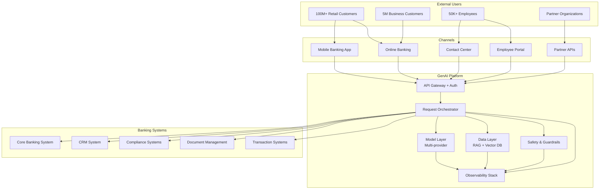
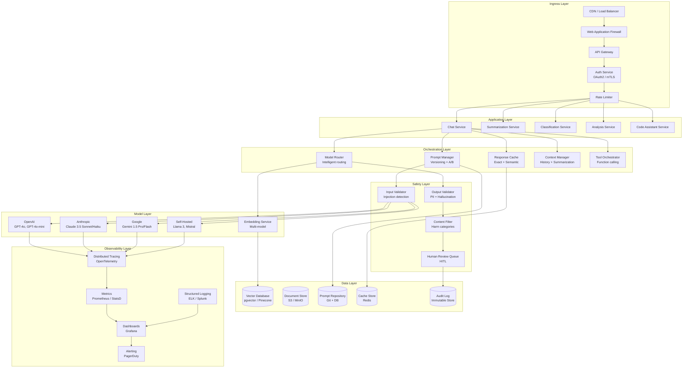
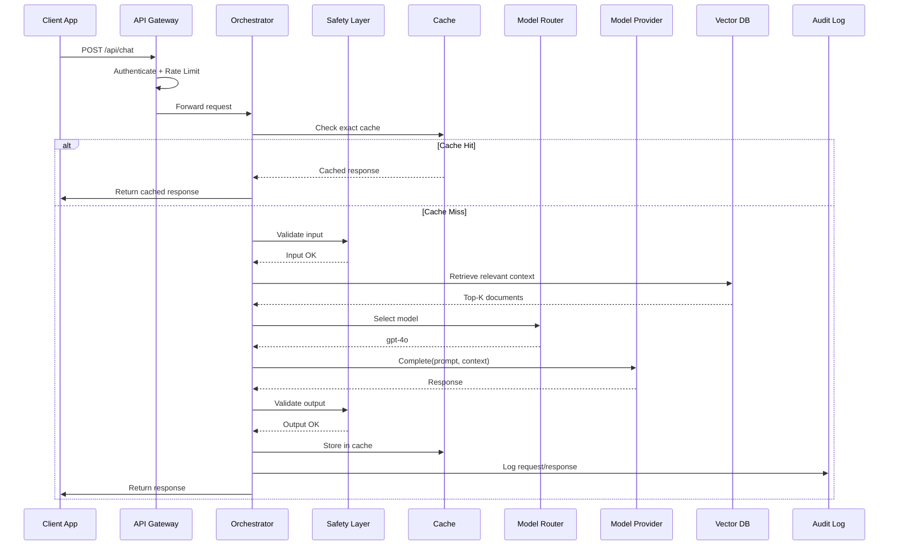
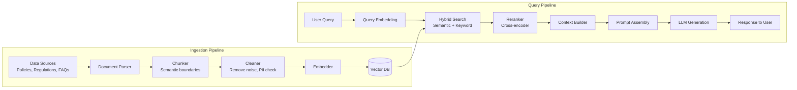
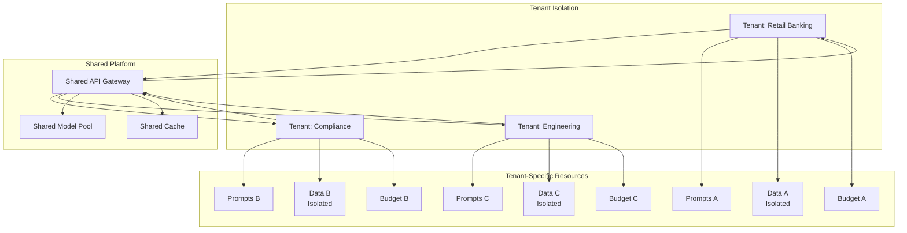
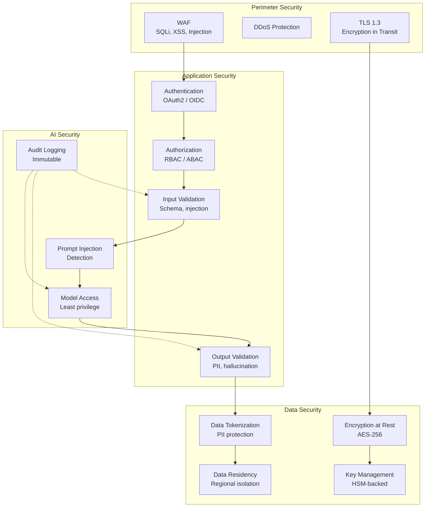
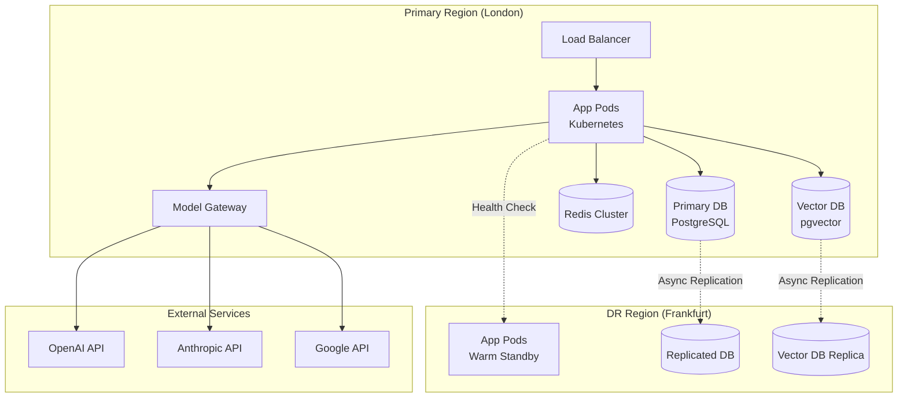

# Enterprise GenAI Architecture

This document presents the complete architecture for an enterprise-grade GenAI platform designed for a global bank serving 100M+ customers across 60+ countries.

## System Context

## Platform Architecture

## Data Flow Architecture

### Request Flow

### RAG Pipeline

## Multi-Tenancy Architecture

### Tenant Isolation Model

| Resource | Shared | Isolated | Rationale |
|----------|--------|----------|-----------|
| Model APIs | Yes | No | Multi-tenant by design |
| Prompts | No | Yes | Each tenant has own prompts |
| Vector Data | No | Yes | Data isolation required |
| Cache | Partial | Yes | Tenant-specific cache keys |
| Audit Logs | No | Yes | Compliance per tenant |
| Budget | No | Yes | Cost attribution |
| Rate Limits | No | Yes | Per-tenant throttling |

## Security Architecture

## Deployment Architecture

## Key Design Decisions

### Decision 1: Build vs. Buy for Orchestration

| Option | Pros | Cons | Decision |
|--------|------|------|----------|
| Buy (LangChain Cloud) | Fast to start, managed | Vendor lock-in, less control | **No** |
| Build on OSS (LangGraph) | Full control, customizable | Engineering effort | **Yes** |
| Custom from scratch | Maximum flexibility | Very high effort | **No** |

### Decision 2: Vector Database Selection

| Option | Pros | Cons | Decision |
|--------|------|------|----------|
| pgvector | Existing infra, SQL integration, GDPR compliant | Less scalable than dedicated | **Primary** |
| Pinecone | Managed, highly scalable | External data, vendor lock-in | **Backup** |
| Milvus | Open source, scalable | Complex ops | **Evaluate** |

### Decision 3: Multi-Model Strategy

| Option | Pros | Cons | Decision |
|--------|------|------|----------|
| Single provider (OpenAI) | Simple, optimized | Vendor lock-in, no fallback | **No** |
| Multi-provider (3+) | Fallback, best-of-breed, negotiation | Complexity | **Yes** |
| Self-hosted only | Data residency, cost at scale | GPU investment, ops burden | **Supplementary** |

## Interview Questions

1. Design a GenAI platform for a global bank serving 100M customers.
2. How do you ensure data isolation between tenants in a shared platform?
3. Walk me through the complete request flow from user input to AI response.
4. How do you design for disaster recovery in a GenAI platform?
5. What are the key security layers in an enterprise GenAI architecture?

## Cross-References

- [model-routing.md](./model-routing.md) — Model routing architecture
- [multi-model-architecture.md](./multi-model-architecture.md) — Provider abstraction
- [ai-safety.md](./ai-safety.md) — Safety layer design
- [caching.md](./caching.md) — Caching architecture
- [../security/](../security/) — Security architecture details
- [../backend-engineering/](../backend-engineering/) — Service design patterns
- [../infrastructure/](../infrastructure/) — Infrastructure and deployment
